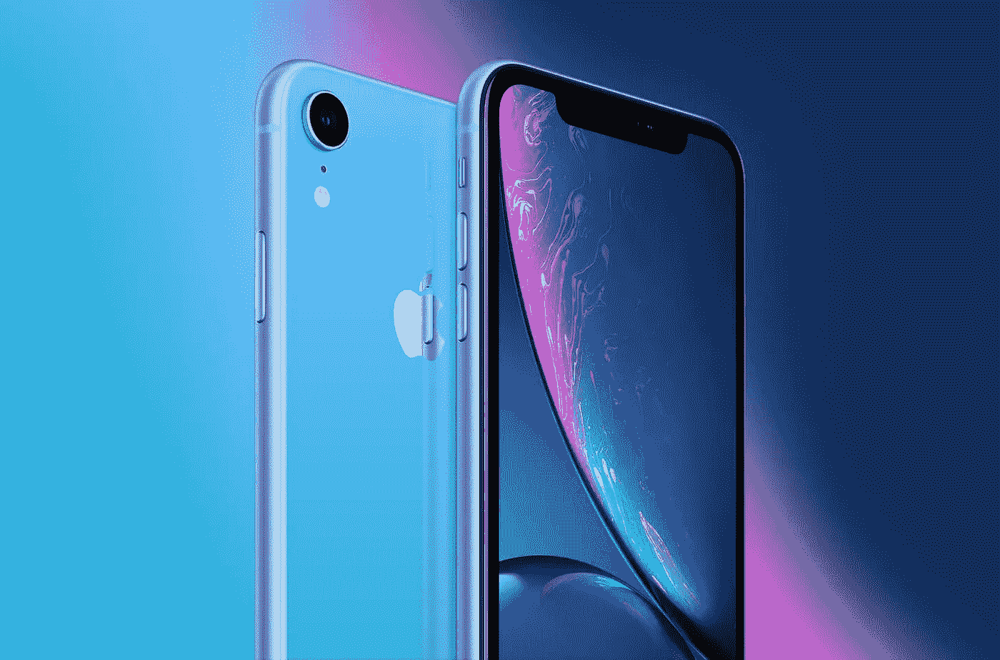
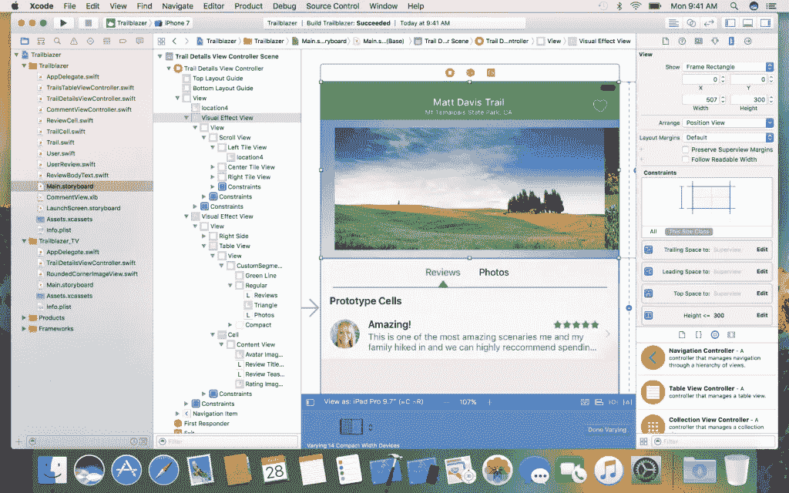
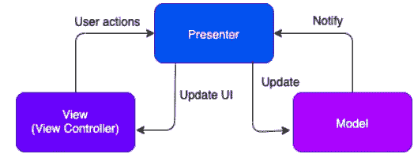
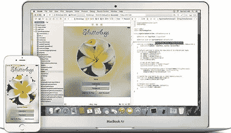
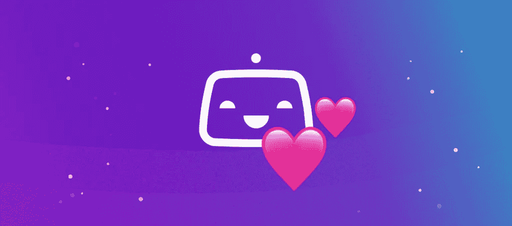
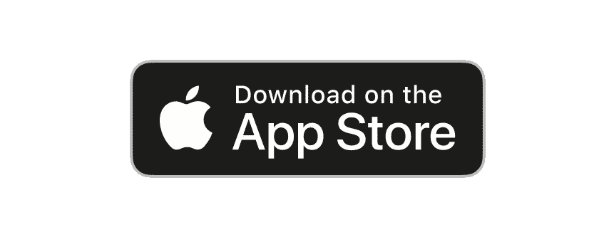
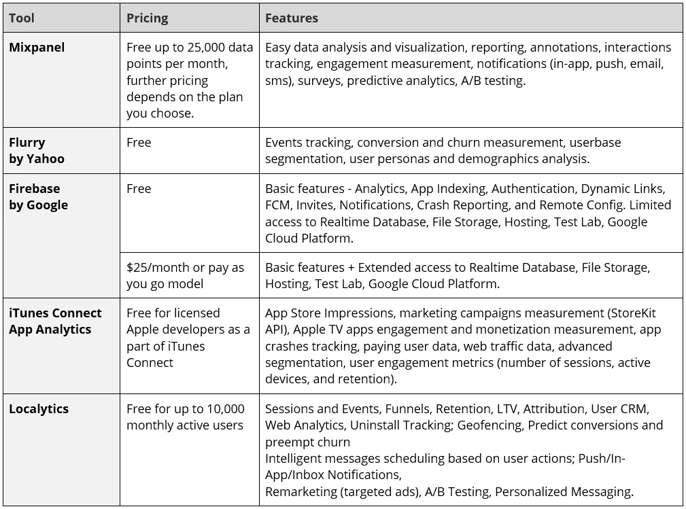
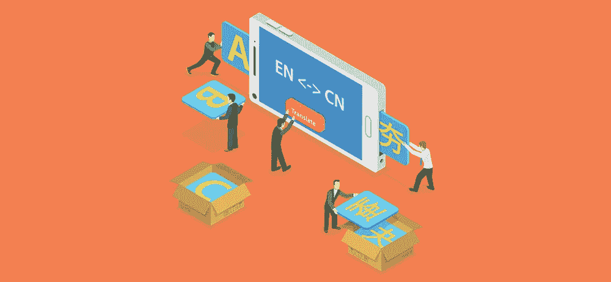

# 构建优秀 iOS 移动应用的实用指南

> 原文：<https://medium.datadriveninvestor.com/practical-guide-for-building-a-great-ios-mobile-app-61d379f061f?source=collection_archive---------20----------------------->

Source: letsgodigital.com

尽管苹果商店已经见证了总计[1800 亿次 iOS 应用下载](https://www.statista.com/statistics/268251/number-of-apps-in-the-itunes-app-store-since-2008/)(截至 2017 年 6 月*)，一些调查结果显示，24%的 iOS 用户[仅使用一次](https://www.statista.com/statistics/271628/percentage-of-apps-used-once-in-the-us/)就卸载了一个应用，因此你的移动应用必须提供出色的性能，以避免在每天充斥商店的数千个应用中丢失。*

苹果之所以被企业和商家广泛使用，是因为他们非常注重安全性和直观的 UI。

以下是构建 iOS 应用程序时需要考虑的一些最佳实践。

# 第一阶段——研究

首先决定你是要 [**原生 iOS app**](https://zesium.com/warning-you-can-save-money-with-native-apps-in-b2b/) **还是跨平台开发**。即使你决定继续使用 cross like [Xamarin](https://www.altexsoft.com/blog/mobile/pros-and-cons-of-xamarin-vs-native/) ，你也需要了解 iOS 基础知识，以构建一个功能强大且与平台一致的应用。

一旦决定使用原生 iOS，下一步应该包括证明你的移动应用的商业案例。

在这里，您应该**确定您的目标受众，研究并定义您的用户角色，** [创建移动应用规范](https://zesium.com/how-to-create-a-mobile-app-specification/) n 并**权衡成本和收益**。

在你完成研究后，你应该 [**选择可靠的技术合作伙伴**](https://zesium.com/how-to-find-top-quality-mobile-app-company-in-9-simple-steps/) 并同意[开发过程](https://zesium.com/how-to-create-a-product-roadmap-for-mobile-app/)。

一旦你完成了开发的基础工作，你就可以进入更多的技术准备阶段。

Source: 9to5mac.com

# 第二阶段—设置和技术基础

iOS 以其严格的政策和正式的 UI/UX 实践而闻名，因为 UI 部署会影响应用性能和整体移动体验

在写任何一行代码之前，确保你有一个好的 iOS 开发团队，他们理解并且**遵循苹果提供的** [指南。](https://developer.apple.com/design/human-interface-guidelines/ios/overview/themes/)

关于**语言**， [Swift 编程语言](https://developer.apple.com/library/archive/referencelibrary/GettingStarted/DevelopiOSAppsSwift/)提供了许多简洁的功能，同时它在开发者中的使用也在增加。回到 2016 年，统计数据显示 Objective C 明显优于 Swift，Swift 仅在 11%的 App 商店前 100 名应用中使用[。如今，情况发生了变化，因为 Swift 对于复杂的项目也很方便，同时它的代码更具可读性、更现代、更快捷。](https://medium.com/@ryanolsonk/are-the-top-apps-using-swift-42e880e7727f)

[Objective-C](https://developer.apple.com/library/archive/documentation/Cocoa/Conceptual/ProgrammingWithObjectiveC/Introduction/Introduction.html) 也是一个很好的选择，在这里你可以使用语言本身或者它的一些元素，比如库，它们是两者的适当组合( *Swift 和 Objective-C* )，取两种语言之长。

另一个重要的方面是 [**Xcode**](https://developer.apple.com/xcode/ide/) —它是苹果提供的一个 [IDE](https://en.wikipedia.org/wiki/Integrated_development_environment) ，提供原生集成级别和适当的工具来构建 iOS 应用。我们使用 Xcode 是因为它是免费的，而且是苹果的产品。有其他的选择，如 [AppCode](https://www.jetbrains.com/objc/) 有附加组件来促进开发，但是检查它的定价模型。权衡利弊，决定哪一个最适合你的移动应用程序开发。

Source: pinterest.com

你应该始终注意选择合适的版本——随着新的 iOS 版本每年发布，旧的平台很快就会过时。尽管旧平台可能兼容，但更有意义的做法是专注于最新版本，开发完全面向未来的移动应用。

设备的 iOS 系统非常丰富，选择正确的目标设备应该取决于你的移动应用的目的——现在，有一种标准的做法是**构建适应屏幕的通用应用**。为了获得更多价值，你可以将你的应用程序调整为在 Apple Watch 上运行，这将是一个健康监测工具的一个很好的附加组件。

关于**编码风格**，你应该确保所有团队成员在整个开发过程中编码一致。这种方法将使团队成员(或外部同事)更容易阅读或改进代码。

你可以建立**可靠的编码标准**或者从现有的如 [GitHub](https://github.com/) 、Objective-C 或 Swift 指南中选择。谷歌的 [Objective-C guide](https://github.com/google/styleguide/blob/gh-pages/objcguide.md) 有助于创建一个易于维护和升级的应用。

另一个重要的方面是 [**适当的架构**](https://thinkmobiles.com/blog/ios-architecture-patterns/) 是构建一个结构良好的应用程序的基础——虽然有几种架构设计方法，但 iOS 中最常用的是[模型-视图-控制器(MVC)](https://developer.apple.com/library/archive/documentation/General/Conceptual/DevPedia-CocoaCore/MVC.html) 模式，这也是苹果推荐的模式。这种模式将代码分成对象，为每个对象指定 3 个主要功能(视图、模型、控制器)中的一个，然而开发人员将 MVC 模式与其他选项结合起来以获得更好的结果，如[模型-视图-视图模型](https://sites.tufts.edu/eeseniordesignhandbook/files/2020/05/Destin_Maximum-Blue-Green-Tech-Note.pdf) (MVVM)。

Zesium iOS 团队还将添加一个模型-视图-展示者( [MVP](https://www.javatpoint.com/ios-model-view-presenter) )模式，因为我们通常在我们团队的大多数项目中使用它。

Source: javapoint.com

# 第三阶段——工程流程和工具

当编写清晰和高质量的代码时，重要的方面是命名原则。

当**命名方法**、类和其他代码元素时，始终遵循[苹果的基本准则](https://github.com/catshive/iOSCodingGuidelines)，保持名称清晰，避免缩写或任何形式的歧义。

命名原则应该在整个过程中保持一致，保留其源文件以构建清晰和可维护的代码。一个好主意是设置一些通用的文件夹结构来帮助整个项目的命名一致性。该结构可以包括模型、视图、控制器、商店等文件夹。

iOS 提供了大量的 [**库**](https://blog.macstadium.com/blog/5-outrageously-popular-open-source-ios-libraries) **和** [**框架**](https://developer.apple.com/library/archive/documentation/MacOSX/Conceptual/BPFrameworks/Concepts/WhatAreFrameworks.html#//apple_ref/doc/uid/20002303-BBCEIJFI) 可以用来解决某些问题，从 UI 实现到与设备硬件的兼容性。那些第三方工具[可以减少从头构建相同功能的时间和成本。](https://www.applemust.com/here-are-all-apples-ios-frameworks-catalyst-brings-to-mac/)

Source: developer.apple.com

iOS 平台由于其限制一直被认为是“封闭的”，然而他们提供了大量的 [**开源**](https://opensource.apple.com/) 项目供你使用。当 Swift 作为开源软件发布时，苹果已经改变了策略，允许开发者为该语言做出贡献，并创建更易访问的工具。使用这样的第三方工具是一个很好的实践——有许多资源列表和几十个这样的库，所以没有必要做多余的工作。

然而，即使有一致的编码风格和共同的实践，也没有开发软件的“唯一”方法。当编写代码行时，每个团队成员都依赖于经验和知识，但是培养代码评审可以对代码质量和应用程序的总体质量产生积极的影响。
IBM resource for developers 提供了一些标准实践[,可以帮助实现更好的结果。](https://www.ibm.com/developerworks/rational/library/11-proven-practices-for-peer-review/)

始终确保像 iOS 一样关注**实现良好的 UI** ，并遵循[事件驱动编程](https://www.confluent.io/blog/journey-to-event-driven-part-1-why-event-first-thinking-changes-everything/)——它预先假定由一些动作或输出触发的特定事件决定了应用的流程。用事件驱动编程构建的应用程序为企业带来了某些[好处](https://www.gartner.com/en/documents/3723434)，比如自动化工作流程、改善沟通等等。

除此之外还有 [**面向对象编程(OOP)**](https://www.educative.io/blog/object-oriented-programming)——使用对象作为构建软件的关键单元。简而言之，将复杂的软件分解成更小的部分，以便于开发和维护。良好的 OOP 使用将使你最大化代码重用和最小化维护成本。

在处理复杂项目时，开发人员往往需要用创新的解决方案和概念来处理项目特定的问题。从长远来看，为研究提供足够的时间可以节省大量资金。彻底的准备和产品概念的工作比在你已经开始后发现产品不能按计划实现要好。

[**持续集成和持续交付(CI)**](https://www.atlassian.com/continuous-delivery/principles/continuous-integration-vs-delivery-vs-deployment) 是软件开发中代表标准实践的另一个重要元素(*不仅仅是 mob apps* )，是敏捷开发不可或缺的一部分。

可以通过 [Jenkins CI](https://www.jenkins.io/) 、 [Bitrise](https://devcenter.bitrise.io/) 、Greenhouse CI、 [CircleCI](https://circleci.com/) 等几个工具实现。它们将各种方法部署到 CI 过程中，但是有一个共同点:帮助您为不同的环境构建代码、自动化测试、管理缺陷日志、交付工件等等。

Source: blog.bitrise.io

不要忘记计算**电池消耗**——一个有经验的 iOS 开发公司也知道用户的期望。[电池消耗和寿命](https://www.techrepublic.com/article/how-to-adjust-ios-13-settings-for-better-battery-life/)对智能手机用户来说是最重要的问题，只有不会对电池产生负面影响的应用才会被保留。

这是有道理的，因为高性能处理器消耗更多的功率，导致短时间内电池电量低——这是用户对其应用程序非常不满的主要原因之一。

包括一些降低电池消耗的[措施](https://developer.apple.com/library/archive/documentation/Performance/Conceptual/EnergyGuide-iOS/SignsofEnergyLeaks.html#//apple_ref/doc/uid/TP40015243-CH32-SW1)以获得相对于竞争对手的优势，并在发布应用程序之前对其进行测试。

# 第四阶段——部署

在进入你的 iOS 应用程序的启动阶段之前，考虑一下**提前获得苹果要求的证书**和账户。

如果你是应用程序的所有者，**创建你的苹果开发者账户** ( *大约 100 美元一年*)，并授权你的 iOS 开发团队在你自己的账户上创建证书和构建应用程序。每个开发人员都获得了对应用程序所有者帐户的访问权限(*管理员或开发人员*),并为开始开发做好了准备。

确保更有效开始的最佳方式是在开始开发过程之前获得这样的帐户和证书。

一旦你的应用程序准备好打开它的大门，决定你将如何分发它是很重要的。苹果目前提供 3 种分发模式:

*   [App Store](https://www.apple.com/app-store/)—iOS 用户可直接上传的常用模式。您可以设置目标国家、支持的设备或版本等参数。
*   [TestFlight 服务](https://testflight.apple.com/join/YxR0a06k)——它在 App Store 的范围内(*意味着你在商店*上传构建)，并提供一个在启动前测试应用构建的选项。你可以让 100 名内部测试人员(*通过某个角色连接到苹果账户，例如管理员、开发人员等*。)和 10000 个外部用户(*全名和邮箱*)。
*   [iOS Developer Enterprise Program](https://developer.apple.com/programs/enterprise/)是一个面向企业级或商业应用的计划，虽然是一个昂贵的解决方案，但它提供了完全的隐私保护，使其对您的员工和承包商来说是安全的。

Source: freelogos.com

在将你的移动应用程序提交到应用程序商店之前，确保**你的应用程序已针对发布**进行了正确配置——除了要填写某些表格和提交文件之外，苹果还会执行手动审查，以验证提交到他们商店的所有应用程序。

**定期监测应用商店的评分和评论**对一个新应用来说很重要——试着与评论者接触，帮助那些失望的人，因为从长远来看，这将提高你的在线声誉。

# 第五阶段——安全

永远**关注安全**！

一些行业需要高水平的安全性，如金融科技、医疗保健或处理敏感私人和商业数据的内部企业应用程序——如果你希望你的 iOS 应用程序被视为专业应用程序，你必须实施最佳安全实践。

基本上，除非你根本不存储数据，否则不可能 100%防止数据被盗——最好的方法是**遵循苹果**的合法 [**安全编码指南**](https://developer.apple.com/library/archive/documentation/Security/Conceptual/SecureCodingGuide/Introduction.html) **或部署一些[最佳实践](https://developer.apple.com/library/archive/documentation/Security/Conceptual/SecureCodingGuide/SecurityDevelopmentChecklists/SecurityDevelopmentChecklists.html)如自定义加密、数据保护等。**

站在用户的角度来讲，也有一些用 iOS 14[保护自己隐私](https://beebom.com/tips-improve-security-privacy-ios-14/)的好做法。

# 第六阶段——业务方面

一旦你的应用程序[启动，工作就没有结束](https://zesium.com/critical-steps-to-launching-a-mobile-app/)——你应该 [**实现分析和报告**](https://zesium.com/best-ways-to-track-user-behavior-in-mobile-app/) **工具**来看看你的用户如何与你的应用程序互动或者[他们为什么卸载应用程序](https://zesium.com/practical-tools-and-benefits-of-tracking-app-uninstalls/)。这提供了宝贵的见解，有助于您以后改进您的应用程序，其中一些流行的工具是:

Source: pinterest.com

在全球范围内，iOS 应用下载量自 2016 年以来一直稳步上升，到 2020 年的 2Q[达到 91 亿次下载](https://www.businessofapps.com/data/app-statistics/)。

例如，你可以开发一款带有应用内购买功能的免费产品，以确保稳定的收入——应用内选项应该简单，并为基础版提供价值。并非所有类型的应用都适合这种盈利模式，所以要小心，并 [**检查其他盈利方式**](https://zesium.com/the-guide-on-the-best-mobile-app-monetization-methods/) 来决定哪种最适合你的移动应用。

如果你计划让你的应用面向全球市场，考虑**应用内化**使其能够适应各种语言。为本地化准备应用程序需要一些特定的步骤，例如将语言与用户界面的其余部分分离，通过 Xcode 导出面向用户的文本等等。

对于从右向左的语言，比如阿拉伯语，要格外小心，因为它们需要镜像用户界面并改变文本方向。

Source: instabug.com

请记住，在软件/移动开发中，产品永远不会完全完成，即使您已经实现了大多数计划的功能，也需要**审查旧的功能，可能会删除一些功能，并最终添加新的**功能。

当苹果推出评估流程'*以确保商店中可用的应用程序是功能性的和最新的*'时，应用程序不允许无更新地闲置，但它保持了市场竞争力和对用户的相关性，尽管给应用程序开发者设置了额外的职责。

如果你正在开发一个 iOS 移动应用，一个很好的依靠是苹果开发者资源网站。

# 最后的

通常的说法是，iOS 应用程序带来的对你自己隐私的恶意软件的担忧更少。这并不意味着苹果用户完全不受恶意软件问题的影响，但是根据 MacWorld UK 的说法，这些都是极少数情况。

尽管苹果因其限制和严格的政策而闻名，但他们提供了一种坚实的方法来提供开发者资源和工具。

确保将这些工具用于你的优势，并构建一个可靠且实用的 iOS 应用程序。

*原载于 2021 年 2 月 3 日*[*https://zesium.com*](https://zesium.com/a-practical-guide-for-building-a-great-ios-mobile-app/)T22。

点击下面的链接，安排与 [**玛娅·达基奇**](https://app.ddichat.com/experts/maja-dakic) 的 DDIChat 会议。

 [## 马贾达基奇-迪迪恰特

### 技术行业(软件、移动应用、物联网、人工智能等)的资深作家。)以及在…

app.ddichat.com](https://app.ddichat.com/experts/maja-dakic) 

在这里申请成为 DDIChat 专家[。
与 DDI 合作:](https://app.ddichat.com/expertsignup)[https://datadriveninvestor.com/collaborate](https://datadriveninvestor.com/collaborate)
点击此处订阅 DDIntel [。](https://ddintel.datadriveninvestor.com/)