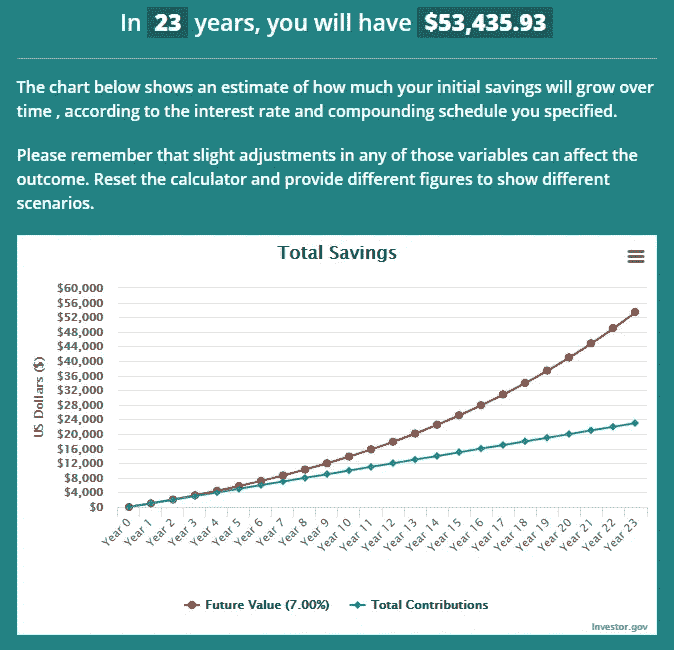
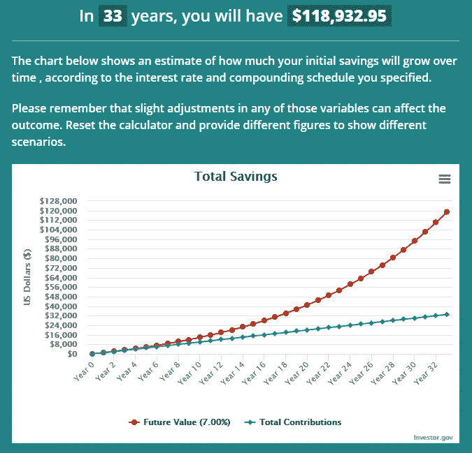

# 每个人都应该知道的关于金融的实用课程

> 原文：<https://medium.datadriveninvestor.com/practical-lessons-about-finance-everyone-should-know-4ad40b4a26d1?source=collection_archive---------6----------------------->

## 我在金融行业工作时学到的一些经验，我认为每个人都需要知道。

Photo by [Michael Longmire](https://unsplash.com/@f7photo?utm_source=medium&utm_medium=referral) on [Unsplash](https://unsplash.com?utm_source=medium&utm_medium=referral)

当我获得金融学士学位时，我已经准备好接管世界了。进入现实世界两年了，隔间生活几乎打碎了我的灵魂。我转行了，现在是一名教师，但我在金融工作期间学到了一些经验，我认为每个人都需要知道。

## 金融 101:金钱的时间价值、风险与回报

你现在拥有的钱是有史以来最有价值的。你口袋里的 20 美元明天会贬值，几年后也会贬值很多。价值的下降是由于通货膨胀。不要把大量现金放在银行账户里，每年赚取 0.25%的利息。你的钱损失了 1.75%(假设美联储的通胀目标是 2%)。

那么，你应该怎么做呢？在我心中，有一个明确的答案。立即花掉你需要的东西，把你剩下的任何东西(除了你的应急基金)投资到能给你带来相对低风险的高回报的投资上。

这是关于投资的真理，你承诺的投资回报率越高，投资的风险就越大。风险越高，你越有可能损失这笔钱。

不要被高投资回报的希望所蒙蔽。事实是，要么成功，要么失败。如果不成功，你投入的钱就没了。请做你的研究。投资风险越大，就应该越靠近你的专业领域和你的实际位置。

在风险投资中，不要投入超过你承受能力的资金。

# 去哪里投资

你应该投资的第一个地方是你的退休账户。越早越好。如果你 22 岁，刚刚大学毕业，甚至 18 岁，正在做你的第一份工作，尽快开始把钱存入你的退休账户。

你存入退休账户的钱会增加。当然，没有任何保证，但相对一致的预期是假设 7%的回报率(T3)(从长期来看)。7%听起来不错，但为什么不直接在普通股票市场购买，而不把它与退休账户挂钩呢？

嗯，当你 55 岁时，你的退休账户到期时，你会得到 7%的免税回报。是的，这是一件大事。长期资本收益率为 20%。但是，我一直瞒着你，7%的回报率。这意味着每年，你不是从你投入的原始金额中获得 7%的利息(单利)，而是从总投资中获得 7%。它长得越多，你每年挣得就越多。

 [## 如何在不牺牲孩子或财务的情况下安全理智地离婚|数据驱动…

### 在美国，七月是以孩子为中心的离婚月。作为 cdfaⓡ的专业人士，我可以向你保证，从长远来看…

www.datadriveninvestor.com](https://www.datadriveninvestor.com/2020/07/28/how-to-divorce-safely-and-sanely-without-sacrificing-your-children-or-your-finances/) 

哦，顺便说一句，你可以而且应该每年向你的退休账户缴款。7%现在看起来很不错，但不要相信我的话。我用一个例子给你描述一下。

假设约翰尼 22 岁，刚从大学毕业。他找到了一份很好的工作，除了房租和其他开销，还有多余的钱。约翰尼决定买那辆新跑车。他直到 32 岁才考虑增加退休金。32 岁时，他开始每年投入 1000 美元(为了简单起见，我们每年投入 1000 美元)。我们一会儿再和强尼联系。

现在让我们说，罗宾，也是 22 岁得到了一份和约翰尼相当的工作。她立即将每年 1000 美元存入她的退休账户，而不是汽车。很明显她会做得更好，但是约翰尼十年的花费让他付出了多少？

在 55 岁时，约翰尼和罗宾都检查他们的账户。

Left: Johnny’s account, Right: Robin’s account — Made on Investor.gov

正如你在图表中看到的，罗宾比约翰尼做得好得多。是的，Robin 在她的账户上多放了 10，000 美元，但她最终比 Johnny 多了大约 65，500 美元。

现在，如果你有一个罗斯个人退休帐户，任何人都可以做，你每年最多可以贡献 6000 美元，如果你超过 50 岁，可以贡献 7000 美元。

# 债务

债务是一种瘟疫。正如我已经提到的，你的钱现在是最值钱的。当你负债时，你要支付一定比例的钱来花你没有的钱。

让我们以信用卡债务为例。短期信用卡债务是一个很好的金融工具。然而，这种类型的债务是一种工具，只有在无法避免的情况下才应该使用。如果你能尽快还清你的信用卡债务，那将是最好的。

当你有信用卡债务时，你要支付一定比例的钱来使用你没有的钱。如果你不还清债务，你用信用卡花的钱会让你付出更多，而且你也不会得到任何其他好处。

有好债。最常见的好债形式是房屋抵押贷款。抵押贷款之所以是好债，是因为它与一种随着时间推移会升值或增值的资产相关联。当你买一辆车时，把它停在停车场要花掉这辆车价值的 50%。当你买房子时，随着时间的推移，它的价值会上升。

# 最后的想法

事实是，本文中介绍的课程并不需要获得金融学位。事实上，作为一名教师，对我来说显而易见的是，所有学生最迟应该在他们的高中阶段学习这些信息。我想分享这些东西，因为事实是，许多人缺乏这些基本知识。所以，在你买那辆华而不实的新车之前，请确保你已经向你的退休账户交款了。

**进入专家视角—** [**订阅 DDI 英特尔**](https://datadriveninvestor.com/ddi-intel)