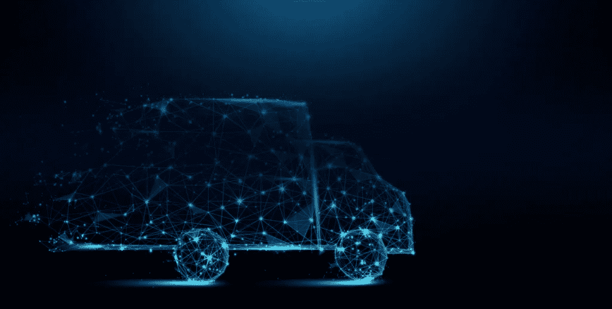
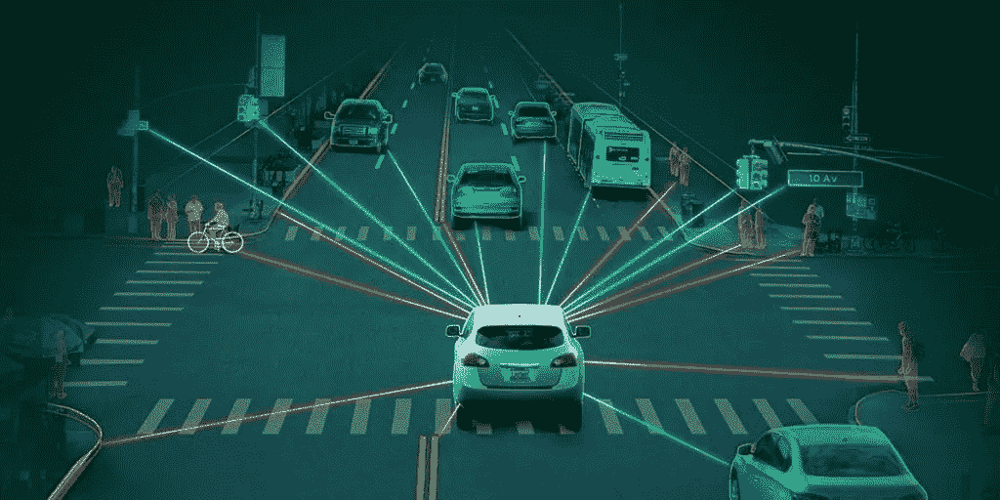
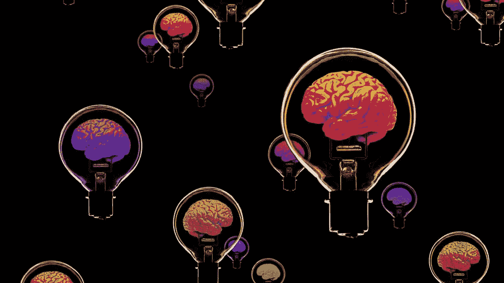
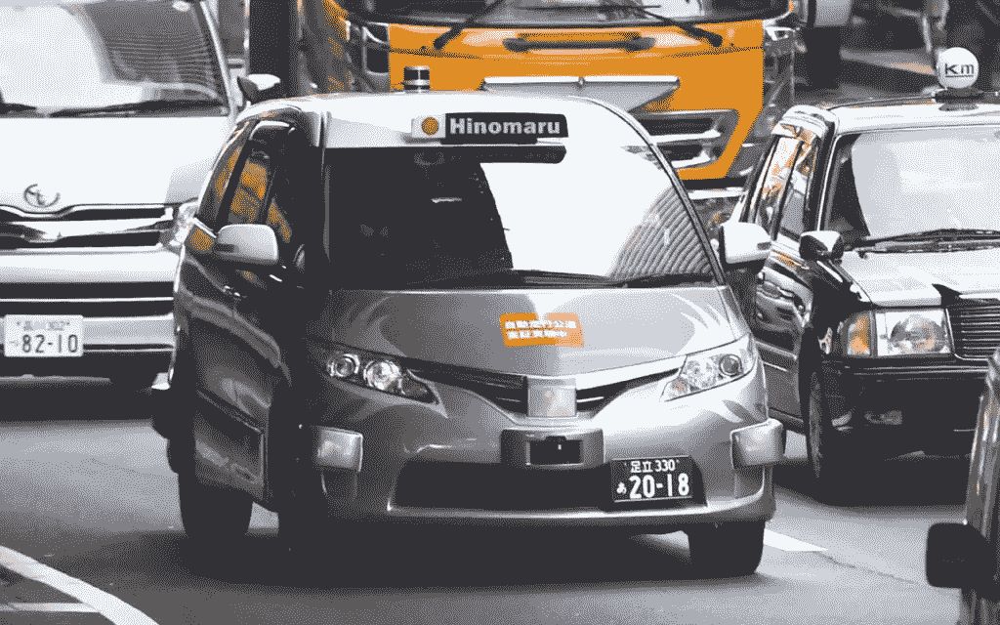
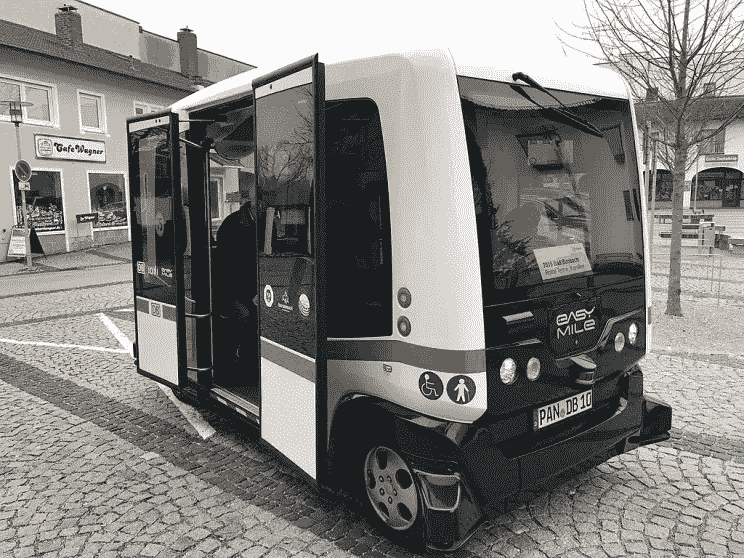
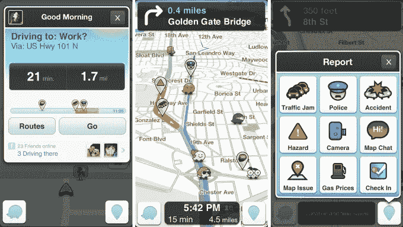
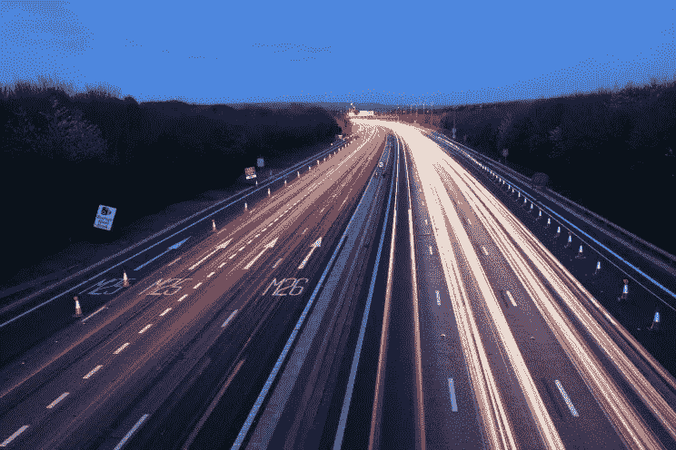
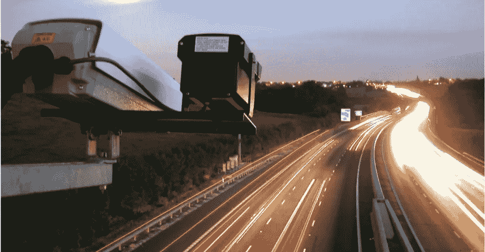
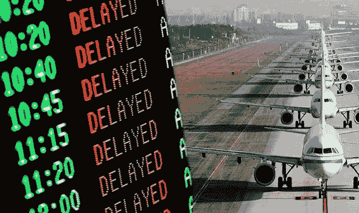
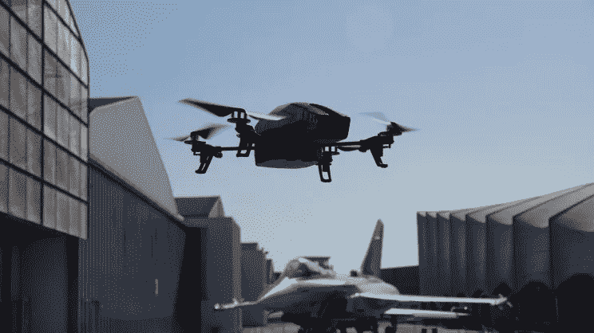

# 人工智能在交通运输中的实际应用

> 原文：<https://medium.datadriveninvestor.com/practical-use-of-a-i-in-transportation-f9af56e688c8?source=collection_archive---------1----------------------->

Source: altexsoft.com

[人工智能](https://en.wikipedia.org/wiki/Artificial_intelligence) (AI)是一种为机器提供人类智能的技术——具有人工智能能力的机器可以自动化手动任务，并像人类一样在旅途中学习。

在人工智能驱动的系统下，这种自动化会得到重复和耗时的任务，这些系统会随着时间的推移而学习，最终可以执行关键任务并自己做出决定。

这种独特的潜力推动运输企业开始投资人工智能技术，以提高收入并领先于竞争对手。

交通行业刚刚开始在关键任务中应用人工智能，但是交通的可靠性和安全性仍然受到质疑。交通方面的主要挑战，如安全、容量问题、环境污染、可靠性等。为人工智能创新提供了巨大的机会。

无论失败与否，到 2023 年，交通行业的人工智能仍将达到[35 亿美元。](https://www.psmarketresearch.com/press-release/ai-in-transportation-market)

Source: techstreetonline.com

# 人工智能如何帮助运输:

交通行业[面临的问题](https://www.businessfleet.com/159407/6-growing-transportation-problems-and-potential-solutions)当系统功能无法按照受交通、人为错误或事故等外部因素影响的可预测模式形成时。

人工智能使用数据来适当地预测决策，并且已经以多种方式实施，其中一些例子包括

*   公共安全(*例如实时跟踪犯罪数据*)，
*   自主车辆(*例如自动驾驶车辆*)，
*   行人安全(*例如，跟踪行人/骑自行车者的路径，以最大限度地减少事故*)，
*   交通模式(*如延误原因、交通拥堵的减少*)和
*   公司决策(*例如，准确的预测方法和预测*)。

# 人工智能在交通领域的优势:

人工智能和交通运输的最佳组合不知何故自然而然地出现了，因为这些技术的采用可以对整个行业产生巨大影响，尽管人工智能的应用仍然因地理位置而异。

增加人工智能的使用将确保降低劳动力成本，同时提供更高的利润——全自动车队将解决长时间驾驶和休息的问题。

AI 还能对**安全和交通事故**产生巨大影响。夜间驾驶是一个大问题，智能无人驾驶汽车可以显著改善这一问题。无人驾驶汽车或无人驾驶车辆可以帮助司机打盹，而不会造成任何交通事故。

**交通管理**也可以更有效——人工智能方法使我们能够通过使用交通数据和城市正在发生的事件的细节来预测交通，并通过自动化建议替代路线。

**复杂的基础设施**和合作链中的各种元素可以在人工智能的帮助下得到改善，例如通过最佳路线安排、最短等待时间、实时交通检测来调整路线等。

**物流****中的数据分析也有助于升级运输规划，提高总体安全性。**

** [## 一名大学生使用语言生成人工智能工具创建了一个病毒式博客帖子|数据驱动…

### 作为作家，我们喜欢告诉自己，我们处在一个无法自动化的职业中，至少短期内不会。但是…

www.datadriveninvestor.com](https://www.datadriveninvestor.com/2020/09/15/a-college-student-used-a-language-generating-ai-tool-to-create-a-viral-blog-post/) 

还有很多好处可以列举，但人工智能仍在发展，好处也会越来越多。

Source: raconteur.net

# 人工智能在运输中的缺点:

尽管人工智能可以给任何行业带来过多的好处，但也有一些缺点需要注意，比如在人工智能决策中创造透明度或自动驾驶汽车的安全问题。

缺点之一包括**工作流**，因为它成为卡车或出租车司机和其他行业成员的一个主要问题。尽管社会专家试图解释工作技能可以转移到其他部门，紧张局势仍然存在。

人工智能的实施也可能带来缺点，因为**不发达国家**在利用此类解决方案时将面临巨大挑战，因为它们的基础设施无法提供维护。

运输公司也面临潜在的人工智能缺陷，因为**运输成本**对公司收入的贡献高达 10%。所有现有的企业都需要开发和实施人工智能技术，以保持其在行业内的竞争力，而开发、维修和维护复杂机器的成本可能会非常高。

**伦理问题**也在修订中——如果想赢得消费者的信任，将人工智能引入交通的公司必须认真对待人工智能的伦理。

人工智能技术仍然需要重大改进，因为它仍然远远达不到人类的智能水平。

Source: zfort.com

# 交通运输中的人工智能

我们已经可以找到人工智能在交通领域应用的例子。随着[人工智能](https://futureoflife.org/background/benefits-risks-of-artificial-intelligence/)的进化和变得更加成熟，可以肯定的是，AI 扮演主要角色的角色数量将会增加。

人工智能在交通领域很常见的一些例子有:

# 自动驾驶汽车

[自动驾驶汽车](https://www.trendhunter.com/slideshow/autonomous-vehicles)已经在交通领域成为现实。它们代表着迈向自主交通新未来的第一步，尽管在过去这似乎是一个非常超前的想法。

人工智能利用其处理、控制和优化能力为这些无人驾驶车辆提供动力。对于自动驾驶汽车，实时数据传输和处理至关重要，这些过程中的任何混乱都可能导致致命的后果。

在 T2 东京，自动驾驶出租车已经开始运营，但出于安全考虑，司机坐在车里，以便在紧急情况下能够控制出租车。

美国从 2018 年开始实施[自动卡车，因为全球 65%的货物通过卡车](https://www.mckinsey.com/industries/travel-logistics-and-transport-infrastructure/our-insights/distraction-or-disruption-autonomous-trucks-gain-ground-in-us-logistics#)运输。据预测，自动卡车运输的维护和管理成本可以降低 45%左右。

[Waymo](https://waymo.com/) 公司已经在一定数量的州内推出了[自动驾驶小型货车和卡车](https://www.digitaltrends.com/cars/waymos-self-driving-minivans-and-big-rigs-arrive-in-two-more-states/)，用于在公共道路上进行测试。

这些类型的项目仍处于试点阶段，试图让自动驾驶汽车对乘客安全，但随着技术的发展，自动驾驶汽车将获得更高的可靠性，并变得更加广泛。

Source: techcrunch.com

# 客运

乘客、行人和司机的安全一直是运输业的首要问题。

人工智能的使用案例是[自动驾驶系统](https://en.wikipedia.org/wiki/Autopilot)，它几乎被用于今天的每一架商用飞机，它是当今任何空中旅行的重要组成部分。

《纽约时报》报道称，波音飞机平均只有 7 分钟由人工控制(起飞和降落)，其余时间由自动驾驶仪控制。

公共交通也将受到人工智能的巨大影响，因为最近已经有了在传感器、摄像头和全球定位系统的帮助下运送乘客的无人驾驶公交车。

人工智能技术可以为我们做很多事情——它可以减少交通中的人为错误，监控安全法规的遵守情况，审查车辆维护报告，并以这样的方式管理交通，以降低城市地区驾驶风险的影响。

# 智能手机应用

今天，*有一个应用程序可以处理一切*——它包括通过像[谷歌地图](https://www.google.com/maps)或 [Waze](https://www.waze.com/) 这样的服务进行人工智能驱动的实时交通更新。

这些应用程序使用从智能手机收集的[位置数据](https://www.tamoco.com/blog/location-data-info-faq-guide/)来分析您所在地区的交通状况，并更好地向用户通报交通情况。

这些应用程序可能很快就会面临自动驾驶汽车的竞争，因为如果汽车本身已经在做同样的工作，你为什么还需要一个应用程序？

Source: techcrunch.com

# 交通管理

由于其处理、控制和优化能力，人工智能可用于管理交通系统。为了让[道路更智能](https://www.lanner-america.com/solutions/transportation/smart-roads/)，可以将 AI 应用到交通管理中，使交通更加顺畅。人工智能预测能力识别可能导致[交通拥挤或拥堵](https://interestingengineering.com/switzerland-plans-to-deploy-europes-first-drone-air-traffic-management-system)的物理或环境问题是另一个巨大的好处。

Source: interestingengineering.com

安装在道路上的传感器和摄像机收集大量与交通细节相关的数据。这些数据由大数据和人工智能系统进行分析，以揭示交通模式。

相关的见解可以帮助通勤者了解交通预测、事故或道路堵塞的详细信息，并提供到达目的地的最短路线建议。

例子是[西门子移动](https://www.bbc.com/future/article/20181212-can-artificial-intelligence-end-traffic-jams)已经测试了一个通过交通摄像头的原型人工智能监控系统——它根据实时道路拥堵情况改变交通灯，从而最大限度地减少道路拥堵。

通过这种方式，人工智能可以减少冗余交通，提高道路安全，减少等待时间。

Source: bbc.com

# 法律的实施

执法是人工智能被用来帮助执法人员识别人们在开车时喝酒或发短信的另一个领域。早些时候，这是人类官员的一个问题，因为车辆以高速移动，但人工智能已经解决了这个问题。

现在，人工智能可以相当准确地检测到一个人是否在开车时喝酒或发短信，并向附近的任何官员发出警报，拦截他们。

其中一个例子是[摩托罗拉解决方案](https://www.govtech.com/biz/New-Radio-Brings-AI-Voice-Assistant-to-Law-Enforcement.html)，它将人工智能语音助手带到执法车辆上，警察只需说出车牌，系统就会查找信息并在几秒钟内做出响应。

Source: bbc.com

# 延迟预测

运输，尤其是航空运输的另一个问题是延误。根据加州大学伯克利分校的[研究报告，在美国，航班延误会造成高达 3900 万美元的损失。](https://news.berkeley.edu/2010/10/18/flight_delays/)

为了克服航班延误的成本以及乘客的负面体验，AI 来到航空运输进行救援。

数据分析和计算机视觉开始帮助并缩短乘客的等待时间，因为人工智能可以利用其能力预测任何事情，从恶劣天气到可能导致航班延误的一定数量的技术故障。计算机视觉系统可以间歇地监控飞机，而人工智能与[机器学习(ML)](https://en.wikipedia.org/wiki/Machine_learning) 一起使用和处理实时飞机数据、记录和天气信息。

计算可以揭示一些隐藏的模式，帮助行业获得关于可能导致延误或取消的可能性的宝贵见解。

Source: express.co.uk

# 无人驾驶出租车

无人机已经被用于送货服务系统，但很快它们也可以被用作出租车。无人驾驶飞行器是对抗碳排放、交通拥堵或昂贵基础设施的独一无二的解决方案。

无人机作为出租车将允许人们更快地到达目的地，同时将通勤时间降至最低。关于城市地区，无人机出租车可以真正解决城市规划和城市基础设施发展等问题。

无人机出租车最近的一些例子是在中国展示的[自主飞行器](https://www.youtube.com/watch?v=7zT9gHwALhM)，17 名乘客首次有机会体验智能空中交通。

几年前，优步向前迈出了一步，通过与美国宇航局签署合作伙伴关系，开发操作自动驾驶“飞行出租车”的软件。

这些用例表明，类似的未来应用程序即将被开发。

Source: interestingengineering.com

# 结局

人工智能(AI)已经不仅仅是一个有远见的想法——它是我们日常生活的一部分，我们每天都在使用它，甚至没有注意到。人工智能可以在我们的移动应用程序中，在社交媒体反馈中，或者在[如何检查我们的语法错误的方式中找到。](https://www.grammarly.com/)

运输行业已经使用一些人工智能解决方案有一段时间了，但用不了多久，人工智能就会在运输和物流中增加。

随着时间的推移，人工智能变得越来越微妙，我们看到人工智能驱动的令人兴奋的未来只是时间问题！** 

**点击下面的链接，安排与 [**玛娅·达基奇**](https://app.ddichat.com/experts/maja-dakic) 的 DDIChat 会话。**

** [## 马贾达基奇-迪迪恰特

### 技术行业(软件、移动应用、物联网、人工智能等)的资深作家。)以及在…

app.ddichat.com](https://app.ddichat.com/experts/maja-dakic) 

在这里申请成为 DDIChat 专家。
与 DDI 合作:[https://datadriveninvestor.com/collaborate](https://datadriveninvestor.com/collaborate)
点击此处订阅 DDIntel [。](https://ddintel.datadriveninvestor.com/)**