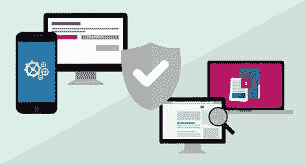
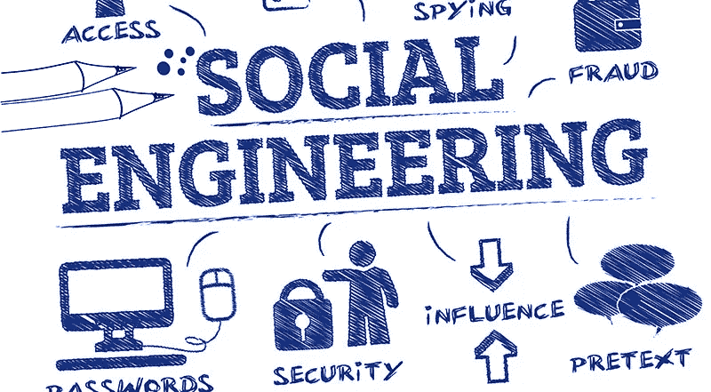
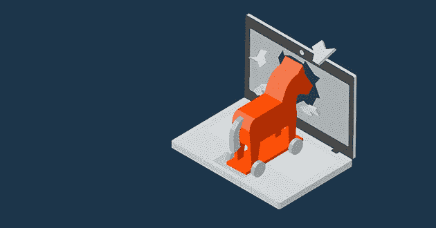
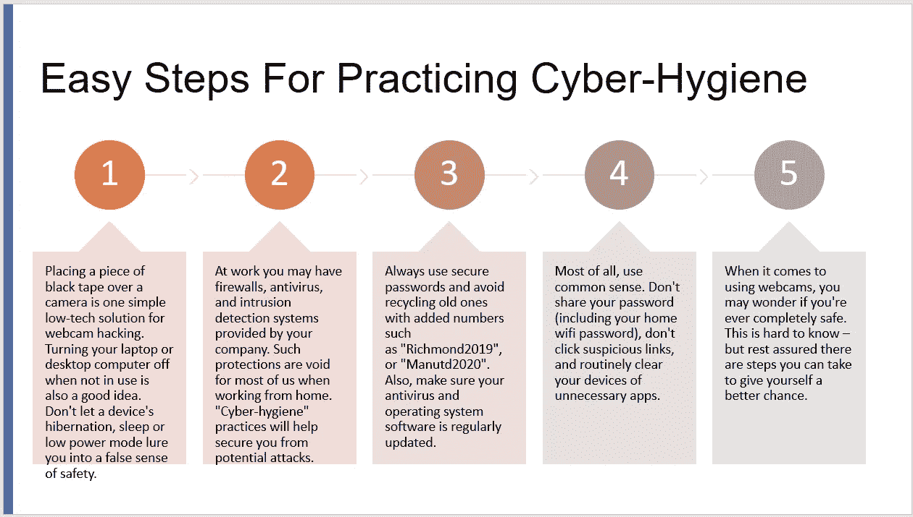

# 实践网络卫生

> 原文：<https://medium.datadriveninvestor.com/practicing-cyber-hygiene-be4dea292faa?source=collection_archive---------12----------------------->

Cyber Hygiene can save you.

## ***先事后***

无论你是使用 Zoom、Skype 还是微软团队，你家用电脑或电脑小工具上的网络摄像头很可能在这次疫情期间从未像现在这样动态过。

我们中的很大一部分人都在电话、平板电脑、PC 上安装了摄像头，或者在工作、学习或虚拟社交时使用工作区网络摄像头。

令人震惊的是，这种好处会让我们无法抵御一种被称为网络感染的网络攻击。这是程序员远程承担你的网络摄像头的责任。他们通过阻碍“开”灯来做到这一点，这通常表明相机是动态的——所以伤亡人员是不知道的。

 [## 当今组织中网络安全的无用性(和希望)|数据驱动的投资者

### 随着世界与疫情的斗争，组织越来越多地在打一场旷日持久且注定失败的战争…

www.datadriveninvestor.com](https://www.datadriveninvestor.com/2020/04/10/the-futility-and-hope-of-cybersecurity-in-todays-organizations/) 

我们的很多小相机都没有绑定。说实话，examine 已经在国际上提出了超过 15，000 个网络摄像头小工具(为家庭和组织记忆)可供程序员立即使用，而无需等待被黑客攻击。

**Mark Zuckerberg**

# **马克的提示**

当你的电脑死机时，它的网络摄像头就不能启动了。尽管如此，我们中的许多人都让自己的工作站处于休眠或休息模式(这是独一无二的)。在这种情况下，这个小工具可以被一个数字违法者唤醒，然后打开相机。事实上，甚至马克·扎克伯格也承认他盖住了摄像头和接收器。

通过未经批准的网络摄像头拍摄的图像被记录的次数普遍较低。这是因为大多数攻击发生时，当事人从未意识到自己受到了伤害。因此，这些袭击都无法解释。

有必要考虑一下为什么有人会决定入侵你的家用设备。攻击者不可能为了个人勒索或他们自己的恐怖冒险而捕捉到你的照片。虽然这些事件最终都会发生，但大多数非法网络摄像头都是为了金钱利益而与社会事务数据联系在一起的。

**Social Engineering**

# Say 芝

网络罪犯时不时地试图愚弄个人，让他们接受自己被网络摄像头黑客攻击了。通常情况下，会有大量的垃圾信息发送给客户，让他们相信自己被“拍”到了。尽管如此，为什么呢？

沿着这些路线羞辱“不当”使用网络摄像头的个人是一个诡计，一个产生重大回报成就的诡计。许多伤亡者在害怕被公开揭露的恐惧中安顿下来。

大多数认证的网络摄像头黑客专注于收集受限数据的攻击。它们经常包括技术知识丰富的公司聚会，进行有见地的社交活动和秘密拍照。一些黑客攻击是公司秘密活动的展示，而其他的则是政府洞察组织的事情。

有两个正常的获取程序用于实施攻击。第一种被称为 RAT(远程管理工具),随后通过恶意个人提供的虚假“远程技术支持”发生。

真正的远程技术支持大部分来自您的零售专业合作社(例如 Telstra 或 Optus)。我们相信我们认可的技术支持人员，但是您不应该将这种信任延伸到一个您几乎没有意识到的“同伴”,让他利用自己的远程帮助编程来“帮助”您解决问题。

RAT 案例是通过电子邮件传播的特洛伊木马感染。这给了程序员对小工具的内部控制。

C完成访问

**Trojan Horse Malware**

当特洛伊木马感染了一个小工具时，它不仅仅是被远程访问的网络摄像头，而是整个 PC。这意味着获得记录、照片、银行和一系列信息。

引入老鼠的能力已经存在很长时间了。2015 年，只需 40 美元就可以在网上买到一只著名的老鼠。恶意软件(破坏性编程)可以通过电子邮件、连接或闪存驱动器发送。

那些需要弄清楚如何利用这些设备的人只需要看看 YouTube 就行了，它有大量的教学练习。对于程序员来说，这从未如此简单。

> **网络摄像头**

Hacked Webcams

我们的家庭每年都有“更多智能设备”。在 2018 年，正常的澳大利亚家庭单位据称有 17 个相关的小工具。

假设有几台个人电脑、三四部手机和平板电脑、一个家庭监控摄像头框架和一台智能电视，电视内置了面部识别摄像头。

# **想要安全？**

Cyber Hygiene Steps

# 希望你会喜欢这个。相关文章敬请关注。

# **#BESAFE**

**访问专家视图—** [**订阅 DDI 英特尔**](https://datadriveninvestor.com/ddi-intel)