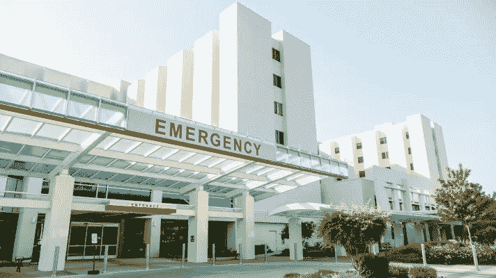

# 利用生物医学数据和机器学习预测医院死亡

> 原文：<https://medium.datadriveninvestor.com/predict-hospital-deaths-with-biomedical-data-and-machine-learning-f45d010aebae?source=collection_archive---------13----------------------->

机器学习的最佳品质之一是，它适用于几乎所有可以想象的工作类型。医疗保健尤其受到影响，因为该领域在基因组测序、检测癌症的对象识别系统和药物发现方面取得了进展。医疗保健行业有大量的数据可以用来彻底改变我们对医学的看法。我最近在 Kaggle 上发现了一条数据。他们正在举办一场比赛，预测病人在医院死亡的概率。作为一名狂热的数据科学家，我立即下载了数据集并开始浏览。

Source: Healthcare It

该数据集包含大约 100，000 名患者和 200 个总列的信息，包括身高、体重、性别、医院部门、既往疾病列表和患者住院期间记录的大量医疗统计数据等详细信息。使用 Python，我将 CSV 文件加载到 Pandas 的数据帧中，我立即注意到大部分值丢失了。

# 预处理

由于我在处理医疗数据，我预计会有一些数据缺失，因为一些测试没有在特定的患者身上进行，但我震惊地看到 33.67%的数据框架是空的。有几列丢失了一半以上的值，所以我设置了一个 50%的阈值，并删除了丢失超过这个值的列。数据集还包含重复的列，因为大多数医疗统计数据被记录了两次，一次是作为原始数据，另一次是根据急性生理学和慢性健康评估(APACHE)的测量结果；这些统计数据包括体温、葡萄糖和钠含量以及血压。APACHE 列平均包含更多的空值，它们的对应列给出了 min 和 max，因此所有的 APACHE 都被删除了。

 [## 大笔资金和尖端技术:人工智能/人工智能投资将如何革新医疗保健…

### 在过去几年人工智能(AI)和机器学习(ML)的显著发展中…

www.datadriveninvestor.com](https://www.datadriveninvestor.com/2018/03/22/big-money-and-cutting-edge-technology-how-investment-in-ai-ml-will-revolutionize-the-healthcare-industry/) 

我根据每个变量的分布情况，使用平均值或中值估算了各种列。对于一些特性，我为一些列创建了子组，并估算了每个子组的平均值。这里有一个到 GitHub 的链接，供任何想进一步了解的人使用，而不是逐一介绍每一种方法。包含清理数据的代码的特定文件在[预处理. py](https://github.com/kathrinv/wids-datathon/blob/master/preprocessing.py) 中。

## 向上采样

我对这些列进行了标准化和热编码，通过几个模型运行数据，并很快意识到存在阶级不平衡。幸运的是，91%多一点的病人存活了下来，正因为如此，我需要对我的数据进行重新取样，以使其均匀。首先，我使用合成少数过采样技术(SMOTE ),该技术从代表不足的类中创建新的合成观察值。这使我的模型不再只预测一个类，但模型最终总体表现不佳。我切换到常规重采样，这只是创建行的副本，这个过程给了我更准确的结果。

Source: Analytica Wiki

# 建模

Kaggle 比赛是通过测量受试者工作特性(roc)曲线下的面积来判断的。该曲线判断不同阈值下的真阳性对假阳性率。我总共使用了四个模型:逻辑回归、随机森林、梯度提升树和神经网络。神经网络和梯度推进模型都过度拟合了数据，所以我转向了另外两个模型。最初，逻辑回归获得了 0.88 的最佳 Kaggle 分数，但是在我修剪了随机森林并做了一些参数调整之后，我达到了 0.89 以上。

# 下一步怎么样

在我第一次尝试预处理时，我主要关注列中的空值和删除重复项。我不去管这些行，而是估算缺失的值，而不是删除缺失某个阈值的值。竞赛的结束日期已经结束，所以对于我的第二次尝试，我现在可以花更多的时间来分析异常值和丢失大部分值的行。我最近还遇到了一个新的模型，称为光梯度增强模型，它在任何级别上一个节点一个节点地生长决策树，而不是遵循严格的逐级设计。这意味着一棵树可以向左或向右生长，而不只是向下生长。我相信通过结合这两种新方法，我可以进一步提高我的分数。