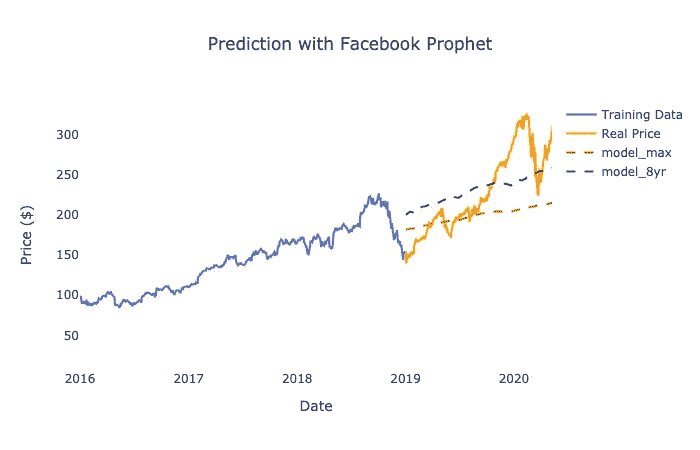
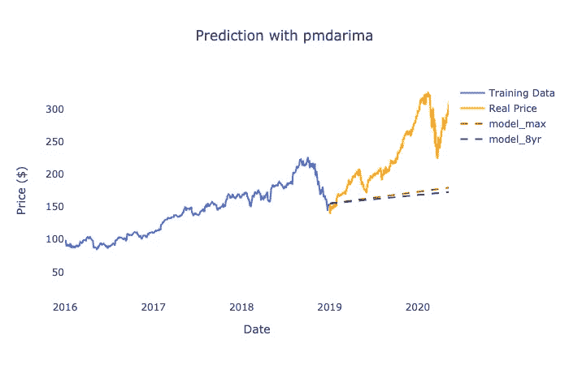
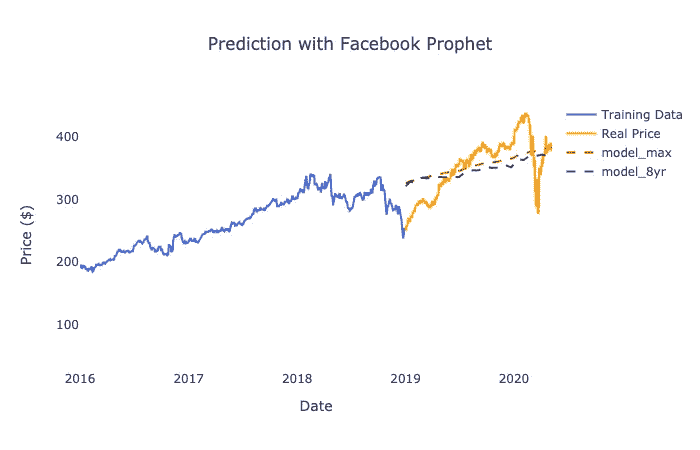

# 用时间序列统计学习预测股票价格

> 原文：<https://medium.datadriveninvestor.com/predict-stock-price-with-time-series-statistical-learning-fec97560439e?source=collection_archive---------0----------------------->


Photo by [Markus Spiske](https://unsplash.com/@markusspiske?utm_source=medium&utm_medium=referral) on [Unsplash](https://unsplash.com?utm_source=medium&utm_medium=referral)

在我最近的股票分析项目中，我计划通过聚集其预测的股票价格来预测标准普尔 500。第一步是预测股票价格。建立一个模型来预测股票价格不是一件容易的工作，但是预测股票价格最简单的方法就是学习时间序列技术。

在我看来，有 3 种算法可以进行预测:自适应模型、盒-Jerkins 方法(ARIMA 模型)和 Holt-Winters 方法；在 Python 中，我们可以使用脸书先知、pmdarima 和 statsmodels 来帮助我们。让我们使用这些软件包为原型预测模型对苹果股票价格进行预测。

使用这三种技术中的一种纯粹是用历史表现来预测股票价格；纯属技术分析。为模型训练选择股票价格的时间间隔会对预测模型的准确性产生巨大影响。最初，我选择了 1997 年到 2018 年之间的股票价格作为训练数据集，选择了 2019 年到 2020 年 5 月之间的股票价格作为测试数据集。在我最初的想法中，时间框架越长，为模型提供的关于股票价格模式的见解越多，预测模型就越准确。因此，至少有两个熊市周期就足够进行模型训练了。

# **脸书先知**

首先，让我们使用脸书先知建立一个预测模型。脸书先知是一个开源的 Python 包，由脸书开发，帮助开发者建立一个自适应的模型。脸书先知(Prophet)是一个非常用户友好的软件包，因为语法是 Sklearn 风格的。Prophet 建立的模型需要 Pandas 数据框架中的训练数据集，该数据框架有两列，必须以“ds”和“y”命名，分别代表日期和响应变量。然后，准备一个数据框，其中包含您希望预测的日期列，列名也必须以“ds”命名。为了方便起见，您可以获得带有日期和股票价格的测试数据集，然后将日期列传递给模型进行预测。

```
# Training data set
X_train = (Source of data…)# Change column names for Prophet, if not, it will not work
X_train.columns = [‘ds’, ‘y’]# Prepare the testing data set
df_test = (Source of data…)# Prepare dates for Prophet for prediction, the column also must called ‘ds’
X_test = pd.DataFrame(df_test[‘ds’])# Train the model and make prediction, same as SKlearn-style syntax
model = Prophet()
model.fit(X_train)
pred = model.predict(X_test)
```

Prophet 所做的预测返回预测，置信区间。预测的那一栏叫做‘yhat’。

让我们用 R 平方来评估预测模型的准确性。它是用 1 — SSE/SST 计算的。不幸的是，这个模型的 R 平方是-4.56%。负的 R 平方意味着模型的表现比取平均值差。

时间序列模型对历史趋势模式非常敏感；建立股票价格预测模型对股票价格表现非常敏感，选择一个时间框架来训练数据集可以很大程度上改变趋势模式。我们知道，苹果公司的股价在 1997 年跌到了最低点，一直持续到 2000 年 ipod 的发布。苹果的股价直到 iPhone 普及后才开始上涨。如果我们选取 2010 年到 2018 年之间的时间框架作为训练数据集。R 平方上升到 44.73%。在这个例子中，我们可以看到训练数据选择是提高准确性的一个重要步骤。我们姑且称用 1997–2018 年数据训练的模型为“model_max”，用 2010–2018 年数据训练的模型为“model_8yr”。



Prediction Apple (AAPL) Stock Price learnt using Facebook Prophet

两个模型都能够发现股票价格的趋势。model_max 由更长的时间间隔组成，其中包括苹果股价上涨势头较弱的年份，因此，我们可以看到 model_max 的价格上涨趋势弱于 model_8yr。因此，用 model_8yr 的预测更接近 2019-2020 年 5 月间的真实股价。

# **pmdarima**

我们可以使用的另一种时间序列统计学习技术是跳箱法。在 R 中，有一个非常方便的包可以搜索 ARMIA 模型的最佳超参数，*预测*包中的 *auto.arima()* 。pmdarima 是 Python 中相当于 R 的*预测*包，旨在找到 ARMIA 模型超参数，如 *auto.arima()* 。与脸书 Prophet 不同，您只需要准备没有日期的响应变量，如 r 中的 auto.arima()。要使用 pmdarima 构建模型，首先，以 Numpy 数组格式准备股票价格，然后，从 pmdarima 调用 auto_arima()，然后预测股票价格。

```
# Prepare training data set in ndarray
X_train = (Source of data…)#Obtain the trading days in testing data
X_test = (Source of data…)# Declare model object and assign minimum and maximum of hyperparameters
model = pmdarima.auto_arima(X_train, start_p=1, start_q=1, max_p=3, max_q=3 m=12,
 max_P=3, max_Q=3, seasonal=True,
 d=1, D=1, max_d=3, max_D=3, trace=True,
 error_action=’ignore’,
 suppress_warnings=True,
 stepwise=True)# Print model summary if you would like to
print(model.summary())# Make prediction, pass a number of predictions you would like to make
# We can pass the number of trading days between 2019 and May 2020
pred = model.predict(X_test.shape[0])
```

pmdarima 遵循 R 风格和语法。语法非常类似于 R 中的预测包，但是 pmdarima 只接受 NumPy 格式的数据；您必须将熊猫数据框列转换为一维 NumPy 数组。为最佳 ARIMA 模型寻找最佳超参数的语法是 auto_arima()，您可以在其中指定最小和最大超参数。它将返回最佳的 ARIMA 模型，并准备进行预测。你可以用。predict()提供一些你想做的预测。例如，如果我们有兴趣获得苹果股票在 2019 年和 2020 年 5 月之间的股价，我们可以输入 343(或测试数据集中的行)来表示 2019 年和 2020 年 5 月之间的 343 个交易日。

让我们尝试建立两个 ARIMA 模型，像我们一样使用两个不同的时间框架来训练数据集——在 1997 年至 2018 年之间和 2010 年至 2018 年之间，并再次将它们称为 model_max 和 model_8yr。

结果 model_max 和 model_8yr 的 R 平方都是负数。如果我们在折线图上绘图，它看起来像这样:



Prediction Apple (AAPL) Stock Price learnt using pmdarima

由于用 pmdarima 训练的两个模型都达到了负的 R-square，我们可以得出结论，用 Box-Jerkins 方法预测苹果股票价格是没有用的。

# **霍尔特-温特斯法**

Holt-Winters 方法是我们在本文中讨论的最后一种时间序列统计学习技术。它使用指数平滑技术，预测完全基于历史表现。我们可以使用 statsmodels 中的指数平滑()函数来构建预测模型。

指数平滑()的样式和语法类似于 pmdarima 中的 auto_arima()。像前面的包一样，您将再次以 Numpy 数组格式准备股票价格，并将其传递给指数平滑()。之后，您可以通过传递您希望做出的预测数，在模型定型后做出预测。

```
# Obtain Training data and Testing data
X_train = (Source of data…)
X_test = (Source of data…)# Model training, need to add alpha and beta in fit()
# Alpha and beta needs to obtain in grid search
model = ExponentialSmoothing(X_train, trend=‘mul’,
 seasonal=‘mul’, seasonal_periods=4).fit(
 smoothing_level=0.6,smoothing_slope=0.25)# Make prediction
pred = model.forecast(X_test.shape[0])
```

您不需要大量数据来构建训练数据；我们可以获得 1 年的股票价格区间，这对于模型来说已经足够了。但是，最难的是找到最佳的 smoothing_level (alpha)和 smoothing_slope (beta)。在这个例子中，我试着将 smoothing_level 设为 0.6，smoothing_slope 设为 0.25，发现这个模型的 R 平方为 41%。


Prediction on Apple (AAPL) stock price using Holt-Winters Method

# **苹果股价的最佳预测模型**

在比较了我们为苹果股价预测模型构建的所有模型后，我们发现，使用脸书预言家对 2010 年至 2018 年间的股价进行训练的预测模型是最准确的，因为它达到了 44%的 R 平方。用 Holt-winters 方法训练的预测模型达到 41%的 R 平方，而用 Box-Jerkins 方法训练的模型都具有负的 R 平方。我们将使用 2010 年至 2018 年间的股票价格训练的模型，使用脸书预言家预测未来的苹果股票价格。

# **所有的股票都不一样**

做 505 个股票价格最难的地方是，我们不能用同样的方法或者同样的时间框架来训练数据集；预测苹果股价的方法和超参数不适用于其他股票。我们再举一个洛克希德·马丁公司(Lockheed Martin)的例子。如果我们用 1997 年至 2018 年的股价和 2010 年至 2018 年的股价，使用脸书预言家为洛克希德·马丁公司训练预测模型，R 平方分别为 42%和 34%。或者，如果我们使用最佳超参数的 Box-Jerkins 方法和 Holt-winters 方法进行训练，R 平方都是负 R 平方。



Prediction on Lockheed Martin (LMT) stock price learnt using Facebook Prophet

# **结论**

对不同股票的股价进行预测是不一样的，每个预测模型都应该是针对每只股票定制的。在本次体验中，我们探索了 3 种不同的 Python 包，以通过 3 种不同的时间序列统计学习来构建预测模型。我们已经发现，相同的方法和超参数不能用于 505 只股票，以达到相同水平的准确性。为了实现所有股票的最高准确性，我们必须使用网格搜索来获得每个股票价格预测模型的最佳方法和超参数。我们知道，每家公司都有自己的业务背景和管理，这对其历史股价起着巨大的作用，并促成了独特的股价趋势模式。我们在文章中使用的方法是基于历史表现预测股票价格的纯技术分析。它不能解释股票的基本面。因此，这是一个很好的起点，但我们应该考虑在预测模型中添加更多的基本特征。

苹果和洛克希德·马丁的股价都是通过 yfinance 从雅虎财经获得的。如果你想了解如何获取股票价格数据，你可以从我的[帖子](https://medium.com/@jjsham/free-apis-to-obtain-stock-price-and-economic-indicators-22a0dc9706cd?source=friends_link&sk=81f0f31b113dcc105af9ac00e91cffeb)中了解更多关于如何从雅虎财经获取数据的信息。如果你想看完整的代码，你可以访问我的 Github 页面，在那里你可以找到与这篇文章相关的代码。

[](https://www.linkedin.com/in/jacquessham/) [## 雅克·沙姆-旧金山湾区|职业简介| LinkedIn

### 查看雅克·沙姆在全球最大的职业社区 LinkedIn 上的个人资料。雅克有 4 个工作列在他们的…

www.linkedin.com](https://www.linkedin.com/in/jacquessham/) 

# **参考**

我在这篇文章上的 Github 页面:

[](https://github.com/jacquessham/StockAnalytics/tree/master/Post_StockPricePrediction) [## 雅克沙姆/股票分析

### 这个文件夹是我的中期文章《用时间序列统计预测股票价格》的补充文件

github.com](https://github.com/jacquessham/StockAnalytics/tree/master/Post_StockPricePrediction) 

我的股票分析项目上的 Github 页面:

[](https://github.com/jacquessham/StockAnalytics) [## 雅克沙姆/股票分析

### 这个项目的目标是进行分析和开发工具进行投资分析。在这个项目中，有…

github.com](https://github.com/jacquessham/StockAnalytics) 

我关于标准普尔 500 预测的 Github 页面:

[](https://github.com/jacquessham/StockAnalytics/tree/master/SP500Prediction) [## 雅克沙姆/股票分析

### 标准普尔 500 是美国的基准指数，也是美国股票市场的重要指标

github.com](https://github.com/jacquessham/StockAnalytics/tree/master/SP500Prediction) 

脸书先知文档:

[](https://facebook.github.io/prophet/) [## 先知

### Prophet 是一个用 R 和 Python 实现的预测程序。它速度很快，并提供完全自动化的预测…

facebook.github.io](https://facebook.github.io/prophet/) 

pmdarima 文档:

 [## pmdarima:Python-pmdarima 1 . 6 . 1 文档的 arima 估计器

### 将 R 的宠儿引入 Python，更有力地证明了为什么数据科学不需要 R。是 100% Python +…

alkaline-ml.com](http://alkaline-ml.com/pmdarima/) 

Statsmodel Holt-winters 文档:

[](https://github.com/alkaline-ml/pmdarima) [## 碱性-ml/pmdarima

### Pmdarima(最初是金字塔-arima，是“py”+“ARIMA”的变位词)是一个统计库，旨在填充…

github.com](https://github.com/alkaline-ml/pmdarima)