# 用 LSTM 预测苹果股价

> 原文：<https://medium.datadriveninvestor.com/predicting-apple-stock-prices-with-lstm-79456ba0b904?source=collection_archive---------1----------------------->

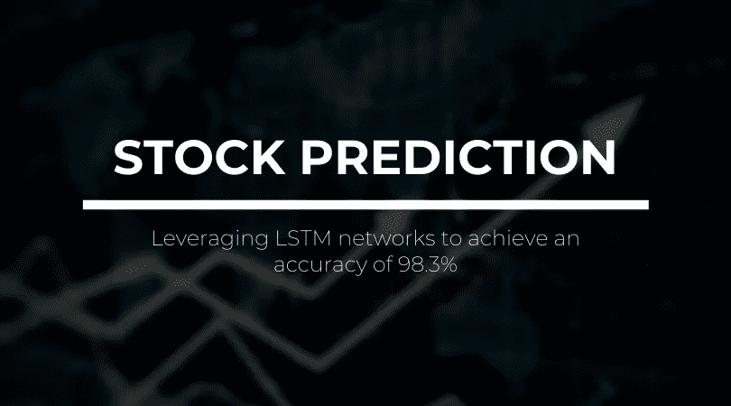

我一直想效仿像埃隆·马斯克、T2、沃伦·巴菲特和 T4 这样的连续创业者的生活，这有三个主要原因。

1.  推动创新和颠覆产业
2.  让自己沉浸在聪明人的环境中
3.  赚足够的钱，让我每次离开家都能穿上一双新鞋子

是啊- *尤其是*最不理智。不幸的是，钱不会长在树上，所以当我 13 岁的时候，我开始投资(实际上)股票。我的投资组合在 3 年内从 100，000 美元涨到 437，303 美元，当我 16 岁时，我开始用真金白银投资。

**我失败了**。可怕地。撕了 16 年的生日钱😥

虽然我在进步，但我想加快这个过程，并决定编写一个能够进行股票预测的 **LSTM** 程序**来拯救我自己免于又一次悲惨的破产！**

传统的神经网络使用**前馈**神经元，输入从该神经元通过函数传播以构建期望的输出。这种架构的局限性在于，它不能捕获输入数据的*顺序信息*，并且人工神经网络不考虑先前的预测。

 [## 认知计算——一套被广泛认为是……

### 作为它的用户，我们已经习惯了科技。这些天几乎没有什么是司空见惯的…

www.datadriveninvestor.com](https://www.datadriveninvestor.com/2020/02/19/cognitive-computing-a-skill-set-widely-considered-to-be-the-most-vital-manifestation-of-artificial-intelligence/) 

**递归神经网络**更好地模拟了我们的认知框架，因为它们在不同的*时间步长*上共享参数，这意味着需要训练的参数更少，计算成本也降低了。它们的内部存储器允许架构**记忆先前的输入**并将先前的输出反馈到输入中，以做出更好的未来预测。

然而，现在很少实现递归神经网络。所有的递归神经网络在递归层中都有**反馈回路**，这使得它们能够将信息保存在*‘记忆’*中，然而训练它们对于需要学习**长期时间依赖性**的 RNN 氏症患者来说是很困难的。这是因为声明的损失函数的梯度随时间呈指数衰减，并且**消失梯度问题**随之而来。

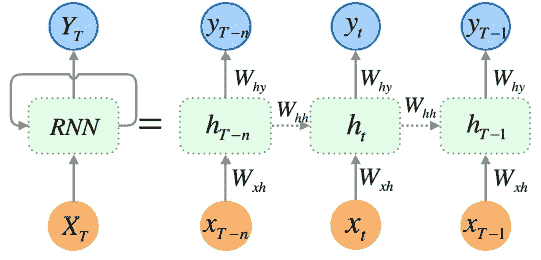

**LSTM** 网络除了使用标准单元之外，还使用特殊单元来包括*存储单元*，这些存储单元可以将信息长时间保存在内存中。这个模型包括多个**门**，它们控制信息进入记忆的时间、输出的时间以及信息被遗忘的时间，从而增强网络学习长期依赖关系的能力。

> *本质上，普通的 RNN 网络只有*个隐藏状态*用于存储，而 LSTM 网络有*个隐藏状态和单元状态*，可以通过门控删除和添加信息。*

从股票预测的角度来看，随着时间的推移，普通 RNN 会忘记早期的股票价格数据，而 LSTM 可以使用历史趋势和数据进行更准确的预测。**存储门**收集可能的输出并存储相关的输出；**选择门**从存储门产生的可能输出中选择最终输出；**遗忘和忽略**门决定哪些数据存储器是不相关的，并处理掉它们。

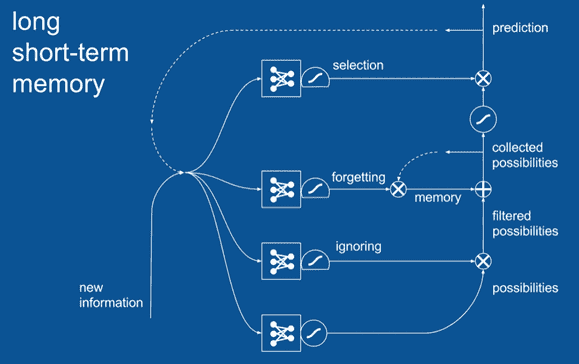

## 既然我们已经理解了递归神经网络和 LSTM 体系结构，让我们开始编程吧！

 [## 苹果股票的苏拉吉-班萨尔/LSTM 预测

### 利用长短期记忆和递归神经网络预测苹果股票价格…

github.com](https://github.com/Suraj-Bansal/LSTM-for-Apple-Stock-Predictions) 

# 步骤 1 →导入库

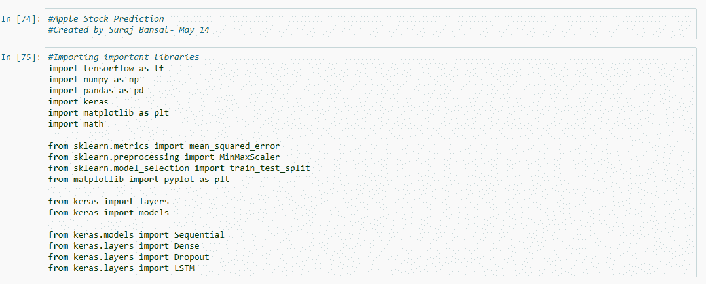

# 步骤 2 →导入数据集

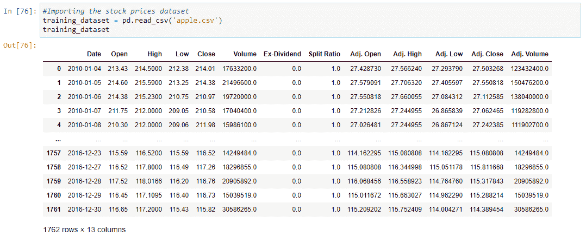

*Pd.read_csv* 帮助将**逗号分隔值(csv)** 文件读入数据帧——我们数据集的*头*和*尾*打印在下面，显示行数和列数。

# 步骤 3 →检查空值

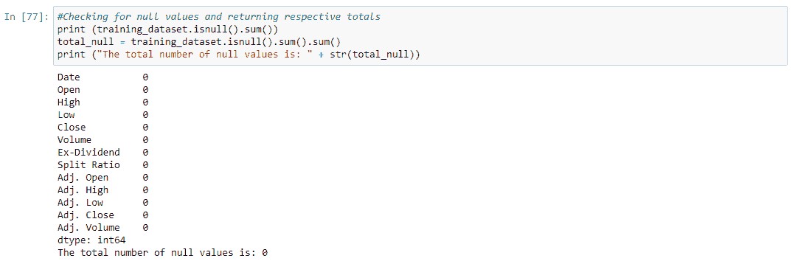

接下来，检查每一列中的空值**并打印找到的空值总数。空值会改变我们模型的预测——幸运的是没有发现空值。**

# 步骤 4 →可视化数据

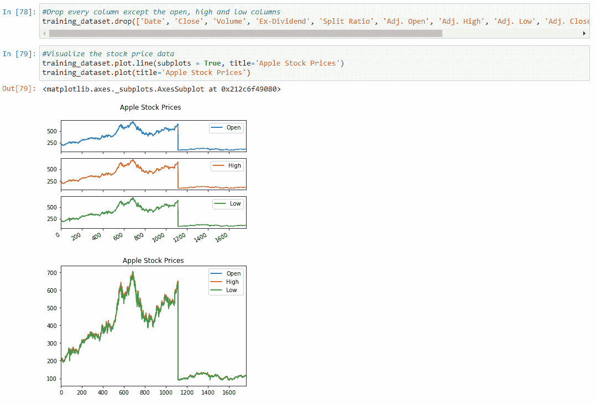

为了可视化股票价格，首先**删除**不必要的列——我单独绘制了每一列，然后为了更好的可视化，将它们集合起来，但是这一步对于创建我们的 LSTM 来说并不是必需的。

# 步骤 5 →删除额外的列

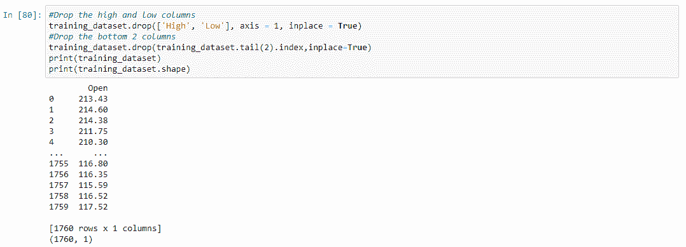

因为我们只处理**开盘**股价，所以我们可以删除高低柱。默认情况下，该函数将在 y 轴上搜索，但设置 **axis = 1** 可确保该函数搜索列而不是行，并且 **inplace=True** 可确保实际数据集被更改。我们还删除了最下面的两行，以便以后更清晰地显示数字。

# 步骤 6 →分为培训和测试

在继续之前，将数据集转换成一个 **numpy 数组**。然后将数据的 **1760** 个样本的数据集按照 *80/20* 的百分比分成训练和测试两部分，训练数据集 **1408** 个样本，测试数据集 **352** 个样本。

# 步骤 7 →缩放数据

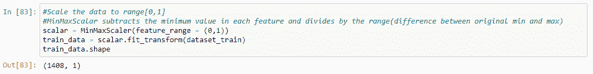

当每个单独的特征被**缩放**到更小的范围，同时保持*正态分布*时，机器学习工作流得到更好的优化。我使用了一个效用函数**将特征向量**缩放成表示形式，以使*在特定范围内标准化*数据，并在减少误差的同时加快计算速度。

我将数据缩放到默认范围 **[0，1]** ，并使用**最小最大缩放器**，它减去每个单独特征中的最小值并除以该范围，该范围计算为原始最小值和最大值之间的差值。

> 如果您对全面理解数据预处理以及如何使用 scikit-learn 进行缩放感兴趣，请查看这篇文章！

 [## 使用 SCIKIT 学习进行数据预处理

### 大多数机器学习工作流在要素按相对较小的比例缩放时运行得更好，并且通常…

medium.com](https://medium.com/datadriveninvestor/data-pre-processing-with-scikit-learn-9896c561ef2f) 

# 第八步→分成 X 列车和 Y 列车

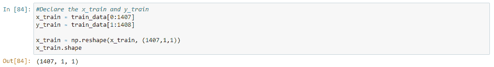

将数据分为 x_train 和 y_train，并将 x_train 重新整形为 LSTM 模型可接受的 3D 输入。

# 步骤 9 →建立 LSTM 模型

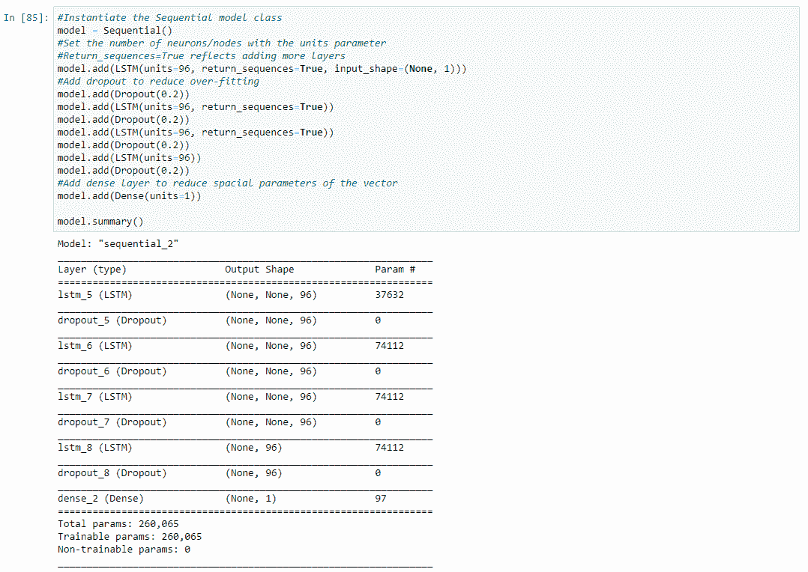

首先，实例化预训练的**顺序**模型，它通过允许我们简单地添加层而使生活变得更容易。

**LSTM 层**设置声明输出空间维度的*单元*的数量。 **Return_sequences = True** 确定是返回输出序列中的前一个输出，还是整个序列，而 **input_shape** 表示我们训练数据集的形状，基本上反映了*时间步长*的数量，而最后一个参数是指示符的数量。

**退出层**随机选择神经元并忽略它们，以使我们的网络*对特定神经元值不太敏感*，从而使*具有更好的泛化能力*。这避免了**过度拟合**，这概括了模型在训练数据上比测试数据表现更好的现象。

# 步骤 10 →编译模型

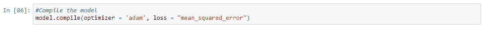

使用 **Adam optimizer** 编译模型，Adam optimizer 使用*自适应学习速率*方法根据训练数据更新神经网络的八次迭代。它将 **RMSprop** 和**随机梯度下降**与**动量**结合在一起——本质上是平方梯度以缩放学习速率，类似于 RMSprop，但它通过使用梯度的移动平均值而不是梯度本身来利用动量，就像具有动量的 SGD 一样。

**估计器的均方误差**测量误差平方的平均值*(估计值和估计值之间的平均平方差)*。此度量查找部分误差，该误差等于由测量点之间的距离产生的形状面积。

# 步骤 11 →拟合模型

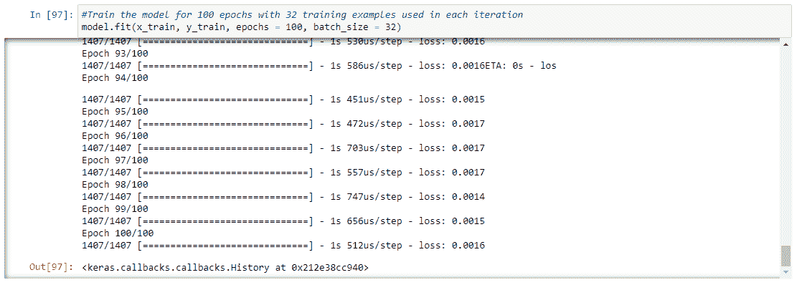

用 **32** 的**批量**训练 **100 个周期**的模型。这意味着 32 个训练样本将用于 100 次迭代。

# 步骤 12 →预测测试数据

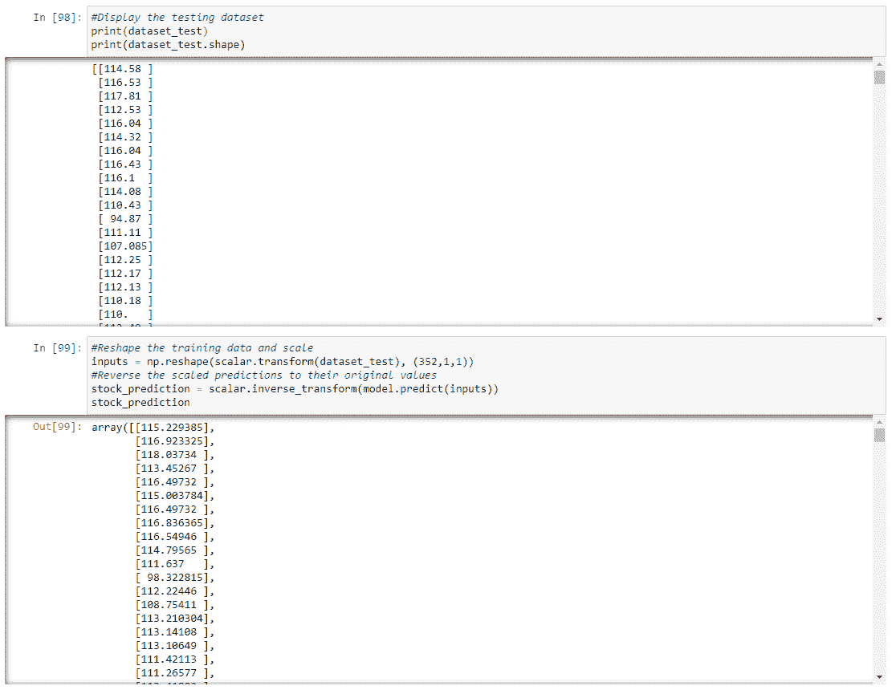

将测试数据整形为可接受的 **3D** 格式，并将之前使用的*标量*应用于数据集。将**模型预测**应用到数据上，然后**将预测逆**为其原始值。

# 步骤 13 →绘制数据

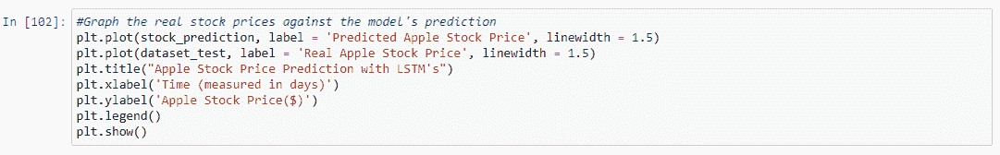

绘制预测股票价格与实际股票价格的对比图。创建图表是不言自明的。该图应该类似于下图。

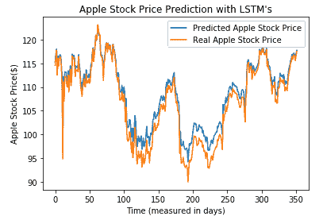

# 步骤 14 →一些快速数学

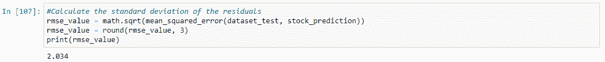

**RMSE 值**代表残差方差的*平方根，表示模型对数据的绝对拟合，以及数据点到模型预测值之间的距离。这么低的 RMSE 值太棒了！*

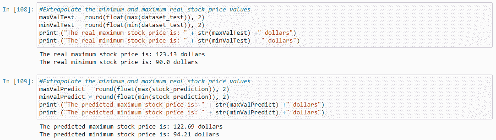

只是为了好玩，我计算了实际数据集和预测值的**最小值**和**最大值**股价。

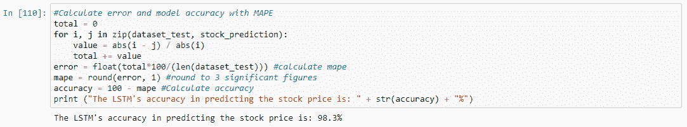

最后，我确定了**模型精度**。我是通过计算 MAPE 的值来实现的，这个值用下面的公式表示。

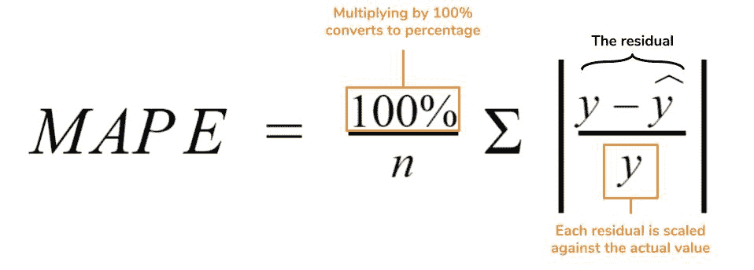

这个基本上取*(实际—预测)* 100/绝对值(实际)*样本数的绝对值。*使用 for 循环计算实际值上的残差总和，然后通过舍入该总和除以样本数并转换为百分比来计算 MAPE。

由于 MAPE 代表**误差**，所以**精度**是通过从 100 中减去误差得到的，以显示 **98.3%** 的精度！这意味着我们的模型非常准确。希望这意味着每次我根据我的 LSTM 做预测时，我会变得更富有 98.3%🤑

# 最后一件事

> 希望你能够更好地理解 LSTM 网络，以及我如何利用它们进行股票预测！如果你能通过做以下事情来支持我，那对我来说将意味着一切

1.  注意👏图标？给我的文章发些**掌声**
2.  **通过 [Twitter](https://twitter.com/surajbansal2003) 、 [LinkedIn](https://www.linkedin.com/in/suraj-bansal/) 和 [Github](https://github.com/Suraj-Bansal) 与我联系**
3.  **查看**我的[个人网站](https://surajbansal.ca/)了解我的最新作品