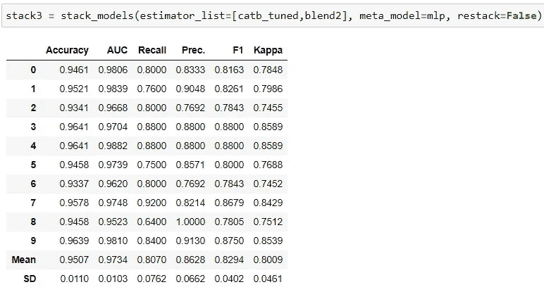

# 使用机器学习预测黄金价格的崩溃

> 原文：<https://medium.datadriveninvestor.com/predicting-crashes-in-gold-prices-using-machine-learning-5769f548496?source=collection_archive---------0----------------------->

## [黄金预测](https://towardsdatascience.com/tagged/gold-price-prediction)

## 使用 PyCaret 分类预测黄金价格暴跌的分步指南


Gold Price Movement

## 方法

在[黄金预测](https://towardsdatascience.com/machine-learning-to-predict-gold-price-returns-4bdb0506b132)系列的前两部分中，我们讨论了如何从免费的 yahoofinancials API 导入数据，并构建一个 ***回归模型*** 来预测黄金在两个时间段内的回报。即 14 天和 22 天。

在这一部分，我们将试图预测在未来 22 天内，黄金价格是否会出现“大幅下跌”或“崩盘”。我们将在这个实验中使用一个 ***分类*** 技术。我们还将学习如何使用训练好的模型对每天的新数据进行预测。这个练习的步骤是:

1.  **导入并形成数据**——这类似于本文第一部分中的解释。您也可以从我的 git [repo](https://github.com/Riazone/Gold-Return-Prediction/blob/master/Training%20Data.csv) 下载最终数据集。
2.  **定义*【暴跌】*** 黄金价格。夏普不是一个绝对的衡量标准。我们将尝试客观地定义*【暴跌】*
3.  **创建标签**——根据*【暴跌】*的定义，我们将在历史数据上创建标签
4.  训练模型预测*【暴跌】*并使用训练好的模型对新数据进行预测

**准备数据**

这一部分与我们在第一部分中所做的完全相同。[笔记本](https://github.com/Riazone/Gold-Return-Prediction/blob/master/Classification/Gold%20Prediction%20Experiment%20%20Classification-%20PyCaret.ipynb)包含用于数据导入和操作的完整代码块，或者您可以通过加载数据集直接开始，该数据集可以从这里的链接[下载。](https://github.com/Riazone/Gold-Return-Prediction/blob/master/Training%20Data.csv)

**定义‘大幅下跌’**

任何分类问题都需要标签。这里，我们需要通过定义和量化“大幅下跌”来创建标签。

为了定义“夏普”，我定义了一个阈值，使得任何窗口(这里是 22 天，这里是 14 天)的回报率低于阈值的概率为 15%(基本上是 p=0.15 的正态分布的左尾)。为此，我需要假设收益的分布是正态的。看看回报的分布，这是一个非常合理的假设。


Histogram of Returns for both 14 and 22 Day window. Very close to Normal Distribution

为了得到两个窗口(14 天和 22 天)的阈值回报水平，我将首先定义分布左尾的 p 值，在本例中为 15%。使用此 p 值，我们从标准正态分布中获得-1.0364 的 z 值。下面的代码将为我们做这件事。

```
import scipy.stats as st
#Select Threshold p (left tail probability)
p= 0.15
#Get z-Value
z = st.norm.ppf(p)
print(z)
```

现在，根据上面的 z 值和每个窗口回报的均值和标准差，我们将获得阈值回报水平。“数据”中的“黄金-T+14”和“黄金-T+22”列显示了 14 天和 22 天的远期收益。

```
#Calculating Threshold (t) for each Y
t_14 = round((z*np.std(data[“Gold-T+14”]))+np.mean(data[“Gold-T+14”]),5)
t_22 = round((z*np.std(data[“Gold-T+22”]))+np.mean(data[“Gold-T+22”]),5)print(“t_14=”,t_14)
print(“t_22=”,t_22)t_14= -0.03733
t_22= -0.04636
```

因此，14 天窗口的阈值回报水平为-0.0373 或-3.73%，22 天窗口的阈值回报水平为-0.0463 或-4.63%。这意味着，14 天回报率低于-3.73%和 22 天回报率低于-4.63%的概率只有 15%。这是一个类似于计算风险价值(VAR)的概念。

**创建标签**

我们将使用上述阈值水平来创建标签。两个窗口中低于各自阈值的任何回报将被标记为 1，否则标记为 0。

```
#Creating Labels
data[‘Y-14’] = (data[‘Gold-T+14’]< t_14)*1
data[‘Y-22’]= (data[‘Gold-T+22’]< t_22)*1
print(“Y-14”, sum(data[‘Y-14’]))
print(“Y-22”, sum(data[‘Y-22’]))Y-14 338
Y-22 356
```

在总共 2，379 个实例中，有 338 个实例的 14 天回报率低于阈值-3.73%，有 356 个实例的 22 天回报率低于阈值-4.63%。

一旦我们有了这些标签，我们实际上并不需要 returns 列，因此我们删除了实际 returns 列。

```
data = data.drop([’Gold-T+14',’Gold-T+22'],axis=1)
data.head()
```

## 用 PyCaret 建模

**22 天窗口**

我们将从这里的 22 天窗口开始。我将在这里使用 PyCaret 的分类模块进行实验。

我们从 PyCaret 导入上面的模块，然后删除 14 天的标签，因为我们在这里使用的是 22 天的窗口。就像在回归中一样，要开始分类练习，我们需要运行 *setup()* 命令来指出数据和目标列。记住所有基本的预处理都是由 PyCaret 在后台处理的。

```
from pycaret.classification import *data_22 = data.drop([’Y-14'],axis=1)
s22 = setup(data=data_22, target=’Y-22', session_id=11, silent=True);
```

为了评估所有模型的集合，我们将运行 *compare_models()* 命令，并将 *turbo* 设置为 ***False*** ，因为我想要评估库中当前可用的所有模型。

```
compare_models(turbo=False)
```


Compare Models Output

在继续选择模型之前，我们需要了解哪个指标对我们最有价值。分类实验中度量标准的选择取决于业务问题。在精确度和召回率之间总是有一个权衡。这意味着我们必须在真阳性和假阴性之间进行选择和权衡。

在这里，最终模型将用于为投资者/分析师创建一个标志，警告他即将发生崩溃的可能性。然后，投资者将决定对冲他的头寸以应对可能的下跌。因此，模型能够预测所有/大部分的剧烈下跌是非常重要的。换句话说，我们希望选择一个具有更好的真阳性能力(更好的召回率)的模型，即使它会带来一些假阳性的代价(更低的精度)。换句话说，我们不希望模型错过“急剧下跌”的可能性。我们可以承受一些假阳性，因为如果模型预测会出现大幅下跌，而投资者对冲了他的头寸，但下跌并没有发生，投资者将失去继续投资的机会成本或至多对冲成本(比如说，如果他买入看跌期权)。这个成本将低于假阴性的成本，在假阴性中，模型预测没有*【大幅下跌】*，但大幅下跌确实发生了。然而，我们需要注意**精度**和 **AUC** 的权衡。

我们将继续创建四个模型，即 MLP 分类器( *mlp)* 、额外树分类器( *et)* 、Cat Boost 分类器( *catb* )以及具有最佳**召回率**和合理 **AUC/Precision 的轻梯度提升机( *lgbm* )。**


基于我们得到的结果，MLP 分类器似乎是最好的选择，具有最高的召回率和非常好的 94.7%*AUC。*

**超参数调谐**

一旦我们有了想要进一步研究的前四个模型，我们需要找到模型的最佳超参数。PyCaret 有一个非常方便的函数 ***tune_model()*** ，它遍历预定义的超参数网格，通过 10 重交叉验证找到我们模型的最佳参数。PyCaret 使用标准的 ***随机网格*** 搜索来遍历参数。迭代次数( *n_iter* )可以根据计算能力和时间限制指定一个较大的数值。在***tune _ function()***中，PyCaret 还允许我们指定我们想要优化的指标。默认值是准确性，但是我们也可以选择其他指标。就像我们在这里选择**回忆**一样，因为这是我们想要增加/优化的指标。


CatBoost Tuned Output

上面的代码调整 Cat-Boost 分类器，通过在定义的网格上迭代 50 次来优化**【Recall】**，并显示每个折叠的 6 个指标。我们看到**的意思是召回**从 base Cat-Boost 中的*58.2%提升到这里的*62.6%。这是一个巨大的跳跃，在调优阶段并不常见。但是仍然低于我们之前创建的基础***【MLP***】的*66.6%。对于其他三个模型，我们没有看到通过调整带来的性能提升(例如在[笔记本](https://github.com/Riazone/Gold-Return-Prediction/blob/master/Classification/Gold%20Prediction%20Experiment%20%20Classification-%20PyCaret.ipynb)中)。原因是迭代参数的随机性。然而，有一个参数将等于或超过基本模型的性能，但为此，我们需要增加更多的时间，这意味着更多的计算时间。***

***因此，目前我们排名前四的车型是:***

******

## *****评估模型*****

***在继续之前，让我们评估一下模型的性能。我们将利用 PyCaret 的***evaluate _ model()***函数来评估和突出显示获奖模型的重要方面。***

****混淆矩阵****

****

****特征重要性****

**由于 *mlp* 和 *catb_tuned* 不提供特性重要性，我们将使用 *lgbm* 来查看哪些特性在我们的预测中最重要:**

****

**我们可以看到，过去 180 天的*‘黄金回归’*是这里最重要的因素。这也是直观的，因为如果黄金价格在过去上涨了很多，它们下跌/修正的机会就更大，反之亦然。接下来的 3 个特征是白银在 250、60 和 180 天内的收益。同样，白银和黄金是交易和关联最广的两种贵金属，因此这种关系非常直观。**

## ****集合模特****

**在调整了模型的超参数之后，我们可以尝试集成方法来提高性能。我们可以尝试的两种组装方法是[“装袋”和“增压”](https://towardsdatascience.com/ensemble-methods-bagging-boosting-and-stacking-c9214a10a205)。不提供概率估计的模型不能用于提升。因此，我们只能将 Boosting 与“lgbm”和“et”一起使用。对于其他人，我们尝试 bagging 来看看性能是否有任何改进。下面是代码快照和 10 倍的结果。**

********

**Ensembling Results**

**正如我们在上面看到的，这两个模型的结果并没有改善。对于其他型号，性能也有所下降(查看[笔记本](https://github.com/Riazone/Gold-Return-Prediction/blob/master/Classification/Gold%20Prediction%20Experiment%20%20Classification-%20PyCaret.ipynb))。因此，我们的成功模式保持不变。**

****混合模型****

**混合模型基本上是在估计器的基础上构建一个投票分类器。对于提供预测概率的模型，我们可以使用软投票(使用它们的概率)，而对于其他模型，我们将使用硬投票。 ***blend_model()*** 函数默认使用硬投票，可以手动更改。我构建了两个混合，看看是否有一些额外的性能可以提取。**

********

**虽然没有一款车型能够将***【MLP】***从榜首位置上赶下来，但第二款***【blend 2】***非常有趣，它是***【lgbm】***和***【et】***的软组合。**62.25%****97.43%**在**召回**和 **AUC** 上的表现分别高于***【lgbm】***和***【et】***两者。这展示了混合模型的好处。现在我们的冠军模特将减少到 3 个。**

****

**[**创建栈网**](https://www.coursera.org/lecture/competitive-data-science/stacknet-s8RLi)**

**[堆叠模型](https://www.geeksforgeeks.org/stacking-in-machine-learning/)是一种方法，其中我们允许一个层中的一个模型(或一组模型)的预测被用作后续层的特征，最后，元模型被允许根据先前层的预测和原始特征进行训练(如果 *restack=True* )以做出最终预测。PyCaret 有一个非常简单的实现，我们可以使用***stack _ model()***构建一个一层一元模型的堆栈，或者使用***create _ stacknet()***构建多个层一元模型的堆栈。我使用了不同的组合来构建不同的堆栈并评估性能。**

****

**Results of Stack-1**

**在第一个堆栈中，***【stack 1】***，我使用了表现不佳的模型， ***catb_tuned*** 和 ***blend2*** 在第一层将它们的预测传递给领导者模型 ***mlp*** ，这将帮助它做出预测， ***mlp*** 的预测由元模型使用，即**由于 ***LR*** 没有很好地处理完整的数据(参见比较模型结果)，我使用了 *restack=False* ，这意味着只有来自先前模型的预测被传递给后续的估计器，而不是原始特征。我们在这里看到的简直是魔术。**召回**从我们最好的车型***【MLP】***的 **66.63%** 跃升到大规模的**77.8%****AUC**和 **Precision** 也是如此。***【stack 1】***绝对远远优于我们之前打造的所有车型。显然，我不得不尝试其他配置，看看是否可以实现更好的性能。我确实找到了一个更好的配置:****

****

**Results of Stack 3**

**上面的堆栈***【stack 3】***取得了最大的成功，其**召回率**平均为 **80.7%** ，即**比我们的获胜者***【MLP】***模型高 14%** ，而没有牺牲**准确性** ( *95%，提高了 3%* )，**

**我们可以使用这个模型来预测我们在设置阶段分离的测试数据*(总观测值的 30)*。我们可以通过使用 *predict_model()* 来实现**

****

**我们可以看到，该模型在测试数据上的表现更好，召回率为 86.9%**

**由于我们有***【stack 3】***作为主导模型，我们将在整个数据(包括测试数据)上拟合该模型，并保存该模型以便对新数据进行预测。**

```
**classifier_22 = finalize_model(stack3)save_model(classifier_22,”22D Classifier”)**
```

**上面的代码拟合了整个数据上的模型，并使用 ***save_model()*** 函数，我将训练好的模型和预处理管道保存在我的 active directory 中一个名为 [" ***22D 分类器*** "](https://github.com/Riazone/Gold-Return-Prediction/blob/master/Classification/22D%20Classifier.pkl) 的 *pkl* 文件中。这个保存的模型可以并且将会被调用来对新数据进行预测。**

## **预测新数据**

**为了进行预测，我们需要像在练习开始时那样导入原始价格数据，以提取特征，然后加载模型进行预测。唯一的区别是，我们将导入数据直到最后一个交易日，以便根据最新数据做出预测，就像我们在现实生活中所做的那样。标题为***'***[***黄金预测新数据—分类'***](https://github.com/Riazone/Gold-Return-Prediction/blob/master/Classification/Gold%20Prediction%20New%20Data%20-%20Classification.ipynb) 的笔记本在回购中展示了数据导入、准备和预测代码。**

**我们将跳过数据导入和准备部分(查看笔记本了解详情)，看看预测过程。**

```
**from pycaret.classification import *
***#Loading the stored model***
classifier_22 = load_model(“22D Classifier”);
***#Making Predictions***
prediction = predict_model(classifier_22,data=prediction_data)**
```

**使用***predict _ model()***我们可以将加载的模型应用于新的数据集，以生成预测(1 或 0)和得分(预测附带的概率)。*‘预测’*数据帧也将包含我们提取的所有特征。**

****

**Prediction Tail**

**查看预测的“标签”和“分数”列，该模型没有预测到任何一天会有明显的下跌。例如，考虑到截至 4 月 29 日的历史回报，该模型预测未来 22 天黄金价格的显著下跌是 ***不太可能*** ，因此 **Label = 0** ，概率为 9.19%。**

# **结论**

**因此，在这里，我逐步创建了一个分类器来预测未来 22 天黄金价格的大幅下跌。笔记本也包含了 14 天模型的代码。您可以尝试创建标签，并尝试以类似的方式预测不同时间窗口内的类似下跌。到目前为止，我们已经创建了一个[回归](https://towardsdatascience.com/machine-learning-to-predict-gold-price-returns-4bdb0506b132)和一个分类模型。在未来，我们将尝试使用分类模型的预测作为回归问题的特征，看看它是否能提高回归的性能。**

# **重要链接**

**[***Git-hub 仓库***](https://github.com/Riazone/Gold-Return-Prediction/tree/master/Classification)**

**[***第一部分和第二部分—回归***](https://towardsdatascience.com/machine-learning-to-predict-gold-price-returns-4bdb0506b132)**

**[***py caret***](https://pycaret.org/)**

**[***我的领英简介***](https://www.linkedin.com/in/riazuddin-mohammad/)**

**点击订阅 DIntel [。](https://ddintel.datadriveninvestor.com/)**

**请访问我们的网站:[https://www.datadriveninvestor.com](https://www.datadriveninvestor.com/)**

**在这里加入我们的网络:[https://datadriveninvestor.com/collaborate](https://datadriveninvestor.com/collaborate)**