# 使用 ML 技术预测信用卡批准

> 原文：<https://medium.datadriveninvestor.com/predicting-credit-card-approvals-using-ml-techniques-9cd8eaeb5b8c?source=collection_archive---------0----------------------->

在这个项目中，我们将使用来自 UCI 机器学习知识库的信用卡审批数据集。我们项目的结构如下—

*   获得我们项目的基本介绍&与它相关的业务问题是什么？
*   我们将从加载和查看数据集开始。
*   操作数据，如果数据集中有任何缺失的条目。
*   对数据集执行探索性数据分析(EDA)。
*   在将机器学习模型应用于数据集之前预处理数据。
*   应用机器学习模型来预测个人的信用卡申请是否会被接受。

## 信用卡应用及其相关问题

如今，银行收到很多申请发行信用卡。他们中的许多人因为许多原因被拒绝，如高贷款余额，低收入水平，或对个人信用报告的过多查询。手动分析这些应用程序容易出错，而且非常耗时。幸运的是，这项任务可以借助机器学习的力量实现自动化，如今几乎每家银行都在这么做。在这个项目中，我们将使用机器学习技术建立一个自动信用卡批准预测器，就像真正的银行一样。

**第一个任务**

导入 pandas 包并加载数据集。

1.  **pandas** : Pandas 用于读取数据集文件，并将其作为 dataframe 导入，类似于一个包含行和列的表格。

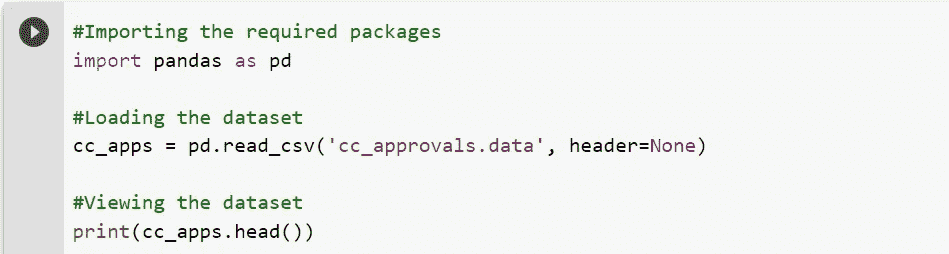

Importing the pandas packages and Loading the dataset

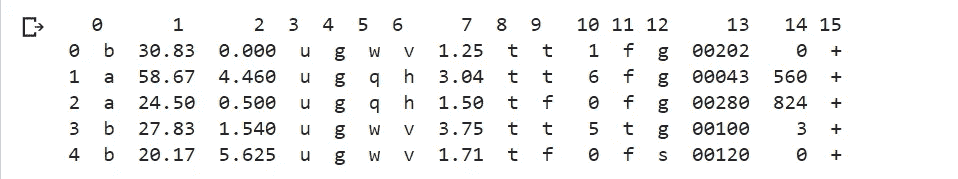

OUTPUT

根据上面的观察，输出乍一看有点混乱，但是让我们试着找出信用卡应用程序最重要的特性。我们发现，由于数据是保密的，该数据集的贡献者对要素名称进行了匿名处理。为了保护隐私，这个数据集的特征被匿名化了，但是 [*这篇博客*](http://rstudio-pubs-static.s3.amazonaws.com/73039_9946de135c0a49daa7a0a9eda4a67a72.html) 给了我们一个很好的可能特征的概述。在典型的信用卡应用中，可能的特征是`Gender`、`Age`、`Debt`、`Married`、`BankCustomer`、`EducationLevel`、`Ethnicity`、`YearsEmployed`、`PriorDefault`、`Employed`、`CreditScore`、`DriversLicense`、`Citizen`、`ZipCode`、`Income`，最后是`ApprovalStatus`。

**第二个任务**

正如我们从数据的第一个输出中看到的，数据集混合了数字和非数字特征。这可以通过一些预处理来解决，但在此之前，让我们再多了解一下数据集，看看是否还有其他需要解决的数据集问题。

那么，让我们从打印汇总统计数据和数据帧信息开始-

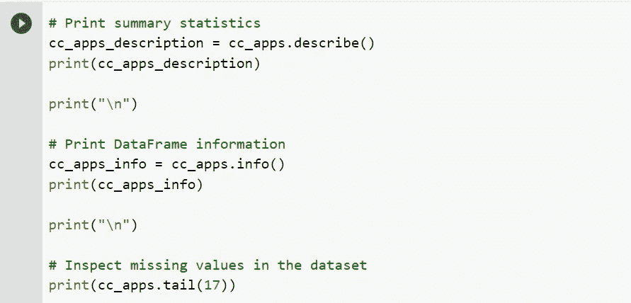

Data analysis part

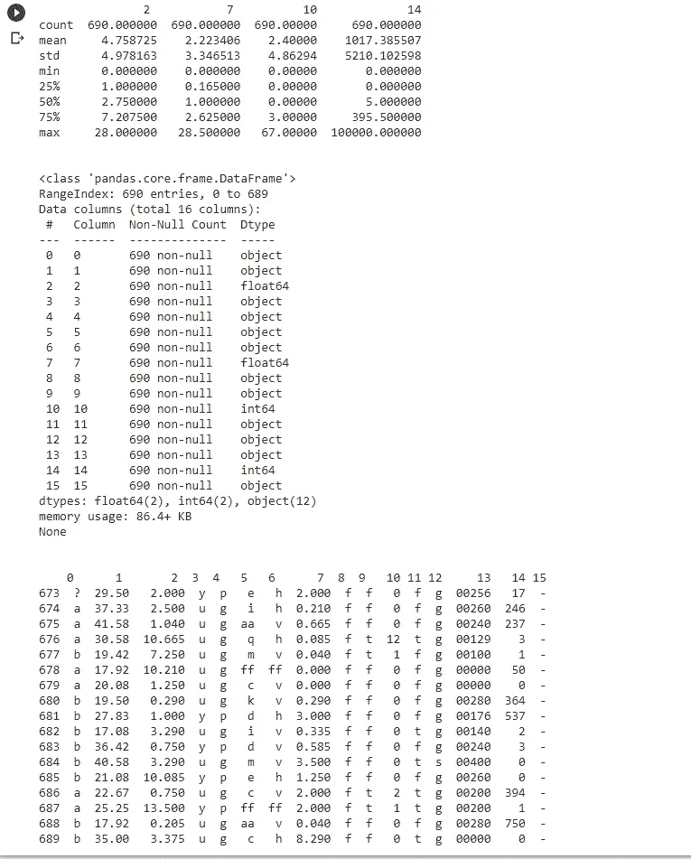

OUTPUT

**第三项任务**

操纵数据—第 1 部分

我们已经发现了一些问题，如果这些问题不变，将会影响我们的机器学习模型的性能:

*   我们的数据集包含数值和非数值数据(特别是属于`float64`、`int64`和`object`类型的数据)。具体来说，特性 2、7、10 和 14 包含数值(分别属于 float64、float64、int64 和 int64 类型)，所有其他特性包含非数值(属于 object 类型)。
*   数据集还包含几个范围的值。一些特性的取值范围为 0–28，一些特性的取值范围为 2–67，一些特性的取值范围为 1017–100000。除此之外，我们还可以获得有用的统计信息(如`mean`、`max`和`min`)，这些信息是关于有数值的特征的。
*   最后，数据集有缺失值，我们将在本任务中处理这一问题。数据集中缺少的值标有“？”，这可以在最后一个单元格的输出中看到。

现在，我们暂时把这些缺失的值问号换成 NaN。

*   **numpy 包** : numpy 使我们能够高效地使用数组。

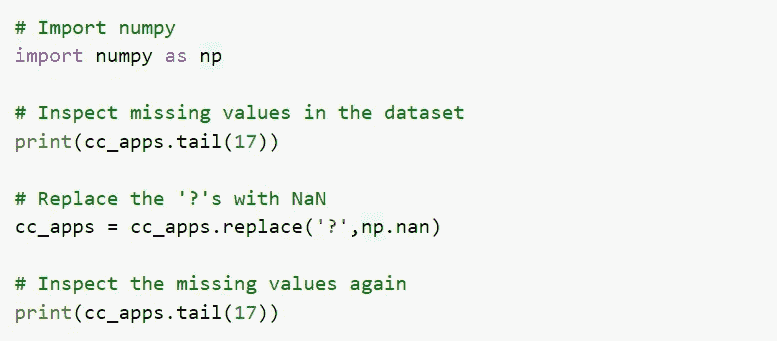

Importing numpy package and manipulating the dataset

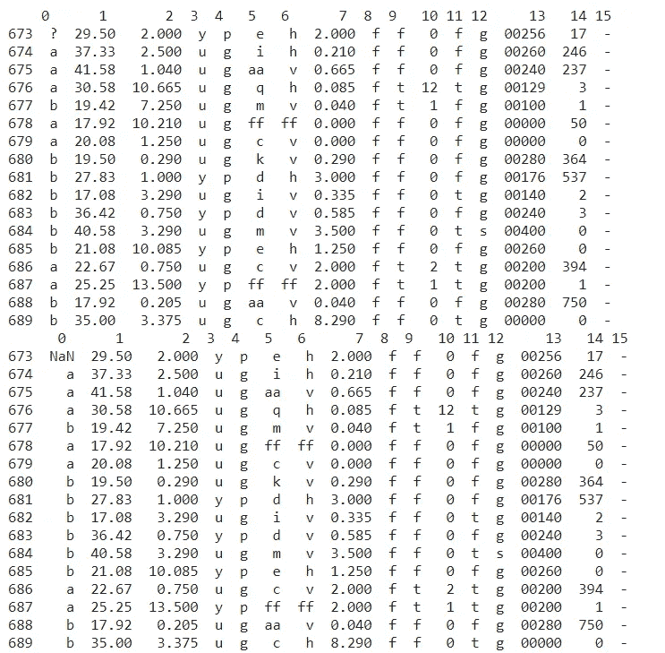

OUTPUT

**第四项任务**

操纵数据—第 2 部分

我们把所有的问号都换成了 NaNs。这将有助于我们在本任务中执行的下一个缺失值处理。

这里提出的一个重要问题是" ***为什么我们如此重视缺失值*？"难道他们就不能被忽略吗？忽略缺失值会严重影响机器学习模型的性能。当忽略丢失的值时，我们的机器学习模型可能会丢失关于数据集的信息，这些信息可能对其训练有用。然后，有许多模型不能隐式处理缺失值，如 LDA。**

因此，为了避免这个问题，我们将使用一种称为*均值插补*的策略来插补缺失值。

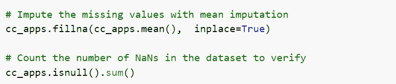

Imputing the missing values with mean

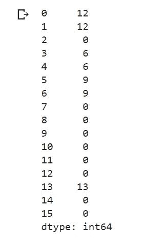

OUTPUT

**第五个任务**

操纵数据—第 3 部分

我们已经成功地处理了数字列中缺失的值。第 0、1、3、4、5、6 和 13 列仍有一些缺失值需要估算。所有这些列都包含非数字数据，这就是平均值插补策略在这里不起作用的原因。这需要不同的处理方式。

我们将用各列中出现频率最高的值来估算这些缺失值。一般来说，在为分类数据输入缺失值时，这是一种很好的做法。

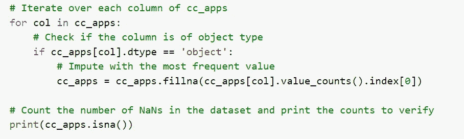

Imputing the missing values with the most frequent value in that column

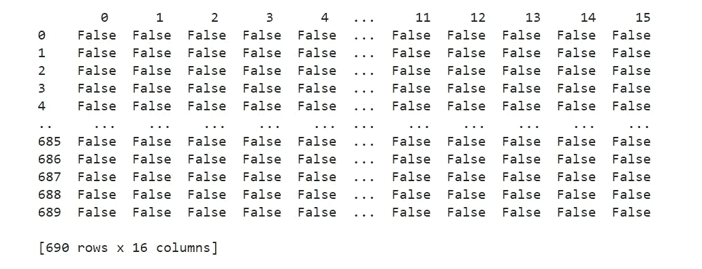

“OUTPUT” shows that there are no more missing values in the dataset

**第六个任务**

数据预处理—第 1 部分

丢失的值现在已被成功处理。

在我们着手建立我们的机器学习模型之前，仍然需要一些次要但重要的数据预处理。我们将把这些剩余的预处理步骤分成三个主要任务:

1.  将非数字数据转换为数字数据。
2.  将数据分成训练集和测试集。
3.  将特征值缩放到统一的范围。

首先，我们将把所有非数字值转换成数字值。我们这样做是因为它不仅可以加快计算速度，而且许多机器学习模型(如 XGBoost)(尤其是使用 scikit-learn 开发的模型)都要求数据是严格的数字格式。我们将通过使用一种叫做*标签编码*的技术来做到这一点。

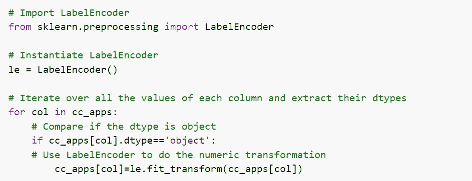

Converting the non-numeric values into numeric values

**第七个任务**

将数据集分为训练集和测试集

我们已经成功地将所有非数字值转换为数字值。

现在，我们将数据分为训练集和测试集，为机器学习建模的两个不同阶段准备数据:训练和测试。理想情况下，来自测试数据的任何信息都不应用于调整训练数据，也不应用于指导机器学习模型的训练过程。因此，我们首先分割数据，然后应用缩放。

此外，像`DriversLicense`和`ZipCode`这样的特征没有数据集中预测信用卡批准的其他特征重要。我们应该放弃它们，以设计具有最佳功能集的机器学习模型。在数据科学文献中，这通常被称为*特征选择*。

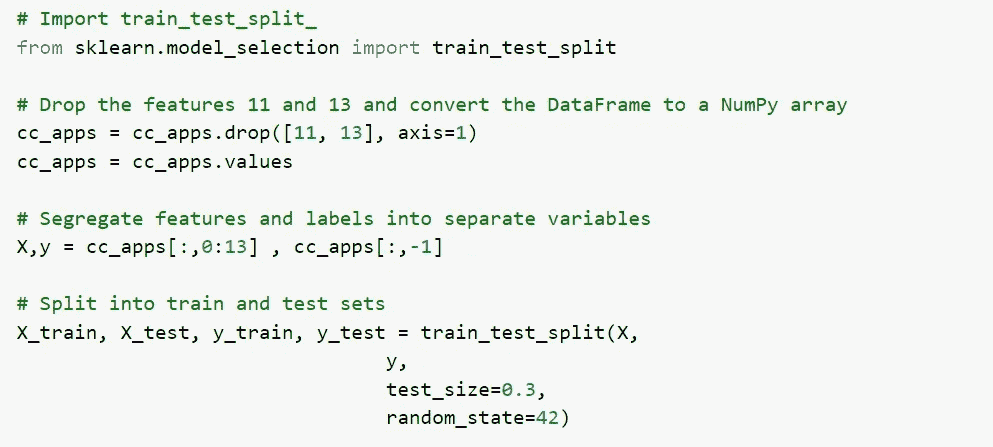

Splitting the data into training set (70%) and test set (30%)

**第八项任务**

数据预处理—第 2 部分

数据现在被分成两个独立的集合，分别是训练集和测试集。在我们可以将机器学习模型拟合到数据之前，我们只剩下缩放的最后一个预处理步骤。

现在，让我们试着理解这些换算值在现实世界中意味着什么。我们以`CreditScore`为例。一个人的信用评分是基于其信用历史的信用度。这个数字越高，一个人被认为在财务上越值得信任。因此，1 的`CreditScore`是最高的，因为我们将所有值重新调整到 0-1 的范围内。

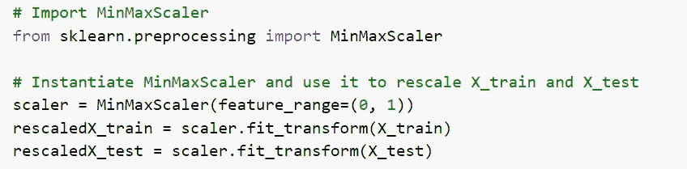

Scaling the feature values to a given range

**第九任务**

将逻辑回归模型拟合到训练集

本质上，预测信用卡申请是否会被批准是一项分类任务。根据 UCI 的说法，我们的数据集包含更多对应于“拒绝”状态的实例，而不是对应于“批准”状态的实例。具体来说，在 690 个案例中，有 383 个(55.5%)申请被拒绝，307 个(44.5%)申请获得批准。

这给了我们一个基准。一个好的机器学习模型应该能够根据这些统计数据准确地预测应用程序的状态。

我们应该选择哪个型号？一个要问的问题是:*影响信用卡审批决策过程的特征是否相互关联？*虽然我们可以测量相关性，但这超出了本笔记本的范围，所以我们将依靠我们的直觉，它们现在确实是相关的。由于这种相关性，我们将利用广义线性模型在这些情况下表现良好的事实。让我们从逻辑回归模型(广义线性模型)开始我们的机器学习建模。

*   sklearn 包:这个机器学习库包括许多已经内置的机器学习算法，其中某些参数被设置为默认参数，因此它们开箱即用。

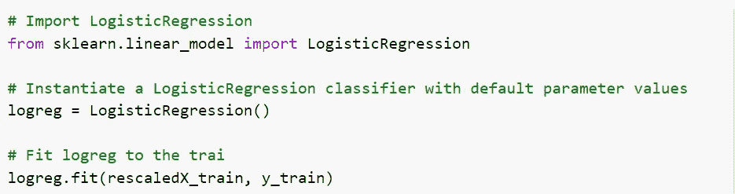

Importing Logistic Regression classification model from sklearn package

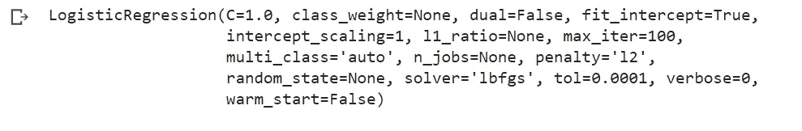

OUTPUT

**第十个任务**

进行预测并评估模型的性能

但是我们的模型表现如何呢？

现在，我们将在测试集上评估我们的模型的分类准确性。但是我们也会看一下模型的混淆矩阵。在预测信用卡申请的情况下，同样重要的是看看我们的机器学习模型是否能够预测最初被拒绝的申请的批准状态。如果我们的模型在这方面表现不好，那么它可能最终会批准本应批准的申请。混淆矩阵有助于我们从这些方面查看模型的性能。

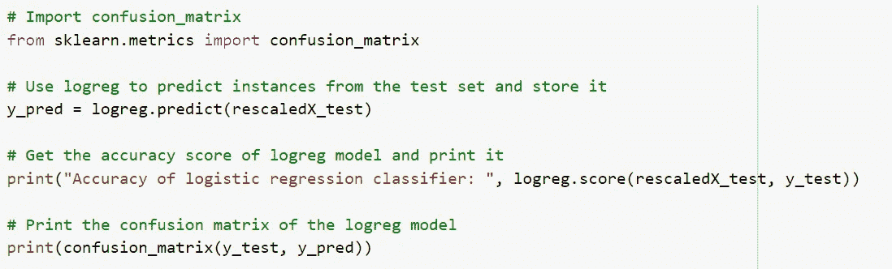

Predicting the accuracy of model on the test set

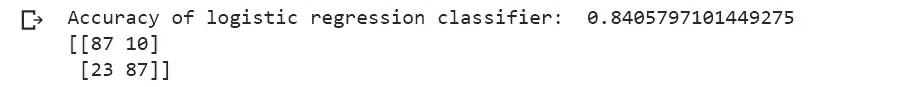

“OUTPUT” showing the accuracy of our classification model

**第十一项任务**

网格搜索并使模型表现更好

我们的模型非常好！它能够产生几乎 84%的准确度分数。

对于混淆矩阵，混淆矩阵第一行的第一个元素表示真正的否定，即模型正确预测的否定实例(被拒绝的申请)的数量。混淆矩阵的第二行的最后一个元素表示真正的阳性，意味着由模型正确预测的阳性实例(批准的申请)的数量。

让我们看看我们是否能做得更好。我们可以对模型参数执行网格搜索，以提高模型预测信用卡批准的能力。

scikit-learn 的逻辑回归实现包含不同的超参数，但我们将在以下两个参数上进行网格搜索:

*   tol
*   max_iter

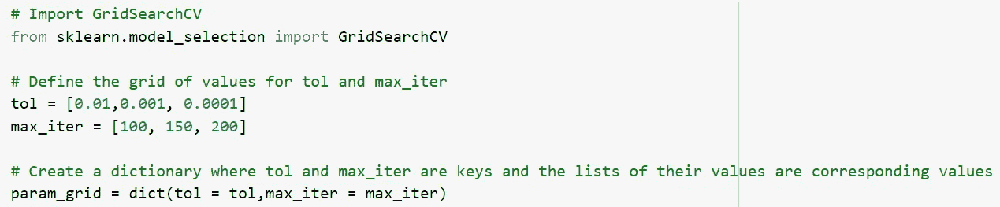

Applying Hyper-parameters to make the model perform better

**第十二项任务**

我们已经定义了超参数值的网格，并将它们转换成一个单一的字典格式，该格式是`GridSearchCV()`期望的参数之一。现在，我们将开始网格搜索，看看哪些值表现最好。

我们将使用我们拥有的所有数据，用我们之前的`logreg`模型实例化`GridSearchCV()`。我们将提供`X`(缩小版)和`y`，而不是分别通过训练和测试。我们还将指示`GridSearchCV()`执行五重交叉验证。

我们将通过存储最佳成绩和相应的最佳参数来结束笔记本。

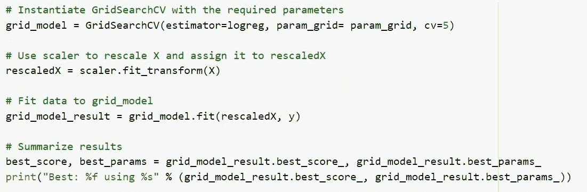

Best score after applying hyper-parameters

OUTPUT

**结论:**

在构建这个信用卡批准预测模型时，我们解决了一些最广为人知的预处理步骤，如**缩放**、**标签编码**和**缺失值插补**。我们完成了一些机器学习模型，以预测一个人的信用卡申请是否会获得批准，或者是否会给出这个人的一些信息。

这就把我们带到了本文的结尾。我希望你已经明白了一切。 ***确保尽可能多的练习*** 。

如果你想查看更多与数据科学和机器学习相关的资源，你可以参考我的 [Github 账户](https://github.com/Ravjot03)。

你也可以在这里查看我的网站— [RAVJOT SINGH](https://ravjot03.github.io/) 。

我希望你喜欢我的文章。从未来的角度来看，您也可以尝试其他算法，或者选择不同的参数值来进一步提高精度。请随时分享你的想法和想法。