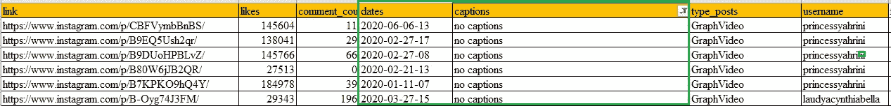

# 预测 Instagram 影响者参与 Python 中的机器学习

> 原文：<https://medium.datadriveninvestor.com/predicting-instagram-influencers-engagement-with-machine-learning-in-python-726c68bda29b?source=collection_archive---------1----------------------->

## 从获取 Instagram 数据到使用机器学习进行预测，逐步预测 Instagram 影响者的参与度


Photo by [Maddi Bazzocco](https://unsplash.com/@maddibazzocco?utm_source=medium&utm_medium=referral) on [Unsplash](https://unsplash.com?utm_source=medium&utm_medium=referral)

在过去的几周里，我试图做一个与**机器学习**相关的**数据科学迷你项目**。在思考了很久之后，我最终决定制作一个机器学习模型，可以预测一个 **Instagram 影响者参与度**在接下来的一个月里是**增长**还是**下降**。这个迷你项目是一个**端到端**项目，本文将分为四个部分:

1.  **使用硒和美汤从 Instagram 影响者检索数据**。
2.  数据预处理从**数据清理**、**特征工程**、**特征选择**等开始，直到数据准备好被机器学习模型消费。
3.  建模使用了机器学习算法(**线性回归**、**随机森林**、 **XGBoost** )，还做了一些调优**超参数**。
4.  **解释来自机器学习的预测输出的结果**。

[](https://www.datadriveninvestor.com/2020/05/04/could-machine-learning-and-nlp-have-predicted-oils-crash-the-answer-is-yes/) [## 机器学习和 NLP 能预测石油的崩溃吗？答案是肯定的。|数据驱动…

### 2020 年 4 月 20 日，WTI 原油期货(美国原油基准)历史上首次达到负…

www.datadriveninvestor.com](https://www.datadriveninvestor.com/2020/05/04/could-machine-learning-and-nlp-have-predicted-oils-crash-the-answer-is-yes/) 

所以在读完这篇文章后，我希望读者能够获得一些与获取外部数据、预处理数据和机器学习模型相关的知识。准备好开始你自己的迷你机械学习项目了吗？。

> 要了解本教程，您至少应该了解:
> 1。 **Python** 中的基础编程。
> 2。用于数据分析工具的 **Pandas** 和 **Numpy** 库。
> 3。用于数据可视化的 **Matplotlib** 和 **Seaborn** 库。
> 4。 **Scikit-Learn** 用于机器学习的库。
> 5。**硒**和**美汤**库用于获取 instagram 数据
> 6。 **Jupyter 笔记本**。

*完整的数据集和代码可以在我的*[***Github***](https://github.com/adiptamartulandi/Project-Instagram-Influencers-Prediction)*下载，所有工作都在 Jupyter 笔记本上完成。*

1 **使用硒和美汤从 Instagram 影响者那里获取数据。**

第一步是最耗时的一步，因为在 Instagram 上检索影响者数据需要很长时间。步骤 1 包括 3 个阶段:

> *1.1 列出将被预测的影响者。我从印尼拿了前 1000 名影响者(来源*[**starngage**](https://starngage.com/app/id/influencer/ranking?page=1)*)。*

```
**#Create Empty List**
ranking = []
username = []
category = []
category_2 = []**#Function to scrape username information
def scrape_username(url):**

    **#accessing and parsing the input url**
    response = requests.get(url)
    print(f'page {a} respose {response}')
    soup = BeautifulSoup(response.content, 'html.parser')
    list_username = soup.find_all('tr')

    **#looping to the element that we want to scrape**
    for p in list(list_username):
        try:
            **#getting the information (rank, names, and category)**
            rank = p.find('td', 'align-middle').get_text().strip()
            ranking.append(rank)
            name = p.find('a').get_text().strip()
            username.append(name)
            cat = p.find_all('span', 'badge badge-pill badge-light samll text-muted')
            category_2 = []
            for c in cat:
                d = c.find('a', 'link').get_text()
                category_2.append(d)
            category.append(category_2)
        except:
            continue
```


Sneak Peak Output of Step 1.1

> *1.2 使用 Selenium 获取 Instagram 上每个有影响力的人的帖子链接。*

```
**#Create Empty List**
link = []
names = []**#Function to get Post Link
def get_influencer_link(username):** **#to influencer url**
    url = f'[https://www.instagram.com/{username}/'](https://www.instagram.com/{username}/')
    driver = webdriver.Chrome()
    driver.get(url) time.sleep(5) i = 0
    while i < 8:   
        try:
            **#get the links**
            pages = driver.find_elements_by_tag_name('a')
            for data in pages:
                data_2 = data.get_attribute("href")
                if '/p/' in data_2:
                    link.append(data.get_attribute("href"))
                    names.append(name) **# Scroll down to bottom**
            driver.execute_script("window.scrollTo(0, document.body.scrollHeight);") **# Wait to load page**
            time.sleep(1)
            i += 1
        except:
            i += 1
            continue
    driver.quit()
```


Sneak Peak Output of Step 1.2

> *1.3 从每个帖子中检索信息，如点赞数、评论数、标题等。用漂亮的汤。*

```
**#Create Empty List**
likes = []
comment_counts = []
dates = []
captions = []
type_posts = []
links = []**#Function to get information**
**def get_information(link):   ** 
    **try:**
        global i, n

        **#accessing and parsing the website url**
        url = link
        response = requests.get(url)
        soup = BeautifulSoup(response.content)

        **#find element that contain information**
        body = soup.find('body')
        script = body.find('script')
        raw = script.text.strip().replace('window._sharedData =', '').replace(';', '')
        json_data=json.loads(raw)
        posts =json_data['entry_data']['PostPage'][0]['graphql']
        posts= json.dumps(posts)
        posts = json.loads(posts)

        **#acquiring information**
        like = posts['shortcode_media']['edge_media_preview_like']['count']
        comment_count = posts['shortcode_media']['edge_media_to_parent_comment']['count']
        date = posts['shortcode_media']['taken_at_timestamp']
        caption = posts['shortcode_media']['edge_media_to_caption']['edges'][0]['node']['text']
        type_post = posts['shortcode_media']['__typename']
        likes.append(like)
        comment_counts.append(comment_count)
        dates.append(date)
        captions.append(caption)
        type_posts.append(type_post)
        links.append(link)
        i += 1
    **except:**
        i += 1
        n += 1
        print(f'number of link error {n} at iteration {i}')
       ** pass**
```


Sneak Peak Output of Step 1.3

2 数据预处理从**数据清洗**、**特征工程**、**特征选择**开始，直到数据准备好被机器学习模型消费。

步骤 2 包括 3 个阶段，即数据清理、特征工程和特征选择。

> *2.1 数据清理包括 2 件事，即将仍处于纪元时间的日期特征格式转换为日期时间，并清理特征标题。*

```
**#convert epoch time --> datetime
#The format is year-month-day-hour** df['dates'] = df['dates'].apply(lambda x: dt.datetime.fromtimestamp(x).strftime('%Y-%m-%d-%H'))**#remove unused characters in feature captions**
df['captions'] = df['captions'].replace(r'[\n]', '', regex=True)**#fill missing value in features captions**
df['captions'] = df['captions'].fillna('no captions')
```



Sneak Peak Output of Step 2.1

> *2.2 这一步是特征工程，从 10 个特征中可以产生 52 个新特征。这个阶段还为建模过程制作了基础表。*

```
**#create features lag of n_post (last 3 month)
#number of n_post 1 months ago**
base_table['n_post_01'] = base_table.groupby(['username'])['n_post'].shift(1).fillna(0)**#number of n_post 2 months ago**
base_table['n_post_02'] = base_table.groupby(['username'])['n_post'].shift(2).fillna(0)**#number of n_post 3 months ago**
base_table['n_post_03'] = base_table.groupby(['username'])['n_post'].shift(3).fillna(0)
```


Sneak Peak Output of Step 2.2

> *2.3 下一步是特征选择，我还是用简单的特征选择。我使用的方法是查看预测器和目标特征之间的相关系数。*

```
**#I choose variables with the value of correlation coefficient r < -0.2 and r > 0.3
#it is very subjective matter**
plt.figure(figsize=(10,8))
sns.heatmap(df.corr());
```


Heatmap Correlation

从总共 62 个特征中，我只选取了大约 20 个特征用于建模过程。

3 建模使用机器学习算法(**线性回归**、**随机森林**、 **XGBoost** )，也做一些调优**超参数**。

> **我在建模过程中做了一些场景，目的是找到最佳模型，这些场景是:**
> 1。没有特征选择和没有调整超参数的建模。
> 2。没有特征选择和调整超参数的建模。
> 3。具有特征选择和没有调整超参数的建模。
> 4。具有特征选择和 wit 调节超参数的建模。


Output of Modelling Process

总共有 **10 个场景**完成了它们在数据训练、数据测试和数据训练+数据测试上的表现。我使用的度量评估只针对**均方根误差(RMSE)** 。在所有场景中，**随机森林**与**特征选择**和**调整超参数**在 RMSE 列车、RMSE 测试和 RMSE 测试中都给出了最佳结果。所以我选择这个模型作为最终模型进行预测。

4 **模型最终机器学习的预测输出结果**的解释。

预测结果显示，7 月份将有 **513** Instagram 影响者平均总参与度将**增长**和 **123** 下降**。**

****

**Predicted Category Composition**

**如果我们查看我们的最佳模型特征重要性的结果，即随机森林，可以看到与喜欢和参与相关的特征具有较高的相对重要性。**

****

**Feature Importance**

**最后，还完成了一篇关于 Instagram 影响者预测的文章。如果我可以总结的话，我们已经做了很多事情:**

> **1.从 Instagram
> 2 获取外部数据。做一些数据预处理
> 3。用机器学习算法建模。
> 4。解释结果**

**我希望这篇文章能帮助读者，如果有建议或意见，请写在下面的评论栏里。**

## **访问专家视图— [订阅 DDI 英特尔](https://datadriveninvestor.com/ddi-intel)**