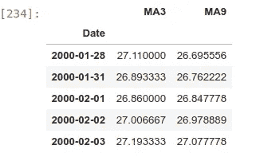

# 用机器学习和 Python 预测油价

> 原文：<https://medium.datadriveninvestor.com/predicting-oil-prices-with-machine-learning-and-python-324153c457ba?source=collection_archive---------1----------------------->

## 使用 Python 和机器学习预测“黑金”价格的完整指南，误差小于 0.3%


Photo by [Chris Liverani](https://unsplash.com/@chrisliverani?utm_source=medium&utm_medium=referral) on [Unsplash](https://unsplash.com?utm_source=medium&utm_medium=referral)

对于一个数据科学家来说，有什么比用他们的模型预测任何类型的市场运动更有价值的呢？嗯，有一件事是肯定的…不多。市场无疑是一个人可以涉足的最迷人的事物之一。他们可以被认为是整个世界的化身。通过观察市场，你可以了解关于人的一切，最重要的是，这种知识的提供方式非常适合数据科学家去接触。市场往往会出现的主要问题是，它们往往是不可预测的。数学模型可能都显示某种商品的价值会上升，然后不可预测的事情发生(例如新冠肺炎)，一切都会改变。

因此，显而易见，市场极易受到外部影响和因素的影响。然而，我将尝试使用线性*回归*来预测布伦特原油在不同时间段的价格。

*如果你喜欢这篇文章，并且有兴趣免费接收每月独家内容，可以在本文末尾订阅我的独家邮件列表(也可以直接从* [*这里*](https://bit.ly/filipposmaillist) *)进入。*

# 关键术语

为了继续，熟悉将在本文中使用的某些关键术语是至关重要的。

## 回归

简单来说，*回归*是一种机器学习算法，可以被训练来预测某些实数结果。预测基于数据集中不同变量的相互作用。

## 特征

*特征*是我们正在分析的对象的可测量属性。在数据集中，*特征*显示为列，是对象的不同特征(例如价格、位置、id)

[](https://www.datadriveninvestor.com/2020/02/19/cognitive-computing-a-skill-set-widely-considered-to-be-the-most-vital-manifestation-of-artificial-intelligence/) [## 认知计算——一套被广泛认为是……

### 作为它的用户，我们已经习惯了科技。这些天几乎没有什么是司空见惯的…

www.datadriveninvestor.com](https://www.datadriveninvestor.com/2020/02/19/cognitive-computing-a-skill-set-widely-considered-to-be-the-most-vital-manifestation-of-artificial-intelligence/) 

## 解释变量

*解释变量*是不同的*特征*，我们将使用它们来预测任何给定时间的石油价格。

## 因变量

因变量取决于*解释变量*的值。简而言之，我们案例中的*因变量*是我们试图预测的石油价格。

## NaN 值

在计算中， *NaN* 是一个不是数字的值。

# 准备我们的数据集和工作环境

首先，我们需要安装一个支持的 python 版本。为此，请导航到此[链接](https://www.python.org/downloads/)，并按照您的操作系统的说明进行操作。

我将使用 T2 的 Python 3.6.9 和 T4 的 Ubuntu 18 . 04 . 4 作为我的操作系统选择。然而，所有受支持的 python 版本都是受欢迎的。

在继续安装所需的库之前，我们必须安装 pip。(我很确定 pip 会出现在 2.7.9 之后的所有 python 版本中，但是如果你没有安装 pip，请遵循本指南的[。)](https://pip.pypa.io/en/stable/installing/)


## 图书馆

以下库应该与 pip 一起安装:

```
pip3 install sklearn
pip3 install pandas
pip3 install numpy
pip3 install matplotlib
pip3 install quandl
```

## 资料组

拥有正确的数据集无疑是任何数据科学项目最重要的方面之一。在这种情况下，我们需要的数据集是过去几年的石油价格档案。您获取所述数据库的方式完全取决于您的偏好。[雅虎财经](https://pypi.org/project/yahoo-finance/)和 [iexfinance](https://pypi.org/project/iexfinance/) 都是检索这类金融信息的好方法(你也可以手动下载数据)。

在这种情况下，我将使用**[**Quandl**](https://www.quandl.com/)**，因为我发现它不仅易于使用，而且具有许多有趣的功能。****

*****为了使用 Quandl，需要一个 **API 密钥**。不过不要担心！获取 API 密钥的过程花费**不到两分钟**并且**不需要任何形式的验证。******

****关于如何获得 Quandl API 密钥的说明可以在 [**这里**](https://help.quandl.com/article/320-where-can-i-find-my-api-key) 找到。****

# ****编码****

****现在我们已经建立了库和数据集，是时候启动我们的文本编辑器了(我将使用 jupyter 笔记本)。****

****我们将从导入所有必需的库开始:****

****现在我们已经准备好了所有的库，我们可以开始使用 Quandl 导入我们的历史数据。我们将使用**二十年**的**原油布伦特**价格，从 2000 年 1 月 1 日开始到 2020 年 1 月 1 日。****

********

****在我们的情况下，我们需要的不仅仅是一个心脏。Quandl 将其数据分类到不同的数据集。从上图我们可以看到，“原油价格:布伦特-欧洲”的 Quandl 代码是**“FRED/DCOILBRENTEU”。******

****我们现在在“数据”下有过去 20 年的所有布伦特原油价格信息。现在是时候看看我们的数据看起来如何，以确定哪些*功能*我们想要保留，哪些我们想要放弃。****

********

****看来我们相当幸运！数据集只包含日期和价格，因此我们不需要进行任何篡改。****

******(如果你使用另一个数据集，你必须对数据建模，只保留必要的数据！)******

****为了更好地进行分析，我们现在将以图表的形式直观地绘制我们的数据。****

********

****既然我们已经恰当地可视化了我们的数据，我们将定义我们的*解释变量*——我们将使用*特征*来预测石油价格。我们将在此阶段使用的变量是过去三个和九个**日**的**移动平均值**。****

****我们现在必须删除所有的 *NaN 值*，并将我们创建的两个变量存储到 X 中，并查看其内容。****

****输出应该类似于以下内容:****

********

****设置好*解释变量*后，是时候初始化我们的*因变量*，y****

****输出应该类似于以下内容:****

********

## ****培养****

****现在一切都设置好了，我们要把数据集分成两个不同的部分。我们将把 80%的数据分配给一个训练集，负责训练模型。剩下的 20%将被分配给一个测试集，用于估计模型的准确性。这样，通过连接来自训练集的输入和来自测试集的预期结果，我们创建了一个*线性回归模型*。****

********

****Image designed by the Portland Data Science Group****

****在我们的案例中:****

```
**X_train & y_train ---> The training datasetX_test & y_test ---> The testing dataset**
```

****为了创建*线性回归模型*，我们将拟合*因变量*和自变量，并为*回归*创建一个常数和一个系数。****

****我们快完成了！现在是时候检查我们的模型是否有效，并将我们的模型预测的价格以及实际价格绘制在同一个图表上进行比较。****

********

****瞧啊。我们绘制了一张图表，显示每次石油的预测价格和实际价格。尽管该图为我们提供了许多关于我们是否成功执行任务的信息，但我们将使用 compute()函数来计算模型的准确性。****

********

****在那里！使用决定系数(R 平方)，我们的模型得分为 98.58%。我不需要解释这个分数有多好，但它肯定不是完美的。****

# ****改进我们的模型****

****可以做许多改变来改进我们的模型。正如我之前所说的，98.58%是一个非常好的分数(记住大多数类似的应用程序不会超过 96.32%的准确率)，但是如果我们可以的话，为什么不做得更好呢？****

****我们可以做一些基本的修改:****

## ****扩大我们的数据集:****

****我选择使用二十年的记录信息来建立这个模型。为什么要限制自己呢？通过快速搜索，我发现布伦特原油的第一次价格记录是在 1987 年。****

****让我们将开始日期改为“1987–05–20 ”,看看它如何影响我们模型的准确性！****

********

******1.02%！**这是通过对我们的代码进行如此简单的调整，我们的模型的准确性增加了多少，达到了 99.6% 的分数**。******

*******本文应被视为机器学习在时间序列分析中的应用的演示，而不是实际的投资模型。如果你对一个现实生活中的应用感兴趣，这个模型可以作为每天的交易策略，这就是你要找的文章:******

****[](https://link.medium.com/dLyTUhqGu6) [## 埃隆的黄金礼物:用 Twitter 和机器学习预测特斯拉的股价

### 埃隆的黄金礼物:用 Twitter 和机器学习预测特斯拉的股价。关于…的完整指南

link.medium.com](https://link.medium.com/dLyTUhqGu6) 

## 调整解释变量:

我们将我们的*解释变量*设定为过去**三个**和**九天**的移动平均线。为什么不改变这些，看看会发生什么？

我们试试分别改成一和二吧！


**多 0.12%！**也许这看起来不像是一个重大改进，但它确实是！我们现在在 **99.72%！**即与 **100%** 相差不到 0.3%。**** 

# ****自我完善****

****我们现在已经达到了 99.72%的准确率。虽然这个数字可以从我这边进一步改进，但我不会这样做。****

****相反，我将向读者提供一个简短的声明，作为改进模型的依据。****

> ****通过向“X”添加更多变量，可以提高预测的准确性。变量的性质可能会有所不同，但一个安全的赌注是:****
> 
> ******-技术指标******
> 
> ******-世界经济数据******
> 
> ******-辅助产业******

****感谢您的阅读，不要忘记留下建设性的反馈！****

****该笔记本可在此处找到:****

****[](https://github.com/Filippos101/Predicting-Oil-Prices-With-Machine-Learning-And-Python.git) [## filippos 101/用机器学习和 Python 预测油价

### 为 filippos 101/Predicting-Oil-Prices-With-Machine-Learning-And-Python 开发做贡献，创建一个关于…的帐户

github.com](https://github.com/Filippos101/Predicting-Oil-Prices-With-Machine-Learning-And-Python.git)**** 

# ****你想了解更多吗？****

****如果你想**增进你的知识**并且对**预测更多商品价格**感兴趣，我**强烈鼓励你**阅读下面**列出的文章**:****

****[](https://medium.com/swlh/making-a-revolutionary-travel-companion-with-machine-learning-and-python-c15f14eee5c0) [## 用机器学习和 Python 打造革命性的旅行伴侣

### 如何结合 Python 和 ML 来预测航班是否会延误的完整指南。

medium.com](https://medium.com/swlh/making-a-revolutionary-travel-companion-with-machine-learning-and-python-c15f14eee5c0) [](https://medium.com/datadriveninvestor/how-i-helped-the-who-deal-with-one-of-africas-deadliest-medical-crisis-using-python-and-deep-be259de48f08) [## 我如何使用 Python 和 Deep…帮助世卫组织应对非洲最致命的医疗危机之一

### 关于如何结合 Python 和 DL 以 98%的准确率检测一个人是否患有疟疾的完整指南。

medium.com](https://medium.com/datadriveninvestor/how-i-helped-the-who-deal-with-one-of-africas-deadliest-medical-crisis-using-python-and-deep-be259de48f08) [](https://medium.com/swlh/detecting-fake-news-with-python-and-machine-learning-f78421d29a06) [## 用 Python 和机器学习检测假新闻

### 关于如何结合 Python、机器学习和 NLP 来成功检测

medium.com](https://medium.com/swlh/detecting-fake-news-with-python-and-machine-learning-f78421d29a06)****