# 预测华盛顿金斯县的房地产价格-第 1 部分

> 原文：<https://medium.datadriveninvestor.com/predicting-real-estate-prices-in-kings-county-washington-part-1-bdca5f0db058?source=collection_archive---------4----------------------->

这是两部分系列的第 1 部分。在本文中，我们执行数据探索。

# 项目目标

这个项目的目标是模拟美国华盛顿州金斯县的房地产价格。我们希望该模型能够基于我们用来构建模型的数据集中提供的许多特征来准确预测房价。预计一旦完成，该模型可被在金斯县地区经营的房地产投资者用作选择投资物业的工具。

# 该过程

我们将使用金斯县住房数据集， *kc_housing_data.csv* ，该数据集可在 Kaggle.com 的*获得。数据集包含 21 列。一个是房屋的价格，其余的我们将用来做预测。*

# 数据探索

我们将检查数据以获得对它的理解。我们将寻找缺失的值、数据类型和特性之间的关系。我们将确定某些数据是否可以被视为连续的或分类的。我们将使用可视化来帮助我们。

# 数据预处理

当我们对我们的数据有了一个好的感觉时，我们将着手清理它。我们将解决价值观缺失的问题。如有必要，删除数据行的特征。如果需要，我们将把数字数据转换成分类数据。如果需要，我们甚至可以反过来做。我们还将处理分类数据的编码，根据需要决定任意数量的编码方案。基于我们发现，可能有必要执行转换和缩放。

# 密码

*resources.py* 中的所有代码也可以以 markdown 文件格式查看。为了便于参考，请查看*资源。MD* 。

# 模型评估

然后，我们将尝试几种模型，对每种模型进行评估，以选择性能最佳的模型。

# 加载所有需要的 python 模块

我们从导入所有必要的 Python 库开始。我们还从 *source.resources* 导入所有函数。这个模块包含了我们在数据清理、特征选择、创建交互术语等方面需要的许多功能

```
**from** **source.resources** **import** *
**import** **pandas** **as** **pd**
**import** **numpy** **as** **np**
**import** **matplotlib.pyplot** **as** **plt**
**import** **seaborn** **as** **sns**

**from** **sklearn.model_selection** **import** train_test_split
**from** **sklearn.linear_model** **import** LinearRegression
**from** **sklearn.model_selection** **import** cross_val_score
**from** **sklearn.model_selection** **import** KFold
**from** **sklearn.preprocessing** **import** PolynomialFeatures
**from** **sklearn.metrics** **import** mean_squared_error, r2_score

**import** **itertools** **as** **it**
**from** **statsmodels.regression** **import** linear_model
**import** **statsmodels.api** **as** **sm**
**from** **statsmodels.formula.api** **import** ols
%matplotlib inline
```

# 探索数据

我们制作了一份拷贝，这样原始数据保持不变。

```
kc_data = pd.read_csv('kc_house_data.csv')
kc_data_copy = kc_data.copy()
```

## 获取一些基本信息

使用 *info()* 和*head()，我们得到了数据的第一瞥。我们可以看到有 21 列 21597 条记录。大多数数据都是数字。

```
md(f'There are **{**kc_data.shape[0]**}** rows and **{**kc_data.shape[1]**}** columns')
kc_data.info()
kc_data.head()
```

有 21597 行和 21 列

```
<class 'pandas.core.frame.DataFrame'>
RangeIndex: 21597 entries, 0 to 21596
Data columns (total 21 columns):
id               21597 non-null int64
date             21597 non-null object
price            21597 non-null float64
bedrooms         21597 non-null int64
bathrooms        21597 non-null float64
sqft_living      21597 non-null int64
sqft_lot         21597 non-null int64
floors           21597 non-null float64
waterfront       19221 non-null float64
view             21534 non-null float64
condition        21597 non-null int64
grade            21597 non-null int64
sqft_above       21597 non-null int64
sqft_basement    21597 non-null object
yr_built         21597 non-null int64
yr_renovated     17755 non-null float64
zipcode          21597 non-null int64
lat              21597 non-null float64
long             21597 non-null float64
sqft_living15    21597 non-null int64
sqft_lot15       21597 non-null int64
dtypes: float64(8), int64(11), object(2)
memory usage: 3.5+ MBkc_data.shape[0] - kc_data.id.nunique()
177
```

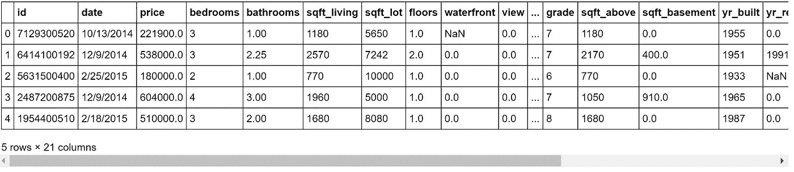

# 第一次观察

## 缺少值

首先突出的是缺少的值。*yr _ renewated*的缺失值最多，其次是*滨水*。*视图*也缺少 63。我们需要进一步探索这些问题，然后才能决定如何解决它们。

## 数据类型

我们还可以观察到，*日期*特征是 object 类型，正如 *sqft_basement* 一样。这些可能需要转换成数字类型。但是我们还没有到那一步。

## 我们能放弃“身份”吗

最后，在最初的观察中，我们看到 *id* 可能有一些重复。这很有趣，因为这表明一些房子在一年内被多次出售。也许他们被“翻转”了。这很重要吗？我的第一个想法是，这些是独特的价值，因此我会放弃它。但现在看来，我需要看得更近一点。

```
kc_data.describe().T
```

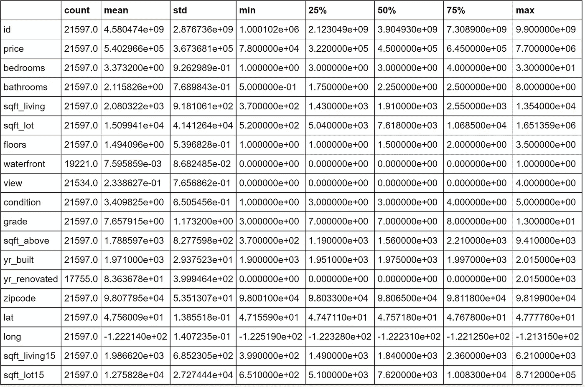

## 初始问题:

> ***蝙蝠可以落在哪些栏目？***

*   *ID* ？
*   也许 lat 和 long 可以被删除，因为它们提供了与 zipcode 相同的信息。
*   *sqft_living* 和 *sqft_above* 相关性非常强，事实上，许多值都有相同的条目。进一步探究发现 *sqft_living* 是 *sqft_above* 加上 *sqft_basement* 之和。我们将需要研究每一个的贡献

**我可以将*卧室*和*浴室*转换成分类值吗？我们应该为房子的年龄创造一个特征吗？**

**' *日期*'是日期格式，但属于对象类型。需要转换..猫？数字？日期时间？**

# 探索一些关系

我们将从探索特征之间的相关性开始。为此，我们在 Seaborn 的 heatmap()方法中输入一个 pandas 关联矩阵。使用“RdYlGn”色彩映射表提供了一种易于阅读的配色方案。我们将在下面讨论我们的发现。

```
sns.heatmap(kc_data_copy.corr(),annot=**True**,cmap='RdYlGn',linewidths=0.2)
fig=plt.gcf()
fig.set_size_inches(14,12)
plt.show()
```

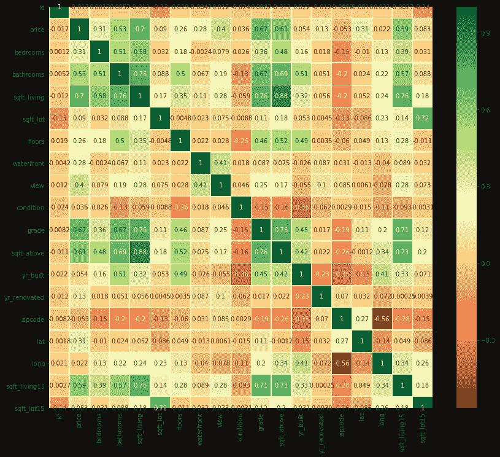

## 热图告诉了我们什么

在上面的热图中，暗绿色表示高度正相关，暗红色表示负相关。我们将使用 0.75 和-0.75 作为确定显著相关性的阈值。

**‘sqft _ living’—强相关性**

很容易看出 *sqft_living* 与 *sqft_above* 、 *sqft_basement* 、*卧房*、 *sqft_living15* 和 *grade* 有很强的正相关关系。

**‘grade’和‘sqft _ above’**

在 0.76 的正相关性下，可以认为*等级*和 *sqft_above* 之间的关系很强。

## 根据我们的发现，我们能去掉任何与相关性有关的特征吗？

## 让我们仔细看看这些关系。

当我们仔细观察时，我们可以看到 *sqft_living* 等于 *sqft_above* 加上*sqft _ based*之和:

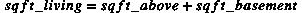

这意味着我们可以通过添加另外两个特性来描述 *sqft_living* 。如果我们放弃它，我们可以减少高相关性的实例。但是首先，我们需要对*的地下室*做一些改动。

至于 *sqft_above* 和*等级*的关系，我们两个都保留。

## 让我们证实我们的观察

从最初的探索中，我们可以看到 sqft_basement 属于“object”类型。让我们将它转换为“int”类型。但是首先，我们需要考虑字符串值“？”，这是在第一次尝试转换失败时找到的。

```
kc_data_copy['sqft_basement'].unique()[4]
'?'kc_data_copy['sqft_basement'].replace('?','0.0',inplace=**True**)
kc_data_copy['sqft_basement'] = kc_data_copy['sqft_basement'].astype(str).astype(float).astype(int)

kc_data_copy[['sqft_living','sqft_above','sqft_basement']].describe().T
```

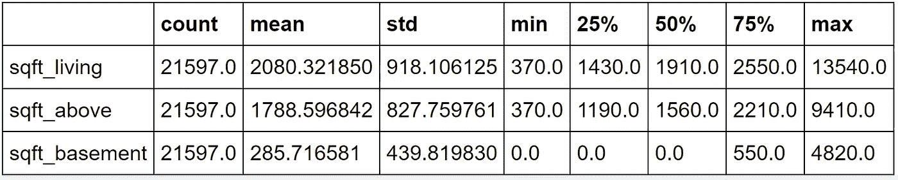

## 在“sqft_living”的顶部绘制“sqft_above”和“sqft _ baseball”

在' *sqft_living* '之上绘制' *sqft_above* '加上' *sqft_basement* '并降低不透明度，显示它们完全重叠。蓝色地块在底部，黄色地块在顶部。它们混合成我们看到的紫色。如果有任何部分没有重叠，它们将显示为完全蓝色或黄色。这说明他们是一样的。因此，我们应该能够删除' *sqft_above* '或' *sqft_above'* '，因为两者都可以通过减去或加上'*sqft _ basis*'来导出。但在我们做出决定之前，我们将继续探索各种关系。

```
*# Plot 'sqft_above' plus 'sqft_basement' on top of 'sqft_living'.* 
plt.figure(figsize=(12,6))
plt.hist(kc_data_copy['sqft_living'], bins=20, color='blue', label='sqft_living')
plt.hist(kc_data_copy['sqft_above'] + kc_data_copy['sqft_basement'], bins=20, color='yellow', alpha=0.4, label='sqft_above + sqft_basement')
plt.legend()
```

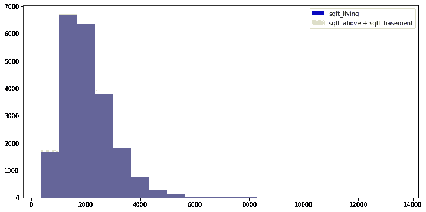

## 让我们再来看看热图。

现在我们可以看到，我们已经通过删除一个特征消除了所有这些高相关性。下面，我们去掉了' sqft_living '，但是没有做到位。但是我们以后会做的。

```
sns.heatmap(kc_data_copy.drop('sqft_living',axis=1).corr(),annot=**True**,cmap='RdYlGn',linewidths=0.2)
fig=plt.gcf()
fig.set_size_inches(14,12)
plt.show()
```

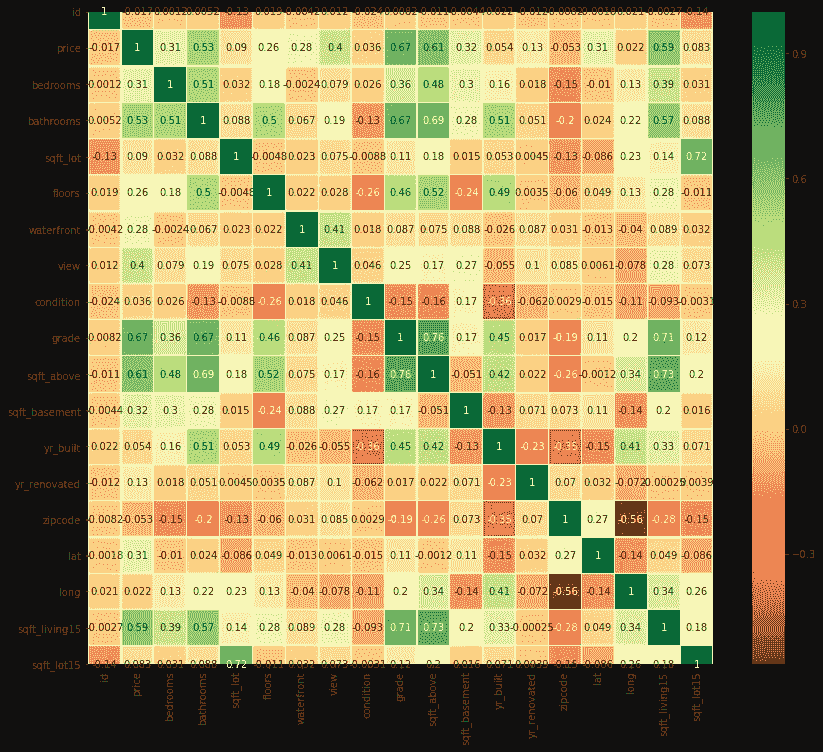

## 散点图

让我们看看每个特性与价格的关系是什么样的。

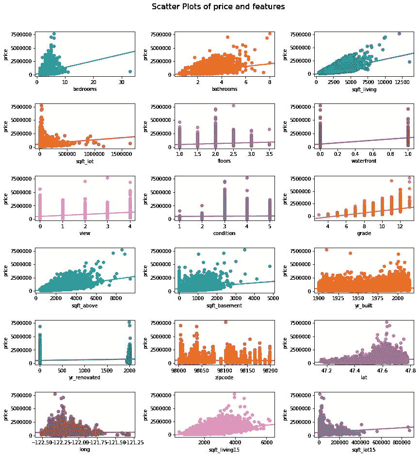

## 观察

似乎有一些分类特征。这些包括*楼层、滨水区、景观、条件、等级、翻新年份和邮政编码*。

我们将不得不仔细研究其中的一些变量。看起来卧室是个不错的开始。回归线显示了良好的正相关性，但大多数点都聚集在 0 到 11 之间。还有一个非常明显的离群值。

然后，我们将进一步研究浴室，它的正相关性要弱得多。

sqft_lot 的形状绝对需要仔细观察。由于该点似乎在左侧堆积，这种关系似乎不是很线性。对于 *sqft_lot15* 来说，这一切都是一样的。

让我们开始吧

## 检查邮政编码

金斯县有 70 个邮政编码。这种高基数可能会使编码方案难以使用。然而，我们可以使用一键编码，这将使我们的特征数增加 68。我们会回来的。

```
print(f'Total number of unique zipcodes: **{**kc_data["zipcode"].nunique()**}**')Total number of unique zipcodes: 70
```

## 卧室

我们可以看到下面有两个明显的异常值。所以我们将比较排除异常值后的平均值。当排除 7 和更大的值时，检查平均值导致非常可忽略的差异。

```
bedroom_count = kc_data_copy['bedrooms'].value_counts()
print(f'The mean including outlier: **{**kc_data_copy["bedrooms"].mean()**}\n**'
      f'The mean excluding outlier: **{**kc_data_copy[kc_data_copy["bedrooms"] < 7]["bedrooms"].mean()**}**')
print(f'The price of the 33 bedroom house is **{**kc_data_copy[kc_data_copy["bedrooms"] == 33]["price"]**}**')The mean including outlier: 3.3731999814789093
The mean excluding outlier: 3.3597863942419317
The price of the 33 bedroom house is 15856    640000.0
Name: price, dtype: float64
```

## 它是绝对的吗？

当我们放大时，散点图显示*间卧室*实际上可能被更好地视为分类变量。我们肯定要考虑这一点。

这也表明，可疑的 33 房间入口是完全不可靠的，所以我们将摆脱它。

```
plt.figure(figsize=(14,8))
plt.scatter(kc_data_copy['bedrooms'],kc_data_copy['price'])
plt.xlabel('Bedrooms')
plt.ylabel('Price')
```

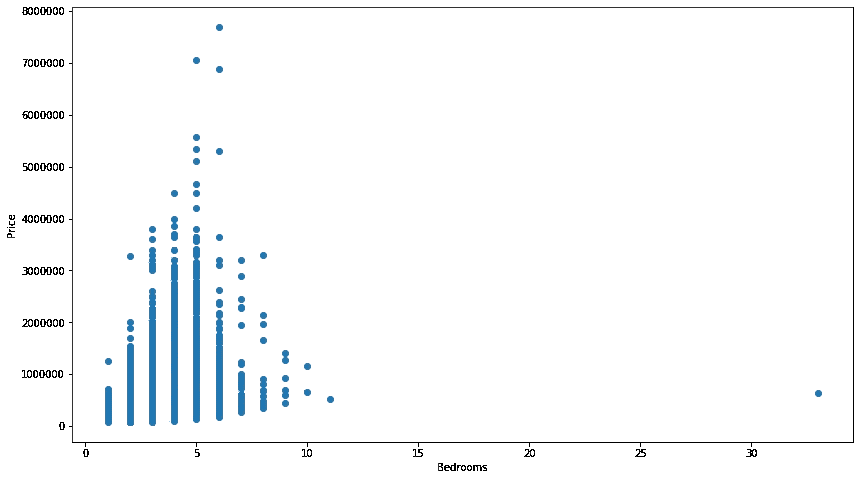

```
*# Remove the outlier*
kc_data_copy.drop(kc_data_copy[kc_data_copy["bedrooms"] == 33].index, inplace=**True**)plt.figure(figsize=(12,6))
plt.scatter(kc_data_copy['bedrooms'],kc_data_copy['price'])
plt.xlabel('Bedrooms')
plt.ylabel('Price')
```

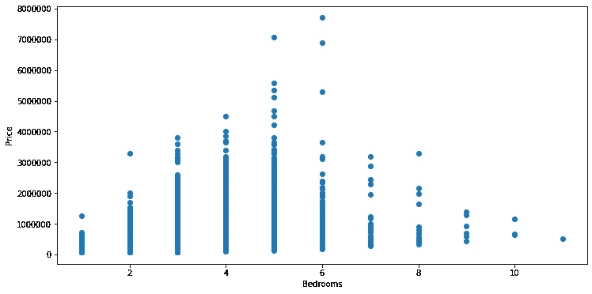

现在，看起来好多了。

现在让我们更好地了解一下分布情况。

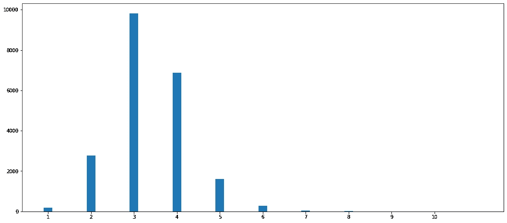

## 创建卧室的新分类表示

使用熊猫的“剪切”功能来绑定*卧室*特征，创建数据的分类表示。这样做可以对数据进行编码。我们使用虚拟编码。该代码包含在*预处理 _ 数据()*中。

```
bins = pd.IntervalIndex.from_tuples([(0, 2), (2, 3), (3,4), (4, 5), (5, 11)])
bds_bins = pd.cut(kc_data_copy['bedrooms'],bins)
bds_bins.categories = ['less than two bedroom','2 bedroom','3 bedroom','4 bedroom','5 or more bedroom']

bedroom_dummies = pd.get_dummies(bds_bins.cat.rename_categories(bds_bins.categories), drop_first=**True**)
bedroom_dummies
```

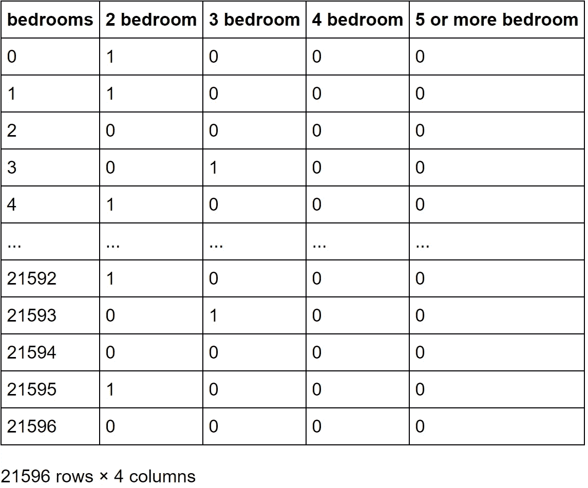

## 浴室

在我们开始可视化之前，让我们看一下值计数。

```
bathroom_count = kc_data['bathrooms'].value_counts()
print(f'Bathrooms value counts: **\n{**bathroom_count.sort_index(axis=0)**}**')Bathrooms value counts: 
0.50       4
0.75      71
1.00    3851
1.25       9
1.50    1445
1.75    3048
2.00    1930
2.25    2047
2.50    5377
2.75    1185
3.00     753
3.25     589
3.50     731
3.75     155
4.00     136
4.25      79
4.50     100
4.75      23
5.00      21
5.25      13
5.50      10
5.75       4
6.00       6
6.25       2
6.50       2
6.75       2
7.50       1
7.75       1
8.00       2
Name: bathrooms, dtype: int64
```

## 让我们仔细看看浴室的散点图

该图表的放大版本显示，该特征也显示了分类特征的特征。因此，再次与*卧室*一样，我们可能不得不转换它。

```
plt.figure(figsize=(12,6))
plt.scatter(kc_data['bathrooms'],kc_data['price'])
plt.xlabel('Number of bathrooms')
plt.ylabel('Price')
plt.title('Price by number of bathrooms')
```

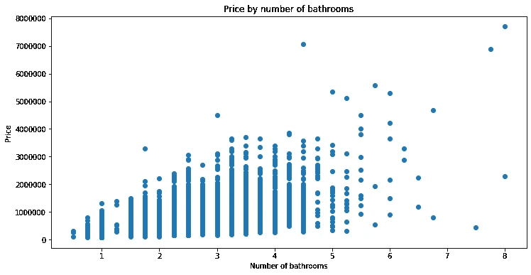

```
brs_by_count_to_plot = kc_data.bathrooms
plt.figure(figsize=(18,8))
plt.xticks(np.arange(0, 8, .25))
my_x = np.array(bathroom_count.sort_index(axis=0).index)
my_y = bathroom_count.sort_index(axis=0).values
plt.bar(my_x, my_y, width=0.2)
```

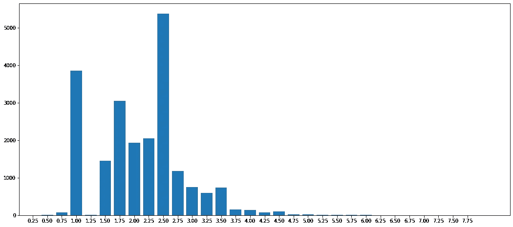

## 将浴室分类

我们再次使用 pandas cut 方法对特征值进行分类。我认为使用*浴室*和*卧室*的连续和分类版本来创建模型是值得的。该代码包含在 *preprocess_data()* 中。

```
bins = pd.IntervalIndex.from_tuples([(0.0, 1.0), (1.0, 1.75), (1.75,2.5), (2.5, 3.0), (3.0, 3.75), (3.75,8)])bth_bins = pd.cut(kc_data_copy['bathrooms'],bins)bth_bins.categories = ['less than one bath','1 - 1.75 bath','1.75 - 2.5 bath','2.5 - 3.0 bath','3.0 - 3.75 bath', '3.75 bath and up']bathroom_dummies = pd.get_dummies(bth_bins.cat.rename_categories(bth_bins.categories), drop_first=**True**)bathroom_dummies
```

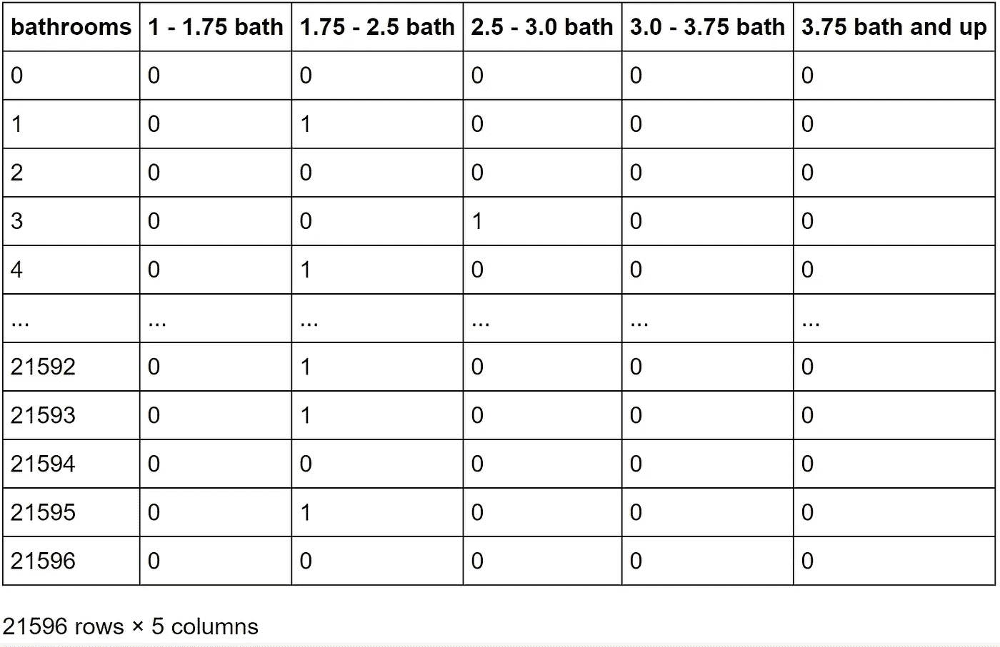

## 现在我们探索滨水区

这显然是一个二元特征——这是不是一个滨水的财产。我们可以看到大部分房产都不是滨水的。

第一个问题是这个特性是 int64 数据类型。它必须被转换成绝对的。

第二个问题是我们必须考虑 2376 个丢失的值。我们接下来会处理这个问题。

```
kc_data_copy.waterfront.isnull().sum()
2376
```

## 我们如何处理丢失的值？

有多种方法可以解释缺失值。最简单的方法是删除包含它们的行。然而，通过丢弃这些值，我们可能会失去一些意义。

另一种方法是，如果我们可以确定该特征对模型的预测能力没有足够的贡献，则删除该特征。

还有一种方法是用统计值(如平均值或中值或其他值)来估算缺失值。

我要做的是，根据位置坐标，尝试估算该房产是否为滨水房产。也就是说，我将绘制滨水区的属性，并尝试在这些属性周围定义边界框。姑且称之为聚类的粗糙尝试。如果一个属性缺少一个值，并且它落在一个边界框内，它将被赋予正确的值“1.0”。否则，如果它不在一个范围内，它将得到“0.0”。已经有值的属性值将保持不变。

```
**def** set_waterfront(s):
    *'''*
 *Rough classifier based on where on the map waterfront properties appear.*
 *Takes a dataframe row and uses the 'lat' and 'long' fields to determine if they are within either of three bounding*
 *boxes that contain most of the waterfront properties.*
 *'''*
    **if** pd.notna(s['waterfront']):
        **return** s['waterfront']

    **elif** (47.34 < s['lat'] < 47.6) **and** (-122.6 < s['long'] < -122.35):
        **return** 1.0
    **elif** (47.5 < s['lat'] < 47.78) **and** (-122.27 < s['long'] < -122.2):
        **return** 1.0
    **elif** (47.56 < s['lat'] < 47.66) **and** (-122.1 < s['long'] < -122.05):
        **return** 1.0
    **else**:
        **return** 0.0
```

## 金斯县海滨地产的地块

首先，让我们根据*滨水区*的特征来绘制房产。下面是我们进行任何更改之前的样子。深色标记表示被记录为滨水区的房产。我使用这个地图来确定和定义包含这些属性的边界框。然后我将使用上面定义的函数 **set_waterfront()** 来应用它们。

```
plt.figure(figsize=(12,10))
plt.scatter(kc_data_copy['long'],kc_data_copy['lat'],c=kc_data_copy['waterfront'], cmap='Reds')
plt.grid(b=**True**, which='major', linestyle='-')
plt.minorticks_on()
plt.grid(b=**True**, which='minor', color='#999999', linestyle='-', alpha=0.2)
```

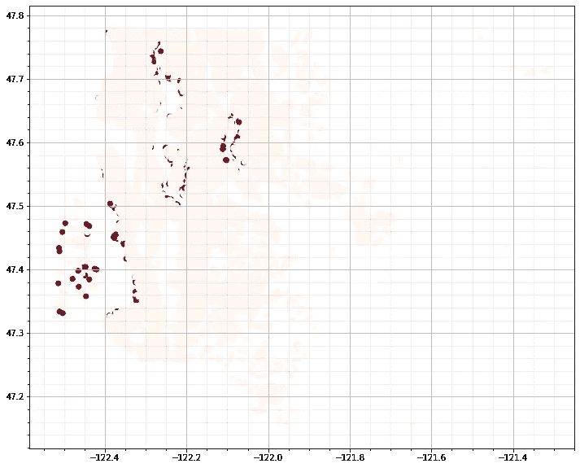

## 转换 NaNs 以表明它是否是滨水地产。

使用 set_waterfront()函数，迭代数据帧并将包含“NaN”的“waterfront”值更改为 1(表示滨水区)或 0(表示非滨水区),具体取决于它们是否属于非的边界框之一。

## set_waterfront()

这是手动定义边界框的地方。如果值不为空，那么它只返回值。如果为空，该函数将尝试确定它是否位于某个边界框内。如果是，函数将返回“1.0”，否则将返回“0.0”。代码在'*source/resources . py*下

```
kc_data_copy['waterfront'] = kc_data_copy.apply(**lambda** row: set_waterfront(row), axis=1)
```

## 再次绘制地图，检查结果是否合理

我们再次绘制地图，看看结果。结果是，在其他滨水区物业的一般区域中出现了更多的滨水区点，并且没有空区。

```
plt.figure(figsize=(12,10))
plt.scatter(kc_data_copy['long'],kc_data_copy['lat'],c=kc_data_copy['waterfront'], cmap='Reds')
plt.grid(b=**True**, which='major', linestyle='-')
plt.minorticks_on()
plt.grid(b=**True**, which='minor', color='#999999', linestyle='-', alpha=0.2)
md(f'There are now ****{**kc_data_copy.waterfront.isnull().sum()**}**** null values')There are now **0** null values
```

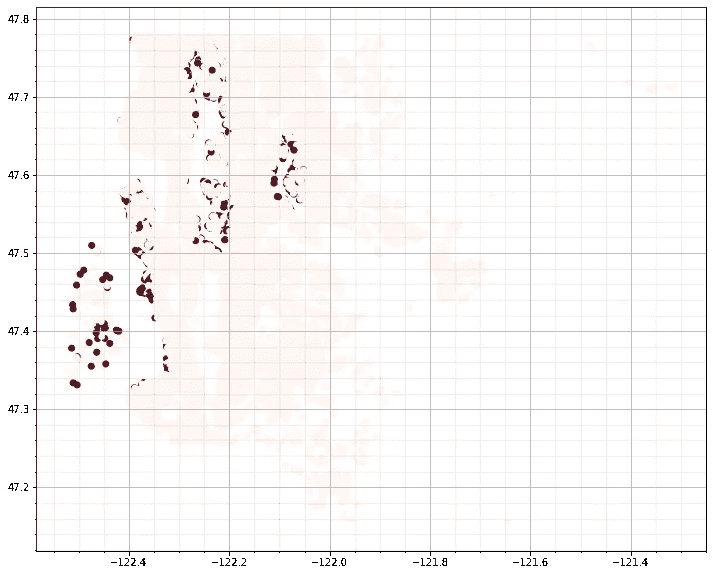

## 我们表现如何？

所以*滨水区*不再有缺失值。看起来我们在评估财产名称方面做得很好。

## 将滨水要素转换为分类要素

我们现在将把 *waterfront* 转换为类型*分类*，并使用*类别代码*对其进行标签编码。

首先，让我们将数据类型转换为“category”。现在我们有了一个合适的类别特征，我们可以对它进行编码。

```
kc_data_copy['waterfront'] = kc_data_copy['waterfront'].astype('category')
kc_data_copy['waterfront'] = kc_data_copy['waterfront'].cat.codes
kc_data_copy['waterfront'].value_counts()0    21048
1      548
Name: waterfront, dtype: int64
```

# 现在看一下与日期相关的字段

我们将从“yr _ renovated”开始。此列的数据类型为“float”。上面你可以看到有 3842 个空值，占 17.78%，相当高。下面，我们看到有 17755 个条目有实际值。但是，其中 17011 的值为 0.0。因此，我们只有 744 项有实际价值的记录，其中 379 项是自 2000 年以来的翻新记录。真的没有显而易见的方法来解决这个问题。

也许，因为这是一个绝对的价值——无论翻新与否。我们可以根据装修时间长短来分类，并有一个“未知”类别。

```
md(f'The missing values are ****{**round(3842 / len(kc_data_copy)*100,2)**}**%** of all records.')
kc_data_copy[kc_data_copy['yr_renovated'] >= 2000]['yr_renovated'].value_counts().sum()The missing values are **17.79%** of all records.
379with_vals = kc_data_copy[kc_data_copy['yr_renovated'].isnull() == **False**].shape[0]
with_zero = kc_data_copy[kc_data_copy['yr_renovated'] == 0.0].shape[0]

md(f"Number of records with values: ****{**with_vals**}****")
md(f"Number of records with value 0.0: ****{**with_zero**}****")
md(f'There are ****{**with_vals - with_zero**}**** useful values out of ****{**kc_data_copy.shape[0]**}**** records.')Number of records with values: **17754** Number of records with value 0.0: **17010** There are **744** useful values out of **21596** records.*# This will be done by our preprocessing function*
kc_data_copy['yr_renovated'] = kc_data_copy['yr_renovated'].apply(**lambda** x: 1 **if** x > 0 **else** -1 **if** np.isnan(x) **else** x).astype('category')
yr_reno_dummies = pd.get_dummies(kc_data_copy['yr_renovated'], prefix='cat_', drop_first=**True**)
```

## 现在让我们看看“yr _ built”

该特征属于 int 类型。没有缺失值，所有值都有效。

```
kc_data_copy['yr_built'].unique()array([1955, 1951, 1933, 1965, 1987, 2001, 1995, 1963, 1960, 2003, 1942,
       1927, 1977, 1900, 1979, 1994, 1916, 1921, 1969, 1947, 1968, 1985,
       1941, 1915, 1909, 1948, 2005, 1929, 1981, 1930, 1904, 1996, 2000,
       1984, 2014, 1922, 1959, 1966, 1953, 1950, 2008, 1991, 1954, 1973,
       1925, 1989, 1972, 1986, 1956, 2002, 1992, 1964, 1952, 1961, 2006,
       1988, 1962, 1939, 1946, 1967, 1975, 1980, 1910, 1983, 1978, 1905,
       1971, 2010, 1945, 1924, 1990, 1914, 1926, 2004, 1923, 2007, 1976,
       1949, 1999, 1901, 1993, 1920, 1997, 1943, 1957, 1940, 1918, 1928,
       1974, 1911, 1936, 1937, 1982, 1908, 1931, 1998, 1913, 2013, 1907,
       1958, 2012, 1912, 2011, 1917, 1932, 1944, 1902, 2009, 1903, 1970,
       2015, 1934, 1938, 1919, 1906, 1935], dtype=int64)# Let's Plot it out
sns.distplot(kc_data_copy['yr_built'])
```

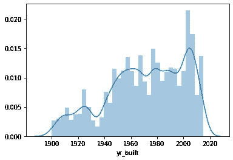

```
plt.figure(figsize=(12,6))
plt.scatter(kc_data['yr_built'],kc_data['price'])
plt.xlabel('Year Built')
plt.ylabel('Price')
plt.title('Price by Year Built')
```

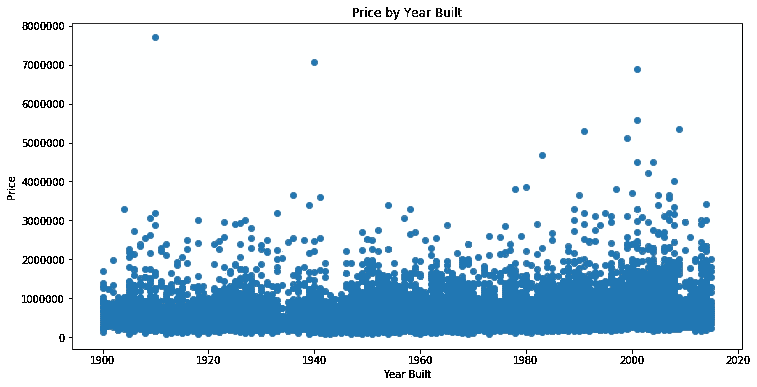

```
plt.figure(figsize=(14,8))
sns.boxplot(x='yr_built', y='price', data=kc_data_copy)
```

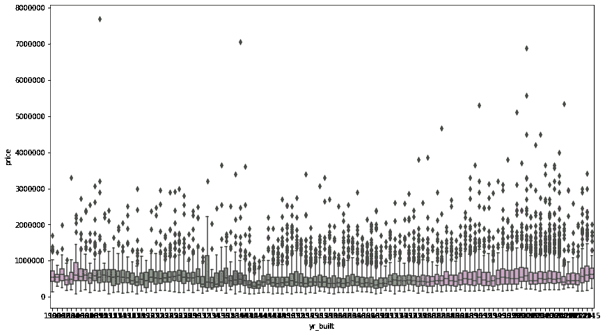

## 让我们来看看“日期”功能

这是一个类型为“*对象*的字段。没有缺失值，所有值都有效。但让我们看看还能找到什么。

散点图显示了一个轻微的负斜率。就其本身而言，似乎贡献不大。

```
plt.figure(figsize=(12,6))
plt.scatter(x='date',y='price',data=kc_data_copy)
plt.xlabel('Date Sold')
plt.ylabel('Price')
plt.title('Price by Date Sold')
```

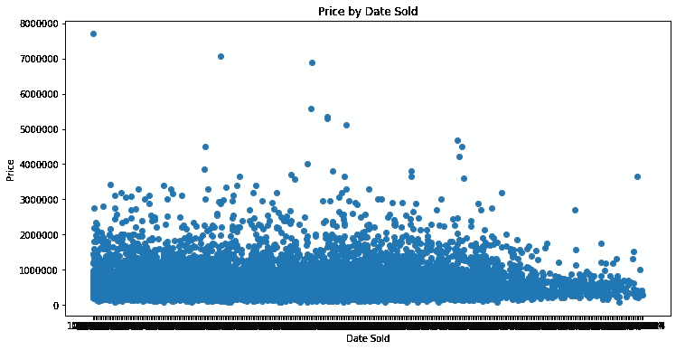

# 创建“年龄何时售出”字段

我们现在将通过从“*日期*特征中减去“*年 _ 造*”来创建一个新特征“*年龄 _ 售出时间*”。然后我们将把它转换成 int 类型。让我们看看我们是否能从组合这些特性中获得任何价值。

从散点图来看，这些特征并没有多大作用。让我们让他们成为候选人。

```
kc_data_copy['age_when_sold'] = pd.to_datetime(kc_data_copy['date']) - pd.to_datetime(kc_data_copy['yr_built'])

kc_data_copy['age_when_sold'] = kc_data_copy['age_when_sold'].dt.daysplt.figure(figsize=(12,6))
plt.scatter(kc_data_copy['age_when_sold'],kc_data_copy['price'])
plt.xlabel('Age when Sold')
plt.ylabel('Price')
plt.title('Price by Age')
```

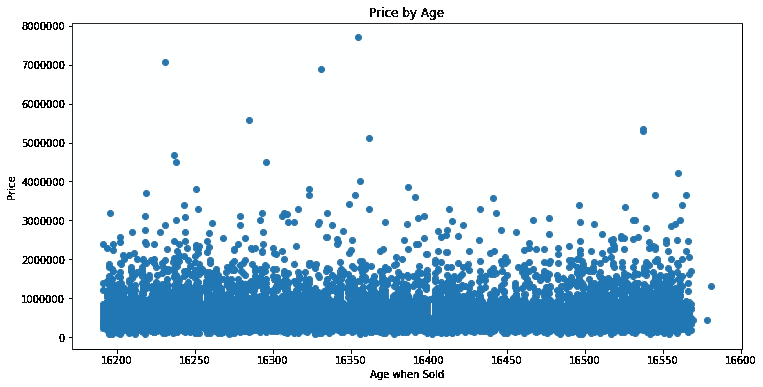

## 是时候看看一些连续变量了—首先是 sqft_lot

这一特征与价格并不呈线性关系。这看起来是一个很好的下降的候选人。但首先，我们将看看是否有一些策略来转换这些数据，使其变得更有用。

```
plt.figure(figsize=(12,6))
sns.regplot(x=kc_data_copy['sqft_lot'], y=kc_data_copy['price'])
plt.xlabel('Lot Square Foot')
plt.ylabel('Price')
plt.title('Price by Lot Square Foot')
```

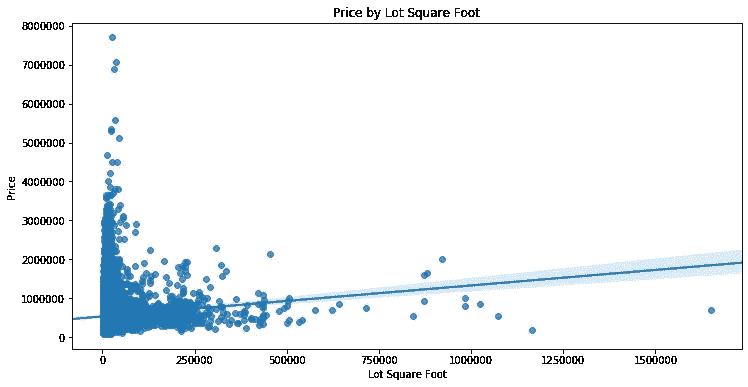

# 如果我们改变这个特征会发生什么？

下面的图表显示了该功能如何通过转换发生变化。顶部 3 描绘了 *sqft_lot* 未改变、对数变换和平方根变换的分布图。我们可以看到，经过对数转换的版本看起来比其他两个版本更接近正常。

接下来，我们来看散点图。嗯。对数转换似乎提供了最好的结果，但也好不到哪里去。

```
plot_trans(kc_data_copy['sqft_lot'], kc_data_copy['price'])
```

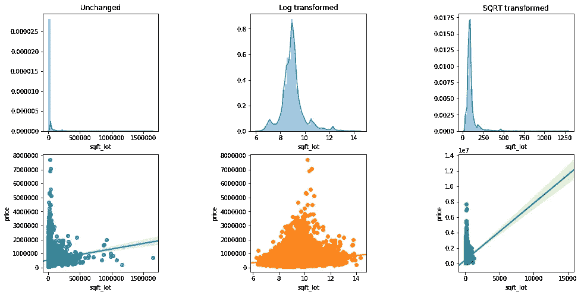

## sqft_lot15 怎么样？

该功能与 *sqft_lot* 非常相似，因此我们可以删除一个或两个。

## 来看看 sqft_living 吧

我们预计这一特性将成为预测价格的最重要因素之一。它给了我们这个建筑的总面积。对数变换特征使我们接近正态分布。然而，仍然存在显著的异方差。因此，转换数据可能没有足够的价值。

```
plot_trans(kc_data_copy['sqft_living'], kc_data_copy['price'])
```

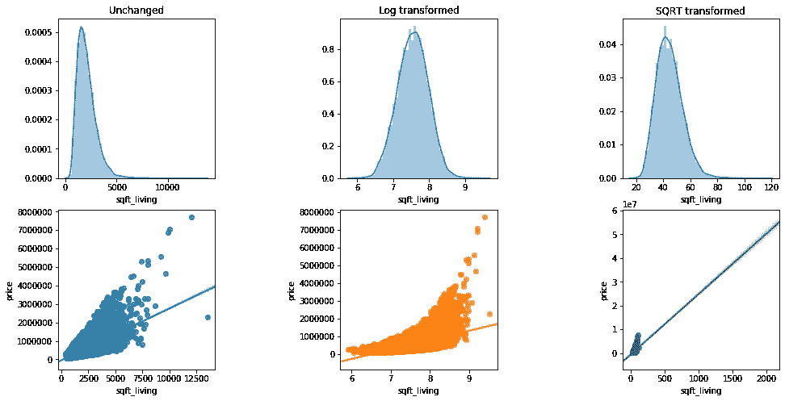

## 我们来看看上面的 sqft _ 吧

很像 *sqft_living* 。它给了我们整个建筑的总面积，不包括地下室。对数变换特征使我们接近正态分布。然而，仍然存在显著的异方差。同样，转换数据可能没有足够的价值。敬请关注。

```
plot_trans(kc_data_copy['sqft_above'], kc_data_copy['price'])
```

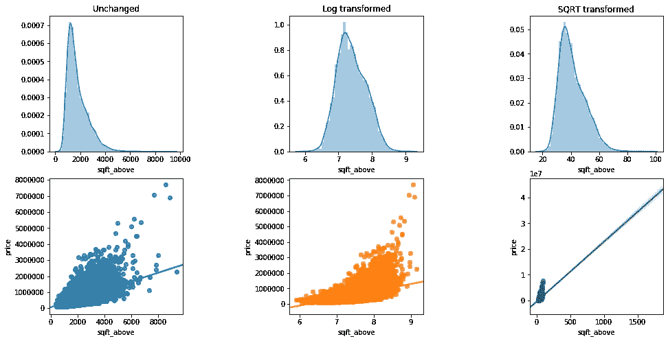

## 平方英尺 _ 地下室

```
plot_trans(kc_data_copy['sqft_basement'], kc_data_copy['price'],z=1)
*#kc_data_copy['sqft_basement'].value_counts()*
```

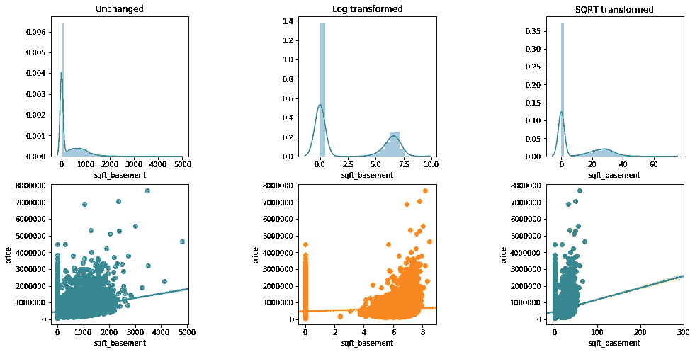

数据探索到此结束，第 1 部分到此结束。

在第 2 部分中，我们将讨论和预处理数据。我们将执行特征选择和维数减少，以及执行转换。然后，我们将构建几个模型并对其进行评估，以选择最佳表现。

我希望到目前为止你已经喜欢它了，并期待着第 2 部分。