# 预测华盛顿金斯县的房地产价格—第二部分

> 原文：<https://medium.datadriveninvestor.com/predicting-real-estate-prices-in-kings-county-washington-part-2-c26873379fe8?source=collection_archive---------8----------------------->

这是预测房价系列的第二部分，也是最后一部分。在[第 1 部分](https://alvarohenriquez-93558.medium.com/predicting-real-estate-prices-in-kings-county-washington-part-1-bdca5f0db058)中，我们对数据集进行了探索性数据分析。在这一部分，我们将执行一些数据预处理。我们将探索特征选择、特征交互和特征转换的影响。

然后，我们将建立几个模型，使用上述的各种组合。接下来，我们对它们进行评估，目的是根据我们的需求选择性能最佳的型号。

为了更好地理解我们的工作，请参阅第 1 部分。

# 现在我们准备预处理数据。

既然我们已经探索了我们的数据，是时候讨论一下了。我们将使用函数**预处理数据()**。它需要一个预测数据帧、一个要删除的要素列表、一个要编码的要素列表以及一个用于转换或不转换数值数据的布尔值。然后它返回我们预处理过的数据帧。

通过改变列表的内容，我们可以尝试不同的功能组合。对于初始基线，我们将只删除*视图*和*yr _ renewed*特性。所有其他特征将被视为数字。

要了解该函数如何工作，请检查' *source/resources.py* '中的代码。我们会多次使用它。

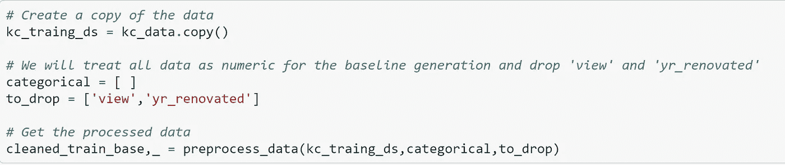

# 将目标从预测值中分离出来，并创建训练测试分割

我们使用来自 sklearn 的 *train_test_split* 将我们的数据分成训练集和测试集。

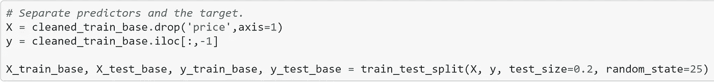

# 生成基线模型

我们的基线将是我们最简单的模型。我们将所有数据视为数字，仅删除*视图*和*yr _ renewed*。正如您所记得的，*yr _ renewated*有许多缺失值，不适合这第一个模型。

我们的目标是不断提高我们的分数。我们使用调整后的 R-square**对我们的模型进行排名。**

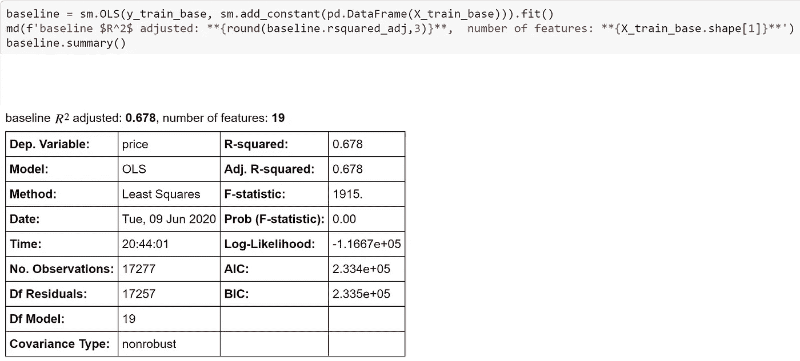

对于我们的基线，我们有一个 0.678 的调整后的 R 平方和总共 19 个特征。我们能做得更好吗？

# 让我们努力在这一点上有所改进

在尝试了不同的功能组合后，以下是得分最高的组合。这是一次反复试验。我将开发一个例程来自动化它。我们将重复预处理、将数据分成训练集和测试集以及拟合模型的步骤。

## 模型-1

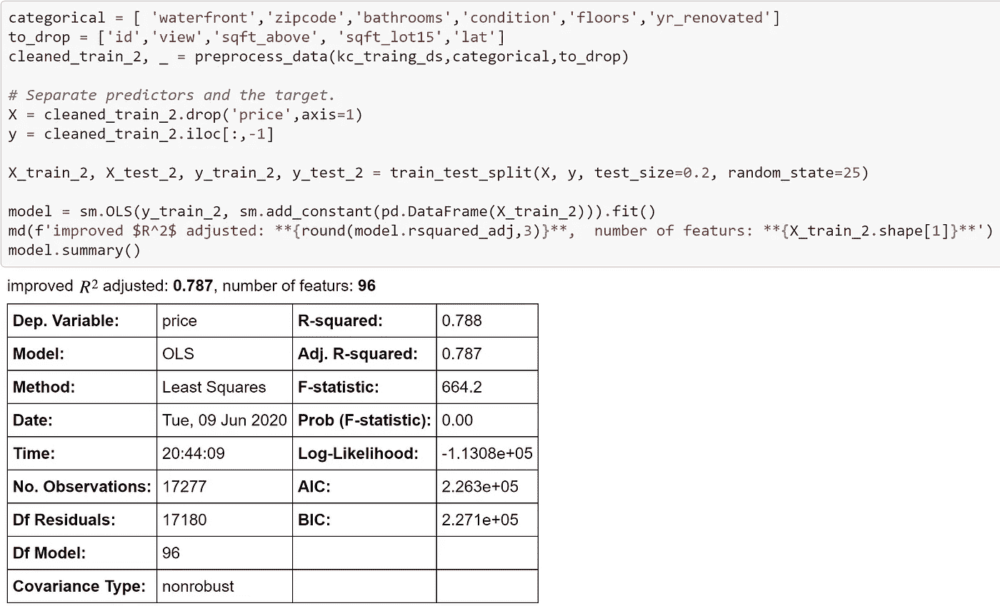

这是一个非常显著的进步。

我们一开始只有 20 个功能，现在已经增加到 96 个了。这是因为我们编码了六个特征，包括邮政编码，它本身包含了 72 个类别。值得注意的是，最后我们并没有对*卧室*进行编码。那是因为当我们这样做的时候，它降低了分数。

我们能减少一些吗？我们接下来会试试。

当我们决定到目前为止用于测试模型的预测因子时，我们已经做了一些特征选择。但是，这里我们将使用逐步特征选择来查看是否有任何其他可以移除的特征。下面是代码。

[https://en.wikipedia.org/wiki/Stepwise_regression](https://en.wikipedia.org/wiki/Stepwise_regression)

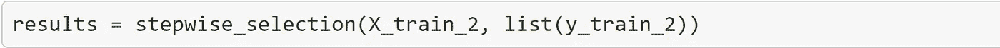

# 让我们看看有什么不同

好，我们从 96 个特征开始，逐步选择函数保持 75 个。因此，根据这些结果，我们需要放弃其中的 21 项。我们会这样做，再次拟合模型，看看我们会得到什么。

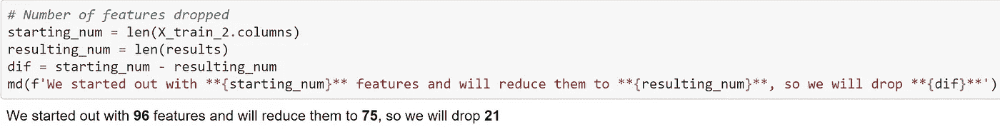

所以现在我们的模型中少了 21 个特性。现在我们将再次拟合模型，并比较分数。

# 使用逐步特征选择的模型-2

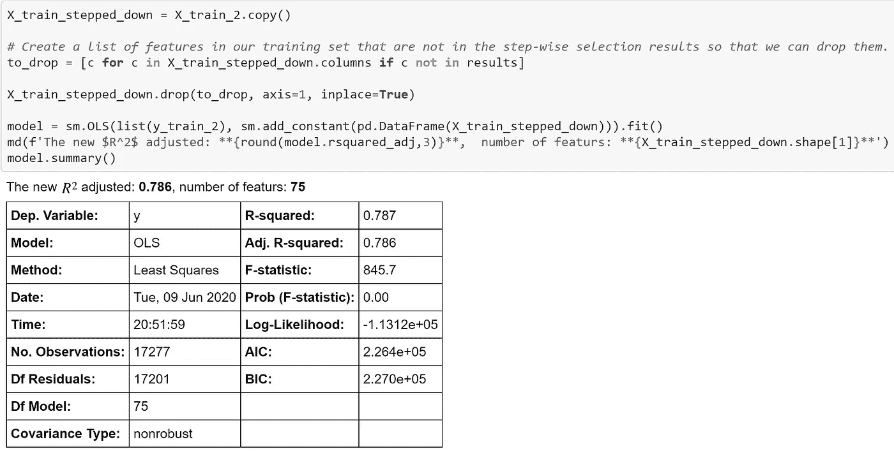

## 特征选择的结果

之前调整后的 R 平方为 0.787。新值为 0.786，略有下降。假设我们已经设法将模型的复杂性减少了 21 个特征，我们将采用 0.001 的减少量

# 相互作用

到目前为止，我们已经做得相当好了，但是让我们看看我们是否能再改进一点。我们现在将搜索交互式术语。函数 **exp_interactions()** 将处理繁重的工作。由于功能太多，需要一些时间才能完成。我们将使用调整后的 R-square 对它们进行评分。

这是代码。

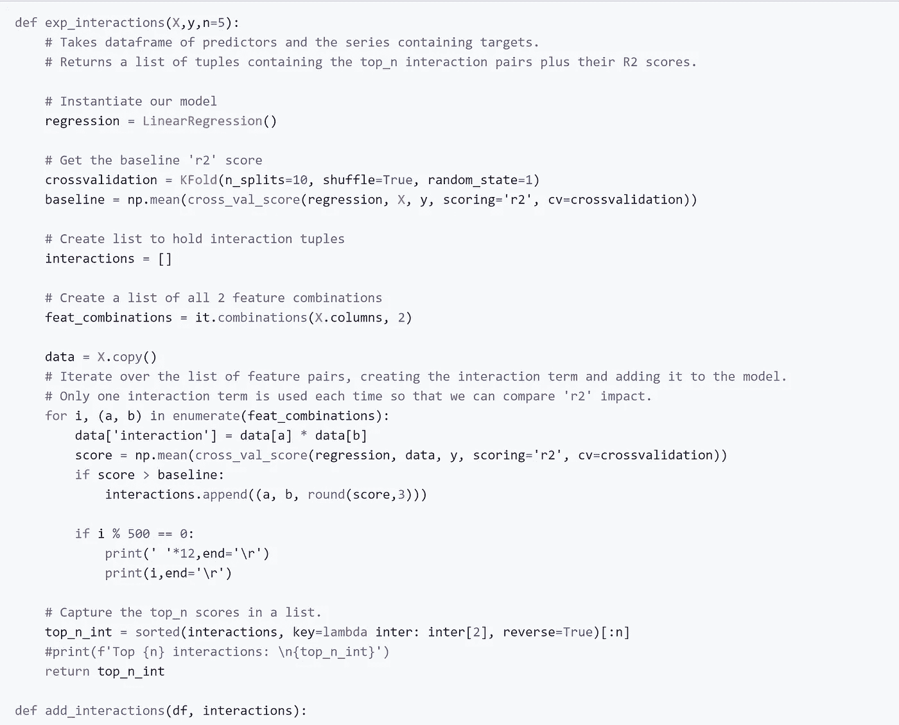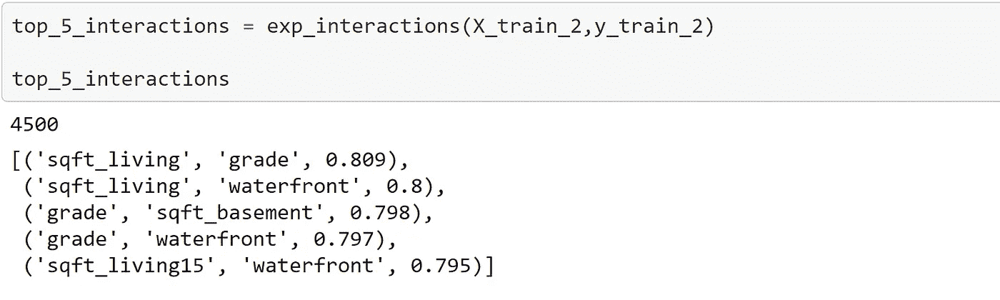

# 交互可视化

我们现在将绘制前 4 个相互作用术语。

## sqft _ 生活和品位

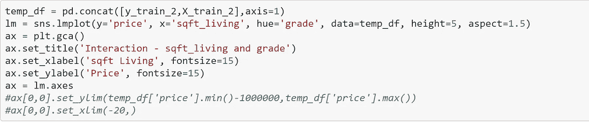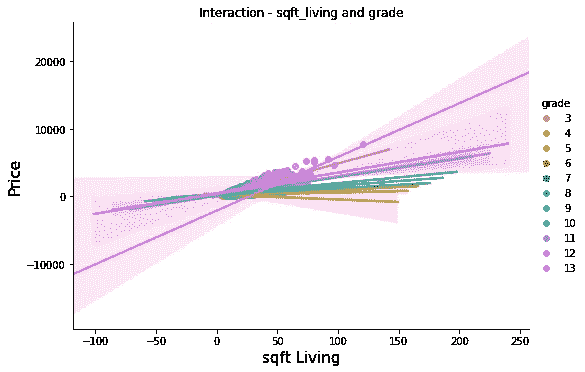

## sqft _ 生活和滨水区

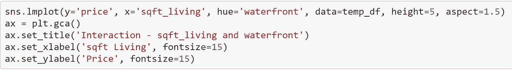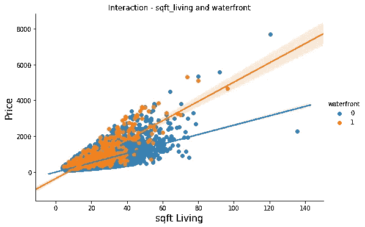

## 3.7 及以上的居住和浴室数量

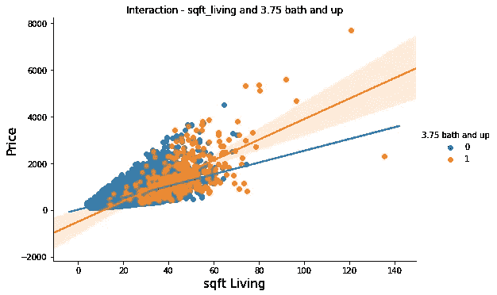

## sqft _ 地下室和坡度

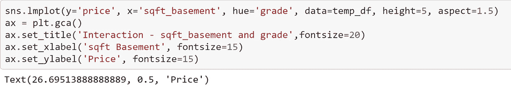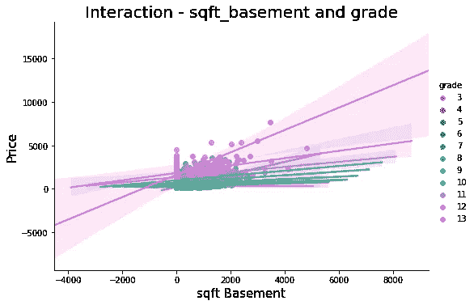

# 将交互项添加到模型中

现在，我们将把相互作用项添加到之前的模型中，看看效果如何。函数 **add_interactions()** 创建交互术语。在这里，我们将传递前 5 个交互。进一步理解请参考函数本身。

密码。

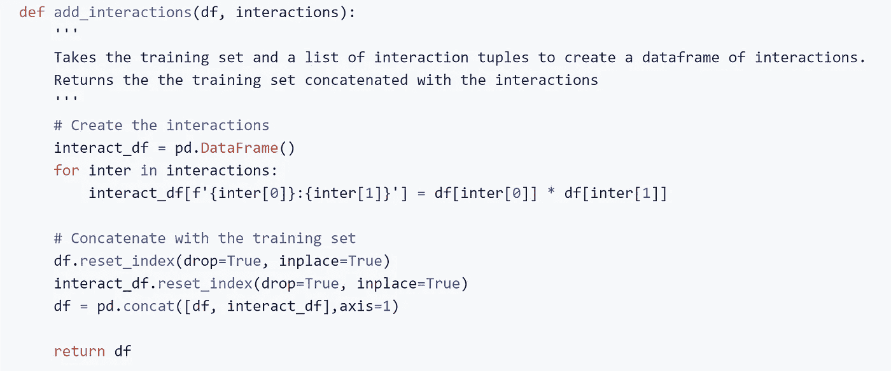

# 使用交互的模型 3

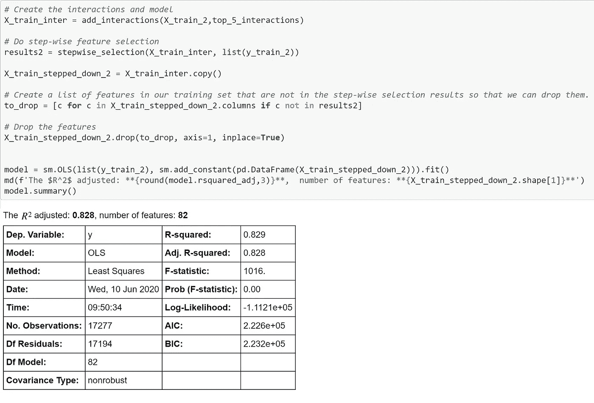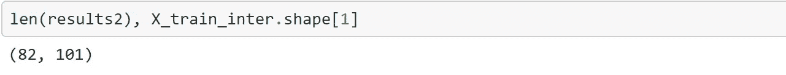

## 又一大进步！

所以现在我们的分数又上升了。最后一个模型产生的调整后的 R 平方为 0.786。这个模型产生 0.828 的分数。另一个改进是减少了功能，从 101 个减少到 82 个。

# 在找到交互之前进行转换

现在我们尝试对数转换数字特征，并使用**最小-最大**缩放它们。在这里，我们经历了所有的步骤。首先，我们将数据传递给 **pre_process_data()** 函数。然后将数据分为预测值和目标值，再分成训练集和测试集。接下来，我们添加先前创建的交互，逐步选择特征以减少特征的数量。最后，我们拟合模型。

# 使用对数变换和最小-最大缩放的模型 4

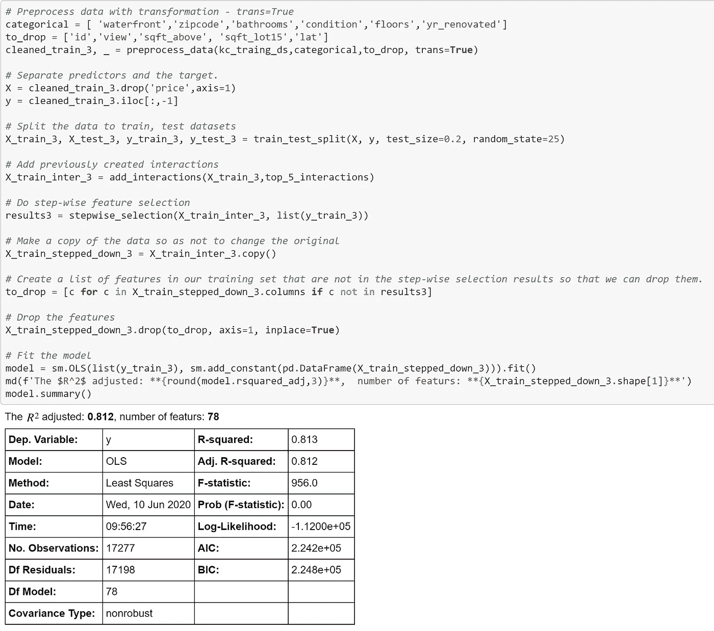

## 结果

这次调整后的 R 平方下降到 0.810。这仍然是一个稳定的分数，但我可能会坚持使用以前的模型。我们一会儿就能确定。

# 交叉验证

我们将使用 SKLearn 库测试我们的最佳模型的可预测性。我们将使用交叉验证来实现这一点。

# 首先，模型 3

模型 3 给了我们最高的调整 R 平方。现在我们将使用 RMSE 作为我们的衡量标准。

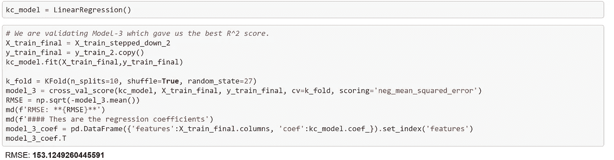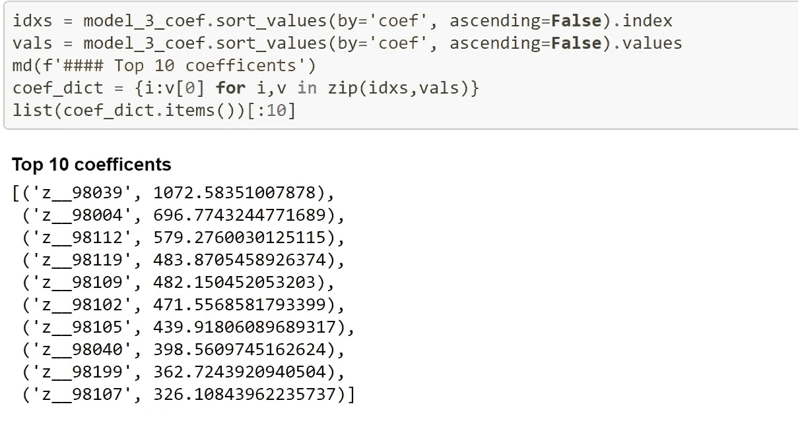

# 使用测试集进行预测

让我们尝试使用测试数据进行预测，并将结果与训练数据进行比较。但是首先，我们将准备测试集。我们将添加交互术语，并删除由分步过程识别的特征。然后，我们将对这两组数据进行预测，并比较它们的 RMSE 分数。

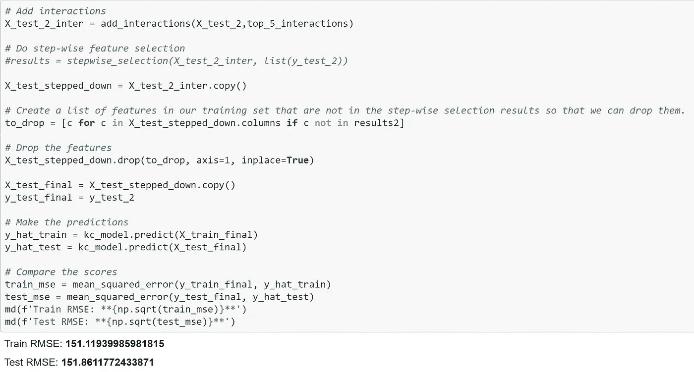

分数非常接近，这意味着变异不是一个问题。

# 多项式模型

现在我们将同样的数据拟合到一个二次多项式模型。我们想看看这是否会给我们一个更好的模型。

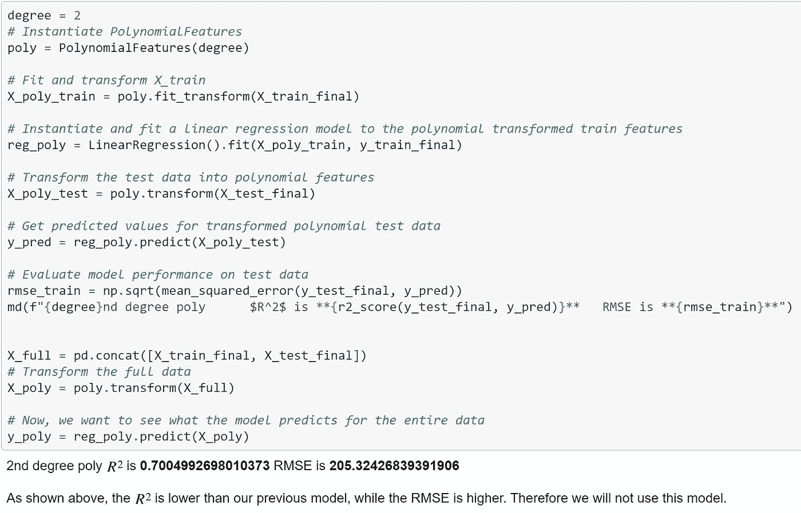

# 模型 4

现在我们将使用转换来评估我们的模型。

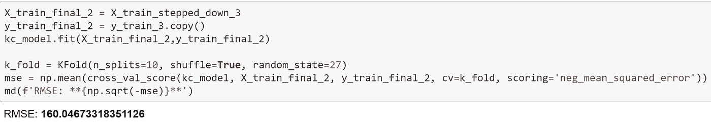

这台 RMSE 比 3 型高一点。

## 使用测试集进行预测

正如我们之前所做的，我们将准备测试集，并使用它来使用模型 4 进行预测。然后我们会比较分数。

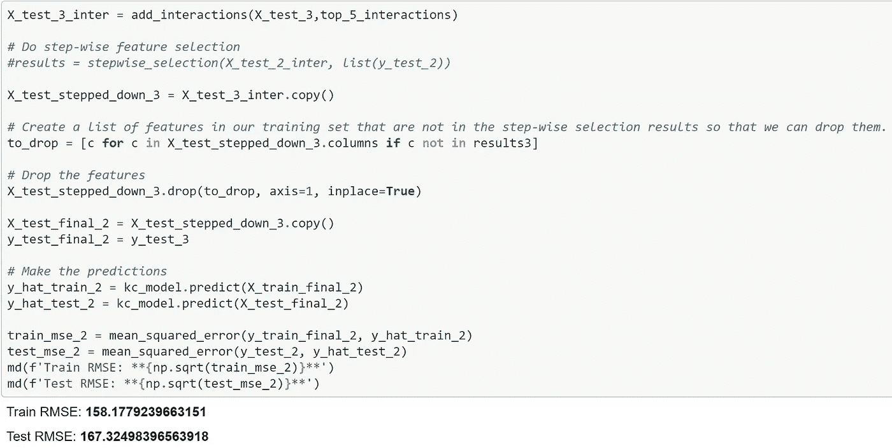

同样，这些分数比模型 3 更高，差距也更大一些

# 模型 2

该模型的调整后 R 平方为 0.786。与模型 3 一样，没有应用交互。

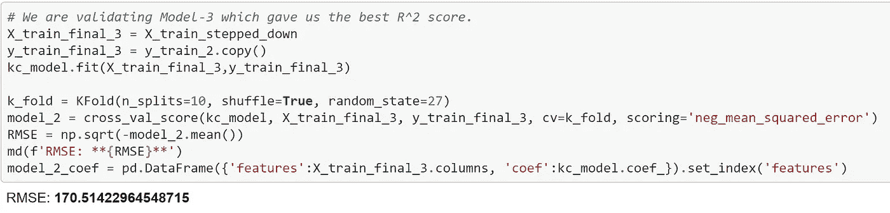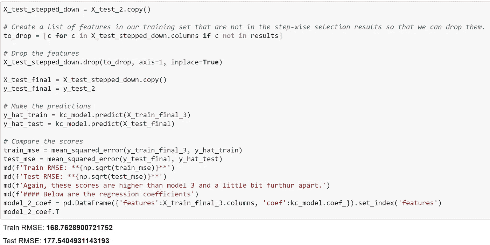

同样，这些分数比模型 3 高，而且差距稍大。

# 结论

基于这些测试，模型 3 被证明具有最佳拟合度和最佳可预测性。然而，它是一个相当复杂的模型，有 84 个特征。这种相互作用也增加了复杂性，使个体贡献特征的系数从正变到负。

出于本练习的目的，我将使用模型 2，因为它的系数更容易解释。

因此，在这本笔记本中，我们探索了金斯县住房数据集。我们识别出那些本质上是分类的特征，并使用不同的方案对它们进行编码。我们找到了一种方法来处理有点不寻常的*滨水区*特征的缺失数据。我们利用函数 *preprocess_data()* 构建并评估了几个模型，这使得使用不同的特性组合变得很容易。它还提供了编码、数据转换和交互术语的创建。

我希望你喜欢这篇文章。