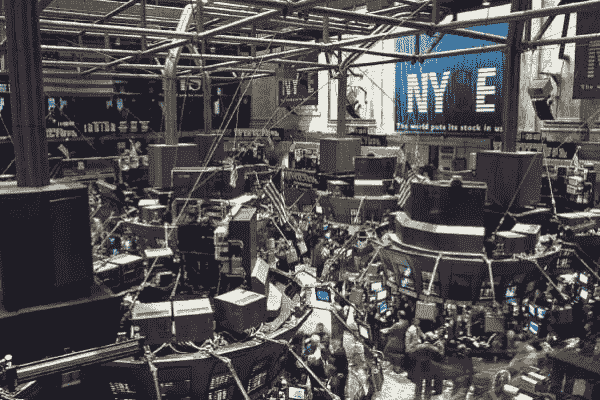
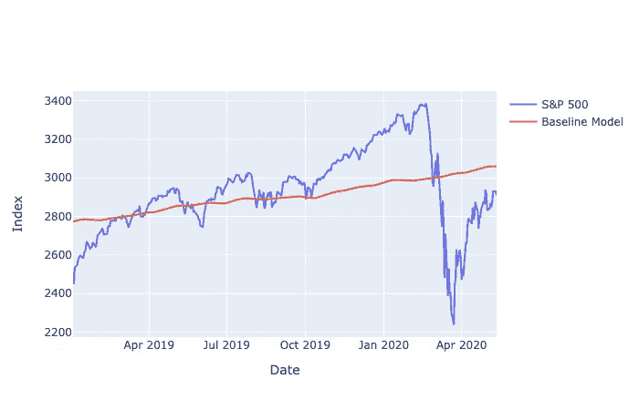
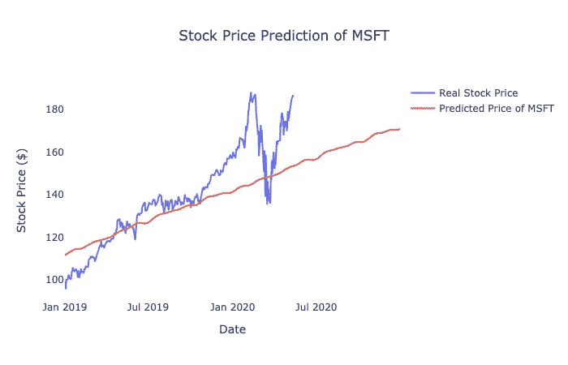
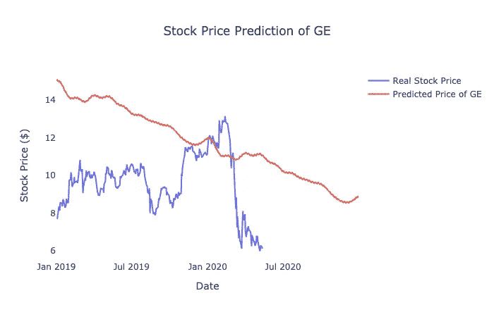
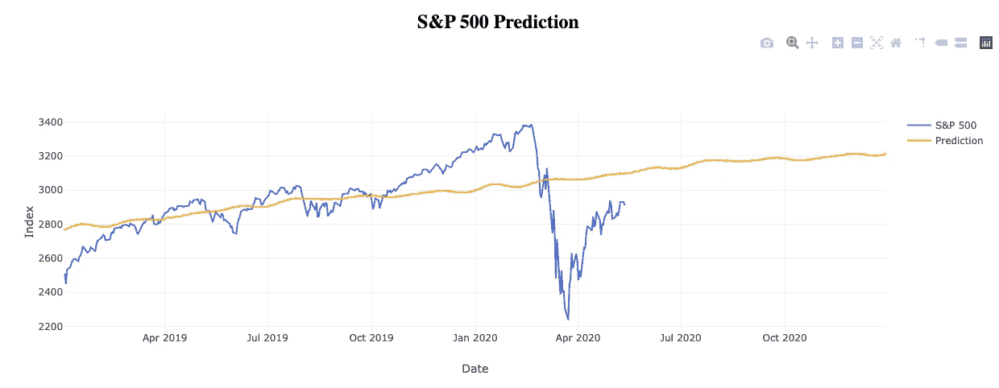
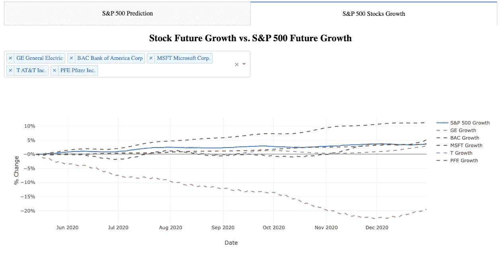

# 用时间序列统计学习预测标准普尔 500

> 原文：<https://medium.datadriveninvestor.com/predicting-s-p-500-with-time-series-statistical-learning-8b9277e30b2a?source=collection_archive---------0----------------------->

标准普尔 500 是美国市场股票表现的基准。能够预测标准普尔 500 的表现对投资股票或期货合约是有价值的。因此，我决定用 Python 建立一个预测模型来预测未来 6 个月的标准普尔 500 指数。

Photo from Yahoo Finance

**S&p500 指数是如何计算的？**
S & P 500 是美国的一个资本化加权指数。这个指数取市值前 500 家公司的加权平均值来反映股票市场的平均水平。事实上，标准普尔 500 指数有 505 种成分，因为有 5 家公司提供 2 类股票。S & P 500 通过将每只股票的市值相加并除以除数来计算，除数是在所有股票中取加权平均值的任意数。截至 2020 年 5 月，前 5 大权重股分别是通用电气(GE)、美国银行(BAC)、微软(MSFT)、美国电话电报公司(AT)和辉瑞(PFE)。由于标准普尔 500 指数是一个资本加权指数，这 5 只股票对指数的影响较大；前 5 大股票成分占指数权重的 12.73%。

**自适应模型(时间序列)方法**
用时间序列统计学习进行预测的第一种方法是用自适应模型训练指数预测模型，我们可以用脸书预言家来建立这个模型。脸书先知(Prophet)是一个非常用户友好的软件包，因为语法是 Sklearn 风格的。在这种方法中，我们可以首先获得 1997 年至 2018 年之间的指数进行模型训练，并用 2019 年至 2020 年 5 月之间的指数评估预测的指数的准确性。

The Prediction of the Baseline Model

该指数预测模型的准确度为 10.69% R-square，这不是令人印象深刻的准确度。我们可以看到，预测能够捕捉到指数增长的趋势，但不能捕捉到波动情绪。然而，这是探索新的预测模型以提高准确性的良好开端。

**另一种方法:用预测的股价预测未来 S&p500**
预测 S & P 500 的另一种方法是用预测的股价计算未来 S & P 500(不是期货合约)。这意味着我们首先预测 505 只股票成分的股价，并使用指数公式用预测的股价计算 S & P 500。我称之为股价聚合模型。这种方法有几个优点:

1.  我们能够捕捉到单个股票的趋势，我们可以更准确地捕捉到模式
2.  用 505 个预测模型来预测 1 个指数非常类似于消除噪声和过度拟合的集合模型
3.  我们可以立即将精选股票的未来表现与标准普尔 500 指数进行比较
4.  我们也可以很容易地分析工业部门的未来表现

要建立这个模型，需要 4 个步骤:
1。数据采集

2.训练 505 只股票的股价预测模型

3.根据预测的股票价格计算指数

4.估价

**数据获取**
股价聚集模型的第一步是使用 yfinance 包从雅虎财经(雅虎财经提供免费数据)获取历史股价和所有必要的数据，包括流通股数量和 S & P 500 除数，并将股价保存在本地关系数据库中。如果你想了解更多关于如何使用 yfinance 获取数据，你可以查看我的帖子[免费 API 获取股票价格和经济指标](https://medium.com/@jjsham/free-apis-to-obtain-stock-price-and-economic-indicators-22a0dc9706cd)。

 [## 利用股市相关性的最佳方式|数据驱动的投资者

### 当阿尔弗雷德·温斯洛·琼斯开创了世界上第一个“对冲”基金(后来“d”被去掉了)时，他让其他投资者大吃一惊…

www.datadriveninvestor.com](https://www.datadriveninvestor.com/2020/02/02/the-best-way-to-use-stock-market-correlations/) 

**股价预测**
下一步是对 505 的股价进行预测，也就是说我们要为每只股票建立一个股价预测模型。为了使这一步变得简单，我们将使用脸书 Prophet 用自适应模型(时间序列)来训练预测模型。有趣的是，如果用不同的时间间隔训练模型，预测模型的准确性是不同的。我们以苹果(AAPL)为例:用 1997–2018 年间的股价和 2010–2018 年间的股价训练的苹果股价预测模型的准确率分别为-4.56%和 44.73% R-square。因此，我们将选择用于苹果股价预测模型的训练数据应该是 2010 年至 2018 年之间的股价。还有，不是所有的股票都一样。用于训练股价预测模型来预测苹果股价的时间间隔与其他股票不一样。例如，预测洛克希德·马丁公司(LMT)的最佳时间间隔是 1997 年至 2018 年。你可以看看我的帖子[用时间序列统计学习](https://medium.com/datadriveninvestor/predict-stock-price-with-time-series-statistical-learning-fec97560439e)预测股票价格，了解更多关于我是如何发现这一点的。

因此，我们将进行网格搜索，为每只股票的预测模型找到训练数据的最佳时间间隔。股票价格预测模型的准确性因股票而异。例如，微软(MSFT)的股票价格预测模型具有 62.98%的 R 平方精度。

The Stock Price Prediction of Microsoft (MSFT)

然而，使用时间序列统计学习来预测股票价格是纯粹的技术分析，该模型不能够捕捉任何事件的情绪影响。以通用电气(GE)为例，GE 最近 2017-2019 年的收益下降，导致股价大幅下跌。通用电气股票价格预测模型无法在模型训练阶段捕捉任何时间间隔内股票价格的大幅下跌，不幸的是，通用电气股票价格预测模型的准确性非常差，它达到了负 R 平方，这意味着该模型的表现比股票价格的平均值差。

The Stock Price Prediction of General Electric (GE)

**指数计算**
在我们预测了所有 505 只股票成分在 2020 年 5 月至 12 月之间的未来股价之后，我们现在可以通过用预测的股价计算指数来对 S & P 500 进行预测。要做到这一点，只需遵循指数公式:将每只股票的所有每日市值相加，然后除以 S & P 500 除数。市场资本总额是股票价格乘以股票的流通股数；S & P 500 除数是代表调整后总市值的任意数字。

计算阶段很简单:首先，计算每只股票的每日市值，并对所有每日市值求和。然后，将每日市场资本总额除以除数，你就会得到你预测的指数。

**评估**
最后一步是评估指标预测模型的准确性。由于数据源没有提供全面的数据集，每只股票的流通股数量和 S & P 500 除数的数据可能不准确，因此指数计算存在潜在误差。因此，我会使用股票价格、流通股数量和测试数据的 S & P 500 除数的公式来计算指数(结果，测试数据集中的指数在 2019 年平均偏离约 100 点)。最后，我对标准普尔 500 指数的准确率是 23%,这证明了指数预测模型是有用的，并且比基线模型表现得更好。预测的结果看起来像这样:

S&P 500 Prediction

根据预测，根据历史表现的模式，该指数可能在年底升至 3200 点。

我们可以看到，该模型能够捕捉指数增长的趋势，但无法捕捉情绪的每日变化，该模型可能对长期交易有用，但对日交易无效。此外，请注意，该模型纯粹基于时间序列统计技术预测指数，这意味着该模型没有考虑任何基本或定性分析。

我还使用 Dash 构建了一个仪表板来可视化预测。我还包括了可视化，以比较指数和选定股票之间的未来增长。

The Future Growth between the S&P 500 and the Top 5 Weighted Stocks

我们可能会看到，到今年年底，微软(MSFT)的表现可能会超出市场 5-7%，而通用电气(GE)的表现可能会低于市场 20%。

用这种方法预测指数的一个优点是，我们可以即时比较预测的性能；构建控制面板后，我们可以访问数据并比较增长情况，而无需进一步的手动计算。

如果你有兴趣学习如何使用 Plotly Dash 构建仪表板，你可以从我的帖子[使用 Plotly Dash](https://medium.com/@jjsham/building-dashboard-using-plotly-dash-36bf94a1137) 构建仪表板中学习。

**建议修改**
指数预测模型依赖于 505 个股价预测模型的预测:这意味着指数预测模型的性能在很大程度上依赖于股价预测的准确性。在当前阶段，只有 40%的股票成分具有正 R 平方的股票价格预测模型，这导致指数预测模型的准确性较低。为了提高指数预测模型的准确性，需要改进所有股票的股价预测模型，特别是权重股(前 10 大权重股占 S & P 500 的 20%权重)。由于指数是如何计算的，当来自权重股的预测股价更准确时，预测的指数可能更精确。

由于每一个股票价格预测模型都是相互独立的，如果我们发现了另一种方法可以获得更高的准确性，我们可以替换一个股票价格预测模型。例如，假设我们已经训练了具有线性回归的苹果(AAPL)股票价格预测模型，并且选择了该模型已经实现 80% R 平方的特征，则我们可以丢弃苹果(AAPL)的当前股票价格预测模型，并且使用来自新模型的新预测股票价格来计算新预测指数。

**思想**
虽然我构建的股价聚合模型没有达到很高的精确度，但它证明了如果我们有正确的数据，这个概念是可行的，并且比基线模型表现得更好。这个模型最难的部分是准确预测 505 只股票的价格。标准普尔 500 指数有趣的地方在于，权重股对指数的影响更大，因此指数预测模型更加依赖权重股。下一步将通过不同的方法改进前 10 大权重股的股价预测模型。股价聚集模型的优点仅依赖于预测的股价，这意味着一只股票的股价预测模型可以被替换，而不会影响另一只股票的股价预测模型。如果我们能够保证前 10 大权重股的股价预测模型的准确性，指数预测模型将会得到很大的提升。

**结论**
这是一个非常令人兴奋的项目，因为该项目涉及大量的数据工程和机器学习技术来完成。对标准普尔 500 的预测可能不准确，但该项目已经证明，通过从预测的股票价格计算指数来预测标准普尔 500 是可行的，这是开始修改模型以使其更有用的良好起点。除了对前 10 大权重股的股价预测模型进行改进之外，我们必须认识到该模型只预测了具有历史表现的指数，而忽略了股票的基本面和定性分析。在改进模型的下一步中，我们还将考虑这些分析，以提高模型的准确性。

如果你想看看这个项目的代码，你可以看看我在 S & P 500 上的 [Github 预测库。或者，如果你想查看这篇文章的补充细节，你可以查看我的](https://github.com/jacquessham/StockAnalytics/tree/master/SP500Prediction) [Github 库，它是这篇文章](https://github.com/jacquessham/StockAnalytics/tree/master/Post_Prediction_SP500)的补充文件夹。

**免责声明**
这个项目是我的数据科学项目股票分析的一部分。这个项目的目标是概念证明，而不是任何交易建议。根据历史表现对标准普尔 500 指数和其他股票做出的预测。本帖中的任何预测都是参考，不是事实。任何交易行为都应咨询您的理财经理，我不对任何交易损失负责。

 [## 雅克·沙姆-旧金山湾区|职业简介| LinkedIn

### 查看雅克·沙姆在全球最大的职业社区 LinkedIn 上的个人资料。雅克有 4 个工作列在他们的…

www.linkedin.com](https://www.linkedin.com/in/jacquessham/) 

**参考**

 [## 雅克沙姆/股票分析

### 标准普尔 500 是美国的基准指数，也是美国股票市场的重要指标

github.com](https://github.com/jacquessham/StockAnalytics/tree/master/SP500Prediction)  [## 雅克沙姆/股票分析

### 这个文件夹是我用时间序列统计预测标准普尔 500 的中期文章的补充文件

github.com](https://github.com/jacquessham/StockAnalytics/tree/master/Post_Prediction_SP500)  [## 用时间序列统计学习预测股票价格

### 在我最近的股票分析项目中，我计划通过汇总预测的 505 只股票价格来预测标准普尔 500

medium.com](https://medium.com/datadriveninvestor/predict-stock-price-with-time-series-statistical-learning-fec97560439e)  [## 获取股票价格和经济指标的免费 API

### 我在大学时学的是金融，所以我对建立预测股票的预测模型非常感兴趣

medium.com](https://medium.com/@jjsham/free-apis-to-obtain-stock-price-and-economic-indicators-22a0dc9706cd)  [## 使用 Plotly Dash 构建仪表板

### 受 Geoffrey Hung 的《数据可视化—懒惰方法》的启发，我想谈谈业务…

medium.com](https://medium.com/@jjsham/building-dashboard-using-plotly-dash-36bf94a1137)