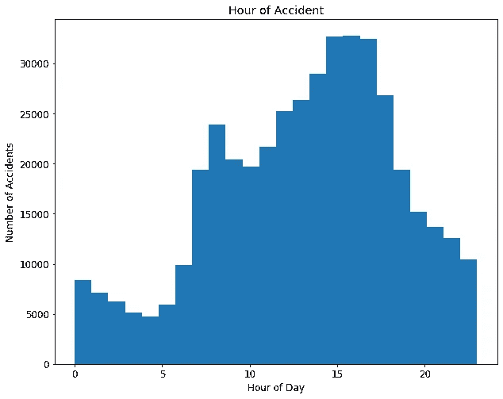
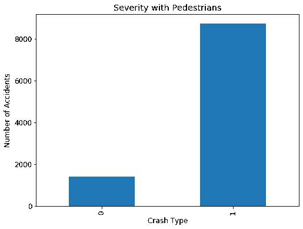
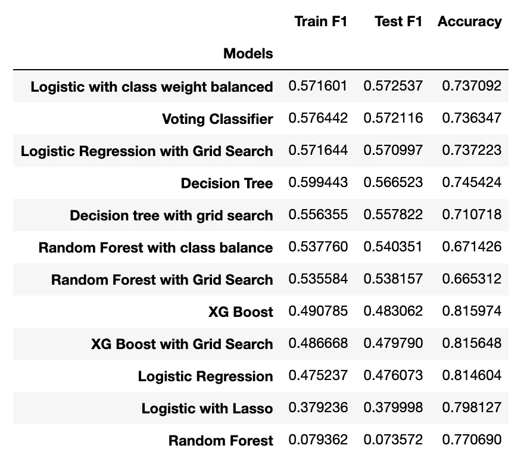

# 预测车祸的严重程度

> 原文：<https://medium.datadriveninvestor.com/predicting-severity-of-a-car-accident-76513fa1ae8b?source=collection_archive---------11----------------------->

美国每年平均发生约 600 万起车祸，即每天约 16438 起事故。

在这篇博客中，我将谈谈我在“预测车祸严重程度”上做的分类项目。我使用了[芝加哥市事故数据集](https://data.cityofchicago.org/Transportation/Traffic-Crashes-Crashes/85ca-t3if)。这个数据集有大约 430，000 个观察值和 49 列。我最终删除了许多列，因为它们与项目无关。

## 数据清理

我不必花那么多时间清理数据。数据集有大约 800 行缺少值，所以我只是删除了缺少值的行。我必须做的另一个清理工作是，大多数数据都是分类的，并且它有不同的值 unknown 和 other，所以我决定将它们合并为一个值 Unknown/other，以减少分类。

## 数据分析

在分析中，我首先查看了事故发生的时间和事故数量。人们发现高峰时间发生的事故比其他时间多。

我还研究了事故的严重程度和天气状况之间是否存在关联。研究发现，在晴朗和多云的天气里，严重和非严重事故的数量保持不变，但在雨天，严重事故的数量会有所增加。

 [## 一瞬间学会数据科学！？数据驱动的投资者

### 在我之前的职业生涯中，我是一名训练有素的古典钢琴家。还记得那些声称你可以…

www.datadriveninvestor.com](https://www.datadriveninvestor.com/2020/07/23/learn-data-science-in-a-flash/) 

## 假设检验

我对数据进行了 3 次假设检验。第一个是关于事故严重程度和天气状况的卡方检验。第二个是关于事故严重程度和道路状况的卡方检验。在这两个测试中，p 值显著低于 0.05。在不同的天气和道路条件下，严重事故的比例不等于非严重事故。

第三个测试是比例 z 测试，以检查在涉及行人的事故中，严重和非严重事故的比例是否相等或更多。人们发现，如果一个行人卷入了一场事故，那事故就更有可能是严重的。

如下图所示，在所有涉及行人的事故中，大多数都是严重事故。(碰撞类型:1 表示严重，0 表示不严重)

## 特征工程

在特征工程中，我从日期开始创建了一个季节列，代表事故发生的季节。然后，我为数据集中的所有分类特征创建了虚拟列。我还使用多项式特征来创建连续特征之间的特征交互。

## 特征选择

对于要素选择，我检查了要素之间的多重共线性，并移除了相关性为 0.8 的要素。然后，我使用了方差膨胀因子，并删除了方差膨胀因子为 0.9 的特性。

我也用套索进行特征选择，但是它去掉了大部分特征。所以我最终忽略了拉索。

## 模型

我对数据运行了几个不同的模型。我使用 F1 分数作为我的评估标准，因为在目标变量中存在巨大的阶级不平衡。我运行了逻辑回归、决策树、随机森林、XG boost，还用这些模型进行了网格搜索，以获得最好的 F1 分数。

以下是我从不同车型中获得的 F1 分数和准确度表:

我得到的最好的 F1 分数是用平衡类权重的逻辑回归得到的，这很好，因为我想要一个更易解释的模型来看看哪些特征对模型来说是重要的。该模型中的测试 F1 分数优于训练 F1 分数，这意味着该模型在测试集上的表现优于训练集。

有关使用哪种评估指标的更多信息，请查看我的博客“[评估分类模型](https://medium.com/@jagansingh_70690/evaluating-a-classification-model-21761632f61d)”。

## 结论

我的最终模型显示，某些列比其他列对车祸的严重程度有更大的影响。该模型显示，与行人或骑自行车的人发生的事故比其他事故更可能是严重的。该模型还表明侧撞事故并不严重。

这是我的[项目库](https://github.com/jagansingh93/Car_Accident_Injury_Prediction)的链接。

## 获得专家观点— [订阅 DDI 英特尔](https://datadriveninvestor.com/ddi-intel)