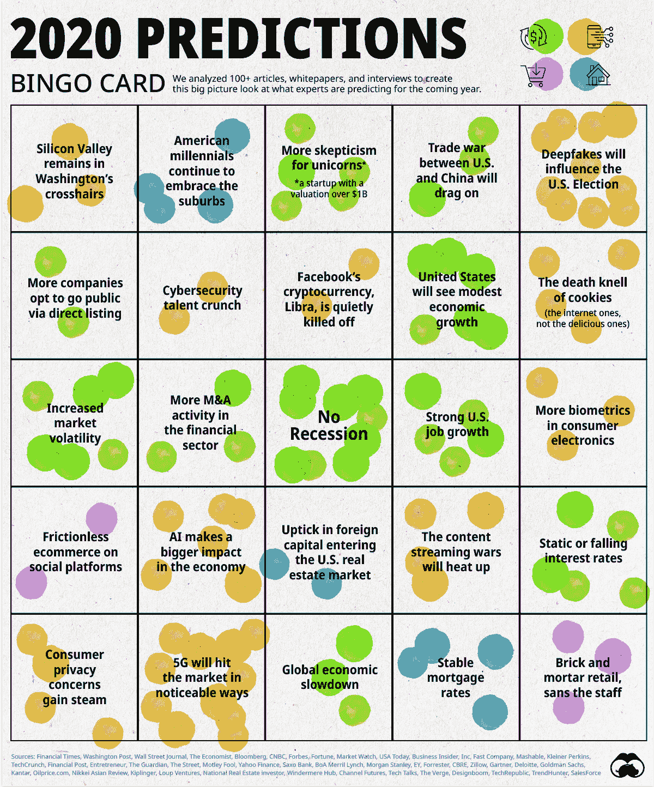
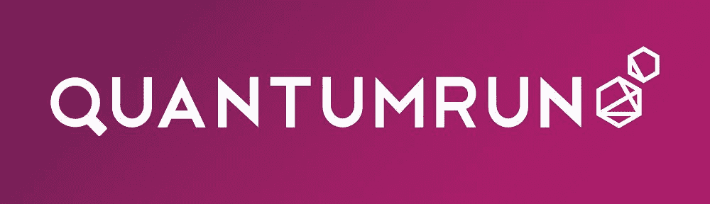

# 预测未来

> 原文：<https://medium.datadriveninvestor.com/predicting-the-future-16f04ea741d6?source=collection_archive---------4----------------------->

*对 2020 年及本十年剩余时间的综合预测*

*2020 年已经开始运行，现在说“新年快乐”不再是[的潮流。](https://youtu.be/EJ6UvCkInRk?t=67)*

*尽管如此，我们还是需要看看水晶球，看看今年及以后会发生什么。许多人在过去的[和](https://www.canberratimes.com.au/story/6556854/20-predictions-for-2020-heres-what-people-thought-would-have-happened-by-now/)中做出了令人尴尬的[错误](https://edition.cnn.com/2020/01/01/tech/2020-predictions-we-got-wrong-scli-intl/index.html)预测，下面的顶点可能会落在同一个篮子里。然而，随着预测量的增加，其中一些更有可能被公之于众。我们应该记住，只要有足够的时间，并遵守物理定律，大多数事情最终都会发生。*

* [## 幸福的算法？数据驱动的投资者

### 从一开始，我们就认为技术正在使我们的生活变得更好、更快、更容易和更实用。社交媒体…

www.datadriveninvestor.com](https://www.datadriveninvestor.com/2019/03/08/an-algorithm-for-happiness/) 

以下是迄今为止最佳预测报道的综述:

[预测共识:专家从*视觉资本家*那里看到了 2020 年](https://www.visualcapitalist.com/prediction-consensus-what-the-experts-see-coming-in-2020/)会发生什么

[2020 年的 23 项技术预测](https://www.inc.com/christina-desmarais/23-tech-predictions-for-2020.html)来自 *Inc* 关于商业的未来:

1.  美国和加拿大之间的科技人才大战将会加剧
2.  支付公司将在 M&A 崛起
3.  量子产业的合作将让位于竞争和收购
4.  许多首席产品官将取代首席营销官
5.  首席技术官将站在最高管理层的最前沿
6.  财务治理将成为云计算的首要任务
7.  首席执行官和创始人受到崇拜的公司的首次公开募股会被市场认为风险太大而打折扣
8.  社交视频将推动潜在客户的产生
9.  在人工智能和 5G 等技术进步的推动下，远程劳动力将继续增长
10.  直接面向消费者将把重点转移到保留和现实世界的扩展上
11.  商业智能将变得更加容易获得
12.  工会将在人工智能改革中获得更大的发言权
13.  更多的工作将在网上完成
14.  电视将被数据打乱
15.  人工智能将改善人类的联系，而不是取代它们
16.  物联网企业间谍将公之于众
17.  “人人都想成为银行”的趋势将会继续
18.  对监听设备的抵触情绪将会增加
19.  软件开发人员的雇佣将变得更加专业化
20.  细菌将成为我们健康中越来越重要的杠杆
21.  围绕人工智能的营销噪音甚至会更多
22.  国会将在联邦层面解决数据隐私问题
23.  自动语音识别将随着数据的减少而提高

[21 世纪 20 年代将会是什么样子|未来预测](https://www.quantumrun.com/future-timeline/2020)由*量子运行*在社会的各个部分:

*   [2020 年至 2022 年](https://www.tomsguide.com/us/5g-release-date,review-5063.html)，大多数城市中心的美国无线消费者将开始获得 5G 设备和连接
*   美国经济衰退将在 2020 年至 2022 年间浮出水面，这一次是由过高的企业债务水平造成的。利率上升被认为是可能的罪魁祸首，因为过度杠杆化的公司在贷款偿还期限的重压下崩溃了
*   [更强的客户身份认证为在线支付或购物的客户实施了新的身份确认框架。](https://www.businessinsider.com/uk-delays-strong-customer-authentication-requirements-2019-8/)
*   [2020 年至 2021 年间，联邦政府将举行无线频谱的电信拍卖，可用于建设超高速 5G 网络](https://mobilesyrup.com/2018/06/06/government-5g-spectrum-band-release-dates-2018-2022-spectrum-outlook/)。
*   [5G 频谱拍卖将于 2020 年至 2021 年间出售，以加速国家 5G 网络的建设](https://www.itworldcanada.com/article/canadian-5g-development-on-track-says-nokia-and-ericsson/415594)
*   [日本使用 ARM 处理器完成 exaflop 超级计算机](https://nextbigfuture.com/2016/06/japan-shooting-for-exaflop.html)
*   [印度完成了一个庞大的光纤网络，将 6 亿农村居民连接到互联网上](https://www.dw.com/en/indias-ambitious-optical-fiber-broadband-network-to-bridge-digital-divide-in-rural-areas/a-18223792)
*   [中国在月球暗面着陆探测器](https://www.techtimes.com/articles/54521/20150521/china-wants-to-land-probe-on-dark-side-of-the-moon-by-2020.htm)
*   [在美国一半以上的地区，太阳能变得比普通电力更经济](https://fusion.net/story/33063/the-real-fun-for-solar-in-america-begins-in-2020/)
*   [PlayStation 5 首次亮相](https://www.pushsquare.com/news/2016/01/ps5_could_launch_as_early_as_2019_reckons_analyst)
*   [拥有手机的人将比拥有电的人多](https://www.cnet.com/news/by-2020-more-people-will-own-a-phone-than-have-electricity/)
*   [全球有 61 亿智能手机用户，超过了基本固定电话用户](https://techcrunch.com/2015/06/02/6-1b-smartphone-users-globally-by-2020-overtaking-basic-fixed-phone-subscriptions/)
*   [美国合法大麻销售额将达到 230 亿美元](https://www.usatoday.com/story/money/business/2016/03/20/legal-marijuana-sales-forecast-hit-23b-4-years/82046018/)
*   [帮助老年人保持活力的机器人外骨骼变得随处可见](https://www.sciencedaily.com/releases/2015/10/151014085414.htm)
*   [世界首届机器人奥运会在日本举行](https://www.businessinsider.com/harvard-robobees-closer-to-pollinating-crops-2014-6)
*   [每瓦特太阳能电池板的成本等于 1.2 美元](https://goo.gl/y8XgSh)
*   [中国建成世界上最大的铁路系统(12 万公里)](https://www.futureagenda.org/pg/cx/view#372)
*   [Venera-D 太空探测器抵达金星](https://goo.gl/Ojt91o)
*   [超大型望远镜(猫头鹰)投入运行](https://content.time.com/time/health/article/0,8599,2106198,00.html)
*   [巨型麦哲伦望远镜投入使用](https://en.wikipedia.org/wiki/Giant_Magellan_Telescope)
*   [世界人口预测将达到 7758156000 人](https://populationpyramid.net/world/2020/)
*   [到 2020 年代，自动驾驶汽车在全球汽车销量中的份额将达到 5%](https://goo.gl/gOrMKM)
*   [(摩尔定律)每秒计算，每 1000 美元等于 10(一个老鼠大脑)](http://blog.ancientlasers.com/wp-content/uploads/2012/03/ExponentialGrowthofComputing.jpg)
*   [预测的全球移动网络流量等于 24eb](https://www.cisco.com/c/en/us/solutions/collateral/service-provider/visual-networking-index-vni/white-paper-c11-738429.html)
*   [全球互联网流量增长至 188 艾字节](https://www.cisco.com/c/en/us/solutions/service-provider/visual-networking-index-vni/index.html)

然而，没有什么比得上 FutureTimeline.net 的[上的综合列表。以下是对 2020 年至 2029 年的预测中一些最受欢迎的选择，其中许多是多年前做出的，并且有望成为现实:](https://www.futuretimeline.net/21stcentury/2020-2029.htm)

[**2020–2025**](https://www.futuretimeline.net/21stcentury/2020.htm#2020-2025)

*   [耳聋的基因治疗](https://www.futuretimeline.net/21stcentury/2020.htm#gene-therapy-deafness)

[**2020**](https://www.futuretimeline.net/21stcentury/2020.htm#2020)

*   [X 一代正在重塑全球政治](https://www.futuretimeline.net/21stcentury/2020.htm#generation-x)
*   [全球互联网使用量达到 50 亿](https://www.futuretimeline.net/21stcentury/2020.htm#internet-2020)
*   [用思维发短信](https://www.futuretimeline.net/21stcentury/2020.htm#texting-by-thinking)
*   [从干细胞生长的复杂器官替代物](https://www.futuretimeline.net/21stcentury/2020.htm#organs)
*   [首例干细胞治疗充血性心力衰竭](https://www.futuretimeline.net/21stcentury/2020.htm#stem-cells-2020)
*   [治愈疟疾的方法](https://www.futuretimeline.net/21stcentury/2020.htm#healthy-people-2020-malaria)
*   [寿命延长的进展](https://www.futuretimeline.net/21stcentury/2020.htm#2020-longevity)
*   [转基因“超级”香蕉](https://www.futuretimeline.net/21stcentury/2020.htm#super-bananas-2020)
*   [东京主办奥运会](https://www.futuretimeline.net/21stcentury/2020.htm#tokyo-2020-olympic-games)
*   [香港地铁已大幅扩建](https://www.futuretimeline.net/21stcentury/2020.htm#hong-kong-mtr-future)
*   [费马恩皮带固定链完成](https://www.futuretimeline.net/21stcentury/2020.htm#fehmarn)
*   [英国扩大了其海上电网连接](https://www.futuretimeline.net/21stcentury/2020.htm#uk-offshore-grid-connections)
*   [英国家家户户都有智能电表](https://www.futuretimeline.net/21stcentury/2020.htm#smart-meters)
*   [汞污染大大减少](https://www.futuretimeline.net/21stcentury/2020.htm#mercury)
*   [冰川国家公园和其他地区正在变得无冰](https://www.futuretimeline.net/21stcentury/2020.htm#glacier_retreat)
*   [英国新航母达到完全作战能力](https://www.futuretimeline.net/21stcentury/2020.htm#queen-elizabeth-class-aircraft-carrier-timeline)
*   [3 万架无人机正在美国上空巡逻](https://www.futuretimeline.net/21stcentury/2020.htm#30000-drones-by-2020)
*   [火星 2020 探测车任务](https://www.futuretimeline.net/21stcentury/2020.htm#mars-2020-rover)
*   [美国宇航局静音超音速技术的首次试飞](https://www.futuretimeline.net/21stcentury/2020.htm#quesst)
*   英国的沿海小路对步行者开放
*   [2020 年世博会在迪拜举行](https://www.futuretimeline.net/21stcentury/2020.htm#expo-2020)
*   [拉森 B 冰架的最终崩塌](https://www.futuretimeline.net/21stcentury/2020.htm#larsen-b)

[**2021**](https://www.futuretimeline.net/21stcentury/2021.htm#2021)

*   [部署万亿次计算机](https://www.futuretimeline.net/21stcentury/2021.htm#exascale)
*   [exo Mars 漫游车在火星着陆](https://www.futuretimeline.net/21stcentury/2021.htm#exomars)
*   詹姆斯·韦伯太空望远镜发射升空
*   [伦敦十字铁路开通](https://www.futuretimeline.net/21stcentury/2021.htm#crossrail)
*   [美国西南部的水危机](https://www.futuretimeline.net/21stcentury/2021.htm#lakemead)
*   [世界上最大的虫群再次出现](https://www.futuretimeline.net/21stcentury/2021.htm#brood-x-2021)
*   [乳腺癌的五年生存率接近 100%](https://www.futuretimeline.net/21stcentury/2021.htm#breast-cancer)
*   [男性避孕药进入市场](https://www.futuretimeline.net/21stcentury/2021.htm#male-birth-control-pill)
*   [世界上第一个人造肾脏](https://www.futuretimeline.net/21stcentury/2021.htm#kidney)
*   [推出 Terrafugia TF-X 飞行汽车](https://www.futuretimeline.net/21stcentury/2021.htm#flyingcar)
*   [首次阿拉伯火星任务](https://www.futuretimeline.net/21stcentury/2021.htm#arab-mars)
*   [阿丽亚娜 6 号的首次飞行](https://www.futuretimeline.net/21stcentury/2021.htm#ariane6)
*   [印度首次载人航天飞行](https://www.futuretimeline.net/21stcentury/2021.htm#india-space)
*   快速变化的劳动力
*   [无线电力即将达到临界质量](https://www.futuretimeline.net/21stcentury/2021.htm#witricity)
*   [深中桥竣工](https://www.futuretimeline.net/21stcentury/2021.htm#bridge)

[**2022**](https://www.futuretimeline.net/21stcentury/2022.htm#2022)

*   印度成为地球上人口最多的国家
*   ITER 实验聚变堆开启
*   德国逐步淘汰核能
*   [北京举办冬奥会](https://www.futuretimeline.net/21stcentury/2022.htm#winter-olympics)
*   [东北走廊高铁升级完成](https://www.futuretimeline.net/21stcentury/2022.htm#avelia)
*   卡塔尔主办世界杯
*   [中国首个空间站建成](https://www.futuretimeline.net/21stcentury/2022.htm#china-space-station-2020)
*   [新视野号完成了对柯伊伯带的研究](https://www.futuretimeline.net/21stcentury/2022.htm#new-horizons-2022)
*   [阿依达任务抵达迪狄莫斯](https://www.futuretimeline.net/21stcentury/2022.htm#aida-mission-2022-timeline)
*   [黑暗时代无线电探索者(DARE)启动](https://www.futuretimeline.net/21stcentury/2022.htm#dare)
*   水正在成为一种战争武器
*   [全球锑储量即将耗尽](https://www.futuretimeline.net/21stcentury/2022.htm#antimony)
*   纳米技术的衣服正在迅速普及
*   [无人驾驶悬浮出租车在迪拜投入运营](https://www.futuretimeline.net/21stcentury/2022.htm#aat)
*   [前往月球南极的蝰蛇任务](https://www.futuretimeline.net/21stcentury/2022.htm#viper)

[**2023–2027**](https://www.futuretimeline.net/21stcentury/2023.htm#2023-2027)

*   区块链的转折点

[**2023**](https://www.futuretimeline.net/21stcentury/2023.htm#2023)

*   [Xi·金平继续担任中国总统](https://www.futuretimeline.net/21stcentury/2023.htm#jinping)
*   [Aerion AS2 超音速喷气式飞机开始服役](https://www.futuretimeline.net/21stcentury/2023.htm#aerion)
*   [大型综合巡天望远镜开始全面运行](https://www.futuretimeline.net/21stcentury/2023.htm#lsst)
*   美国宇航局猎户座飞船首次载人飞行
*   [火星样本返回任务](https://www.futuretimeline.net/21stcentury/2023.htm#mars-sample-return-future)
*   [小行星样本返回任务](https://www.futuretimeline.net/21stcentury/2023.htm#asteroid)
*   [发射宽视场红外巡天望远镜](https://www.futuretimeline.net/21stcentury/2023.htm#wfirst)
*   [欣克利角 C 核电站运行](https://www.futuretimeline.net/21stcentury/2023.htm#hinkley-point-c-timeline)
*   [26 型环球战斗舰入役](https://www.futuretimeline.net/21stcentury/2023.htm#type26)
*   土耳其庆祝独立 100 周年
*   [伦敦“超级下水道”竣工](https://www.futuretimeline.net/21stcentury/2023.htm#sewer)
*   [大脑植入以恢复失去的记忆](https://www.futuretimeline.net/21stcentury/2023.htm#memory-chip-brain-implant)
*   [月神 27 号在月球的远侧着陆](https://www.futuretimeline.net/21stcentury/2023.htm#luna27)
*   [无人驾驶高速列车开始在法国运营](https://www.futuretimeline.net/21stcentury/2023.htm#trains)
*   [达塞船舶隧道竣工](https://www.futuretimeline.net/21stcentury/2023.htm#stad)
*   [sp herex 任务的发射](https://www.futuretimeline.net/21stcentury/2023.htm#spherex)

[**2024–2064**](https://www.futuretimeline.net/21stcentury/2024.htm#2024-2064)

*   [下一代伦敦地铁](https://www.futuretimeline.net/21stcentury/2024.htm#london-future-tube-trains)

[**2024**](https://www.futuretimeline.net/21stcentury/2024.htm#2024)

*   [弗拉基米尔·普京卸任俄国总统](https://www.futuretimeline.net/21stcentury/2024.htm#putin)
*   [近乎零成本的开源 3D 打印服装](https://www.futuretimeline.net/21stcentury/2024.htm#3d-printed-clothes-future)
*   [30 米望远镜全面投入使用](https://www.futuretimeline.net/21stcentury/2024.htm#thirty-metre-telescope)
*   [完成平方公里阵列](https://www.futuretimeline.net/21stcentury/2024.htm#ska)
*   [横跨北美的日全食](https://www.futuretimeline.net/21stcentury/2024.htm#2024-solar-eclipse-timeline)
*   2024 年欧洲杯由德国主办
*   巴黎主办夏季奥运会
*   月球任务一号钻入月球南极
*   [治疗关节炎的生物电子技术已被普遍使用](https://www.futuretimeline.net/21stcentury/2024.htm#arthritis-future-cure)
*   汽车共享人气大增
*   [风力涡轮机无人机检测是一个价值数十亿美元的行业](https://www.futuretimeline.net/21stcentury/2024.htm#wind-turbine-drone-inspection-future-timeline)
*   [Starlink 达到最大容量](https://www.futuretimeline.net/21stcentury/2024.htm#starlink)
*   [首个飞入太阳外层大气的探测器](https://www.futuretimeline.net/21stcentury/2024.htm#solar-probe)

[**2025–2050**](https://www.futuretimeline.net/21stcentury/2025.htm#2025-2050)

*   [失业率飙升](https://www.futuretimeline.net/21stcentury/2025.htm#future-unemployment)

[**2025–2035**](https://www.futuretimeline.net/21stcentury/2025.htm#2025-2035)

*   所有的电视都变得基于互联网
*   [小型模块化核反应堆获得广泛采用](https://www.futuretimeline.net/21stcentury/2025.htm#small-modular-nuclear-reactors)
*   [载人登月任务](https://www.futuretimeline.net/21stcentury/2025.htm#china-moon-2025)
*   [先进技术大口径太空望远镜(ATLAST)执行其生命搜寻任务](https://www.futuretimeline.net/21stcentury/2025.htm#atlast)
*   [小鼠冷冻复苏](https://www.futuretimeline.net/21stcentury/2025.htm#future-prospects-cryopreservation)

[**2025–2030**](https://www.futuretimeline.net/21stcentury/2025.htm#2025-2030)

*   许多城市禁止化石燃料驱动的车辆
*   生物恐怖主义的威胁正在增加
*   [高超音速导弹被用于军事用途](https://www.futuretimeline.net/21stcentury/2025.htm#hypersonic-missiles-2025-2030)
*   英国一些最著名的动物物种濒临灭绝

[**2025–2029**](https://www.futuretimeline.net/21stcentury/2025.htm#2025-2029)

*   [火星月球探测探测器收集并返回样本](https://www.futuretimeline.net/21stcentury/2025.htm#mmx)

[**2025–2028**](https://www.futuretimeline.net/21stcentury/2025.htm#2025-2028)

*   与旅行者号探测器失去联系

[2025](https://www.futuretimeline.net/21stcentury/2025.htm#2025)

*   十亿人类基因组已经被测序
*   [人脑模拟正在成为可能](https://www.futuretimeline.net/21stcentury/2025.htm#humanbrainsimulations)
*   [3D 打印人体器官](https://www.futuretimeline.net/21stcentury/2025.htm#future-3d-printing-technology)
*   [中国正变得高度城市化](https://www.futuretimeline.net/21stcentury/2025.htm#boomingchina)
*   垂直农场在城市很常见
*   [固体废物正达到危机水平](https://www.futuretimeline.net/21stcentury/2025.htm#solid-waste-future-impacts)
*   [基瓦林娜已经被淹没](https://www.futuretimeline.net/21stcentury/2025.htm#kivalina-alaska-global-warming)
*   [东安格利亚区竣工](https://www.futuretimeline.net/21stcentury/2025.htm#east-anglia-zone-timeline)
*   [英国逐步淘汰煤电](https://www.futuretimeline.net/21stcentury/2025.htm#future-of-coal-fired-power-plants-uk)
*   [欧洲超大型望远镜投入使用](https://www.futuretimeline.net/21stcentury/2025.htm#e-elt)
*   巨型麦哲伦望远镜已经完全投入使用
*   [天空龙空天飞机的首次试飞](https://www.futuretimeline.net/21stcentury/2025.htm#skylon)
*   [俄罗斯新航天港首次载人飞行](https://www.futuretimeline.net/21stcentury/2025.htm#vostochny-2025)
*   [许多国家正在扩建高速铁路网](https://www.futuretimeline.net/21stcentury/2025.htm#hsr)
*   美国空域系统的全面改革已经完成
*   [美国海军正在使用轨道炮](https://www.futuretimeline.net/21stcentury/2025.htm#railguns-2025)
*   [全球众筹市场达到 1000 亿美元](https://www.futuretimeline.net/21stcentury/2025.htm#crowdfunding)
*   BepiColombo 抵达水星轨道
*   [最终*头像*电影上映](https://www.futuretimeline.net/21stcentury/2025.htm#avatar)

[**2026–2031**](https://www.futuretimeline.net/21stcentury/2026.htm#2026-2031)

*   [印度可重复使用运载火箭投入运行](https://www.futuretimeline.net/21stcentury/2026.htm#india-space-shuttle)

[**2026–2030**](https://www.futuretimeline.net/21stcentury/2026.htm#2026-2030)

*   柏拉图天文台开始运作了

[**2026**](https://www.futuretimeline.net/21stcentury/2026.htm#2026)

*   [合成人类基因组完成](https://www.futuretimeline.net/21stcentury/2026.htm#synthetic-human-genome)
*   [水产养殖提供了世界上大部分的海产品](https://www.futuretimeline.net/21stcentury/2026.htm#aquaculture)
*   [高亮度大型强子对撞机(HL-LHC)投入运行](https://www.futuretimeline.net/21stcentury/2026.htm#hl-lhc)
*   [国际直线对撞机完成](https://www.futuretimeline.net/21stcentury/2026.htm#linear)
*   [3d 打印电子薄膜预防心脏病](https://www.futuretimeline.net/21stcentury/2026.htm#3d-printed-heart-monitor)
*   [衰老心肌通过 GDF-11 的年轻再生](https://www.futuretimeline.net/21stcentury/2026.htm#future-heart-failure)
*   [阿尔茨海默病的新疗法](https://www.futuretimeline.net/21stcentury/2026.htm#alzheimers)
*   [上升的海平面正在肆虐马尔代夫](https://www.futuretimeline.net/21stcentury/2026.htm#maldives)
*   [全球铟储备即将耗尽](https://www.futuretimeline.net/21stcentury/2026.htm#indium-future-supply)
*   [意大利举办冬奥会](https://www.futuretimeline.net/21stcentury/2026.htm#olympics)
*   [圣家堂的建设已经完成](https://www.futuretimeline.net/21stcentury/2026.htm#sagrada-familia-construction)
*   [与人类能力相匹配的机器人手](https://www.futuretimeline.net/21stcentury/2026.htm#most-advanced-robot-hand)
*   [国际足联世界杯由加拿大、墨西哥和美国联合举办](https://www.futuretimeline.net/21stcentury/2026.htm#football)
*   [火星科学实验室关闭](https://www.futuretimeline.net/21stcentury/2026.htm#msc)
*   [50TB 硬盘](https://www.futuretimeline.net/21stcentury/2026.htm#50tb)

[**2027**](https://www.futuretimeline.net/21stcentury/2027.htm#2027)

*   [金砖四国超越七国集团](https://www.futuretimeline.net/21stcentury/2027.htm#brics-g7)
*   [轻型氢燃料电池汽车年销量达到 100 万辆](https://www.futuretimeline.net/21stcentury/2027.htm#hydrogen-future-technology)
*   [东京和名古屋由高速磁悬浮](https://www.futuretimeline.net/21stcentury/2027.htm#tokyo-nagoya-maglev)连接
*   许多国家正在进行碳封存
*   [Venera-D 任务抵达金星](https://www.futuretimeline.net/21stcentury/2027.htm#venera)
*   小行星 1999 AN10 接近地球
*   欧罗巴快船抵达轨道
*   [猫王的尸检报告公之于众](https://www.futuretimeline.net/21stcentury/2027.htm#elvis-presley-2027)
*   [波兰中部新机场开幕](https://www.futuretimeline.net/21stcentury/2027.htm#poland)

[**2028**](https://www.futuretimeline.net/21stcentury/2028.htm#2028)

*   [完成深空网关](https://www.futuretimeline.net/21stcentury/2028.htm#deep-space-gateway)
*   [启动欧洲雅典娜 X 射线天文台](https://www.futuretimeline.net/21stcentury/2028.htm#athena)
*   [中国建造世界上最大的粒子加速器](https://www.futuretimeline.net/21stcentury/2028.htm#china-particle-accelerator)
*   [印刷电子产品无处不在](https://www.futuretimeline.net/21stcentury/2028.htm#printed-electronics)
*   英国人口达到 7000 万
*   英国报纸即将停止发行
*   [发射 ARIEL 航天器](https://www.futuretimeline.net/21stcentury/2028.htm#ariel)
*   [发射彗星拦截器](https://www.futuretimeline.net/21stcentury/2028.htm#comet)
*   德里成为世界上人口最多的城市
*   洛杉矶主办夏季奥运会
*   [澳大利亚和新西兰的日全食](https://www.futuretimeline.net/21stcentury/2028.htm#eclipse)
*   [几种灭绝物种的复活已经实现](https://www.futuretimeline.net/21stcentury/2028.htm#dodo-resurrection)
*   国际空间站退役

[2029](https://www.futuretimeline.net/21stcentury/2029.htm#2029)

*   类似人类的人工智能正在成为现实
*   [提高银行业务的自动化程度](https://www.futuretimeline.net/21stcentury/2029.htm#banking-automation-future)
*   [近地小行星阿波菲斯接近](https://www.futuretimeline.net/21stcentury/2029.htm#apophis)
*   [基因驱动在蚊子身上的大规模应用](https://www.futuretimeline.net/21stcentury/2029.htm#mosquitoes)
*   [全球白银储备即将耗尽](https://www.futuretimeline.net/21stcentury/2029.htm#silver)
*   [芬兰禁止煤炭用作能源](https://www.futuretimeline.net/21stcentury/2029.htm#finland-coal-ban)
*   [马达加斯加辐射龟野生灭绝](https://www.futuretimeline.net/21stcentury/2029.htm#tortoise)
*   加州高速铁路线的第一阶段已经完成
*   伦敦希思罗机场的扩建
*   木星的大红斑正在消失
*   泰坦尼克号的残骸已经分解

最近，毕马威会计师事务所对未来 20 年做出了 20 项预测。

这是对 2020 年 1 月之前未来十年的预测总结！期待我们美好的未来。希望在今年的 [SXSW](https://www.sxsw.com/) 见到大家！

如果你想了解更多关于[超人类主义](https://www.transhumanism.com.au/)和新兴技术的信息，请关注我的[媒体](https://medium.com/@peterxing)。*