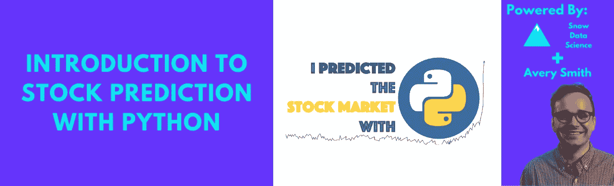
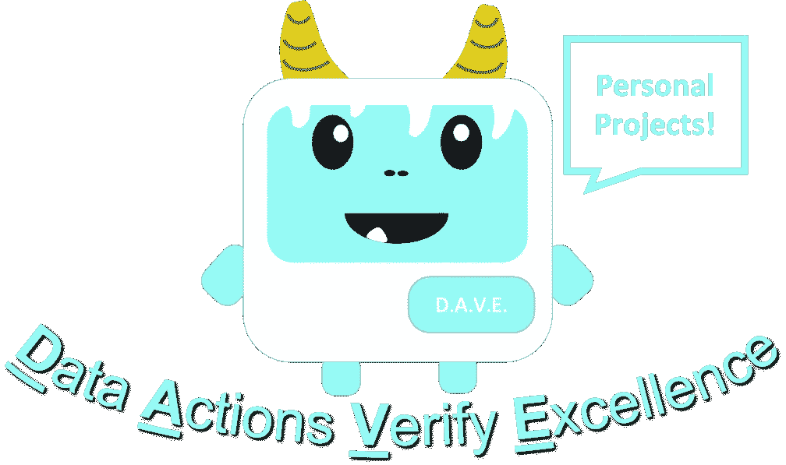
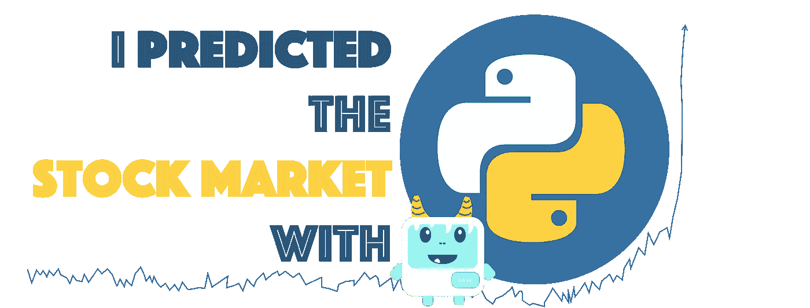
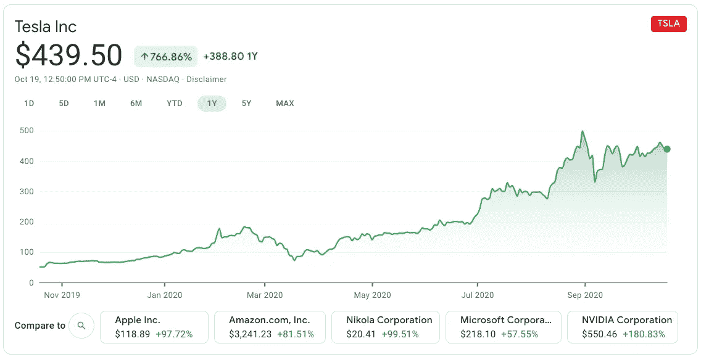
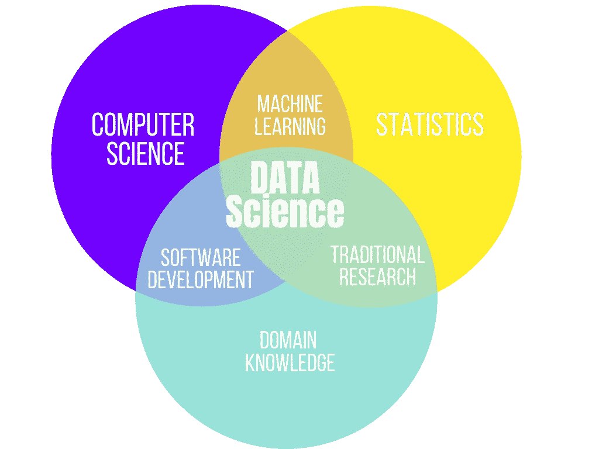
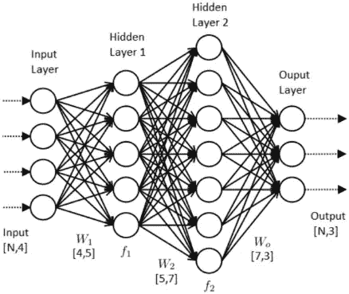
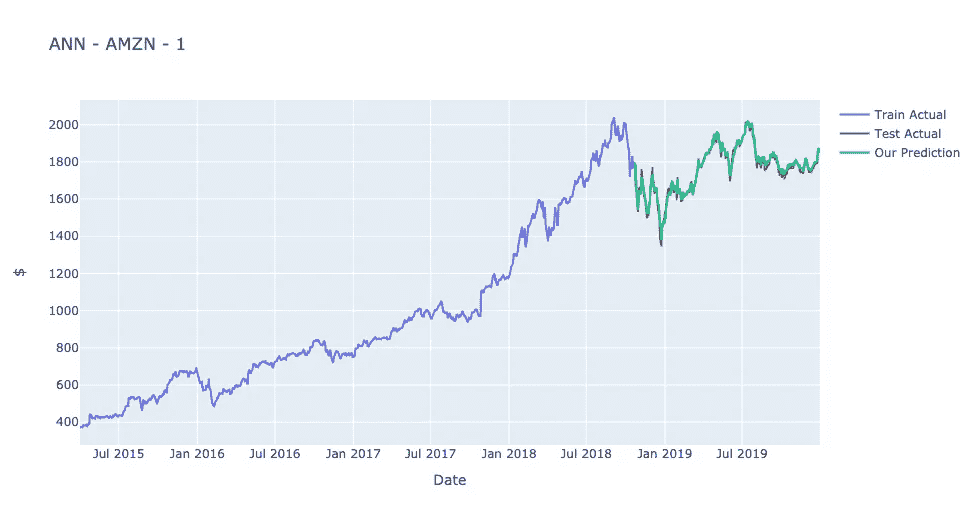

# 📈用 Python 预测股市

> 原文：<https://medium.datadriveninvestor.com/predicting-the-stock-market-with-python-bba3cf4c56ef?source=collection_archive---------1----------------------->

## 了解股票、Python 和数据科学💻

## 🤖使用机器学习来预测股票价格



Image by Author

# Python 股票预测简介

欢迎光临！非常高兴你点击了这篇关于用 Python 预测股票市场的短期课程的文章。我希望你喜欢！

本课程将教你:**股票、Python 和数据科学**。这些技能中的每一项都有可能改变你的生活；我没有夸张。每一个都极大地影响了我的生活，对你也一样。

我们将介绍如何通过 Python 中的机器学习使用历史模式来预测股票的未来价格。它将简要介绍股票，一些机器学习技术，以及 Python 中的一些通用编程。

它不会涵盖关于股票的一切，关于 Python 的一切，以及关于机器学习的一切。但这将是一个很好的学习平台。

最好的学习方法是做项目。我真心相信这一点。

做项目让你以一种保持兴趣和动力的方式学习。但是，这些项目也可以作为投资组合中的项目，向雇主展示你的经验和专业知识。

我 100%袖手旁观，这就是为什么我创造了数据 Yeti。D.A.V.E 代表数据行动验证卓越。做这个项目是一个数据行动，会验证你的优秀。



Image by Author

如果你更喜欢看视频而不是阅读，我在 [YouTube](https://www.youtube.com/playlist?list=PLo0oTKi2fPNi4VVdm8RPOpXBd4qd6zIzr) 和[我的教育网站](https://averysmith.podia.com/predict-the-stock-market-with-python)上有相关视频。

**免责声明:** *课程中表达的技术和预测仅用于一般信息目的，并不旨在为任何个人或任何特定的证券或投资产品提供具体的建议或推荐。它只是为了提供关于金融、数据科学和编程行业的教育。使用我教你的算法不会让你变得富有，但是得到的教育可能会:)*

## 成本？这门课是免费的。$0.你不需要为这个入门课程支付任何费用。我只想问，如果本课程对您有所帮助，请:

*   告诉你的朋友
*   查看我的数据科学[教育页面](https://averysmith.podia.com/)并寻找新课程
*   在 LinkedIn 上关注我

如果你希望进一步支持这个项目，我很乐意为你购买一个[“我用 Python 预测股市”贴纸](https://averysmith.podia.com/sticker-predict-the-stock-market-with-python)。每个 10 美元，把它放在你的笔记本电脑或水瓶上，这是向朋友炫耀你有多酷的好方法。所有的资金都将用于支持未来的免费课程。



Sticker Designed By Author

此外，我很乐意听到你的反馈或对你喜欢的课程的任何其他想法，请在 [LinkedIn](https://www.linkedin.com/in/averyjsmith/) 上给我发消息

# 什么是股票？

股票是一种投资，你可以通过购买来拥有公司的一部分。例如，你可以购买任何上市公司的一小部分。例如，你今天可以用不到 500 美元的价格购买 1 股特斯拉股票。

股票价格会随着时间的推移而波动和升值。目标是低买高卖。

这里有一个去年𝑇𝑆𝐿𝐴股票价格的例子:



Screenshot from Google Finance

这些公司的份额也意味着你可以对公司的一些决策进行投票，并通过被称为*股息*的季度资金分配分享部分利润

# 你可以在哪里买/卖股票？

买卖股票最简单的方法是通过网上股票经纪人。在过去，会有费用，但最近，大多数都转向了免费模式。有几个网上股票经纪人，每一个都有优点和缺点。

就我个人而言，我喜欢 Robinhood 和 Ameritrade。

罗宾汉是为普通人打造的。它简单，干净，容易跟随。它有很好的信息和内容来帮助你的交易。

最好的部分是，如果你注册，你会得到一个免费的股票，如果你使用我的参考代码。你也会帮我，因为我也会得到一份免费的股票！

请使用我的代码:[http://join.robinhood.com/averys12](http://join.robinhood.com/averys12)

**AmeriTrade:** Ameritrade 稍微高级一点，有更多的铃铛和哨子。还是挺好的。

# 预测股票和算法交易

每天都有数百万人试图玩股票市场。交易员(买卖股票的人)不断买卖股票，目的是利用价格波动获利。这种做法相对容易，可以带来惊人的回报，或者血本无归。

最近，计算能力和互联网速度的提高推动了算法交易(通过计算机交易股票)的热潮。算法交易通常使用计算机遵循一套规则和指令进行交易，希望以人类无法实现的速度和频率产生利润。算法交易占所有股票交易的 80%以上。

如果你能预见未来，知道几天后的股票价格，你就能赚很多钱，因为你知道该买还是该卖。

预测不是看到未来，但它是我们最接近的东西。

# 你能用什么来预测

虽然有相当多的选项可以用来预测股票价格是上涨还是下跌，但我们将主要关注来自最近一天表现的参数。我们将添加一些技术财务指标以及一些数据参数来增强我们的预测能力。

其他人已经使用网络抓取、地缘政治稳定性、专有财务报表、情绪分析和历史分析等东西来设计独特的算法来预测股票市场。

我们将使用:

*   最近一天的表现
*   金融技术指标
*   日期参数

# 我们从哪里获得数据？

幸运的是，股票数据实际上是最容易获得的数据集之一。我们只需要每天的“高”、“低”、“开”、“闭”。这些数据可以从几个地方获得，但是雅虎！金融在这方面做得很好。

既然我们是程序员，我们就不用只看站点获取数据，而是用 python **包**自动为我们获取。那个包叫做 [**yfinance**](https://pypi.org/project/yfinance/) ，由[冉阿让](https://aroussi.com/)创建。

这将为我们提供每天的“高”、“低”、“开”、“闭”。

# 更多数据？

有“高”和“低”是有用的，但肯定不能告诉我们未来几天价格的一切；还有其他因素要考虑。

## 日期:

日期之类的事情也可能有影响。苹果经常在秋季发布产品，这些产品的发布通常会严重影响股价。公司也有季度报告，讨论他们推动价格的运作。这些类型的日期因素在预测价格时会很有用。

## 技术财务指标:

金融指标，如动量、成交量、趋势和波动性，有助于理解股票价格。

## 这些怎么加？简单！Python 包！

# Python 是什么？

Python 是一种计算机编程语言。它是免费的。很简单。这很有趣。它非常强大。它的能力范围从处理数字，到机器学习，到网站建设，到网页抓取，到视频处理，几乎无所不包！它是我大多数应用程序的首选。

# 哪里可以得到 Python？

如果你刚刚开始，我建议你使用谷歌协作。这其实就是我用来做这个笔记本的！它已经在云上安装了 Python，不会为您带来任何麻烦！

如果你想在你自己的机器上安装它(这太棒了)，我推荐通过 [Anaconda](https://docs.anaconda.com/anaconda/install/) 安装。这是最简单的入门方式，并且会让你接触到像 [Jupyter Notebook](https://jupyter.org/) 和 [Spyder](https://www.spyder-ide.org/) 这样的环境。

# Python 库:

Python 附带了一些默认的功能，比如数学、数组管理等等，但是为了获得 Python 的全部能力，我们将依赖于被称为*包*或*库*的东西

Python 包基本上是 Python 的扩展，允许您更容易地完成某些任务。例如，有一个叫做 [matplotlib](https://matplotlib.org/) 的图形库。有图书馆做网页抓取，做网站建设，什么都有！

要将这些包添加到您的 Python 库中，您首先必须安装它们，以便在本地拥有代码。用 *pip 安装*最容易做到。

例如，如果我想要 matplotlib 库，我可以通过在终端中键入:

```
*pip install matplotlib*
```

一旦它被安装在本地，如果我想在我当前的脚本或笔记本中使用它，我必须导入。你可以像*导入【库名】*那样做，例如:

```
*import matplotlib*
```

数据可以表格形式存储在一个名为 *dataframe* 的对象中。这将是一个有用的结构。

# Python 基础知识:

*   Python 可以做像 *2+2* 这样的人，Python 会返回 4。
*   您可以通过声明 equals 子句在 python 中创建变量。如:*答案= 2+2* 。*答案*现在等于 4。
*   Python 有多种变量类型，但主要的要么是:A)数字，要么是 B)字符串(任何形式的字母)。
*   字符串通常在变量名两边用“或”表示。
*   要查看您所做的工作，*打印*功能很有用。简单的用变量代替函数，程序会打印出变量是什么。例如 *print(answer)* 会在我的控制台上记录一个 4。
*   函数是定制的模块，通常允许代码编写一次，然后在整个项目中重复使用。它们由字母 *def():* 定义。

# 什么是数据科学？

数据科学是通过使用数据改进决策的任何一种方法。



Image by Author

它通常结合数学、编程和领域来做出更好的决策以增加价值。

它包括以下内容:

*   数据分析
*   机器学习
*   自动化
*   网页抓取
*   数据可视化

数据科学家，以数据科学为职业的人，在 Glassdoor 的美国最佳工作中排名总是很高，平均工资约为 105，000 美元。

# 什么是机器学习？

机器学习是数据科学的一个分支，在这里你可以创造出*智能*算法来帮助你。他们经常做出明智的预测。

在这种情况下，我们将创建机器学习算法来预测未来几天的股票价格。

这些算法在某种程度上是自学的。它们是浏览数据和自我调整的书面指令，因此它们尽可能为你预测最好的结果。

机器学习总是基于之前的数据。你不能凭空预测。过去不能预示未来，但它是我们有根据的猜测中最好的东西。

你总是想用你的部分数据来*训练*(教导)你的模型，然后保留一点历史数据来测试你的模型，看看它做得有多好。在盲目相信结果之前，最好评估一下如果实施的话会有什么样的结果。

# 线性回归

线性回归可能是最熟悉的机器学习形式。

线性回归用于对目标变量和输入之间的关系进行量化建模。目标变量通常被称为响应变量、因变量或“y”。这些输入通常被称为预测变量，或“x”。

你可能见过简单形式的线性回归，只有一个变量:

𝑦=𝑚⋅𝑥+𝑏

其中‘m’是斜率的*，而‘b’是‘截距’。它只是描述两个变量之间关系的拟合线。*

你可以在更大的范围内这样做，而不是只有一个 x，你有多个 x。它看起来会像这样:

𝑦=𝑚1⋅𝑥1+𝑚2⋅𝑥2+𝑚3⋅𝑥3+…+𝑏

# 人工神经网络

机器学习的另一种流行形式是人工神经网络(ANN)。这些试图模仿人类大脑学习的方式，通常被称为人工智能。

神经网络的想法来自人类大脑中的生物神经元。

我们大脑中有数百万个神经元。每个人都是一个小决策者，接收信息并输出结果。一个单独的神经元从来不会做出决定，而是一个独特的分层网络，它们结合起来做出决定。

ANN 可以表示非常复杂的决策界限。这就是他们在复杂情况下处理大数据表现出色的原因。

我们将使用最普遍的 ANN 的多层感知器。它从几个节点开始，经过几层，直到在单个预测节点结束。它依赖于*激活函数*，该函数获取输入，对它们进行加权，并产生一个输出。

以下是人工神经网络的一个示例:



*Image from* [*Data Science Central Article*](https://www.datasciencecentral.com/profiles/blogs/how-to-configure-the-number-of-layers-and-nodes-in-a-neural)

# 现在我们将从代码开始

对于代码，我认为如果我使用 GitHub Gist 并使用 Google Colab 的 Gist 功能进行嵌入，会更容易。你可以看到下面所有的代码:

如果方便的话，可以在 Colab 中随意打开它！

GitHub Gist For Coding Section

因为我使用 Plotly 来制作图形，所以它们在 GitHub Gist 和 Medium 中显示得不太好。这是图应该看起来的样子，如果你在 Colab 中打开，你将能够看到它们。



Image by Author

# 未来的增强

有些股票比其他股票更难预测。如果你的算法不太好，试着选择另一只股票或时间框架。在 COVID 期间预测股票非常困难，尝试 COVID 之前的数据可能会更成功。

我们使用的模型相当简单，而且是现成的。尝试以某种方式微调它们；在人工神经网络中增加更多的层，改变激活函数等。

我们只是用前一天来做预测。如果你使用之前的 10 天，甚至是过去的 2 个月，你可能会得到更好的结果。*提示:编辑滞后功能*。

你也可以尝试做一个更复杂的模型。除了传统的多元线性回归，为什么不试试逐步回归、套索回归或岭回归呢？不要 MLP 安，试试 LSTM 型号的。或者可能使用 [TensorFlow](https://www.tensorflow.org/) 、 [Keras](https://keras.io/) 或 [Prophet](https://facebook.github.io/prophet/) 。

你可以尝试用其他股票价格来预测类似股票的价格。你也可以看看行业指数基金。

你可以用你的一生来完善这个算法。有这么多选择。要有创意。玩得开心。享受吧。

此外，你可能想挂钩一些算法到你的股票经纪人账户，这样你就可以开始算法交易。

我们将在 Python 股票交易课程的第 2 部分讨论所有这些内容！

# 谢谢你

希望这个短训班对你有帮助。

就像我在开头说的:股票、Python 和数据科学是可以改变你生活的三种技能。我真的相信他们三个。

我也希望不管你最初的技能是什么，你都喜欢用这种方式学习。项目是*最好的*学习方式，我希望你在这次经历中感受到这一点。

如果你觉得这个课程有用，并且你想看到更多类似的材料，请购买[“我预测了股市”](https://averysmith.podia.com/sticker-predict-the-stock-market-with-python)贴纸来支持这个项目和未来的项目。


Sticker by Author

请告诉你的朋友，在社交媒体上分享，并把你的贴纸放在人们可以知道你有多酷的地方。

我们罗宾汉见！:)(链接又来了[http://join.robinhood.com/averys12](http://join.robinhood.com/averys12))