# 基于 Python 的推特情感分析预测美国总统选举结果

> 原文：<https://medium.datadriveninvestor.com/predicting-us-presidential-election-using-twitter-sentiment-analysis-with-python-8affe9e9b8f?source=collection_archive---------1----------------------->

## 修订数据科学基础的有趣项目，从数据集创建到数据分析再到数据可视化


Image by Author

据《纽约时报》报道，到 2020 年 4 月，几乎所有参加总统竞选的人都退出了，现在只剩下唐纳德·特朗普和乔·拜登。所以，我做了一个小项目，试图预测这次选举的获胜者。

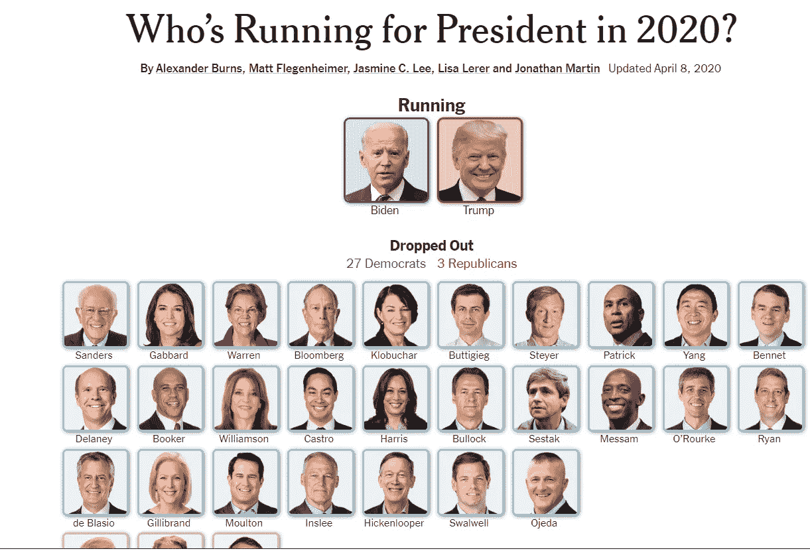

source [NYTimes](https://www.nytimes.com/interactive/2019/us/politics/2020-presidential-candidates.html)

所以，基本的想法是，我正在收集唐纳德·特朗普和乔·拜登最近推特的回复，并分析人们对他们的看法。我知道这不是分析这种情况的正确方式，因为特朗普的大量追随者会导致数据有偏差。但是我确信这个博客会教你从数据集创建到数据可视化的数据科学基础。

# 工具

*   **Python** —一种编程语言
*   **Tweepy** —一种专为 Twitter 开发的 RESTful API
*   **Textblob** —处理过的文本数据库工具(已经对大量文本数据进行了训练。)
*   **Pandas** —数据处理和分析库
*   **NumPy** —科学计算库
*   **Matplotlib** —绘图库
*   **plottly**—绘图库
*   **Seaborn** —基于 Matplotlib 的数据可视化库
*   **Wordcloud** —文本数据的可视化表示库

本文主要分为三个部分

1.  **数据集创建**
2.  **数据分析**
3.  **数据可视化**

# 第 1 部分数据集创建

在这一部分，我使用 **Python 搜集了两位跑步者的回复。**

如果你不想使用 Twitter 的 API，你也可以使用软件收集推文回复。

[](https://towardsdatascience.com/a-guide-to-scrape-tweet-replies-from-twitter-2f6168fed624) [## 从推特上收集回复的指南

### 使用 Octoparse 抓取 tweet 回复的初学者指南

towardsdatascience.com](https://towardsdatascience.com/a-guide-to-scrape-tweet-replies-from-twitter-2f6168fed624) 

如果您想使用 python 来完成，请遵循以下步骤。

**步骤 1:** 为 API 注册并创建一个 Twitter 开发者账户

[](https://developer.twitter.com/en/apply-for-access) [## 申请访问- Twitter 开发者

### 申请准入。Twitter APIs 和工具入门。所有新开发人员必须申请一个开发人员帐户…

developer.twitter.com](https://developer.twitter.com/en/apply-for-access) 

**步骤 2:** 转到 [**开发者仪表板**](https://developer.twitter.com/en/portal/dashboard) ，点击**项目和应用**，然后点击**按键图标**

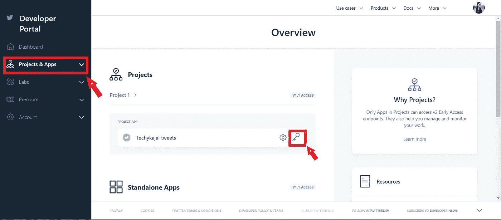

Screenshot by Author

**步骤-3:** 复制“ **API 密钥**”、“ **API 秘密**”、“**访问令牌**”、“**访问令牌秘密**”

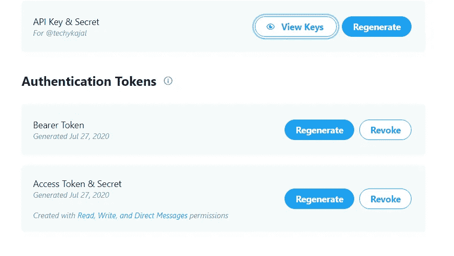

Screenshot by Author

**注意-** 保持这些密钥的安全性和私密性，消费者密钥与 API 密钥相同。

**步骤 4:** 使用 pip 包管理器下载 **Tweepy**

```
pip install tweepy
```

如果没有安装 pip，也可以克隆 GitHub 存储库。

```
git clone https://github.com/tweepy/tweepy.git
cd tweepy
python setup.py install
```

**步骤 5:** 导入 Tweepy、CSV、SSL

*   Tweepy 用于使用 python 访问 Twitter API。
*   CSV 模块用于以 CSV(逗号分隔值)格式写入抓取的表格数据。
*   SSL(安全套接字层)为客户端和服务器端的网络套接字提供了对等身份验证功能。

```
import csvimport tweepyimport ssl
```

**步骤 6:** 输入您的 Oauth 密钥

```
consumer_key = "XXXXXXXXXXXXXXXXXXXXXX"consumer_secret = "XXXXXXXXXXXXXXXXXXXXXX"access_token = "XXXXXXXXXXXXXXXXXXXXXX"access_token_secret = "XXXXXXXXXXXXXXXXXXXXXX"
```

**步骤 7:** 设置 Twitter 认证

使用**oauthandler**传递凭证以允许访问 Twitter 的 API 特性。

```
auth = tweepy.OAuthHandler(consumer_key, consumer_secret)auth.set_access_token(access_token, access_token_secret)ssl._create_default_https_context = ssl._create_unverified_contextapi = tweepy.API(auth)api = tweepy.API(auth, wait_on_rate_limit=True)
```

为了检查您的 Twitter API 是否正常工作，您可以添加:

```
user = api.me()
print (user.name)
```

它应该会在控制台中返回您的 Twitter 帐户句柄的名称。

**步骤 8:** **从特定的 Twitter 句柄抓取用户的推文**

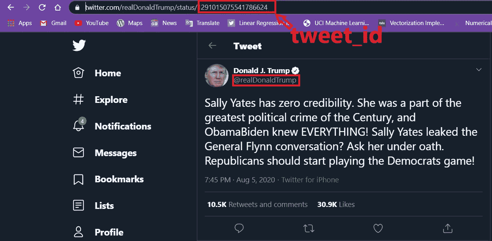

Screenshot by author

```
name = 'realDonaldTrump'tweet_id = '1291015075541786624'
```

name 是特定的 Twitter @ username，tweet_id 是 URL 中 username 后面的字符串，对于每条 tweet 都是唯一的。在这个例子中，我使用唐纳德·特朗普用户名。

**步骤 9:** 提取推文并保存到 CSV 文件中

我收集了 1000 条他最近的推特回复。您可以根据需要更改项目的值。

如果您想进一步定制您的搜索，您可以在此处查看 tweepy [的 API 文档中提供的其余搜索参数。](https://tweepy.readthedocs.io/en/latest/api.html#API.search)

这就是你的数据在抓取后在 excel 表格中的样子。

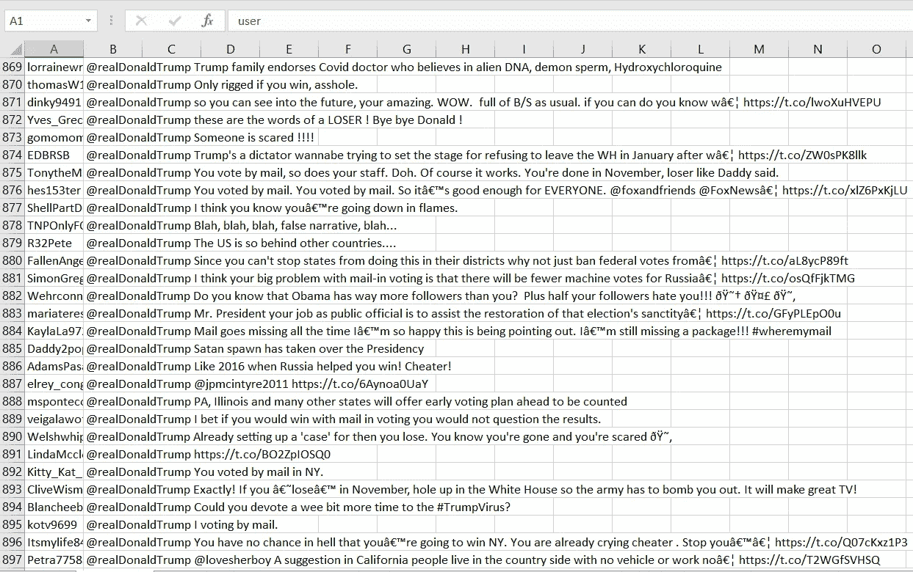

以类似的方式，您也可以为 Joe Biden 的推文回复创建数据。

# 完整代码

# 第 2 部分:数据分析

因为我们的主要任务是获取数据集。现在，我们的下一个任务是分析数据，对没有返回任何含义的文本进行清理，并应用我们的算法将文本分类为积极情绪或消极情绪。

[](https://www.datadriveninvestor.com/2020/07/07/introduction-to-time-series-forecasting-of-stock-prices-with-python/) [## 用 Python |数据驱动投资者进行股票价格时间序列预测简介

### 在这个简单的教程中，我们将看看如何将时间序列模型应用于股票价格。更具体地说，一个…

www.datadriveninvestor.com](https://www.datadriveninvestor.com/2020/07/07/introduction-to-time-series-forecasting-of-stock-prices-with-python/) 

因此，如果仔细观察我的数据集，它总共包含两个属性，只有 replies 列是我们要考虑的，另一个不会给我们的情感分析增加任何价值。在这种情况下，分析重要的属性就像吃一块蛋糕，但对于许多其他情况来说就不一样了，你可能需要找到不同属性之间的相关性来选择最重要的属性，这也被称为[特征选择](https://towardsdatascience.com/a-feature-selection-tool-for-machine-learning-in-python-b64dd23710f0)，这是一种很好的降维技术。

那我们开始游戏吧，

## 安装和导入库

## 特朗普评论

看看川普的数据集。

```
Trump_reviews.head()
```


## 拜登评论

看看拜登的数据集。

```
Biden_reviews.head()
```

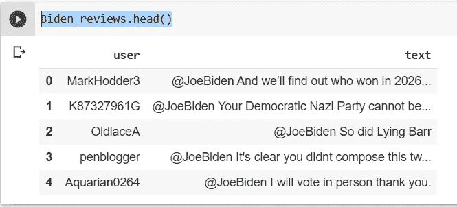

```
Trump_reviews['text'][10]
Biden_reviews['text'][500]
```

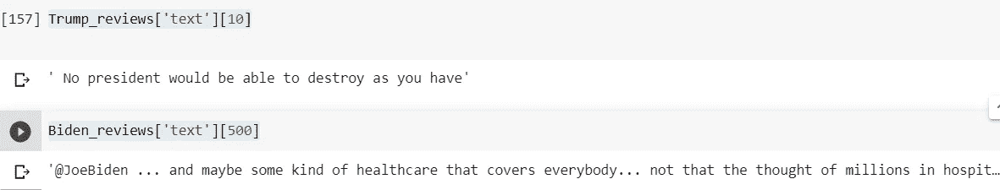

# 使用 TextBlob 的情感分析

TextBlob 是一个 python 库，提供了一个简单的 API 来访问它的方法和执行基本的 NLP 任务。在这里，我使用这个库在情感分析的基础上执行正面或负面的文本分类。

这个库就像一个 Python 字符串，具有的功能是你可以很容易地使用它的函数。它提供了一个非常酷的功能，可以很容易地总结文本，为您提供文本的情感，拼写纠正，翻译和语言检测等等…

一定要参考这篇文章来了解更多关于[的信息。](https://www.analyticsvidhya.com/blog/2018/02/natural-language-processing-for-beginners-using-textblob/)

python 中还有其他一些 NLP 库，如 Spacy、NLTK、gensim，它们也为您提供了许多处理文本数据的功能。

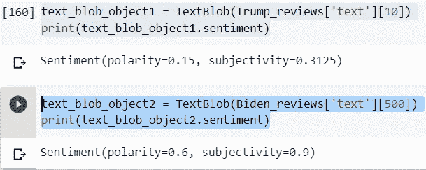

*   **极性**范围从-1 到+1(从负到正)，并告知文本是具有负面情绪还是正面情绪。极性讲述了事实信息。
*   **主观性**范围也是-1 到+1(负到正)。所以更多的主观性意味着更少的事实数据和更多的公众意见。

因此，在上面输出的第二条语句中，您可以看到主观性为 0.9，这表明第 500 行包含的文本几乎不是个人意见。

## 带有“零”极性和主观性的中性评论

在很多情况下，极性为零，因为有些数据不包含任何文本，或者只有链接或标签。因此，我们将在后续步骤中删除此类数据。

```
text_blob_object2 = TextBlob(Biden_reviews['text'][100])
print(text_blob_object2.sentiment)
```

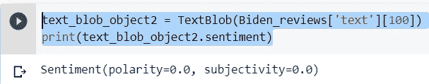

## 特朗普数据集中的情绪极性

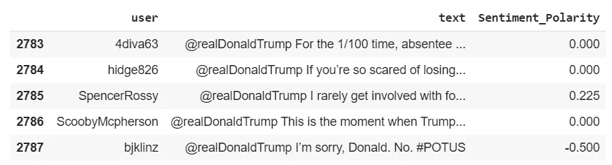

## 拜登数据集中的情感极性

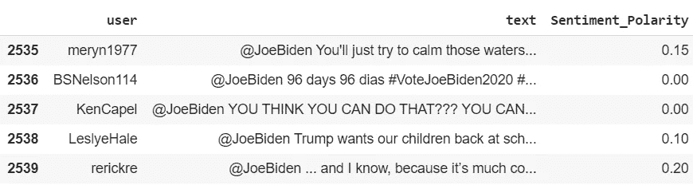

## 为表达式标签再添加一个属性

## 法宝

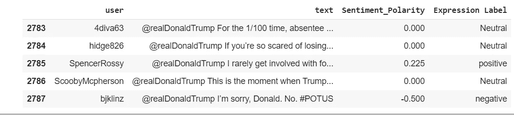

## 拜登（姓氏）

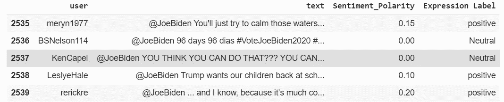

## 分析对特朗普推文的正面、负面和中立回复

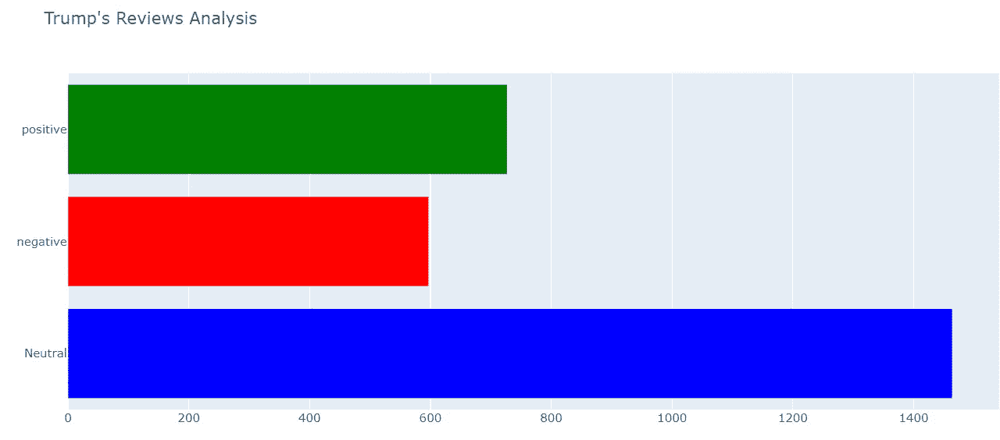

## 分析拜登推特上正面、负面和中立的回复

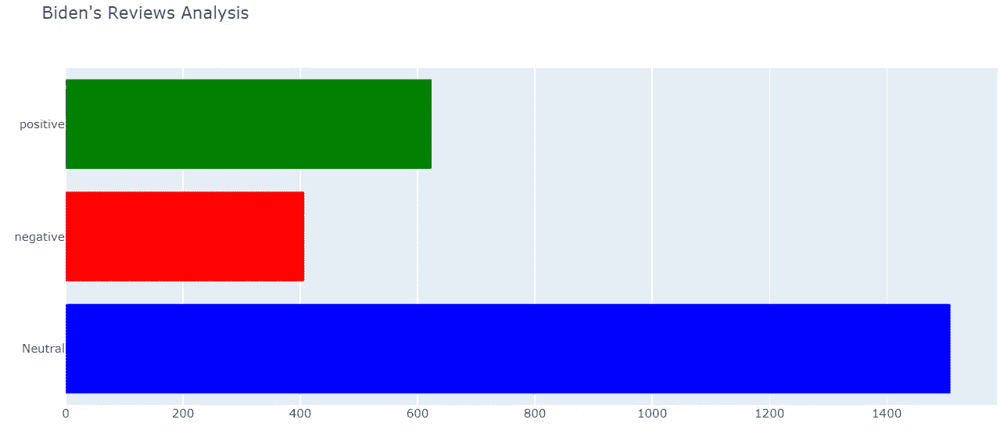

**删除 Trump 数据集中其陈述为中性且极性为“零”的所有行**

我们将删除两个数据集中极性都为中性的所有行，因为这些数据没有给出任何关于预测的见解，并且给我们的数据添加了噪声。

```
reviews1 = Trump_reviews[Trump_reviews['Sentiment_Polarity'] == 0.0000]
reviews1.shape
```

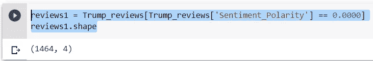

如你所见，中性语句的大小约为 1500。这是相当大的，我们将放弃他们所有的

```
cond1=Trump_reviews['Sentiment_Polarity'].isin(reviews1['Sentiment_Polarity'])
Trump_reviews.drop(Trump_reviews[cond1].index, inplace = True)
Trump_reviews.shape
```

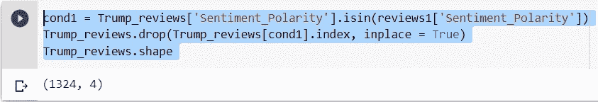

**以类似的方式，删除 Biden 数据集的所有中性行。**

```
reviews2 = Biden_reviews[Biden_reviews['Sentiment_Polarity'] == 0.0000]
reviews2.shape
```

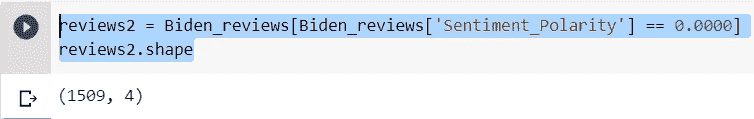

**甚至，它包含了大量对我们的分析没有贡献的中性极性。所以都放下吧。**

```
cond2=Biden_reviews['Sentiment_Polarity'].isin(reviews1['Sentiment_Polarity'])
Biden_reviews.drop(Biden_reviews[cond2].index, inplace = True)
Biden_reviews.shape
```

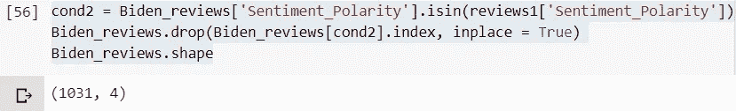

## 平衡数据集

现在，我们的下一个任务是使我们的数据集达到公平预测的平衡，为此我使用了一种随机方法。


所以，正如你从上面的图像中看到的，两个数据集现在都平衡了。

# 第 3 部分:数据可视化

可视化数据让你更清楚地了解我们实际在做什么。因此，在你的项目中，这是最重要的一步，它能让你在演示中以最简单、最容易的方式更好地理解它。此外，它在您面前框出了一幅清晰的画面，表明哪种属性对您的输出有更好的贡献。这是应用任何分析和建模之前的一个重要步骤。

在这里，我将特朗普和乔·拜登的负面推文进行比较，通过可视化来更好地了解谁将赢得这场选举。

## 唐纳德·特朗普

从下图中，人们可以很容易地理解极性范围从-1 到+1，更多的人有积极的评价，因为它主要集中在 0 到 0.5 之间。

```
sns.distplot(df_subset_trump['Sentiment_Polarity'])
```

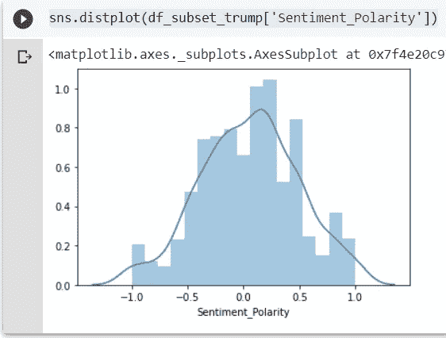

从下面的箱线图可以看出，大部分极性集中在 b/w -0.25 到 0.50 之间。所以，它基本上只显示了极性的集中。

```
sns.boxplot([df_subset_trump.Sentiment_Polarity])
plt.show()
```

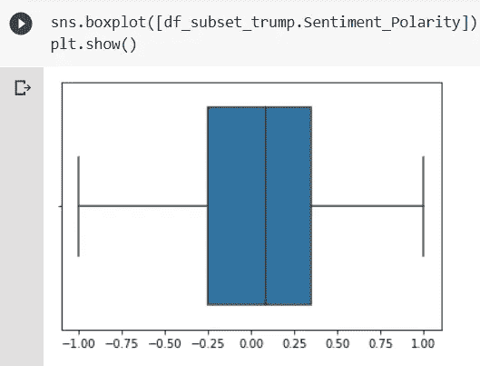

# 乔·拜登

同样，我们正在使用 seaborn 分布图分析 Biden 数据集的情感极性，seaborn 分布图适用于比较数字数据组的范围和分布。

```
sns.distplot(df_subset_biden['Sentiment_Polarity'])
```

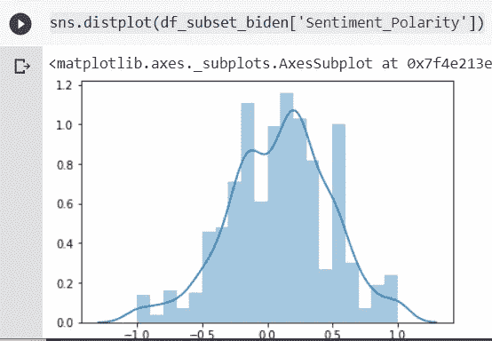

同样，我们用 boxplot 来看看拜登的数据能给我们什么样的见解。

```
sns.boxplot([df_subset_biden.Sentiment_Polarity])
plt.show()
```

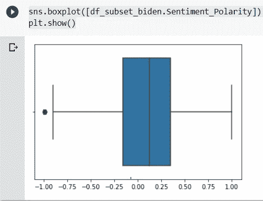

现在，我们将一起分析两个数据集评论，以获得一个清晰的画面。

## 法宝

```
count_1 = df_subset_trump.groupby('Expression Label').count()
print(count_1)
```

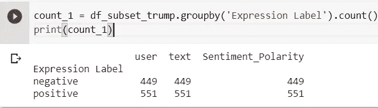

```
negative_per1 = (count_1['Sentiment_Polarity'][0]/1000)*10
positive_per1 = (count_1['Sentiment_Polarity'][1]/1000)*100
```

## 拜登（姓氏）

```
count_2 = df_subset_biden.groupby('Expression Label').count()
print(count_2)
```

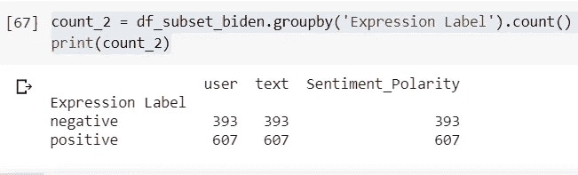

```
negative_per2 = (count_2['Sentiment_Polarity'][0]/1000)*100
positive_per2 = (count_2['Sentiment_Polarity'][1]/1000)*100
```

## 正反两方面评论的处理分析

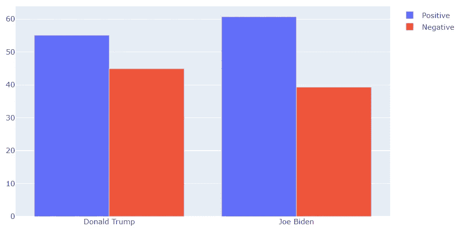

从上图中可以明显看出，与负面评价相比，乔·拜登得到的正面评价更多，而特朗普得到的两种评价都接近。等比例。

## **分析两个手柄上最肯定和最否定的回复**

你可以从下面附上的输出中得到启示，句子中有哪些关键词对极性 1 或-1 有贡献。你也可以分析这个文本情感分析器有多好。

**注-** 根据我在做这个项目时获得的见解。它没有足够的能力正确地察觉讽刺的评论。这并不奇怪，因为它对句子的标记起作用，并据此进行分类。所以，如果一个句子包含了大量的正面词，比如“最棒的”，“太棒了”，而负面评论是以讽刺的方式写的。所以，它肯定会把它归为积极情绪。

*   最终，这并不完全是它的错，因为我们人类有时也无法理解讽刺的语气。🙃

## **唐纳德·川普得到最多肯定回复**

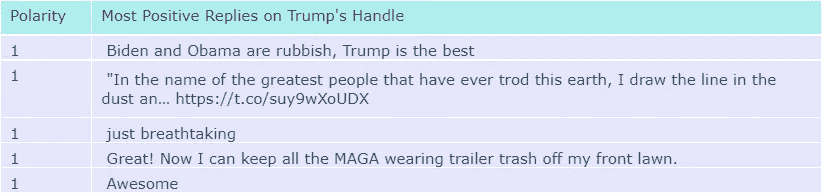

## 唐纳德·特朗普得到最多的负面回复


## 乔·拜登得到了最多的肯定回答

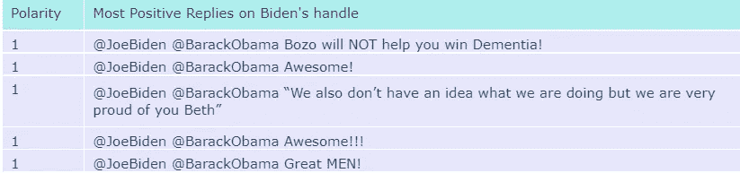

## 乔·拜登得到的负面回答最多

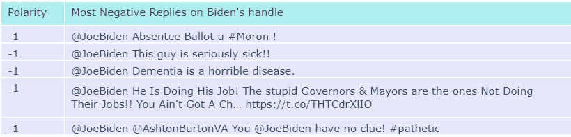

# 唐纳德·特朗普推特回复的词云

一个'**字云**'就是字复现的直观写照。这个术语在被剖析的内容中出现得越普遍，这个词在生成的图片中出现得就越大。词云逐渐被用作识别合成材料的焦点的直接设备。

**文字云**有助于发现你的客户在商业目的上的痛点，我在此用它来了解公众对他们领导的看法，以及市民反对他们领导最常用的关键词。

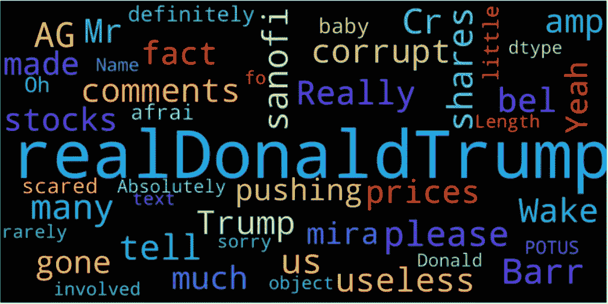

# 乔·拜登推特回复的词云

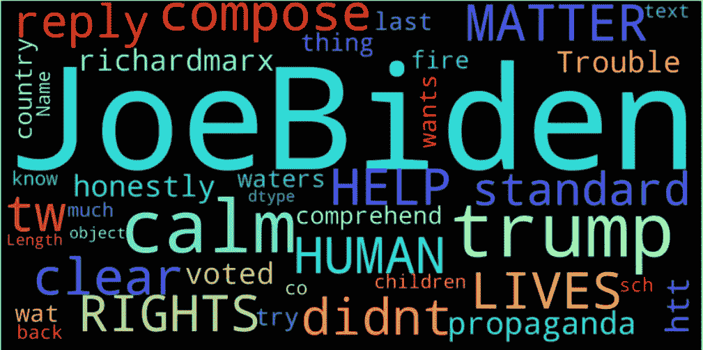

# 对两者负面评价的比较

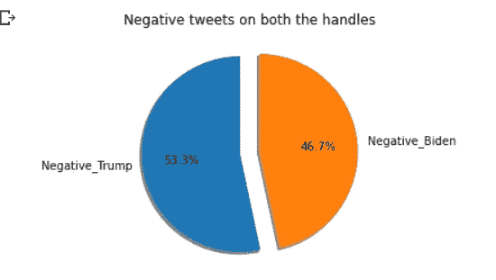

# 对两者的正面评价比较

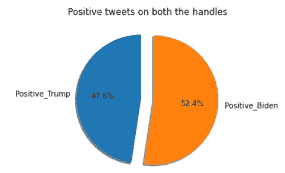

令人惊讶的是，尽管特朗普拥有大量粉丝，但拜登对特朗普的评论略多一些。在下面评论你认为这次谁会赢。

> **免责声明** —将这一最终结果视为半信半疑，因为我假设了许多假设，但从数据集创建到数据可视化，这是一个修改我的数据科学和机器学习基础的有趣项目。

完整的代码附在下面，供您进行更改和修改此代码，以更好地执行。

快乐学习✨
不断成长😊✌️

## 完整代码:

我已经公开了我的数据集，你可以从 Kaggle 下载我的数据集。

[](https://www.kaggle.com/techykajal/us-election-using-twitter-sentiment-analysis) [## 使用推特情绪分析的美国大选

### Kaggle 是世界上最大的数据科学社区，拥有强大的工具和资源来帮助您实现您的数据…

www.kaggle.com](https://www.kaggle.com/techykajal/us-election-using-twitter-sentiment-analysis) 

您可以通过以下方式联系我:

1.  订阅我的 [**YouTube 频道**](https://www.youtube.com/channel/UCdwAaZMWiRmvIBIT96ApVjw) 视频内容即将上线 [**这里**](https://www.youtube.com/channel/UCdwAaZMWiRmvIBIT96ApVjw)
2.  跟我上 [**中**](https://medium.com/@TechyKajal)
3.  在 [**LinkedIn**](http://www.linkedin.com/in/techykajal) 上连接并联系我
4.  跟随我的博客之旅:-【https://kajalyadav.com/】
5.  **成为会员:-[**https://techykajal.medium.com/membership**](https://techykajal.medium.com/membership)**

**也可以看看我的其他博客:**

**[](https://towardsdatascience.com/scraping-1000s-of-news-articles-using-10-simple-steps-d57636a49755) [## 用 10 个简单的步骤搜集 1000 篇新闻文章

### 如果你遵循这 10 个简单的步骤，使用 python 进行网络抓取是非常简单的。

towardsdatascience.com](https://towardsdatascience.com/scraping-1000s-of-news-articles-using-10-simple-steps-d57636a49755) [](https://towardsdatascience.com/8-ml-ai-projects-to-make-your-portfolio-stand-out-bfc5be94e063) [## 8 ML/AI 项目，让您的投资组合脱颖而出

### 有趣的项目想法与源代码和参考文章，也附上一些研究论文。

towardsdatascience.com](https://towardsdatascience.com/8-ml-ai-projects-to-make-your-portfolio-stand-out-bfc5be94e063) 

**访问专家视图—** [**订阅 DDI 英特尔**](https://datadriveninvestor.com/ddi-intel)**