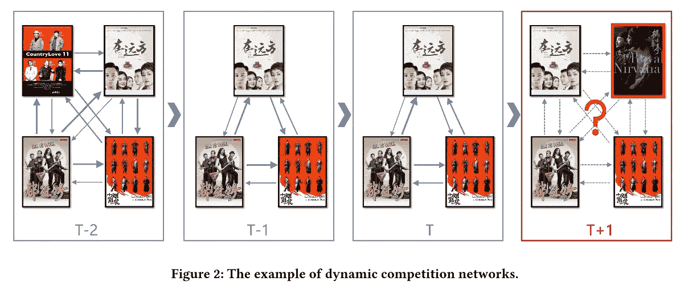
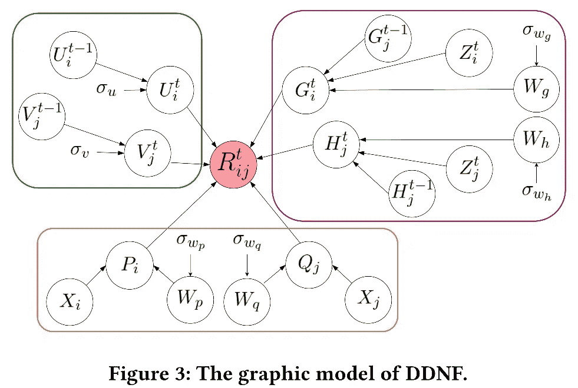
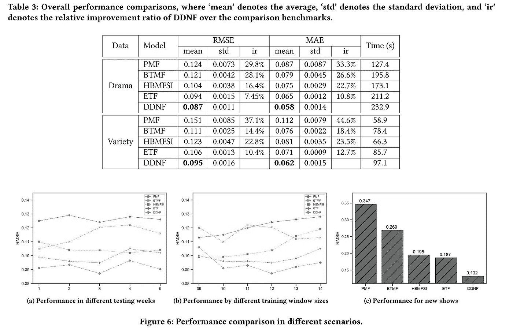

# 网络电视剧的观众竞争预测与分析

> 原文：<https://medium.datadriveninvestor.com/prediction-and-profiling-the-audience-competition-for-online-tv-series-8bef87ad74fd?source=collection_archive---------35----------------------->

*下载“*[*【KDD 论文云知识发现】*](https://resource.alibabacloud.com/whitepaper/cloud-knowledge-discovery-on-kdd-papers_2592) *”白皮书，探索 12 篇 KDD 论文和 12 位阿里巴巴专家的知识发现。*

*张鹏(金喜)、刘传仁、宁克峰(程铮)、朱文祥(恒运)、张宇(道吉)*

# 背景

目前，热门电视剧吸引了大型在线视频平台的主要流量。这对广告资源很重要。准确预测电视剧的目标观众流量，有助于优化广告效果，增加收入。然而，预测观众流量并不能回答更高层次的问题，例如一个平台未来应该购买什么电视剧。电视剧的流量和同平台电视剧之间的竞争都需要考虑，避免平台内的人气冲突。本文从竞争力的定义、算法设计和实验对比三个方面探讨了网络电视剧的观众竞争问题。

# 竞争力定义

目前，学术界对“电视剧竞争力”还没有一个明确的定义在我们研究了关于竞争力的文章后，我们提出了电视剧观众竞争的标准。首先，我们统计两部电视剧在特定时间内特定数量观众的收视记录数量。然后，我们计算两部电视剧之间收视记录数的相对占有率。最后，我们将所有用户的平均值作为“最终竞争力”

 [## 机器学习和人工智能如何改变电子商务的面貌？|数据驱动…

### 电子商务开发公司，现在，整合先进的客户体验到一个新的水平…

www.datadriveninvestor.com](https://www.datadriveninvestor.com/2020/11/19/how-machine-learning-and-artificial-intelligence-changing-the-face-of-ecommerce/) 

我们通过使用“一周”作为指定时间来计算竞争力。然后，我们定义一个竞争网络图。地图中的节点代表电视剧，而边缘代表竞争力。这个竞争网络图是动态的，随着时间而变化。我们需要预测未来网络地图中每条边的价值，这些都是电视剧之间的竞争。下图显示了一个动态竞争网络的例子。竞争网络 T-2、T-1 和 T 的时间是已知的。我们需要预测 T+1 时的竞争网络。*注:*动态竞争网络中的电视剧不是一成不变的。老电视剧可能会在大结局后消失一段时间，新电视剧可能会在首播时出现。

# 算法设计

基于上述竞争力定义，我们通过结合深度神经网络(DNN)和知识库(KB)设计了深度动态深度网络分解(DDNF)。)这个框架可以充分融合电视剧的静态和动态特征，以及竞争网络中的时间动态。因此，可以优化电视剧在动态竞争网络中的潜在因素，并利用潜在因素有效预测未来的观众竞争。该框架由三部分组成。第一部分是时间模块，即时间潜在因素。该模块利用张量分解从竞争网络中学习到的电视连续剧的潜在因素。第二部分是深度静态特征模块，静态特征的深度嵌入。该模块结合知识库和 DNN，从静态特征中提取电视剧的关系和属性信息。静态特征包括电视连续剧的介绍、主题和制片人关系。第三部分是递归动态特征模块，动态特征的递归嵌入。该模块使用长短期记忆(LSTM)网络从电视剧的动态特征中提取电视剧的动态变化。动态特征包括收视记录数、点赞数、电视剧更新状态。最后，这三个模块被组合成一个端到端的 DDNF 框架。如下图所示，绿框表示时间潜在因素，黄框表示静态特征的深度嵌入，紫框表示动态特征的递归嵌入。

# 实验比较

我们利用一个大型网络视频平台的历史数据构建了一个电视剧比赛数据集，并使用该数据集进行了实验。数据集包括电视剧子集和综艺节目子集，跨度为一年。我们还选择了经典算法概率矩阵分解(PMF)，贝叶斯时态矩阵分解(BTMF)，考虑附加信息的分层贝叶斯矩阵分解(HBMFSI)，以及结合时态和附加信息的进化张量分解(ETF)进行比较。实验结果表明，我们的算法 DDNF 在两个子集上都取得了最好的结果。DDNF 在预测新电视剧的竞争力方面也表现较好。

# 摘要

在这篇文章中，我们根据收视记录为电视剧建立了一系列动态竞争网络。然后，我们通过结合 DDN 和知识库设计了一个 DDNF。该框架能够充分整合电视剧的静态和动态特征以及竞争网络中的时间动态。因此，可以优化电视剧在动态竞争网络中的潜在因素，并利用潜在因素有效预测未来的观众竞争。预测电视剧的观众竞争对于在线视频平台管理广告销售、购买视频版权以及与其他视频服务平台竞争具有重要价值。

*本文观点仅供参考，不一定代表阿里云官方观点。*

# 原始来源:

 [## 网络电视剧的观众竞争预测与分析

### Alibaba Clouder 年 10 月 15 日 169 下载《KDD 论文云知识发现》白皮书，探索 12…

www.alibabacloud.com](https://www.alibabacloud.com/blog/prediction-and-profiling-the-audience-competition-for-online-tv-series_596751) 

## 获得专家视图— [订阅 DDI 英特尔](https://datadriveninvestor.com/ddi-intel)