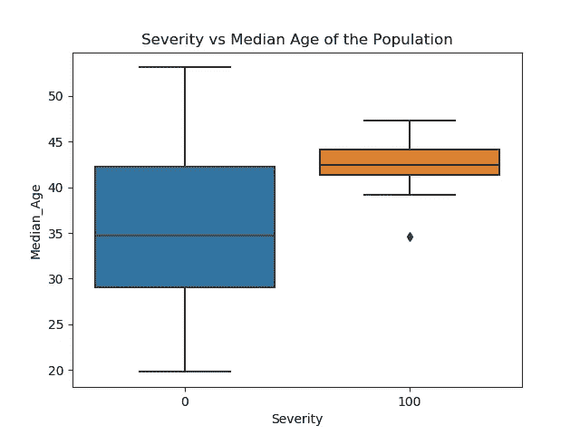
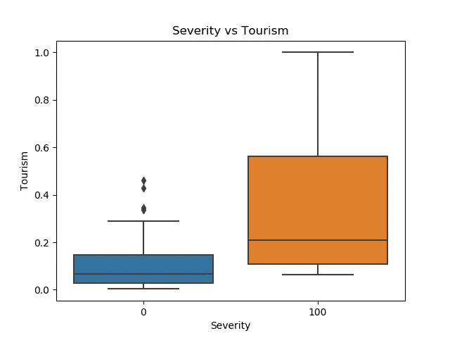
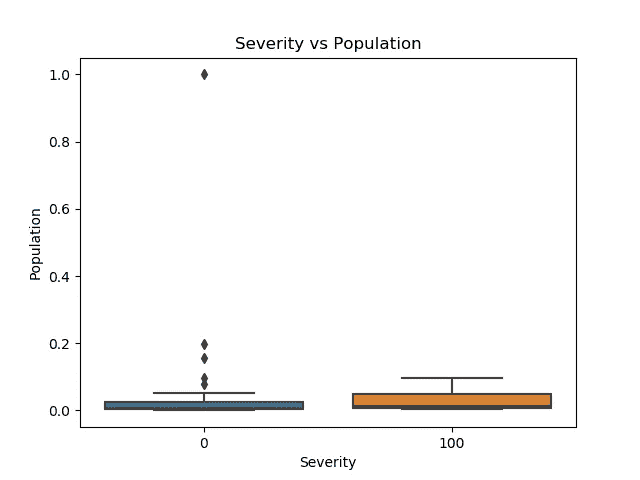
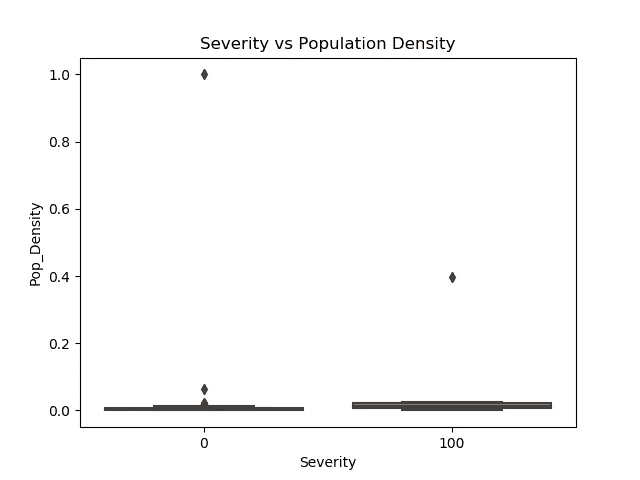
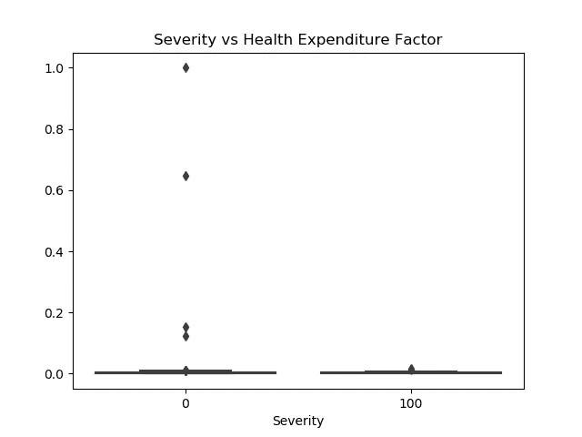
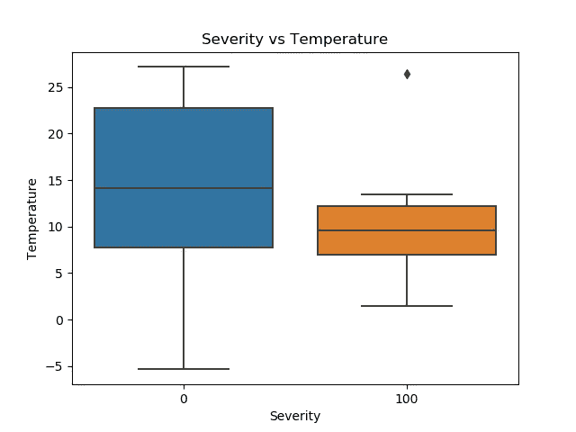
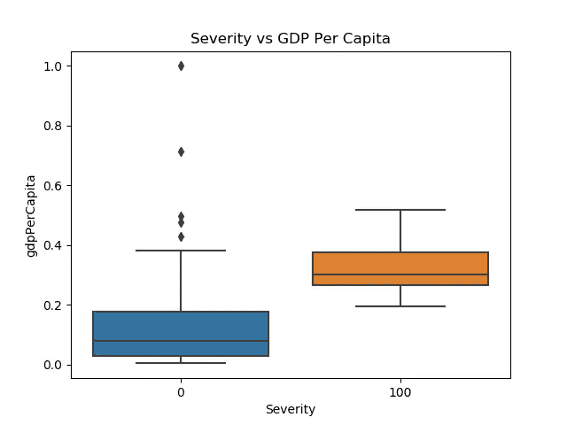

# 用数据科学分析新冠肺炎

> 原文：<https://medium.datadriveninvestor.com/predictions-about-covid-19-with-data-science-bc45c22bda5e?source=collection_archive---------5----------------------->

这项研究背后的主要动机是发现新冠肺炎病毒与几个不同参数的相关性。本分析中使用的数据来自不同的来源，在制作数据集时没有考虑来自中国的数据。数据进一步分为两个*级* : **严重性 0** 表示确诊病例数较少，**严重性 100** 表示确诊病例数较多。对于两个*类*，将每个特征分布的峰值(平均值)缩放至[0–1]后，通过运行优化方法最大化峰值(平均值)之间的距离，找到创建类之间边界的数字。最后发现边界数为 83。因此，**严重性 100** 表示病例数超过 83，**严重性 0** 表示病例数在 83 以内。

***年龄和旅游:***

大多数受新冠肺炎影响较大的国家的人口中值年龄在 40-45 岁之间，游客数量也很多。

The unit of **age** is years

Here **Tourism** is the scaled version of the number of tourists visiting a country per year

***人口和人口密度:***

无法得出恰当的结论。

Here **Population** is the scaled version of population of a country

Here **Population Density (population per sq kilometers)** of a country is also a scaled version

***健康相关支出与温度:***

*卫生支出系数*由一个国家每年的卫生相关支出除以其人口得出。大多数受新冠肺炎影响较大的国家的*卫生支出系数*值较低(我们考虑分布的尾部)。另一方面，大多数受新冠肺炎影响较大的国家都处于较低的温度范围(大约 7-15 摄氏度)，但新冠肺炎也可以在温暖的环境中传播。

Here **Normalized Health Expenditure Factor** is calculated by dividing health related expenditure of a country by its population

The unit of **Temperature** is degC

***识字与 GDP:***

大多数受新冠肺炎影响较大的国家识字率较高。与大多数受新冠肺炎影响较小的国家相比，大多数受其影响较大的国家人均国内生产总值较高。

Here **Literacy** rate is in percentage

Here **GDP per Capita** of a country is a scaled version

在这项工作中，分别分析了每个特征与新冠肺炎的相关性。但是多种因素会对新冠肺炎的传播产生共同的影响。在下一部作品中，将讨论这些特征对新冠肺炎传播的共同影响。