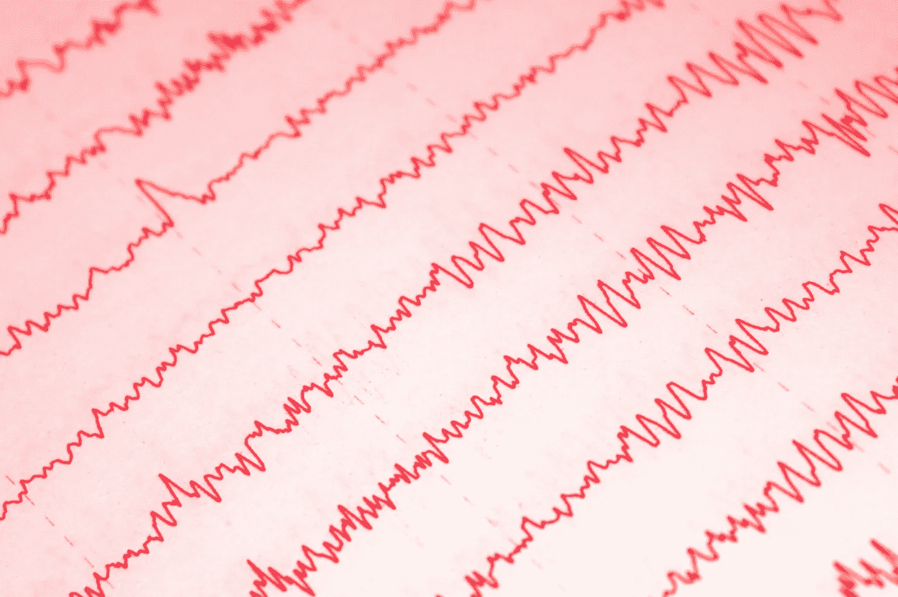
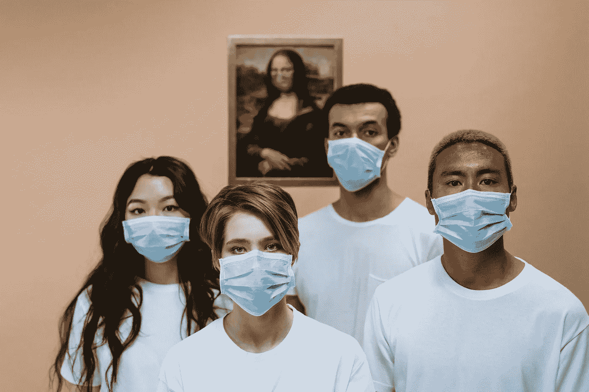

# 预测分析系列(AI):医疗保健

> 原文：<https://medium.datadriveninvestor.com/predictive-analytics-series-ai-healthcare-61e6056e9c78?source=collection_archive---------14----------------------->

很快，

> 预测分析是一套分析当前和过去数据以做出未来预测的统计技术。

可以肯定的是，这篇文章不会用单调乏味的统计模型来折磨你，而是会更倾向于有形的东西。这种方式更有趣，因为更多没有统计数据但对预测分析感兴趣的人可以加入进来。

> 未来是关于一些事件发生的概率和可能性。预测分析的工作就是告诉我们某些事件发生的可能性有多大。

在进入医疗保健之前，先热身看看什么是超级熟悉的。

## 天气预报。

如果我们遵循我们开始这篇文章的定义——它是关于当前和过去的数据来预测未来的天气。接下来的几天和几周会是什么样子。很明显，你需要相关数据。

你有一个预测方程，其中包括某些值，如历史温度、湿度、风速、风向等。你操作的是长期的历史数据，包括周期和季节。

在天气预报中，当你有包含正确变量的工作方程时，你就能够预测明天或一周后是晴天还是下雨，预测温度和风力条件。概念很简单。

> 未来的稳定，你需要的是一个方程和大数据。数据只是喂给算法，算法喂给你答案。然而，如果数据是垃圾，你将得到垃圾答案。

## 医疗保健是你在这里的原因。

首先要提到的是行业。它有自己的流程和效率水平。预测分析可以提升它。对现实世界问题分析、可视化和解决的需求也在增加。

> 也就是说，医疗保健有其记录，可以数字化，因此量化。例如，你的医疗记录有可能成为数据，为算法提供相关答案。你关心的答案。

 [## AI 和医学影像创业公司？6 大趋势|数据驱动的投资者

### “IBM Watson 健康成像”是医疗保健的未来吗？谷歌详细说明了人工智能对胸部 x 光的分类…

www.datadriveninvestor.com](https://www.datadriveninvestor.com/2020/08/30/ai-and-medical-imaging-startups-6-key-trends/) 

## 然后令人毛骨悚然的部分出来了。

因为它可能会给出你不喜欢的预测。

> 例如，如果你是 42 岁的男性，你可能会在 5 年内因为一个非常具体的原因而死亡，预测分析会发现这个原因，但医生不会。

作为比较，如果病人死于癌症，医生可以说他或她死于癌症。没什么复杂的，因为它已经发生了。然而，如果你把一个健康的 42 岁的人的数据输入算法，预测者会说，只剩下几年了。它涉及未来可能发生的事情。有 69%左右的信心，即使这个人现在是健康的。

> 那是令人毛骨悚然的部分。因为你现在知道未来。但是，根据预测算法，您可以将其视为高级诊断。当算法找到死亡的潜在原因时，你可以改变通向那里的路径，延长人类的寿命。

> 简单地说，如果你想让你的手停止流血，就把刀拿开，不要再刺它了。因为刺伤会导致出血。以类似的方式，你改变路径来阻止某些结果。

毕竟，预测分析是基于概率的。对它持保留态度，因为未来和现在一样不稳定，所以也不能 100%正确预测。因为区分伟大、一般和糟糕算法的是准确性。例如，如果你看到一个超重的人过着平静的生活，不运动，消耗的热量比燃烧的热量多，不做脑力或社会工作，那么就会导致严重的状况。你可以从常识中得出结论。

但是预测性是什么呢？是 32%、54%还是 76%？统计可能性是预测分析的强弱之处。

## 因此，预测分析可以取代基于机器的心理过程。

当你这样做时，更好的决策在医疗保健行业非常有效。挖掘数据和预测有助于准确处理伤害、疾病或感染。某些医生现在就这么做。但是机器很快也能做得一样好或者更好。

> 预测分析可以成为覆盖人类死亡率的无限可能性的最高引擎。积极或消极取决于哪种类型的道德规范控制着算法。

## 我们讨论了诊断，但还不止这些。

谈到医疗保健行业的组织效率，预测分析也很有用。

***它将根据数据提供见解，以优化员工水平。***

例如，在某些时候现场工作人员不要太多或太少。所以通过这种方式，可以让人更有生产力。并防止工作过度或无人需要照顾时的职业疲劳或厌倦。预测分析可以很好地管理比率，使组织方面更有效率。

***它将协助员工招聘过程。***

我们必须熟悉人类判断的主观方面。这通常是决定是否为这些角色聘用人员的一个影响因素。预测分析可以检测技能占主导地位的程度、过去的历史、个人特质等。用人单位往往看的是技能和工作经验。在此基础上，他们预测候选人的表现。假设预测分析是这样的，但至少好 10 或 100 倍。

***它会更好的开出药方。***

有许多好的药物处方有助于处理医疗状况。与此同时，一些不太有效的药方也让情况变得更糟。一个好的预测分析可以提供一些基于大数据的未来见解，即如果给患者开一种药物，它会是什么样子。当场。一个开药的人用他长期的教育、训练和经验作为后盾。然而，这种“数据”不足以与大数据竞争，大数据可以产生类似或更好的结果。这可以更好地改善药物处方实践，使整个社会更加健康。

## 这是暂时的。

算法可以像人一样被偏执。你教算法预测，人类是老师。试想一下，人类未来的预测错了多少次。计算机程序可以做类似的事情。如果你教计算机认为黑色是红色，6 是 9，哪个是错的。如果你以这种方式教它，它不会自我纠正，但对你来说是错的。如果算法能够自我纠正，你会看到向自主人工智能迈出了良好的第一步。人类需要参与进来。

如果你喜欢这篇文章或者觉得它有用，请鼓掌👏👏👏

还有，以后关注这个账号(又名我)看更多文章。你不太可能错过我发表的任何东西。

**进入专家视角—** [**订阅 DDI 英特尔**](https://datadriveninvestor.com/ddi-intel)