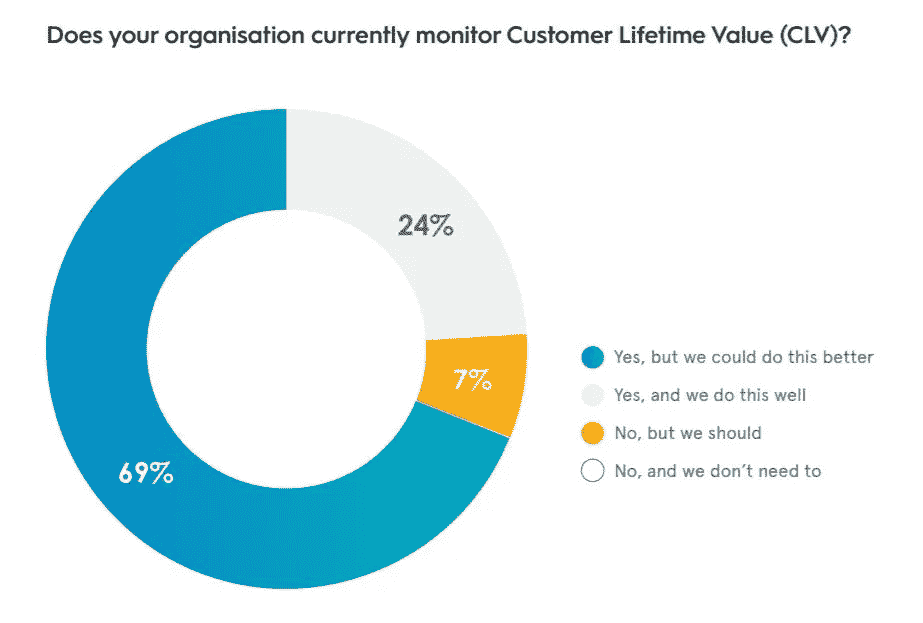
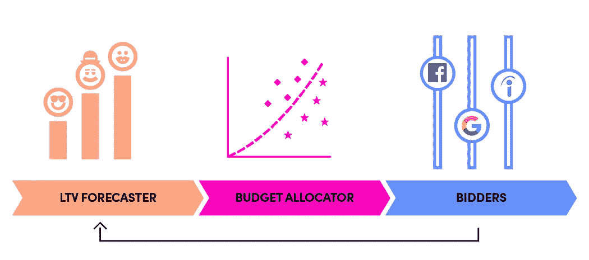

# 预测性 LTV UA 优化——这意味着什么，为什么它将很快不再只是一个大品牌游戏？

> 原文：<https://medium.datadriveninvestor.com/predictive-ltv-ua-optimization-what-does-it-mean-and-why-will-it-soon-not-be-just-a-big-brand-7d8ba25fe1b3?source=collection_archive---------6----------------------->

如果您可以在用户即将被收购时冻结时间，并根据您的历史数据预测他们的行为，会怎么样？然后你可以决定瞄准哪些用户，以什么价格，以及在任何给定的时间你可以期望什么样的回报。

这种想象中的未来不知何故已经发生了，至少对于最大的在线和移动品牌来说是这样。通过运行用户级的基于 LTV 的预测并根据预测优化普遍获得活动，它正在获得牵引力并成为标准。

基于 LTV 的优化使得大规模获取有价值的用户变得可行。在内部开发它有点像火箭科学(或者现在是量子计算？)，但随着需求的增长，端到端的外部解决方案应运而生。

我们都是奴隶

从本质上讲，ROAS 回答了一些基本的营销问题，比如“我投资 X 美元到这个营销渠道最终会得到什么回报？”。

从长期来看，这一指标比 7 天转换窗口的回报率要准确得多。衡量和优化短期结果更容易，也更安全。然而，真正的价值在于管理和对冲长期回报的风险。

你的目标是什么？这真的取决于行业，根据我在各个行业与品牌合作的经历。例如，如果你是一家 SaaS 公司，你应该把第一个月的 ROAS 定为 20%。休闲游戏占 IAP 的 2–10%。超级休闲游戏在第一周增加了 20-50%。电子商务的目标是在第一个月内达到 70–95 %,等等。

**预测 LTV 可以在不同的水平上以不同的方式进行(例如，群组对比单个用户)。这个话题应该有自己的博文，我保证你会看到的。

# 用户级的 LTV 预测就像开采钻石——艰难，但完全值得

*我们即将进入巨人之地……*

如今，这种先进的功能大多是由顶级品牌内部开发的，使用了大量(如果不是巨大的)工程和数据科学。

很快，这种重物将不再是必需的。

大多数大品牌不再依赖传统的策略，即简单地优化群体水平的预测，并做出保留/淘汰的决定。他们也不会满足于优化那些只接触到一部分目标受众的短期转化窗口。

利用他们自己的数据湖，这是他们的方法:首先，他们依靠他们自己的内部用户级数据(用户档案、购买行为、参与模式和多个第三方数据，等等)，并运行模式识别来识别模式，将他们的用户划分为长期价值和保留的桶。然后，通过一些数学、统计方法、人工智能、机器学习和其他聪明人知道的东西，他们建立了准确而有价值的 LTV 预测模型。当然，更丰富的原始数据会产生更精确的模型。

因此，每个新用户都会收到一个代表预测的分数。你可以预测他们将盈利到什么程度。由于用户也是由把他们带到你这里的活动、广告组或广告来标记的，你可以知道你的哪些活动比其他的“LTV 更好”。

直到最近，利用这种能力的方法是每隔几个小时或几天做出保留或取消的决定，转移预算并调整活动、广告系列、创意和关键词的竞价策略。这是通过汇总 pROAS(预测 roa)上的队列水平预测来实现的。这本身是只有大品牌才能实现的，它给了(并且仍然给了)他们惊人的竞争优势。然而，没有办法利用用户级别的预测，并为不同价值桶中的用户提供不同的出价。过去，如果不明确构建一个实时投标人(通常由第三方如 AppNexus 等促成的一项巨大任务)，就无法实现这一点的自动化。

今天，基于 LTV 的优化不再是一个保留或杀死运动或广告的问题。新的[脸书转换 API](https://www.facebook.com/business/help/2041148702652965) 和[谷歌的服务器端标签](https://developers.google.com/tag-manager/serverside)允许媒体购买者整合至关重要的反馈服务器端信号，如 LTV，以便基于它们优化活动(更具体和相当技术性的是，它允许品牌直接共享用户级信号，服务器到服务器，而不是通过客户端终端设备。没有它，发送用于优化目的的 LTV 分数是根本不可能的)。这项新技术允许品牌发送各种新信号——离线转换、免费试用后的时间等。更成熟的品牌可以用它来发送 LTV。

# 给大众的钻石

以上内容让我们很容易理解为什么只有少数几个标志性品牌能够在内部制造出如此巨大的机器。

但事情已经改变，技术已经发展，需求推动了新型的端到端解决方案，这些解决方案不需要任何 R&D，例如 [Voyantis](https://www.linkedin.com/company/voyantis/about/) 。

有趣的是，Criteo 说 69%的组织监控 LTV，但是他们做的没有效率。在那些成功完成工作的人中，81%的人提高了他们的表现。

当被问及主动管理和监控 LTV 时，他们列举了这些障碍:太贵、没有内部技能、太复杂。

Source: [Criteo](https://www.criteo.com/wp-content/uploads/2018/03/Criteo-UK-Commerce-Marketing-Forum.pdf)

# 恰当的例子

一个相关的例子，一家公司，我认为在衡量 LTV 方面做得非常好，可以采取行动，是 Lyft。Lyft 的增长战略侧重于持续改善用户获取流程，采用数据驱动的跨职能方法，考虑规模、可测量性和可预测性。为此，他们开发了他们所谓的“交响乐架构”，由三部分组成:终身价值(LTV)预测器、预算分配器和投标人。在这里阅读他们是如何做到的。

Source: [Lyft](https://eng.lyft.com/lyft-marketing-automation-b43b7b7537cc)

我认为，品牌，而不仅仅是最大的品牌，应该利用人工智能来优化营销和增长活动。我知道许多成长专业人士正在积极寻找可行的解决方案。

目前，太多的品牌缺乏资源和专业知识。这正是我和我的搭档决定成立 Voyantis 时的想法。

想了解更多信息，请联系我:

 [## Ido Wiesenberg -联合创始人兼首席执行官- Voyantis | LinkedIn

### 在全球最大的职业社区 LinkedIn 上查看 Ido Wiesenberg 的个人资料。我有 7 个工作列在他们的…

www.linkedin.com](https://www.linkedin.com/in/idofrido/)  [## 成长团队的超能力

voyantis.ai](https://voyantis.ai/)