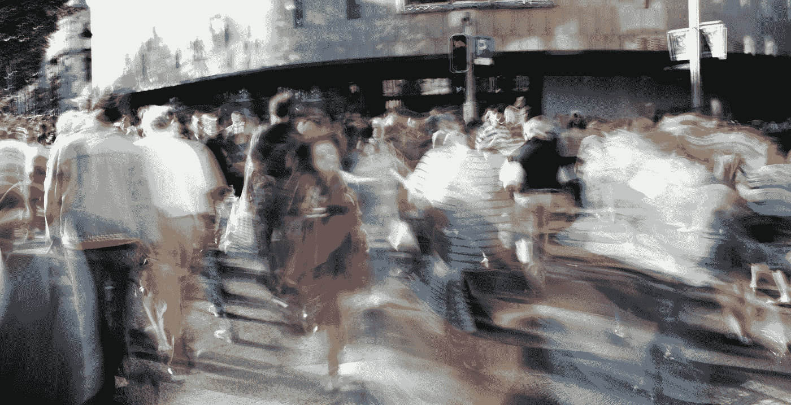
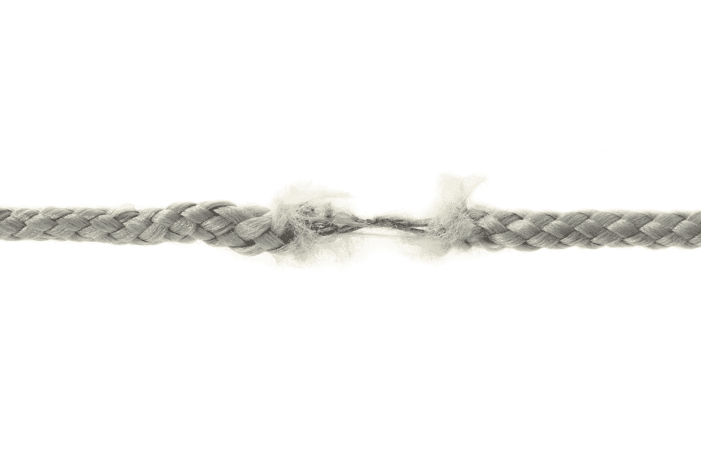

# 假装我们活着并不能让我们活着

> 原文：<https://medium.datadriveninvestor.com/pretending-that-we-live-doesnt-make-us-alive-875796d5a50a?source=collection_archive---------29----------------------->

前几天，我接到我嫂子打来的一个令人不安的电话…我肯定没有准备好这么长的演讲，关于她对我 17 岁的侄女，她的女儿的行为的关注。奇怪的是，她从来没有抱怨过我的侄女不知道她想要什么，懒惰，没有激情，没有信心，我们应该做点什么。也许，找一个心理学家，向她解释生活中你应该有目标，知道并清楚地明白你想要得到什么，而不是像一个迷失的灵魂一样浪费时间四处游荡…

我发现自己在想她是在描述我…我想说有些时候我确实知道自己想要什么，我确实有激情，也许有时候不是那么强烈，但是…

当她停止说话时，我只有一个问题要问她:

你为什么假装知道事情？

但是我没有勇气去问…

我有一个评论

有些人的自信很可能是一种无知…

但这救不了我们，所以我只是答应和我侄女谈谈。

于是，在一个清新的冬日，我遇到了我亲爱的小家伙。她难过吗？我们默默地走了大约 10 分钟，不时看着对方。我们俩都没敢先提问…

我正试图想出一个最合理的答案，她说:

“我不认为我需要心理学家”

“但是谁让你相信你需要一个？”，我试图假装惊讶。

她用那双“我知道，你知道”的眼睛看了我一眼，深深地叹了口气。

我们走近一个湖，她开始把她的鞋子挖进沙子里…速度如此之快，看起来这个洞很快就能覆盖她的整个身体，也许我们两个。

“我不知道如何和我的母亲说话，她让我生气，她要求答案，她假装什么都知道……而我，我……不知道”，她最后说。

“我也是……这很难承认，但我经常不知道该做什么，尽管有时假装是专家……我对别人隐瞒痛苦和尴尬的经历，但也对自己隐瞒……不要问我为什么——我不知道……但我们可以试着公开谈论迷失的真实感受”，我回答道。

然后我们聊了起来，我没有试图找到合适的词…我没有隐藏我的感受是多么脆弱，我的生活是多么可怕和不可预测…

但是…我试图得出的结论是— **你永远不应该放弃，只是继续寻找你的答案，在途中犯你的错误…**

也许下一次和我侄女的谈话会变得非常不同。也许下次她会需要一个真正的建议，更有力的话语，实际的支持，甚至是心理学家。万一我不知道该说什么…

**我肯定知道的事情，你不可能肯定知道一切。那么为什么我们经常假装我们知道呢？**

有很多人可以承认——你学得越多，你就越意识到你实际上知道的是多么少。那些人不傻，只是不无知。你的知识中几乎不可能没有空白。假设你能感受、阅读和理解你遇到的任何人，更重要的是你自己，这是非常奇怪的。

但是有些人缺乏这种意识。他们似乎被自己的无知所折磨，以至于他们无法承认自己可能在某个特定领域缺乏知识。这种人可能会对你、政治、基本上所有事情做出奇怪的假设……嗯，这个世界充满了万事通，他们实际上不知道自己在说什么，并试图说一句话或不同意……他们会把你生吞活剥。

不久前，在 1999 年，两位心理学家——邓宁和克鲁格进行了一项实验，他们在幽默、逻辑和语法方面对参与者进行了测试，并将实际结果与参与者自己对他们管理能力的判断进行了比较。

例如，在幽默测试中，参与者被给了一个笑话列表，并被要求以 0 到 10 的分数来判断这个笑话有多好笑。他们的回答与职业喜剧演员的评分进行了比较。

你猜到结果了吗？

在判断一个笑话是否好笑方面表现最差的参与者认为他们在这项任务中远远高于平均水平。

而在任务中表现很好的参与者认为他们比实际情况要差。

嗯，幽默是一个主观领域…但是逻辑和语法测试的结果是一样的。

现在是 21 世纪，任何话题、任何问题或斗争都不缺乏信息……你可能会期望很容易找到答案，专家意见。但这就是生活，你挖掘的信息越多，你就越清楚地看到真正的智慧是稀有的商品。

我希望更多的人考虑这些简单的至理名言:“在你假设之前，先了解事实。在你判断之前，要明白为什么。在你伤害别人之前，先感受一下。说话之前，想一想“

所以，我们可能有一个假设，然后测试这个假设，看看它是真的还是远非如此。测试一个假设难道不是完全自然的吗？

当有人不准确地假设了我们的意思，或者更糟——关于我们的一些事情，我们很少会想“也许，这是一个合理的假设。”最有可能的是，像“他们他妈的怎么了？!"

然而，我们忽略了一个事实，那就是我们也整天做出错误的假设，有大量的研究表明**我们有超过 50 %的时间是错误的。**

有时候，我们根本没有时间去思考、分析和核实事实。

有时候我们太匆忙了，以至于我们没有停下来真正倾听并试图理解。

但有时，我们只是忘记……**“每个人只是在不同的学科上无知。”**

开个玩笑，我想用这句话做个总结:“眼睛只能看到头脑准备好理解的东西。”