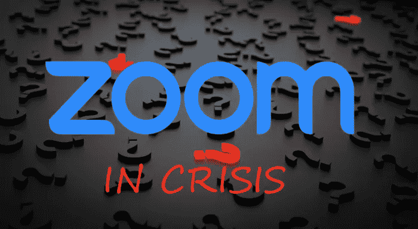

# 防止产品安全危机

> 原文：<https://medium.datadriveninvestor.com/preventing-a-product-security-crisis-23a63e739283?source=collection_archive---------22----------------------->

Zoom in Crisis

视频会议公司 Zoom 在过去几周飙升至新高，又暴跌至新低。它是少数几个完全适合被隔离行动困扰的世界的通信应用程序之一，但由于安全性、隐私性和透明度较差，它已经远远失去了吸引力。政府、大公司和用户群体要么公开批评，要么完全放弃该产品。在一个潜在增长难以想象的时代，Zoom 正在努力保持相关性，抵御竞争，并完好无损地脱颖而出。

# **避免产品信心完全丧失**

所有产品和服务公司都可以从中吸取教训，避免这种可怕的不幸。每个组织的领导层都应该进行反思，以了解他们如何才能最好地防止这种失误，并确定他们在这种危机时刻如何应对。

Zoom 是一个电话会议平台，已被证明是可扩展的，并能有效地将团队聚集在一起进行远程协作。这是一个竞争激烈的领域，功能、上市时间、性能和可用性对成功至关重要。许多产品、服务和企业都是如此。通常在这样的环境中，管理层拥有一个锐利的竞争焦点，这意味着尽快将产品和新功能推向市场。

 [## 以太坊、Tron & Ripple 会为加密之春铺平道路吗？数据驱动的投资者

### 作为交易者、投资者或只是对密码感兴趣的人，你可能喜欢也可能不喜欢的一件事是如何交织在一起的…

www.datadriveninvestor.com](https://www.datadriveninvestor.com/2019/02/27/will-ethereum-tron-ripple-pave-the-way-for-a-crypto-spring/) 

如此狭隘的关注是有代价的。营销信息的准确性可能会被忽略。文档质量经常被牺牲。更重要的是，安全性作为一种可接受的折衷方案被贬低是很常见的。这就是短视的开始。

安全是信任的基础。在疯狂的开发周期中，容易被工程师和高管视为分心的事情，可以在“以后”解决，将引入基本的弱点，随着时间的推移，这些弱点会被利用。

这就是 Zoom 的位置。该组织正感受到在产品开发期间很早以前所做决策的痛苦和混乱，现在由于他们的解决方案的快速增长和采用而出现。

出现了许多问题，使得客户、政府和股东质疑该产品的领导地位和信心。有一个隐私问题，收集用户数据，并在未经同意的情况下发送到脸书。默认设计允许骚扰事件，称为“ *Zoombombing* ”，令用户尴尬和愤怒。端到端(E2E)安全性营销声明的不准确性和不准确的隐私政策。该架构设计和代码有许多漏洞，不能保护 E2E 各方之间的会话隐私。然后是选择使用在中国的数据中心资产，他们在那里存储敏感信息，但没有通知客户谁是非常不舒服的这种配置。现在，Zoom 面临着严重且非常公开的问题，涉及对管理层安全产品承诺的信任、对用户隐私的尊重、营销的诚实性以及保持积极用户体验的设计决策。

# **从失败中学习**

这个教训很简单。Zoom 面临的所有问题都可以而且应该在它们以惊人的方式爆发之前得到解决。这对每个人来说都是关键:在开发阶段缺乏对安全和隐私的投资可能会导致灾难性的后果。每个组织都应该评估他们的 DevOps 安全计划。他们应该重新评估安全在产品设计、开发、更新和持续运营中的作用和价值。Zoom 展示了忽视适当风险管理的严重后果。他们不是第一个，但世界在变，人们对这种问题的容忍和耐心正在变得不那么宽容。Zoom 和所有其他产品公司都必须进行调整，以满足对安全性、隐私性和安全性日益增长的期望。

# **变焦怎么恢复？**

对于那些对 Zoom 应该如何解决他们在产品危机中面临的系统性问题感兴趣的人，我推荐 HelpNetSecurity 上的[***Zoom in crisis:How to response and manage product security incidents***](https://www.helpnetsecurity.com/2020/04/15/zoom-crisis/)文章，其中我分解了许多问题和解决步骤。