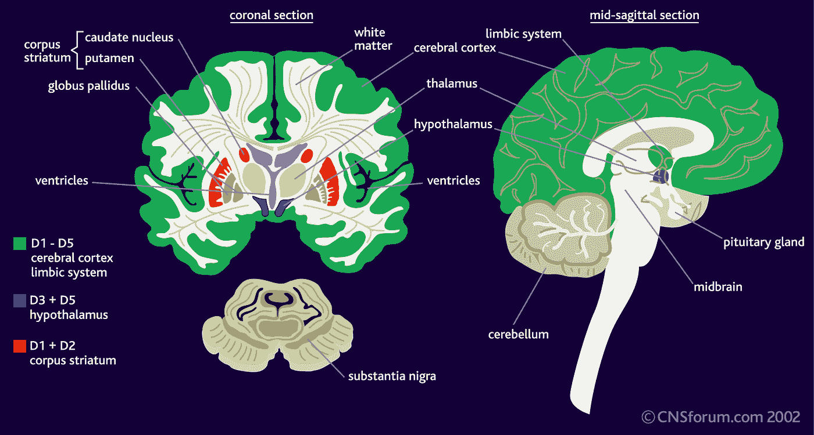
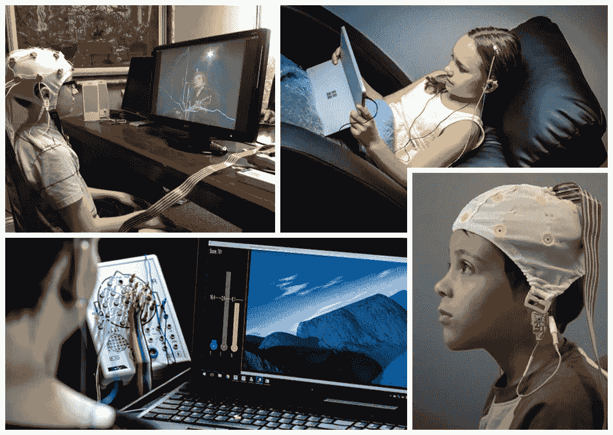

# 利用神经反馈预防进食障碍

> 原文：<https://medium.datadriveninvestor.com/preventing-eating-disorders-using-neurofeedback-50227ec2e72a?source=collection_archive---------8----------------------->

## 一种令人心痛的疾病，使数百万人的生活营养不良。但现在不是了。

一种阻止人们体重增加的疾病。

三千万 T2 人在他们生命中的每一分钟都遭受着这种疾病的折磨。

症状不明的疾病。

罪魁祸首？*神经性厌食症*。

# 神经性厌食症

*神经性厌食症*，简称厌食症，是一种导致饥饿的进食障碍。患有这种饮食失调症的人摄入的食物量非常有限。结果，他们变得营养不良，但仍然认为自己超重。他们的平均身体质量指数低于 17.5，而健康的身体质量指数为 18.5-25。患者经常变得营养不良，以至于经常住院。

9/10 的厌食症患者是女性，在美国 10 至 25 岁的女性中，大约有 1%患有厌食症。

但是厌食症意味着什么呢？

当一个人大量减少食物摄入量，导致身体质量指数显著降低，并伴有对肥胖的强烈恐惧时，这个人就被认为是厌食症患者。

但最重要的是，他们养成了奇特的饮食习惯，比如不在家人和朋友面前吃东西。

从长远来看，厌食症患者开始处理这些外国活动带来的破坏性情绪后果。

## 类型

厌食症有两种类型。其中一种与一种叫做暴食症的饮食紊乱有关，这种疾病的特征是当一个人吃了东西后故意呕吐。

另一种亚型通过严格限制食物和热量来表现自己。

## 原因

尽管厌食症症状的微小细节尚不清楚，医生们已经意识到它们是由心理、环境和社会因素造成的。

让专家们保持警觉的第二件事是，厌食症可能是无意识地试图与未解决的冲突或痛苦的童年事件达成妥协的一部分。

虽然性虐待已被证明是暴食症发展的一个因素，但它与厌食症的发展无关。

## 效果

科学家、医生和心理学家正在发现更多关于厌食症、贪食症和暴食症等饮食紊乱如何影响我们的大脑。虽然还有很多需要了解，但非常清楚的是，当患者有限制性行为时，他们的神经系统(包括大脑和神经)会受到负面影响。研究发现，饮食失调可能会导致:

*   神经递质(将信号从一根神经传递到另一根神经的化学物质)行为的中断
*   青少年在成年早期出现神经症状的风险增加
*   在厌食症状态下，大脑的某些部分会发生结构变化和异常活动
*   降低心率，这会使大脑缺氧
*   神经相关疾病，包括癫痫发作、思维混乱以及手脚麻木或奇怪的神经感觉
*   作为奖赏回路一部分的大脑区域反应减弱
*   大脑整体尺寸的缩小，包括灰质和白质
*   对大脑情感中心的不利影响可能会导致抑郁、易怒和孤独
*   难以思考、转换任务和设定优先级

## 风险

尽管医生并不完全知道厌食症的原因，但他们的研究已经得出结论，有一些因素使一个人比普通成年人面临更大的厌食症风险。其中包括:

*   较高的儿童期体重指数(基于身高和体重的体脂测量)
*   遗传和基因(饮食失调倾向于家族遗传)
*   大脑皮层和下丘脑中控制饥饿和进食的大脑化学物质的异常功能
*   性虐待或身体虐待史
*   缺乏社会或家庭的支持

## 治疗

[Credit](https://www.google.com/url?sa=i&url=https%3A%2F%2Fwww.self.com%2Fstory%2Favoiding-antidepressant-withdrawal&psig=AOvVaw1aFB0zRsmbmh3kGzAe1ncU&ust=1610772395320000&source=images&cd=vfe&ved=0CA0QjhxqFwoTCODhmPiQne4CFQAAAAAdAAAAABAD)

为了使治疗高效，它必须同时解决心理问题和身体问题。治疗团队应该包括一名心理健康专家和一名初级保健医生。

成功的治疗通常包括持续的医疗护理、常规治疗、营养咨询，有时还包括药物治疗。

虽然某些抗抑郁药有时被用于治疗厌食症，但它们并不总是 100%可靠，并且没有药物被美国食品和药物管理局批准用于治疗厌食症。

## 与大脑的关系

研究人员发现，对于那些有暴饮暴食症状的人来说，“大脑的整体尺寸缩小，与自我调节相关的区域活动减少。”

简单地说，大脑中帮助我们对欲望说“不”的部分并没有全力运转。康复不是需要更多的意志力。相反，大脑需要重新训练和更新，以做出恢复选择。

根据 Haynos 博士的说法，大脑中有两个区域必须相互交流才能产生健康的思维过程:大脑中处理*“想要”**“回报”*的一侧和驱动抑制和控制的一侧。对于饮食失调和成瘾的患者来说，大脑的这两个部分并不完全一致。研究人员发现，对于神经性贪食症患者来说，暴饮暴食的计划阶段对大脑的奖赏中枢有着强大的影响。

Brooks 等人(2012)的进一步研究报告称，厌食症患者的**自上而下的**前额皮质(大脑的思考和决策部分)增加**自下而上的**体感(身体意识；食欲)对食物图像的反应。

在大脑中，能量稳态(与进食能力直接相关)主要由下丘脑和脑干中的神经元回路控制。进食行为的奖励和动机方面是由边缘区域和大脑皮层的神经元控制的。

但是神经反馈怎么会是解决饮食失调的好方法呢？如何快速有效地做到这一点？

## 神经反馈

[Credit](https://www.google.com/url?sa=i&url=https%3A%2F%2Fmindbrainlv.com%2Fneurofeedback%2F&psig=AOvVaw0gjTIx2URyluecD68vFAHa&ust=1610772150988000&source=images&cd=vfe&ved=0CA0QjhxqFwoTCJC9h4OQne4CFQAAAAAdAAAAABAD)

简单地说，神经反馈允许我们重新思考和重新编程我们的大脑。使用正确的工具和技术，它可以帮助改善你的身心联系。它重新连接了你的身体和情绪，稳定了你的大脑。

神经反馈利用技术读取脑电波，并向大脑提供反馈，使其能够自我调节。这是一种无创、无痛的治疗方法。

神经反馈是一种基于证据的治疗方法，已被证明有助于许多与饮食失调相关的症状。一些好处包括情绪稳定、增加能量、提高清晰度和调节睡眠。

了解神经生物学对进食障碍的影响，可以保证有一个方面的治疗可以帮助解决这些大脑异常，结合传统的治疗方法，如心理治疗和药物治疗。这就是神经反馈可以在恢复健康认知和饮食行为方面发挥作用的地方。

## 神经反馈如何工作

神经反馈训练大脑平静地运作，调节神经系统，帮助那些患有饮食失调的人提高食欲意识。神经反馈触及大脑问题的根源，并治疗潜在的原因。因此，伴随的潜在疾病也得到治疗和改善，创造了全面的大脑健康。

神经反馈疗法是治疗进食障碍的有力工具，因为它涉及大脑功能的直接训练，通过这种训练，大脑学会更有效地运作。对于正在与进食障碍作斗争的人来说，神经反馈疗法可以帮助解决大脑调节障碍的主要来源。

神经反馈接收来自神经元的输入，脑电波来自附在你头上的**脑电图** **耳机**。脑电图耳机是一种用于*脑电图*的可穿戴设备，这是一种记录大脑电活动的监测方法。头戴式耳机中的脑电图传感器沿着头皮放置电极来检测神经元群的大脑活动。

它通过耳机记录并监控耳机接收到的直接连接到电脑的信号。医生和病人将能够分析脑波频率和大脑皮层中的神经元，以及它们的功能。

从那里，医生可能会建议病人“改变大脑的感觉”。例如，如果脑电波测量值为 17 赫兹，理想的脑电波为 12 赫兹，医生会给出一些建议来帮助大脑恢复健康状态。通过使用类似游戏的场景和脑电图读数，患者学习如何自我调节某些大脑过程。

在我们的例子中，病人学会控制他们的大脑，并最终将脑电波频率降低到 12 赫兹。

# 总结:神经反馈、神经性厌食症和自杀

作为这篇文章的总结，我想提到一个由研究人员和科学家完成的案例研究，它将对神经反馈的启示和未来产生重大影响！

厌食症最具毁灭性的影响之一是死亡率增加了六倍。与此相关，自杀是神经性厌食症患者最常见的死因。以上提到的这几点，就是为什么神经性厌食症这个巨大的谜团，必须尽快用最好的表现来解开。

神经性厌食症的全因死亡率是 15-24 岁女性正常死亡率的 12 倍，是住院女性精神病人研究发现的两倍多。

## 个案研究

为了监测不同严重程度的神经性厌食症患者和正常人之间的不同大脑活动，医生们使用了 **CGI-S** 量表和脑电图记录:

在每次访视时，将 **CGI-S** 、 **CGI-I** 、住院天数和 **HDRS** 评分记录在图表中。从患者病历中获得的其他信息包括主要和次要诊断、参考脑电图时的年龄、药物试验失败史以及先前和随后的住院(如果有)。

CGI-S 量表是一个七分的李克特量表。临床医生将患者疾病(在这种情况下是饮食失调)的严重程度分为 1 到 7 级，其中“1”表示“完全没有病”，“7”表示“病得最重”。 **CGI-I** 是一个类似的七分李克特量表，其中“1”表示“非常改善”，“4”表示“没有变化”，“7”表示“非常糟糕”。 **CGI-S** 和 **CGI-I** 是精神病学中广为接受的结果测量方法。 **HDRS** 是一个经过充分验证的抑郁评定量表，我们使用了 21 项版本的 **HDRS** 来评定抑郁症状，包括失眠、食欲、自杀意念和精力水平。

除了睡眠脑电图记录，最近基于定量脑电图的研究报告称，与厌食症和神经性贪食症患者相比，健康对照者的中央、顶骨、枕叶和边缘区的α-1 源**(8–9hz)**的*振幅更大。顶叶、枕叶和边缘区域的 17α-2 源**(10–12 赫兹)**显示，对照组的*振幅大于厌食症和神经性贪食症患者的*。与厌食症和神经性贪食症患者相比，以及与神经性厌食症患者相比，神经性贪食症患者颞区的α-1 源显示出更大的振幅。中枢α-1 源与患者的体重指数显著相关。*

正如你所看到的，正在进行的持续研究将帮助科学家和医生达到预防厌食症等有害疾病的目标，为更光明的未来提供一个途径。

## 个人笔记

感谢您花时间阅读这篇文章！本 [***谷歌文档***](https://docs.google.com/document/d/1EC4JJyCMhh4An6G53RBdDN_DDtHJL6pPFeyi8aEauq4/edit?usp=sharing) 上提供了所有来源。

查看我的 [**LinkedIn**](https://www.linkedin.com/in/fatimah-hussain/) ， [**Instagram**](https://www.instagram.com/fxtimxhh/?hl=en) ，关注我的 [**中**](https://medium.com/@fatimahandhussain) 。我最近发表了我的 [**个人网站**](https://fatimahhussain.com/) ，看看吧！当我写这些文章的时候，我总是付出 100%的努力和奉献，所以我希望你过得愉快！敬请关注，点击关注按钮，获取每周更新和引人入胜的文章！