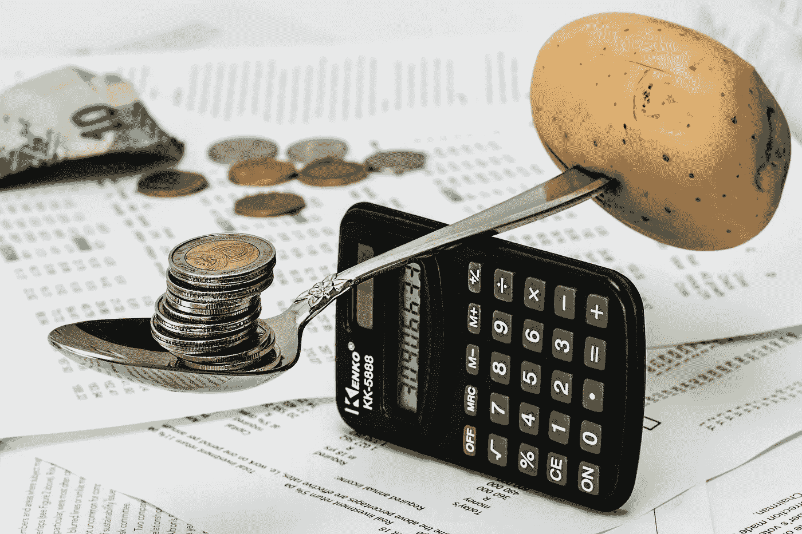

# 价格敏感度:这里是你需要知道的一切

> 原文：<https://medium.datadriveninvestor.com/price-sensitivity-heres-everything-you-need-to-know-5c42a82c7049?source=collection_archive---------23----------------------->

## 价格应该是经济中最敏感的变量。尽管在疫情的影响下经济发生了快速变化，但本轮价格波动一直很平静

Image by [Steve Buissinne](https://pixabay.com/users/stevepb-282134/?utm_source=link-attribution&utm_medium=referral&utm_campaign=image&utm_content=1015125) from [Pixabay](https://pixabay.com/?utm_source=link-attribution&utm_medium=referral&utm_campaign=image&utm_content=1015125)

# **核心观点**

**过去，当一个国家受到需求冲击时，整体价格往往会出现波动。然而，这次疫情明显不同。供给冲击的特征很明显，需求也受到了重创。供需的同时收缩使得价格下降有限。在疫情后的经济复苏过程中，供需双方也在回暖。两者同时扩张使得价格上涨相对温和。**

****从历史上看，**货币和财政刺激后，如果叠加库存仍然较低，那么全球通胀上升的概率很大，本轮可能也不例外。值得一提的是，中国在全球通胀中的作用不容忽视，尤其是如果其房地产和基础设施投资趋势是下行的，那么全球似乎很难出现明显的物价上涨。**

** [## 2021 年美国经济展望

### 回顾 2020 年，美国经济受到新冠肺炎的重创

medium.com](https://medium.com/datadriveninvestor/2021-u-s-economic-outlook-6a9800af7d4a) 

**展望未来，**随着疫情对全球经济的影响边际递减，加上各国刺激政策的持续发酵，物价攀升仍是大趋势。然而，如果没有中国房地产和基础设施投资势头的积极支持，并考虑到疫情后供应改善对价格的影响，全球和中国的整体通胀进程可能是不可言喻的强劲。

# **简介**

价格应该是经济中最敏感的变量。尽管受疫情影响后经济变化迅速，但本轮价格波动一直平静。

**比如**次贷危机期间，以 PPI 为代表的价格波动幅度近 20%，但本轮新疫情以来只有 3%。在前期全球货币和财政政策的强刺激下，未来通胀是否会回归？近期以大宗商品为代表的工业品价格快速上涨，是否预示着在经济复苏的背景下，通胀将开始加速？

由于非洲猪瘟等扰动因素的逐步消除，中国 CPI 和 PPI 有望从过去几年的分化趋势转向同步。因此，未来应更加关注具有全球定价特征的 PPI 变动及其对中国整体物价的影响。

Photo by [Mathieu Stern](https://unsplash.com/@mathieustern?utm_source=unsplash&utm_medium=referral&utm_content=creditCopyText) on [Unsplash](https://unsplash.com/s/photos/economy?utm_source=unsplash&utm_medium=referral&utm_content=creditCopyText)

# **为什么价格适中:供电能力**

过去经济冲击后，总需求大幅萎缩，供给调整相对滞后，物价伴随总需求明显下跌；经济恢复时，政策刺激后需求回升，且快于以劳动力就业为代表的供给恢复，物价上涨明显。

本轮新疫情后，供需同步收缩使得价格跌幅有限；在疫情后的修复过程中，供需双方也在恢复中，两者的同步扩张使得价格上涨相对温和。

# **为什么价格适中:需求的力量**

为了应对疫情的影响，美联储等国直接将政策利率下调至接近零的水平。美国、日本和欧洲央行的总资产增加了近 50%，这是近十年来最大的一次扩张，而且仍然没有转向的迹象。从历史上看，在货币和财政刺激下，全球需求有望持续复苏，推动价格回升。如果叠加库存处于较低水平，全球通胀上升的概率很大。这一轮可能也不例外。

> 中国在全球通胀中的作用不容忽视

中国作为世界工业产品消费大国，粗钢、铜等重要原材料的消费量占全球消费量的一半以上，石油消费增量也占到 40%以上(2019 年高达 70%)。中国以房地产基建为代表的投资势头影响着全球价格的涨跌。过去几轮通胀周期表明，如果中国房地产和基建投资趋势下降，即使海外经济明显回暖，全球物价似乎也不会大幅上涨。

 [## 新冠肺炎会议后的世界经济

### 世界经济已经从最初由疫情引起的暴跌中抬起头来，但这次复苏将是温和的…

medium.com](https://medium.com/datadriveninvestor/the-world-economy-after-covid-19-358acd70d6ca) 

**展望未来，**随着疫情对全球经济的影响边际递减，加上各国刺激政策的持续发酵，物价攀升仍是大趋势。然而，如果没有中国房地产和基础设施投资势头的积极支持，并考虑到疫情后供应改善对价格的影响，全球和中国的整体通胀进程可能是不可言喻的强劲。

初步预计，2021 年，中国全年 CPI 为 1.7%，PPI 为 1.8%。整体价格涨幅会相对温和。

Photo by [Dominik Lückmann](https://unsplash.com/@exdigy?utm_source=unsplash&utm_medium=referral&utm_content=creditCopyText) on [Unsplash](https://unsplash.com/s/photos/economy?utm_source=unsplash&utm_medium=referral&utm_content=creditCopyText)

# 基本结论

**首先**是过去一个国家受到需求冲击时，整体价格往往会出现波动。然而，这次疫情明显不同。供给冲击的特征很明显，需求也受到了重创。供需的同时收缩使得价格下降有限。在疫情后的经济复苏过程中，供需双方也在回暖。两者同时扩张使得价格上涨相对温和。

**第二，**从历史的角度来看，货币和财政刺激后，如果叠加库存维持在较低水平，全球通胀上升的概率很大，此轮可能也不例外。值得一提的是，中国在全球通胀中的作用不容忽视，尤其是如果其房地产和基础设施投资趋势是下行的，那么全球似乎很难出现明显的物价上涨。

**第三个**是展望未来。随着疫情对全球经济的影响边际递减，加上各国刺激政策的持续发酵，物价上行仍是大势所趋。然而，如果没有中国房地产和基础设施投资势头的积极支持，并考虑到疫情后供应改善对价格的影响，全球和中国的整体通胀进程可能是不可言喻的强劲。

 [## 2020 年:迄今为止最神奇的一年！

### 2020 年是近十年来最复杂最难言的一年。它带来了毁灭性的打击和灾难性的…

medium.com](https://medium.com/datadriveninvestor/2020-most-magical-year-yet-74ba3b82d174)**