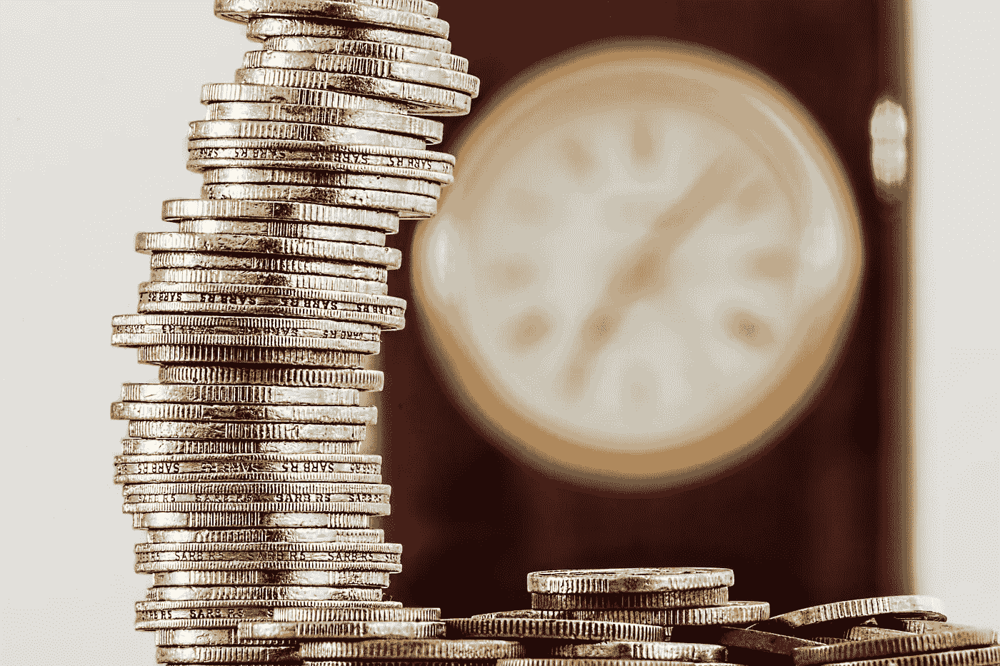
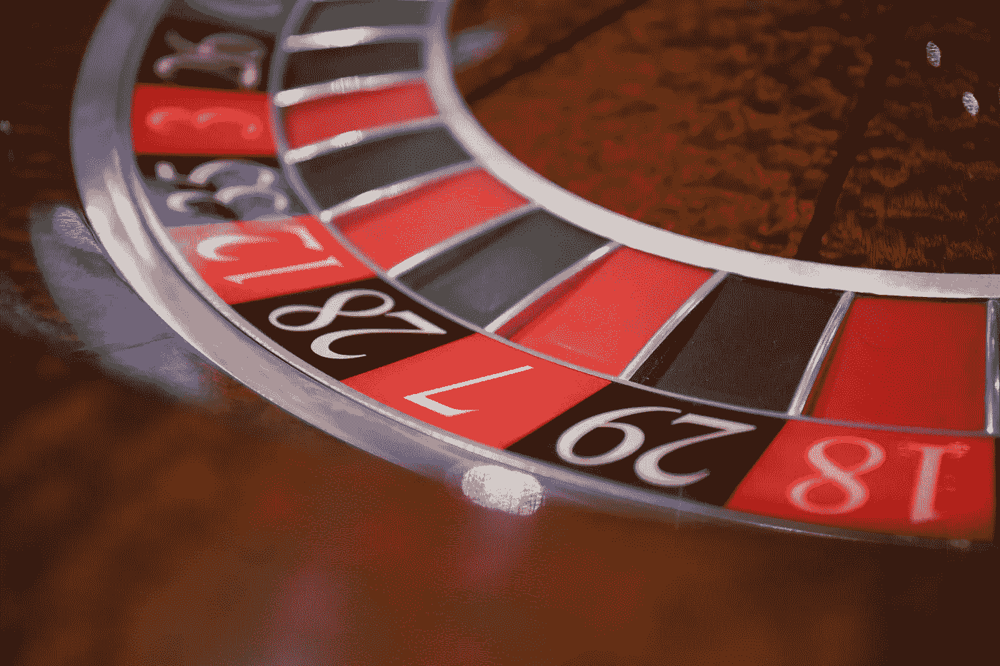

# 为什么买比特币不是投资

> 原文：<https://medium.datadriveninvestor.com/price-vs-value-whats-the-difference-anyway-20985d62bcd3?source=collection_archive---------33----------------------->

## 价格与价值——到底有什么区别？

Photo by [Worldspectrum](https://www.pexels.com/@worldspectrum?utm_content=attributionCopyText&utm_medium=referral&utm_source=pexels) from [Pexels](https://www.pexels.com/photo/black-and-red-caliper-on-gold-colored-bitcoin-1099339/?utm_content=attributionCopyText&utm_medium=referral&utm_source=pexels)

虽然一些投机者的自尊心可能受到了伤害，但在这篇文章的写作中，没有任何人受到伤害。

最近，我和一位比特币的狂热粉丝讨论了投资和投机的区别。这位粉丝坚信比特币是一种投资，因为他赚了钱(账面上)。

这个定义没有击中要害，对任何相信它的人的财富来说都是一个严重的风险。

## 投资与投机

投机者可以赚钱，有些人确实如此，就像赌场里总有赢家让人们保持兴奋和花钱一样。然而，谁会赚钱或赚多少钱还不确定，因为投机更像赌博，而不是投资。

这就是为什么投机(如赌博)不是积累财富的好计划。 太不确定，失败概率太高。

正如沃伦·巴菲特的导师本杰明·格拉哈姆在其代表作《证券分析》中所说:

> **投资操作是一种经过彻底分析后，承诺本金安全和满意回报的操作。不满足这些要求的操作是推测性的。**

比特币具有巨大的价格波动和不确定的未来，经过彻底的分析，它并不能保证本金的安全。回报是不确定的——它可能是巨大的，也可能是完全的损失。这取决于许多因素和竞争技术，这些因素和技术可能会也可能不会如粉丝所愿。

如果一个竞争对手最终主宰了市场，那该怎么办？如果政府决定禁止加密货币并将其没收会怎样？如果你中了一个骗局，失去了这份 [SEC 报告](https://www.sec.gov/investor/alerts/ia_virtualcurrencies.pdf)中标明的一切，该怎么办？

如果这项技术从未真正流行起来呢？当价格在接下来的几个月里波动 50%时，人们会用比特币购买普通的东西吗，比如一副太阳镜？

也许会，也许不会。

> 投资时，永恒的乐观和情绪需要在门口检查，否则你可能会犯下重大错误，眼睁睁地看着你的资本在你眼前蒸发。

这就是为什么买比特币是投机，不是投资。

当参与者开始忽视风险，并对像我这样提出风险的人(你友好的邻居投资者)感到愤怒时，要小心了。 ***是情绪在作怪，而不是逻辑，情绪对你的回报没有好处。***

Photo by [Samantha Hurley](https://burst.shopify.com/@lightleaksin?utm_campaign=photo_credit&utm_content=Browse+Free+HD+Images+of+Woman+Crosses+Arms+And+Legs+With+Angry+Face&utm_medium=referral&utm_source=credit) from [Burst](https://burst.shopify.com/urban-life?utm_campaign=photo_credit&utm_content=Browse+Free+HD+Images+of+Woman+Crosses+Arms+And+Legs+With+Angry+Face&utm_medium=referral&utm_source=credit)

## 你如何发现投机？

有很多方法，比如脱离基本面的快速价格上涨，把所有讨论风险的人都贴上异端邪说标签的极端乐观主义，把大增长推断到遥远的未来，等等。

识别投机性购买的最简单方法之一是询问某人资产的价值。 你能投资的一切都有内在价值。一个企业以给定的回报率为其所有者产生现金流和增长，一个投资性房地产产生可以计算的收入和增值，等等。

比特币的价值是什么？这个简单的问题难倒了粉丝，因为他们不知道如何回答。 ***这是因为比特币没有内在价值。理论上，它是一种货币——尽管由于其波动性，它是一种糟糕的货币，只能与他人交易。这依赖于投资的大傻瓜理论，你可以为某样东西支付任何价格，因为将来会有一个更大的傻瓜以更高的价格购买它。***

> 然而，在某些时候，音乐停止播放，大多数参与者没有椅子。

在我们讨论比特币的价值时，比特币爱好者的回应是“它值市场价格，不管它是什么。”这是一个常见的错误，也是一个值得讨论的错误，因为它会严重影响你积累财富的能力。

> 内在价值与当前市场价格无关，市场价格在任何一天都可能高或低。

举一个房地产危机的例子，2008 年 9 月，标准普尔 500 指数为 1279。到 3 月份，这一数字已降至 688。这 54%的下降是对房地产和金融行业一些问题的反应。美国经济在此期间并没有收缩 54%(根据[圣路易斯联储](https://fred.stlouisfed.org/series/GDP)的数据，在此期间 GDP 下降了约 4%)，因此下跌前的市场价格和下跌后的市场价格不能同时代表指数的真实价值。其中一个或两个市场价格与投资的潜在价值相差甚远。

Photo by [Kat Jayne](https://www.pexels.com/@katlovessteve?utm_content=attributionCopyText&utm_medium=referral&utm_source=pexels) from [Pexels](https://www.pexels.com/photo/adult-alone-anxious-black-and-white-568027/?utm_content=attributionCopyText&utm_medium=referral&utm_source=pexels)

投资的关键之一是了解你所购买的东西的价值，以便你能以更低的价格购买。正如巴菲特的投资伙伴查理·芒格所说:

> 所有明智的投资都是价值投资——获得比你付出的更多。为了评估股票的价值，你必须评估企业的价值。

> 如果你不知道你买的东西的价值，你怎么知道你是否在做一笔好的投资呢？

你不能。句号。

如果连比特币专家都无法得出一个比特币值多少钱(而价值不仅仅是一个价格目标)，你怎么知道自己是付出了太多还是以一个好价格得到了它？

任何资产都不是好买卖。 比特币 35k 美元值得买吗？五万美元？十万美元？50 万美元？为什么？因为你*相信*它会上涨？比特币什么时候会被高估？

如果你不能回答这些问题，那么你就不应该尝试投资 crypto 或者其他你无法量化的东西。

要了解更多关于投资而不是投机的信息，请阅读这篇文章:

 [## 如何通过投资获得成功

### 来自本杰明·格拉哈姆的永恒教训

medium.com](https://medium.com/the-innovation/how-to-find-success-with-investing-411fb59d54f8) 

## 为什么重要？

你不应该以全市价购买投资性房地产，因为这样会让你更难获利。如果你的假设是错误的，那么你可能会亏钱。 ***你需要一个*** [***安全边际***](https://www.investopedia.com/terms/m/marginofsafety.asp) ***，借此你以低于其价值的价格购买投资，以确保即使你对租金、升值、维护成本等判断错误，你也能赚钱。***

收购企业也是如此。如果你的朋友拥有一家餐馆，并提出要卖给你，你怎么知道该付多少钱？你必须考虑餐馆的盈利能力、回报率、收回投资的回收期、需要付出的努力以及拥有该资产的相关风险。竞争格局是怎样的？你非常了解卫生法规吗？你的员工成本是多少？位置好吗？

所有这些都会影响到你对餐馆的公平价值的评估。一般来说，你不会愿意支付高于这个公平价值的价格，如果你在市场上购买餐馆，你会希望找到相对于你所知的价格来说卖得好的餐馆。

这是大多数购买的常识。谁会不顾价值，去买他们能找到的最贵的车或衣服？没有人对积累财富感兴趣。

> 到处支付比物品价值更多的钱是毁灭财富的好方法，而不是创造财富的好方法。

但是在投资中，人们害怕错过已经上涨的东西，所以他们买贵的而不是便宜的。这导致了糟糕的结果，也是股市投资者整体表现不佳的一大原因。

Photo by [Pixabay](https://www.pexels.com/@pixabay?utm_content=attributionCopyText&utm_medium=referral&utm_source=pexels) from [Pexels](https://www.pexels.com/photo/silver-and-gold-coins-128867/?utm_content=attributionCopyText&utm_medium=referral&utm_source=pexels)

比特币(以及类似的“投资”)的一个主要问题是它没有内在价值。所有的货币都只值别人为它们支付的价格，这使得它们成为糟糕的投资，因为你必须试图预测未来以及人类的情感才能获得成功。

为了支持这种说法，根据德国 [ResearchGate](https://www.researchgate.net/publication/339353897_Returns_from_Investing_in_Cryptocurrency_Evidence_from_German_Individual_Investors) 在 2020 年 2 月 ***发表的研究，只有 56%受访的加密投资者有正回报*** ，而 29%有负回报，15%不亏不赚。请记住，由于买卖时机的不同，个人参与者的结果可能与基础投资相差很大。股市也是如此。

比特币和其他密码的高波动性助长了这种财富毁灭，因为当价格上下波动如此之快时，情绪会占上风。上面引用的同一项研究发现，56%的加密投资者表现不如对比特币的基础投资。

在我看来，随着密码的投机性和波动性越来越高，这些结果可能只会变得更糟。即使比特币升值，许多投资者也会亏损。

事实上，加密可能会在某个时候改变我们做生意和生活的方式，但试图在泡沫中挑选赢家并知道支付什么是输家的游戏。从 17 世纪的郁金香到 1999 年的科技股，泡沫不断增长，泡沫不断破裂。他们一直都有，也将永远有，尽管有些人拼命想让他们相信。

正如约翰·邓普顿爵士曾经说过的:

> 英语中最昂贵的四个词是“这次不一样”

要了解我如何以低于市场价值的价格购买房地产，请阅读以下内容:

 [## 积累财富的秘密

### 当我通过寻求价值购买投资性房地产时，我如何产生权益。

medium.com](https://medium.com/datadriveninvestor/the-secret-to-building-wealth-cab646114422) 

## 只有我一个人吗？

我知道炒作都是为了比特币。吹捧加密革命好处的文章太多了。

> 我是唯一一个指出潘趣酒碗里的大便的人吗？

好吧，为了支持我，下面是一些传奇投资者对加密货币的一些想法，这些投资者已经存在足够长的时间，当他们看到泡沫时，他们知道泡沫:

沃伦·巴菲特在 2020 年 2 月的一次美国消费者新闻与商业频道采访中说道:

> **“加密货币基本没有价值。除了卖给别人，你不能用它做任何事情。”**

[福布斯](https://www.forbes.com/sites/billybambrough/2020/06/25/legendary-investor-jim-rogers-warns-governments-will-have-to-eliminate-bitcoin/?sh=9075982584a0)报道称，与乔治·索罗斯(凭借货币投机赚了数十亿)共同创办量子基金的吉姆·罗杰在 2020 年 6 月表示:

> **“我相信以比特币为代表的虚拟货币会衰落，最终变为零。这是一个明显的泡沫，我不知道正确的价格。虚拟货币不是投资标的。”**

[美国消费者新闻与商业频道](https://www.cnbc.com/2018/07/18/billionaire-investor-marks-says-bitcoin-will-be-shown-not-to-have-any.html)报道称，橡树资本的亿万富翁 Howard Marks 在 2018 年的投资者会议上就比特币发表了如下言论:

> “这不是一项投资……这是一项交易，”马克斯说。“从长远来看，我认为它将被证明没有任何实质内容。”
> 
> 他说，那些购买比特币的人这么做只是“因为他们认为有人会以更高的价格从他们那里购买。”
> 
> **“不是因为他们能指定其内在的好处。不是因为他们能判断内在价值。但这只是因为他们认为价格会上涨，”马克斯说。**

Photo by [Naim Benjelloun](https://www.pexels.com/@naimbic?utm_content=attributionCopyText&utm_medium=referral&utm_source=pexels) from [Pexels](https://www.pexels.com/photo/close-up-shot-of-a-roulette-3894215/?utm_content=attributionCopyText&utm_medium=referral&utm_source=pexels)

## 投机可以吗？

任何人都不应该因为别人告诉他们而购买或不购买比特币(或任何其他资产)。每个人都要做自己的研究和思考，然后做出判断。

我甚至不反对投机比特币。如果你有足够的钱，可以承受失去全部投资，并且对加密感兴趣，那么，无论如何，继续吧。

只要知道你是在赌一个不确定的结果就可以了。如果你赢了，你就赢大了。但是赢的几率很小，所以你要做好全输的准备。

如果你真的投机比特币(或任何其他定价过高的资产，比如特斯拉——是的，我说了)，请用你财富的一小部分进行投机，而不是用你退休或孩子教育所需的钱。你更有可能失去它而不是赢得大奖，你将需要你投资的其余部分来保持你的前进。

> 富人可以进行投机，因为他们可以承受失去全部投资后仍然过着舒适的生活。
> 
> 可以吗？

我与列出的任何网站都没有关系，也没有从任何合作伙伴或我的文章推荐中赚钱。我不是律师，会计师，或注册理财规划师。所有材料都是基于我的知识和经验，出于提供信息的目的而真诚呈现的。它无意取代专业建议。在做出任何法律、税务或财务决定之前，你都应该向专家咨询。

 [## 这么说一家大型风投基金正在投资你的初创公司？4 实际考虑|数据驱动的投资者

### 首先，恭喜你。融资总是需要努力的，一个大的风险投资基金当然是一个大的…

www.datadriveninvestor.com](https://www.datadriveninvestor.com/2020/08/09/so-a-big-vc-fund-is-investing-in-your-startup-4-practical-considerations/) 

获取专家视图— [**订阅 DDI 英特尔**](https://datadriveninvestor.com/ddi-intel)