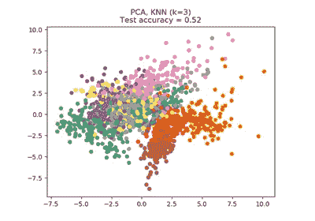
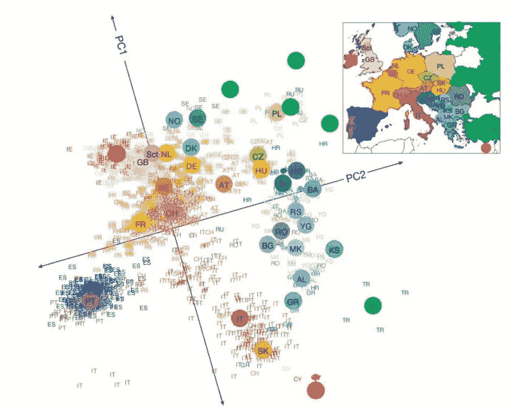

# 主成分分析

> 原文：<https://medium.datadriveninvestor.com/principal-component-analysis-pca-666f4424f798?source=collection_archive---------13----------------------->

在这个故事中，你将能够理解使用主成分分析进行降维以及它是如何工作的

# 维度的诅咒

在机器学习中，“维数”只是指数据集中的特征(即输入变量)的数量。

虽然如果我们添加额外的特征/维度，任何机器学习模型的性能都会提高，但在某些时候，进一步的插入会导致性能下降，即当特征的数量与数据集中的观察数量相当大时，一些线性算法会努力训练有效的模型。这就是所谓的“维数灾难”。

**降维**是一套技术，研究如何缩小数据的规模，同时保留最重要的信息，进一步消除维数灾难。它在分类和聚类问题中起着重要的作用。

 [## 金融行业如何受益于机器学习发展和人工智能|数据驱动的投资者

### 在快速变化的金融世界中做出正确的决定并抓住机会可以让你的…

www.datadriveninvestor.com](https://www.datadriveninvestor.com/2020/07/28/how-finance-sector-can-benefit-by-machine-learning-development-and-ai/) 

# 什么是 PCA？

PCA 是一种在数据集中提取模式的统计技术。是的，它是。你可能知道它是降维方法，是的。但实际上不止如此。PCA 简单地转换你的数据集以识别隐藏的关系、相似性或差异，然后你可以对它的输出进行降维、数据压缩或特征提取。然而，PCA 是最著名的，用于降低数据集的维度，这就是我们将在本文中做的:用 PCA 降维。

在现实世界的数据分析任务中，我们分析复杂的数据，即多维数据。我们绘制数据，并在其中找到各种模式，或者用它来训练一些机器学习模型。考虑维度的一种方式是，假设您有一个数据点 **x** ，如果我们将该数据点视为一个物理对象，那么维度仅仅是视图的基础，就像从水平轴或垂直轴观察数据时，数据位于何处。

随着数据维度的增加，对其进行可视化和计算的难度也在增加。那么，如何降低一个数据的维度-
*去掉冗余维度
*只保留最重要的维度呢

# PCA 是如何工作的？

为了通过 PCA 从原始数据集分析和构建新的数据集(维数减少),通常使用以下步骤:

1.  获取数据集
2.  计算数据的协方差矩阵

协方差矩阵只是特征(维度)的协方差矩阵。协方差是两个特征的方差；换句话说，这两个特征是如何相互区别的。当您需要从现有特征中提取新的模式或特征时，这是一条非常有用的信息。因此，作为第二步，我们需要计算数据集的协方差矩阵。由于数据中有 4 个特征，因此我们需要计算 6 个协方差和 4 个方差。

3.计算协方差矩阵的特征值和特征向量

特征值和特征向量是 PCA 的核心；不仅是 inPCA，还有 SVD，LDA。但是为什么它们如此重要呢？相关的特征值和特征向量构成矩阵方程的根特征。我将把对此的解释留给[这个](http://mathworld.wolfram.com/Eigenvalue.html)源，并将继续讨论 PCA 的特征向量和特征值的重要特征。

4.选择主成分

5.根据所选组件构建新的专题数据集

# 主成分分析的应用

*   降维
*   PCA 主要用作 [**探索性数据分析**](https://en.wikipedia.org/wiki/Exploratory_data_analysis) 和制作 [**预测模型**](https://en.wikipedia.org/wiki/Predictive_modeling) 的工具。
*   高维数据的可视化——如果我们有高维数据，可能很难绘制成 effectively.有时绘制前两个主成分可以揭示数据中有趣的几何结构。
*   寻找基本属性/变量(高维数据中的特征选择)
*   PCA 用于发现数据中的模式。
*   噪声过滤。

[https://www.ncbi.nlm.nih.gov/pmc/articles/PMC2735096/](https://www.ncbi.nlm.nih.gov/pmc/articles/PMC2735096/)

# PCA 的弱点

它很容易受到数据中异常值的影响。

为了克服这个问题，已经开发了许多健壮版本的 PCA，包括随机化 PCA、稀疏 PCA 等。

# 结论

如果你正准备开始你的机器学习，并想从头开始学习，我将制作这个关于机器学习的 5-6 分钟长的系列，并在每章的结尾做一些辅助项目，所以请保持关注，祝学习愉快

这些是我个人的研究，如果你有任何意见，请联系我。

欢迎来到我的媒体页面

[Github](https://github.com/zahrael97) ， [LinkedIn](https://www.linkedin.com/in/zahraelhamraoui97/) ， [Zahra Elhamraoui](http://zahraelhamraoui1997@gmail.com/) ， [Upwork](https://www.upwork.com/o/profiles/users/~01e52291fa456a8934/)

**进入专家视角—** [**订阅 DDI 英特尔**](https://datadriveninvestor.com/ddi-intel)