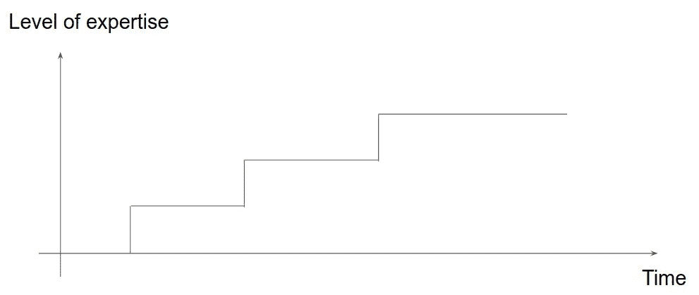
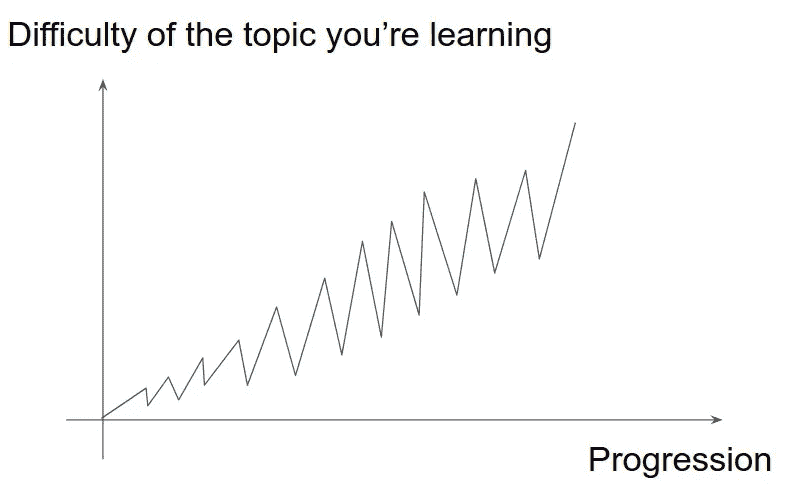

# “硬核学习”

> 原文：<https://medium.datadriveninvestor.com/principles-and-guidelines-of-hardcore-learning-b5ec93f4ce96?source=collection_archive---------7----------------------->

## 建立规则和指导方针的小小尝试

我们在这里称之为“核心学习”是一种在尽可能短的时间内有效掌握一门学科的方法。这套规则不是凭空而来的。我通过我的许多生活来使用和收集它们:在做了 10 年的木匠后成功地获得了法律学位，为学生写了一本关于数学的书，然后在一次事故后再次改变生活，成为一个小型创业公司的 CTO 建筑代码和现代 web 应用程序的架构。

在继续之前，我想澄清一下，这篇文章不会帮助一个对某个科目一无所知的学生通过考试。这可能是一个有趣的话题，但本文的重点是在长期的基础上整合知识。

让我们先研究一套建议，然后再研究方法。

# 一.一套建议

## 没有简单的方法

我马上带来坏消息:掌握一件事很难，所以快速掌握一件事更难。根据 K. Anders Ericson 的说法，一个人需要学习和练习一个科目 10.000 小时才能达到专家水平。如果你每天学习 15 个小时，这大概是 2 年的学习/练习时间。不过别担心，他说的是非常高水平的专业知识。你可能需要更少来达到你的目的。

> 从一个舒适区突破到另一个舒适区总是痛苦的，而且感觉有风险。你知道这很难，但现在这是虚拟的。它会变得真实，会有困难时期，会带来怀疑。

作为一名开发人员，我花了 1 年半的时间(平均每天 17 个小时)专业地学习和实践，才开始对自己的知识感到自信。但是在两个星期内(你可以想象 24/7)，我已经可以部署一个基本的 API 并服务于一个基本的前台。这就把我们带到了下一点。

## 知道你的目标

每个技术主题都会引出许多其他主题。每一个都和上面的一样深一样大。这意味着你应该知道你到底想要什么，你想达到什么水平。

> 在 0 和 1 之间，已经有无穷大了。同样的规则也适用于此。

## 了解你自己

这是一个重要的部分。你必须知道“直到哪里”你可以推动它。目的绝对不是打破和失去自尊或自信。你将需要

## 认识你身边的人

这也是很重要的一部分。如果你和你的妻子/丈夫或家人住在一起，他们当然为你高兴，这是毫无疑问的，但是:

*   他们不想听到你整天谈论你正在学习的所有细节。
*   打破你的舒适区也会打破他们的舒适区。因此，你必须检查他们能接受和容忍什么，你不想因此而离婚。

## 知道你能投入学习的最大限度(并且要现实一点)

这一个也是相当自明的。如果有人正常工作需要 1 年才能完成的事情，你加倍努力 6 个月就能完成。但不是每个人都能连续工作或学习 30 个小时。不过这不是问题，你只需要让它符合你的计划。

## 你会成功的

希望，只要你坚持下去，失败是不可能的。当我面对一个问题时，我有这样一句格言:“如果一个人做到了，我也能做到”，你也一样。我当然看到你来了，有很多事情我不能做，我肯定不会用 9s57 跑 100 米。但是在绝大多数情况下，我们应该相信非常努力的工作会让我们成功。

> 你需要的两样东西是时间和精力。

## 进步不会是线性的。

你可能已经知道了，但是你不会线性地进步。你将逐步进步。每一步都取决于你为此所做的努力，每一步都需要更长的时间来实现。其中一个“危险”实际上是在某个特定的步骤感到足够舒适，并停留在那里。

## 更快意味着更专注

现在有一些很棒的东西，你可以播放音频或观看视频的速度比它的常规流量更快(比如快 1.25 或 2 倍)。更快地学习一些简单的部分是很棒的，但是要小心，这需要额外的专注。

## 这样做

这篇文章不是关于停止拖延。我假设你已经足够了解自己，可以在一张纸上呆上 10/15 个小时，而不用打开 YouTube 或脸书。不过，我可以分享一个建议:

> -拖延是非常令人沮丧的，这是一个松散的交易。如果你做了你原本应该做的事情之外的事情，你只会自我感觉不好，甚至不会享受你正在做的事情。如果你处于这种情况，倒过来做:先工作一段时间，然后给自己“社交媒体”或其他东西作为奖励。这样你就不会为此感到难过，很快你甚至会对其他事情失去兴趣。
> 
> -也不要等待完美的设置。你不需要 10.000€的相机来拍摄 YouTube 上的短片，不需要 1.700€的笔记本电脑来开始编码，不需要找到完美的字体来开始写作(不过别担心，我们都经历过这些)。
> 
> -活动带来活动

# 二。规则组

## 挖深

如果你想对你所做的事情有信心，这是第一条规则:真实地学习。学习定义并理解它们。

## 总是学一些(稍微)对你来说太难的东西

这个建议是成功的关键。你应该总是学习超出你水平的东西。危险在于在一个水平上停留的时间太长。没有必要。

> 当你从一个年级转到另一个年级时，你有没有感觉到即使你没有重新学过，上一个年级还是很容易的？这里也是一样，当你学习更难的东西时，它会让你的大脑以一种新的创造性的方式使用你以前学过的东西。

## 偶尔退后一步

同样，你要遵循的进程不需要是线性的。我喜欢把它看作是一个不断向两个方向移动的过程，我总是一步一步地学习。如前所述，当你在学了很难的东西之后又学了很容易的东西，你会在更深的层次上理解它。幅度可以想多大就有多大。

> 同样的事情发生在你第 2/3 次看一部电影的时候:这是同一部电影，但是要么你注意到了你之前没有注意到的东西，要么甚至知道结局会让你对某些场景有不同的理解。

## 学习、理解、实践

你应该从第一天就开始练习。这有助于你马上理解理论背后的真正含义。你不应该回避这三种方法中的任何一种。

## 熟记于心

大脑有一些迷人的东西，如果你重复某件事足够长的时间，你会突然“突然”理解它的深层含义。人们有时甚至在镜子前做。

## 如果你忘记了，不要害怕

遗忘是这个过程的一部分。我的一位法律老师告诉我们:你必须学习东西，忘记它们，再学习，再忘记……需要多少次就学多少次。直到第三次，你才会开始记起它们。不过不要担心，随着时间、练习和专业知识的积累，它会变得容易得多。

## 使用各种策略

有些人在阅读时记忆更好，有些人在写作时记忆更好，有些人在听时记忆更好，有些人在解释时记忆更好，这样的例子不胜枚举……但有一点是肯定的，你一定要尝试使用各种策略，而不仅仅是你能适应的策略(即使这肯定是你最常用的策略)。

## 阅读文档/听播客

你应该开始倾听关于你所学主题的现状，倾听争论，即使你现在还没有完全明白。

## 把自己推向崩溃的边缘

让你的大脑达到极限是一项非常有趣的练习。有人说，如果你完全筋疲力尽或再也受不了了，学习就毫无价值。我不完全同意。这甚至可能是一个神奇的时刻，当事情被写在你大脑的更深处(我没有任何来源来证实这一点)。大脑是可塑的，你必须强行建立新的联系。我的策略是将我的大脑推向极限，然后休息。当你这样做时，你肯定会看到进步。

## 不要害怕失败

如前所述，从一个舒适区到另一个舒适区肯定感觉危险，但失败是这个过程的一部分。没有一个人是凭空冒出来的，精通一件事之前没有失败过十几次。

## 快速失败

当事情失败时，我们倾向于做得更好(除了修复它们，我们别无选择)。因此，我们经常听到的一句格言是，一个人应该快速失败:快速失败，快速学习。

## 始终保持谦虚

有时我们都觉得自己比别人强，即使他们是专家。尽管这是一个坏习惯，我们应该先怀疑自己的话，再怀疑别人的话。

> 当你问专家一个问题时，答案通常是“这很复杂”，而不是“这是神奇的解决方案”。为什么？因为他们知道这很复杂…

## 教

向某人解释比你正在向其解释的人更能帮助你。解释会迫使你用简单的词语和示范来表达和建立一个非常清晰的概念。

## 把自己放在一个不能放弃的位置上

这一条并不容易，但是如果你能处在一个负责重要事情的情况下，失败不是一个选项。然后，你将部署令人难以置信的力量和策略，使一切顺利进行。如果你是一名摄影师，找一份让你别无选择只能前进的工作，那就去拍婚礼吧

我现在剩下的就是感谢你的阅读，并祝你好运，我希望一些建议对你有用。非常感谢对主题/写作的所有反馈。