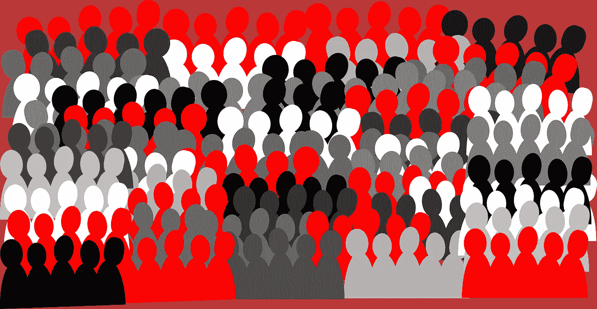

# 隐私还是匿名？

> 原文：<https://medium.datadriveninvestor.com/privacy-or-anonymity-6a5e2800985f?source=collection_archive---------7----------------------->

Image by [Clker-Free-Vector-Images](https://pixabay.com/users/Clker-Free-Vector-Images-3736/?utm_source=link-attribution&utm_medium=referral&utm_campaign=image&utm_content=307088) from [Pixabay](https://pixabay.com/?utm_source=link-attribution&utm_medium=referral&utm_campaign=image&utm_content=307088)

意识到一些安全措施是不可避免的，我们担心我们的隐私。商店保存我们购物的记录。信用卡会留下痕迹。我们给谁打了电话，谁给我们打了电话，都被记录在某个地方。安全摄像头几乎无处不在地跟着我们。最新的技术可以从人群中提取我们的面部照片，并与之前存储的照片进行比较。互联网为从地球上任何一点进行现场摄像提供了无限的可能性，也同样方便了对早期录像的回顾。随着信息技术的进步，越来越多的关于我们行踪的数据被存储在某个地方，这些数据将更容易被更多的人访问。

很糟糕吗？最近，我的朋友有一辆自行车在他公寓地下室的存放区被偷了。只有几个居民有这部分共用地下室的钥匙。如果有摄像头的话，他可以证实他的自行车是否如他所怀疑的那样被隔壁的孩子拿走了。他接受了损失，知道向警方报案很可能也无济于事。事情并不总是这样。

有人告诉我一件发生在我认识的人身上的事。让我们回到大约 90 年前，一个快速发展的工业城市郊区的一个小村庄。大多数人已经有了工厂的工作，但他们仍然保留着他们的小农场的一些零零碎碎。其中一户人家的女士养了几只母鸡，它们自由地在这个地区游荡，每晚都回到鸡舍。每天晚上，她数她的母鸡栖息。一天，她发现少了一个。她四处查看，但毫无疑问，母鸡不见了。她认为她的母鸡被一个村民偷了，这个人没有稳定的收入，被认为是小偷。她那天在附近见过他。她毫不犹豫地跑进了他的房子。她一打开门，就被一股沸腾的肉汤的香味淹没了。“你偷了我的母鸡！”—她哭了。“不，我在商店买的”——男人回答。“你在撒谎。我查过了，你没有在当地商店买，也没有去过市里”。

她正在说服那个男人。她有点虚张声势，但一个人的行踪是众所周知的，很容易核实。这名男子承认，他抓到了一只游荡到他后院的母鸡，并同意第二天做一些家务，作为对丢失母鸡的补偿。与制度化的司法系统相比，由社区事务透明度支持的一点点谈话更有利于公正。

我们听过很多这样的故事。还有很多小社区没有秘密。然而，我们大多数人住在大城镇。我们经常认不出住在我们隔壁多年的人的面孔。我们是匿名的，在店里，在街上，在电梯里，几乎无处不在。我们不识别邻居的孩子，我们的孩子知道他们是隔壁邻居的匿名面孔。我们不知道谁贫困，谁富裕。谁值得同情的帮助，谁只值得怜悯的帮助。我们不时会震惊地发现隔壁的人是小偷、变态或恐怖分子。

我们希望有更多的安全，但我们担心隐私。我们大多数人生活在大城市里，喜欢匿名，这常常被误认为是隐私。最近，无处不在的摄像头和社交媒体的透明度让我们认为是私人的东西变得公开。从上面提到的村庄或小镇的角度来看，有了新技术，一切都恢复了正常。历史做了一个完整的循环。在一个新的层面上，我们正在接近我们已经经历过的，即我们的邻居可以很容易地了解我们，我们也可以很容易地了解他们。我们是失去了隐私，还是失去了匿名性？