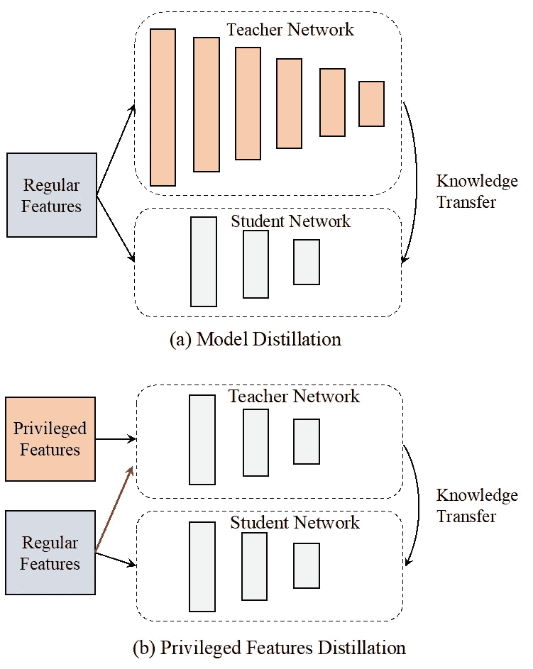
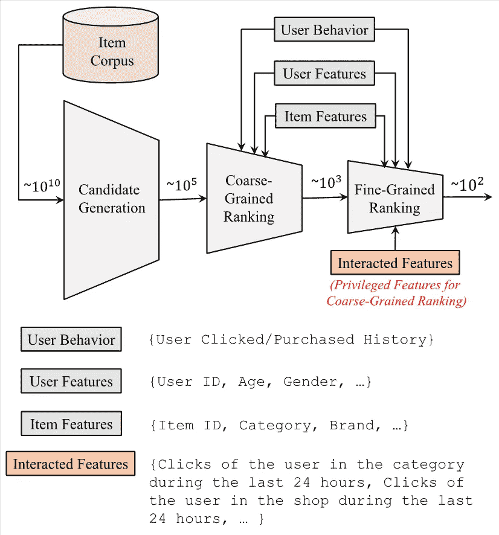
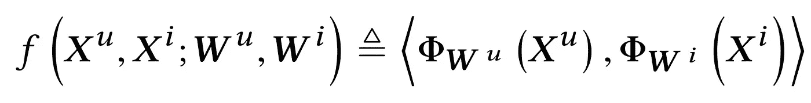
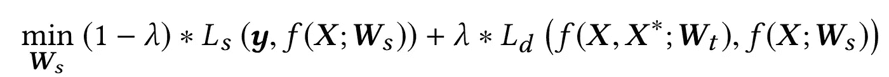
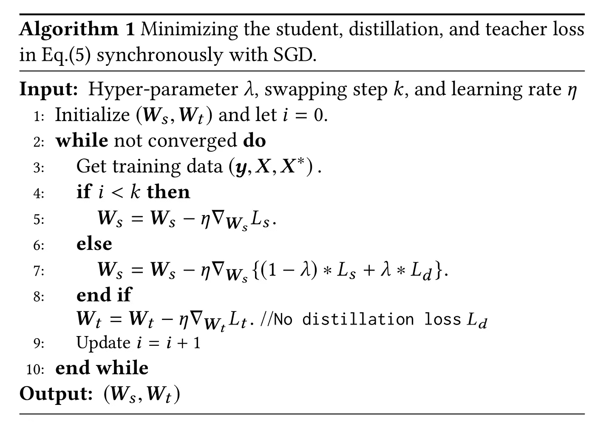
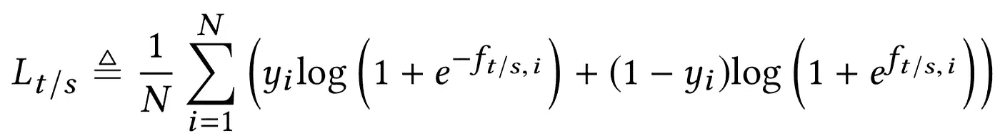
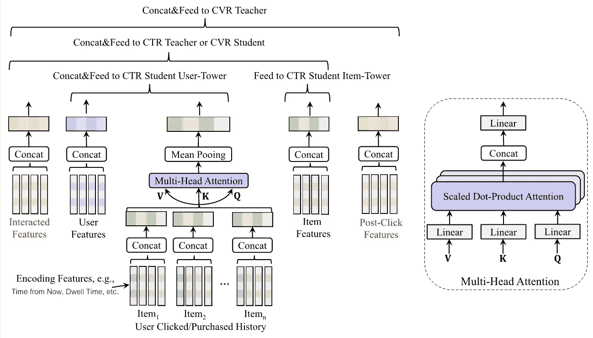
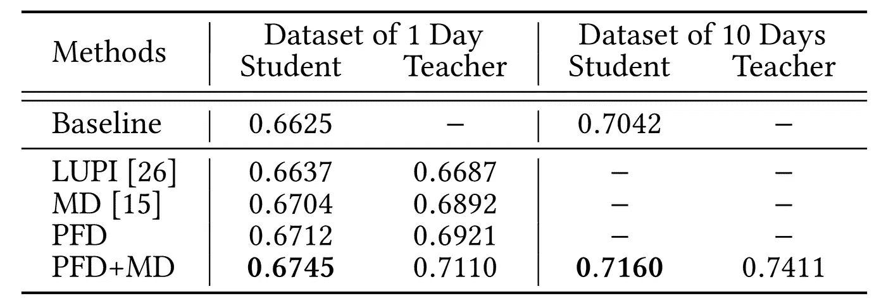
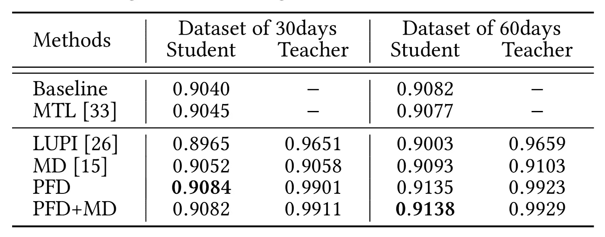

# 特权功能提炼于淘宝推荐

> 原文：<https://medium.datadriveninvestor.com/privileged-features-distillation-at-taobao-recommendations-c448870ca015?source=collection_archive---------11----------------------->

*下载“*[*【KDD 论文云知识发现】*](https://resource.alibabacloud.com/whitepaper/cloud-knowledge-discovery-on-kdd-papers_2592) *”白皮书，探索 12 篇 KDD 论文和 12 位阿里巴巴专家的知识发现。*

*作者:、、葛俊峰、高晋阳、、裴昌华、、、孙、欧*

# 1.介绍

在推荐行业，特征的区分度决定了模型和算法的能力。为了确保离线培训和在线服务的一致性，我们通常使用在两种环境中都可用的相同功能。然而，一致性，反过来，忽略了一些区别特征。例如，当我们估计转换率(CVR)时，如果用户点击一个项目，用户将购买它的概率，项目细节页面上的停留时间等功能是有信息的。但是，在点击发生之前，应该对在线排名进行 CVR 预测。因此，我们无法在服务期间获得此类事后特征。

我们将区别性的但仅在训练期间可用的特征定义为特权特征。利用特权特征的一个直接方法是多任务学习(MTL)，用一个额外的任务预测每个特征。然而，在 MTL，每一项任务并不一定都符合无害的保证。特权特征会损害原始模型的学习。更重要的是，无伤害保证很可能会被违反，因为估计特权特征可能比原始问题更具挑战性。从实践的角度来看，当同时使用几十个特权特性时，调整所有的任务将是一个挑战。

受使用特权信息学习(LUPI)的启发，我们提出特权特征提取(PFD)来利用这些特征。在离线训练中，我们训练两个模型:一个学生模型和一个教师模型。学生模型与原始模型相同。教师模型处理所有功能，包括特权功能。因此预测精度更高。从教师模型(教师模型的最后一层的输出)中提取的知识被转移到学生模型以监督其训练，这额外地提高了其性能。在在线服务期间，仅提取学生部分，这依赖于非特权特征作为输入，并保证与训练的一致性。与 MTL 相比，PFD 主要有两个优势。一方面，特权特征以更适合于预测任务的方式被组合。通常，添加更多特权特征将导致更准确的预测。另一方面，无论特权特征的数量是多少，PFD 仅引入一个额外的蒸馏损失，这更容易平衡。

PFD 是来自通常使用的模型蒸馏(MD)的 different。在 MD 中，教师和学生都处理相同的输入。教师使用的模型比学生使用的模型容量更大。例如，教师可以使用较深的网络来指导较浅的学生，而在 PFD 中，教师和学生使用相同的模型，但输入不同。PFD 也不同于原始的 LUPI，其中 PFD 中的教师网络另外处理常规特征。图 1 给出了差异的说明。

*Figure 1\. Illustration of MD and PFD proposed in this work. In MD, knowledge is distilled from the more complex model. In PFD, knowledge is distilled from both the privileged and the regular features (indicated by the red arrow.) PFD also differs from LUPI, where the teacher only processes the privileged features.*

我们在淘宝推荐的两个基本预测任务上进行 PFD 实验，粗粒度排序的 CTR 预测和细粒度排序的 CVR 预测。通过提取更强大的 MPL 模型和由于在线构建特征和高模型推理延迟而被禁止的**交互特征**，点击度量在 CTR 任务中提高了 **5.0%** 。通过提取**的事后特征**，比如停留时间，在 CVR 任务中，转换指标提高了 **2.3%** ，而点击指标没有下降。

# 2.淘宝推荐的特权功能

为了更好地理解本文中利用的特权特性，我们在图 2 中给出了淘宝推荐的概述。我们采用级联学习框架。随着评分项目数量的减少，模型变得更加复杂。在这个实验中，所有特征都需要一键编码和映射到嵌入(连续特征可以通过 Bin 划分来离散化)。基于用户行为，通常采用递归神经网络(RNN)或变换器来建模用户的长期和短期兴趣。

*Figure 2\. Overview of Taobao recommendations. We adopt a cascaded learning framework to select/rank items before presenting them to users. At coarse-grained ranking, the interacted features, although they are discriminative, are prohibited as they greatly increase the latency at online serving. In this work, interacted features are used as privileged features for coarse-grained ranking.*

我们采用两个阶段进行排序:粗粒度排序和细粒度排序。在粗粒度排序阶段，预测模型的复杂度受到严格限制。我们使用内积模型来衡量项目得分:

其中 u 和 I 分别表示用户和项目。x 表示输入，W 表示非线性映射的模型参数φ，其中φ使用多层 MLP。由于在服务期间，用户侧和项目侧在前面的等式中是分开的，所以我们可以预先离线计算所有项目的映射，并在存储器中为结果创建索引。当一个请求到来时，我们只需要执行一次正向传递来获取用户映射，并计算它与所有候选项的内积，效率极高。有关更多细节，请参见图 4 中的插图。

 [## 什么是数据目录，它如何使机器学习取得成功？数据驱动的投资者

### 数据目录是机器学习和数据分析的燃料。没有它，你将不得不花费很多…

www.datadriveninvestor.com](https://www.datadriveninvestor.com/2020/08/27/what-is-a-data-catalog-and-how-does-it-enable-machine-learning-success/) 

如图 2 所示，粗粒度排名没有利用任何交互特征，例如用户在过去 24 小时内在项目类别中的点击以及用户在过去 24 小时内在项目商店中的点击。添加这些功能大大增强了预测性能。然而，这反过来大大增加了粗粒度排序阶段服务期间的延迟。如果将它们中的任何一个放在项目侧或用户侧，映射φ_ w(⋅)的推断需要执行与候选数一样多的次数，也就是这里的 10⁵。通常，非线性映射(多层 MLP)比简单的内积运算多花费几个数量级的计算。因此，在粗粒度排序阶段的服务期间使用交互特征是不实际的。这里，我们将交互特征视为粗粒度排序的 CTR 预测的优先特征。

在细粒度排名阶段，除了像在粗粒度排名中那样估计点击率之外，我们还需要估计所有候选人的 CVR，即如果用户点击了某个商品，用户会购买该商品的概率。根据 CVR 的定义，很明显，被点击项目的详细信息页面上的用户行为对预测非常有帮助，如图 3 所示。然而，在任何未来的点击发生之前，需要对 CVR 的排名进行评估。详细页面上描述用户行为的功能在推断过程中不可用。这里，我们将这些特征表示为 CVR 预测的特权特征。

*Figure 3\. Illustrative features describing the user behavior on the details page of the clicked item. Including the dwell time (that is not shown), these features are rather informative for CVR prediction. However, during serving, we need to use CVR to rank all candidate items before any item is clicked. We denote these post-event features as the privileged features for CVR prediction.*

# 3.特权特征提取

接下来，我们将详细描述特权特征提取。模型提取和特征提取都旨在帮助非凸学生模型更好地训练。对于特权特征提取，目标函数可以抽象如下:

其中 x 表示常规输入特征，X^*表示特权特征，y 表示标签，*表示模型输出，l 表示损失函数。在下标中，s 代表学生，d 代表精华，t 代表老师。λ是平衡这两种损失的超参数。*注意:*除了特权特性之外，我们还向教师模型提供常规特性。如前面的等式所示，预先训练教师模型，这增加了模型训练时间。一个更合理的方法是同步培训老师和学生。然后，目标函数被修改如下:*

**

*虽然同步训练显著减少了训练时间，但它可能不稳定。在早期阶段，当老师没有被很好地训练时，如果直接通过老师的输出来训练，学生可能会分心。为了解决这个问题，我们在早期将λ设置为 0，并用交换步长将其固定为预定义的值。有关操作步骤的更多信息，请参见算法 1。*注:*我们让提取误差只影响学生参数的更新，不通过梯度返回教师参数，以避免由于教师网络和学生网络的共同适应而造成的准确度损失。*

**

***扩展:统一蒸馏***

*图 1 说明了 MD 和 PFD 之间的差异。这两种蒸馏技术是互补的，可以提高学生的成绩。一个自然的扩展是通过形成一个更准确的教师来指导学生，从而将 MD 和 PFD 结合起来。在粗粒度排序的 CTR 预测中，我们使用这种统一提取(UD)技术。*

*如等式 1 所示，在这项工作中，我们使用内积模型对候选项进行评分。无论我们如何映射用户和项目输入，模型容量本质上都受到内部产品操作中的*双线性*结构的限制。粗粒度排序的内积模型可以看作是包含边信息的广义矩阵分解。根据神经网络的通用逼近定理，*非线性* MLP 比双线性内积运算具有更强的表达能力。所以在这里自然被选为更强的教师模式。图 4 说明了粗粒度排序的 UD。图中具有特权特征的教师模型与用于细粒度排名的 CTR 预测的模型相同。这里的蒸馏技术可以看作是从细粒度的排序中提取知识，以改进粗粒度的排序。*

**

**Figure 4\. (a) UD framework at coarse-grained ranking and (b) its deployment during serving. At the training time, the interacted features (the privileged features) of the user and the item and the complex non-linear network form a strong teacher to instruct the bi-linear inner model operation. During serving, we compute the mappings of all items offline in advance and create an index for them in the memory. When a request comes, we only need to execute one forward pass to derive the user mapping.**

# *4.实验*

*因为我们想测试用户是否点击/购买了商品，所以我们对老师和学生都使用了日志损失。*

**

*其中 *f_(t/s，i)* 表示来自教师或学生模型的第 I 个样本的输出。对于蒸馏损失，我们通过用 1/(1 + e^(-f_{t,i})代替 y_i 来使用交叉熵。在这里，我们用广泛使用的曲线下面积(AUC)来衡量模型在第二天保留数据中的表现。此外，教师和学生之间的公共输入组件在培训期间共享，如图 5 所示。*

**

**Figure 5\. Illustration of the overall network. The common input components between the teacher and the student are shared during training.**

***粗粒度排序的 CTR 实验结果:**如图 1 所示，在 MD 中，老师只处理特权特征。在 PFD 中，教师处理特权特征和常规特征。我们不包括 MTL，因为预测几十个交互特征(特权特征)太麻烦了。)如下表所示，MD+PFD 组合显著提高了粗粒度排序时的训练性能。当训练时间更长、数据更多时，该技术的优势仍然存在。在我们的在线 A/B 测试中，MD+PFD 将点击指标提高了 5.0%，而转换指标没有下降。*

**

***CVR 细粒度排序实验结果:**MTL 的多个任务共享底层神经网络的输出。在 MD 中，使用了更宽和更深的神经网络，但是教师的表现并不明显优于学生的表现。因此，在在线 A/B 测试中，仅使用 PFD。与基线相比，PFD 将转换指标提高了 2.3%，而点击指标没有下降。*

**

# *5.摘要*

*在本文中，我们主要关注预测任务中的特征输入。具体来说，我们提出 PFD 来最大限度地利用特权特性。在两者中，在淘宝推荐的两个基本面预测任务中，PFD 可以显著提高相应模型的效果。PFD 是常用 MD 的补充，在粗粒度排序中，PFD+MD 框架可以额外提高训练性能。有关技术和实验细节的更多信息，请点击链接阅读我们的论文[。](https://arxiv.org/abs/1907.05171)*

# *6.参考*

*[15]杰弗里·辛顿、奥里奥尔·维尼亚尔斯和杰夫·迪恩。2015.从神经网络中提取知识。arXiv 预印本 arXiv:1503.02531 (2015)。
[26]戴维·洛佩斯-帕斯、莱昂·博图、伯恩哈德·朔尔科普夫和弗拉季米尔瓦普尼克。2016.统一精华和特权信息。在 ICLR。*

**本文观点仅供参考，不一定代表阿里云官方观点。**

# *原始来源:*

* [## 特权功能提炼于淘宝推荐

### Alibaba Clouder 年 10 月 15 日 65 下载《KDD 论文中的云知识发现》白皮书，探索 12 KDD…

www.alibabacloud.com](https://www.alibabacloud.com/blog/privileged-features-distillation-at-taobao-recommendations_596741) 

## 访问专家视图— [订阅 DDI 英特尔](https://datadriveninvestor.com/ddi-intel)*