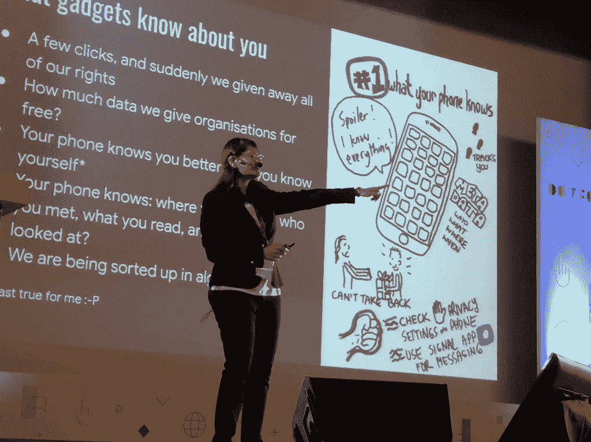
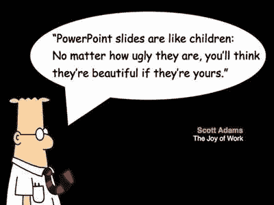
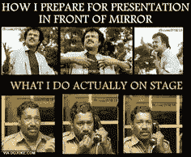

# 让你的下一次会议取得巨大成功的专业建议[如何开始计划]

> 原文：<https://medium.datadriveninvestor.com/pro-tips-for-making-your-next-session-a-huge-success-how-to-start-planning-c904470cb314?source=collection_archive---------8----------------------->

## 主持会议？但是，不知道怎么设计？这个博客系列将帮助你掌握，如何作为一个主持人通过互动活动来计划、执行和交付你的下一次会议，以取得巨大的成功。

假设你是一名主持人，正在介绍反向传播算法背后的数学原理(深度学习领域中一种著名的学习算法！)

你认为参与者能集中注意力多久？如果这个话题是他们所关心的，而你作为一个演讲者是一个好的演讲者，他们最多可以专注于演讲大约 7 到 10 分钟*(一个心理事实！)*。如果他们对这个话题不感兴趣，或者你是一个乏味的演讲者，那么他们会很快失去联系。如果观众有一个“短暂的休息”或“其他事情”，那么他们可以再用 7 到 10 分钟的时间重新开始。

 [## 教科书行业如何最终被颠覆，并将继续改变|数据驱动…

### 就此而言，教科书产业在美国乃至全世界都有着悠久的历史。事实上，他们已经…

www.datadriveninvestor.com](https://www.datadriveninvestor.com/2018/09/25/how-the-textbook-industry-has-finally-been-disrupted-and-will-continue-to-change/) 

好吧，每 10 分钟休息一下？这听起来有点奇怪，也不可行，所以，让我们把注意力放在“其他事情”上，它可以帮助我们实现主题部分的学习目标，并让参与者参与进来，而不是让他们身兼数职。

**我会在这个系列中发布以下文章:**

*   *会议开始前——了解计划阶段*
*   [*开始会议—打破僵局*](https://medium.com/@charmichokshi/pro-tips-for-making-your-next-session-a-huge-success-kicking-off-the-session-326463eeb02b?source=friends_link&sk=ec93a39047c2dd0452fa0737100b5bfa)
*   *会议期间——互动会议创意、活动、惊喜以及更多内容！(* ***千万不要错过这个！*** *)*
*   *会议结束后——反馈循环，保持联系！*

# 让我们开始学习一些有效引导的专业技巧，帮助你成为一名表演者而不是一名演讲者，因为这不仅仅是一项技能，而是一门艺术！！

that’s me! taking a session on Cyber Intelligence at DevFest Banglore 2019

# 规划阶段…

> "没有计划，你就是在为失败做准备."―本杰明·富兰克林，美国的国父

## **知道谁会在房间里**

在你到达房间之前，尽可能多地了解谁会在房间里。因为你与 C 级高管的谈话会有不同，从主题演讲到医生，两者都不同于在满是小学教师的自助餐厅里的午餐和学习。

当你了解你的听众时，你会对他们产生同情，也更容易与他们产生共鸣。创建参与者可以联系到的真实生活问题的例子和(虚构或非虚构)故事。试着用最简单明了的方式表达出来。创建一个演示文稿，使用他们理解的语言，并吸引他们的兴趣。

> 建议:用趣闻轶事和故事给你的演讲增添人情味，让你的内容看起来更合适。比起死记硬背的数据和统计数字，人们对现实生活中的情节反应更大！

## **定义目标**

永远**努力让你的课程以学员为中心，而不是以培训师为中心**。努力弥合学习者和知识之间的差距。一旦你选择了一个主题，用一句简洁的话写下演讲的目标。*在研究和开发演示文稿时，使用此语句有助于保持注意力集中。*

通过记住以下参数来定义这个目标，

*   你有多少时间来准备课程
*   参与者的背景知识
*   您想要传递的内容的级别
*   你有多少时间做报告

目标需要具体说明，你希望你的参与者从你的会议/网络研讨会/讲座中学到什么？你希望你的参与者在你的报告后采取什么步骤？

## 设计会话流

*我将在本系列的后续博客中详细讨论这个主题，*但是首先，**用 ADIDS 类比**来计划任何会议通常是一个好方法。如果你足够幸运，有一个人和你一起合作，那就利用这个人。讨论你们如何最好地相互支持和团队合作，并为以下各点分配专用时间。

*   *A —活动*
*   *D —讨论*
*   *I —输入*
*   *D —深化*
*   *合成*

**活动**:计划一些与课程主题相关的活动来开始你的课程。这意味着向参与者介绍该主题，并让他们立足于自己与该主题相关的背景。

讨论:在这一部分，每个人都谈谈他们对刚刚完成的活动的看法。培训师应准备问题来指导活动。

**输入**:作为培训师，你将介绍与课程重点相关的问题、子主题和更高级的概念

**深化**:在技术会议/研讨会中，这通常是会议的实践环节。在这里，参与者可以将他们所学的东西付诸实践

**综合**:一个好的训练习惯是总是总结会议。准备要点，分享会议中发生的事情。继续观察会议期间发生的事情，你也可以分享一些讨论的结果，讨论了什么问题，提出了什么解决方案。

## **准备教学材料**

一旦你明确了课程目标，就开始动手练习和准备材料。

> 把有趣的迷因，但不要让你装饰迷因！

把迷因放在无聊的话题之间，放上图像、图表、视频和外部链接，让他们探索并使用技术术语，同时牢记你的受众水平。请记住，如果一个主题可以通过一个图像轻松理解，不要试图用沉重的段落过度解读它。确保它们看起来“漂亮”！

image [reference](https://www.pinterest.com/pin/21532904442144633/?d=t&mt=login)

我喜欢创建在线测验，可以在会议期间或会议结束时进行。我最喜欢的一些平台是，[卡豪特](http://kahoot.com)！、 [Quizlet Live](http://quizlet.com/live) 、 [Gimkit](http://gimkit.com) 和 [Quizizz](http://quizizz.com) 。

> **专业提示**:如果你仍然不确定听众的水平，就这个话题做一个基本的测验，让他们在一天的最初几分钟里玩。现在，你可以通过测验结果很好地了解你的听众的想法！根据他们的理解，计划所有即将到来的会议(如果是系列会议的话)。

## **准备谈话要点**

你必须听起来放松、舒适、自信，并且有亲和力。背诵一个记住的 PPT 不会完成任何事情。不要草拟你的演讲，而是列出你想要分享的观点，并按照逻辑顺序组织它们。

> **提示:**建议使用索引牌，这样你就可以洗牌了；添加、更新和删除无关点。准备好记忆地图，从准备会议到到达会场，再到安全回家！:P

## 复习材料

现在，您已经选择了完美的关键词、图像和精心制作的内容，并准备了一份出色的会议计划。现在，从你的导师或在类似领域工作或像你一样有参加会议经验的同事那里获得所有信息是一个好主意。

一旦你让他们理解了你准备的材料的基本原理，明确要求他们批判性地回顾并给出建设性的反馈。*，* [*【舒巴姆·阿尼基特·帕乔里*](https://medium.com/u/e6aa751f9e6e?source=post_page-----c904470cb314--------------------------------) *，感谢您对这篇博文的宝贵反馈！*

## 设置学习环境

在你上课的几个小时或一天前，给他们发一篇有趣的阅读材料、一篇博客或一段视频，让他们看看你要讲的话题，让他们对第二天的学习更加兴奋。

# **奖励积分**

*   最后，当你完成创建你的卡片组，编码问题，测验，作业等。请务必查看其内容。

> 在脚本会话中，为讨论、问题或额外练习留出空间通常是个好主意

*   想想你的一些后备计划。如果注册的人数是 70 人，但只有 10 人会来，你会怎么做？你能顺利进行会议吗？所有计划的活动都可以在这么大的观众群中进行吗？相比之下，如果不是 70，你将不得不面对 200 人坐在你面前几个小时？重新检查您的会议计划，并进行必要的更改。
*   准备好在线测验后，请确保所有问题都标有正确答案。

> 即使对于经验丰富的演讲者来说，在会议期间进行现场演示也是一场噩梦！

*   如果你进入了某个技术领域，并且想让你的学习者亲自动手编程，首先你要知道代码的每一行。想想参与者会犯什么愚蠢的错误，以及如何解决它们。如果您计划将代码发送给他们，请确保代码的每一行都写得很干净，并带有适当的注释。所以，**只是排练，排练，再排练！**
*   确保您知道如何在视频通话中显示屏幕。听起来很傻，但是如果由于一些技术问题，你面临这样的困难，你的道德很有可能崩溃。
*   验证演示文稿中的所有外部链接都在正确的位置，因为您可能不喜欢在讨论 Q2 时打开第 4 季度的销售图表。
*   **如果你想再次确认以上几点，做一次预演**(彩排)。如果你觉得自己怯场，这将是一个在你的朋友、家人或镜子前排练的绝佳机会！

image [reference](https://www.pinterest.com/sgenius/presentation-humor/)

> **提示:**拿一张纸，准确地写下你想在演讲的每一个小节上花多少分钟。不建议在分配的时间前完成训练，也不要拉伸太久。在众多现场观众面前对 youe session 进行时间管理当然不是儿戏。

在那之后，问问你自己:

*   会议计划符合您的目标吗？
*   有逻辑结构吗？
*   你是否为你的观众准备了合适的材料？
*   是计划的会议太长，太短，还是完美？

如果答案是否定的，对于以上任何一点，修改相应的部分，在登陆日之前好好吃一顿，喝一杯温水，好好睡一觉！因为这将是漫长的一天，你站在舞台的另一边说话！

*在阅读了计划会议时需要注意的事项后，请继续关注即将发布的博客文章，* [*本系列的第二部分*](https://medium.com/@charmichokshi/pro-tips-for-making-your-next-session-a-huge-success-kicking-off-the-session-326463eeb02b?source=friends_link&sk=ec93a39047c2dd0452fa0737100b5bfa) *、开始会议或网上研讨会的技巧和诀窍。因为你演讲的开始是至关重要的。这是你与观众接触的第一点；你可以在几秒钟内抓住或失去观众的注意力。*

**学习。申请。分享一下。重复一遍。**

thanks in advance! :)