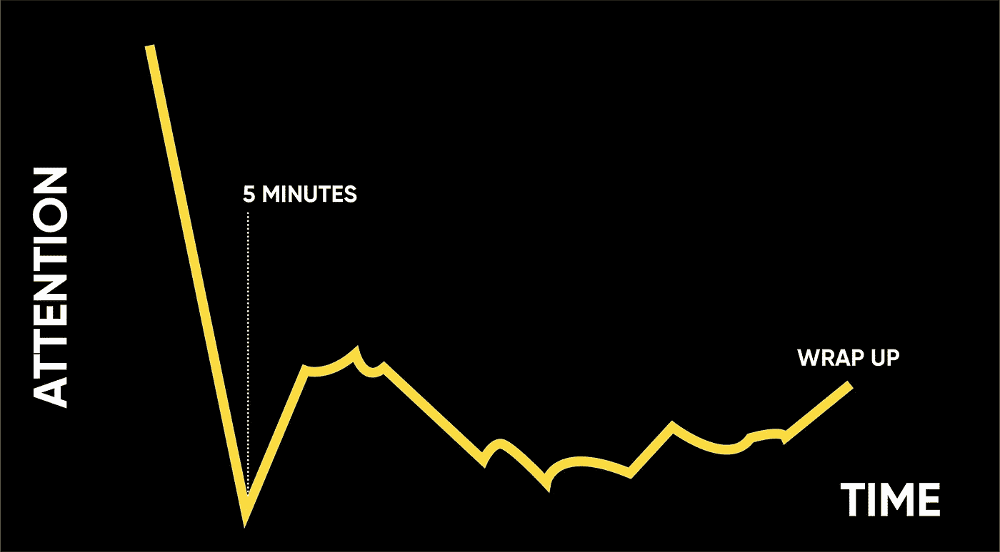
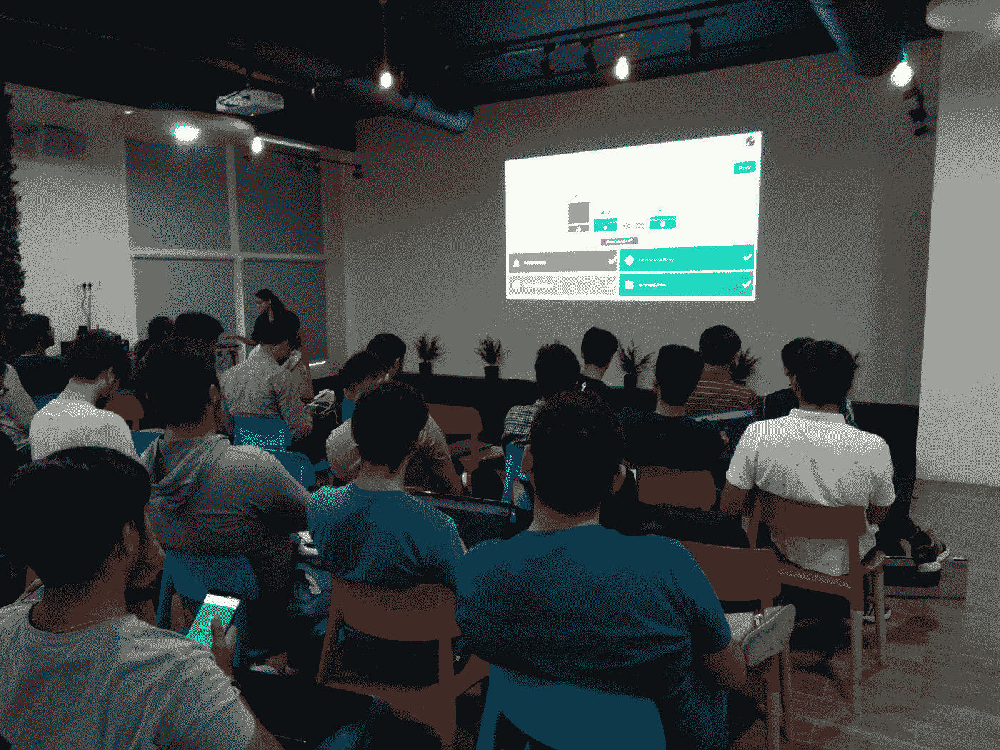
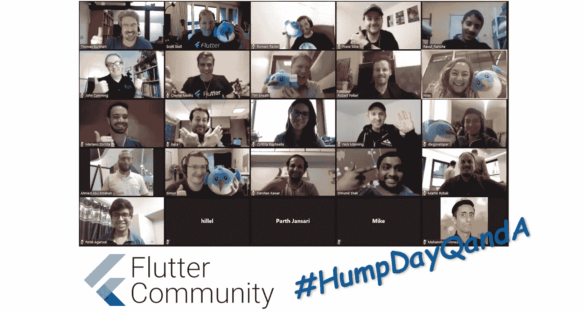

# 使你的下一次会议取得巨大成功的专业建议[开始会议]

> 原文：<https://medium.datadriveninvestor.com/pro-tips-for-making-your-next-session-a-huge-success-kicking-off-the-session-326463eeb02b?source=collection_archive---------11----------------------->

that’s me! taking a selfie with the audience while starting the session!

## 举办研讨会？却不知道如何在最初几分钟内获得观众的充分关注？学习有效计划、设计和执行下一次会议的专业技巧。

*阅读完本系列的第一部分***后，在计划会议时要注意的事项，让我们今天就学习开始会议/网上研讨会/研讨会的技巧和诀窍。**

*想象一下，在因疫情飓风而被封锁的这段时间里，你决定进行一些娱乐活动(尽管是在房子里:P )，让我们缩小思维范围，看一些电影或网络连续剧。在不同的平台上有数百万个这样的应用程序(*不知道这是好事还是坏事！*)。但是，你如何决定是看某个节目还是换另一个节目呢？ ***你会看预告片！然后，很有可能在几分钟内，你会说“看起来很有趣，很值得一看”，或者咕哝着相反的观点，“这不值得我浪费时间”。****

*同样，将这个类比应用到您的会话中，您必须首先播放"*预告片"*！因为他们会很快对你和你的疗程做出决定。在最初的几分钟过去之前，你必须让听众相信你值得留下来听，否则在他们的心目中，他们会转向其他想法。*

**

*typical attention span in an hour-long session (source: Sequoia Capita)*

*有趣的事实:你通常会在演讲的前 5 分钟内失去 90%的观众。*

*让我们试着从一开始就通过制作你的大片预告片来真正吸引我们的观众*

> *你永远没有第二次机会留下第一印象*

# *开始会议…*

*以下是一个列表，列出了开始在线和离线会议或网络研讨会的不同方式。选了两到三个打开你的！*

## *播放一些音乐[适合在线和离线会话]*

*提前 10 分钟到场，当人们到达时，用欢快的音乐来激发他们的情绪。*

*你也可以在会议期间使用音乐——舒缓的器乐或乌托邦的声音有助于人们在执行任务或小组工作时集中注意力。这里有一些好的建议，*

*   *[https://www.youtube.com/watch?v=6RHmhrLJW24](https://www.youtube.com/watch?v=6RHmhrLJW24)*
*   *[https://www.youtube.com/watch?v=xIrkdJnsLPU](https://www.youtube.com/watch?v=xIrkdJnsLPU)*
*   *[https://www.youtube.com/watch?v=rkWC1ShvKck](https://www.youtube.com/watch?v=rkWC1ShvKck)*

## *玩一些游戏[适合离线会话]*

*进行一些有趣的身体或精神上的有趣练习可以增强参与者的能量，这也有助于提高注意力，或者就像破冰一样完美！*

*   *[**抄拍手**](https://www.youtube.com/watch?v=O44KCiT8shM)——一项有趣的体育活动*
*   *[**命名游戏**](https://www.youtube.com/watch?v=Pd8_pZ2wHo8) —一个有趣的入门活动*
*   *[**字母游戏**](https://www.youtube.com/watch?v=JS1J-2QYB-Q)*
*   ***多**多[多**多**多](https://www.partnersforyouth.org/category/activities/group-building/warm-ups/)*

## *相互了解[在线和离线会议/网络研讨会的必备内容]*

*考虑在会议开始时进一步介绍，包括一个打破僵局的问题。在对自己进行简短而甜蜜的介绍后，让参与者与坐在他们旁边的人配对，并给几分钟时间谈论他们的教育背景、职业经历等。等等。等等……等等……我们能不能让这个变得更有趣、更刺激一点？*

*是啊！*

*你可以要求他们讨论以下创新点，*

**

*   *过去一年你做过最疯狂的事是什么？*
*   *找出与坐在他们旁边的人的五个相似之处*(*不能与人体相关)——*这将使他们与他们可能不得不一起进行许多集体练习的所谓邻居相处得很舒服**
*   *他们做过或听说过的最酷的项目是什么？(可能是你将在课程中涉及的技术/主题)— *因为知识通过分享而增长**
*   *他们为什么要参加这个会议？他们希望从这次会议中得到什么？— *一定要问这个问题，并与他们的期望和你的会议范围保持一致，因为作为一名演讲者，你有责任首先明确议程**

> ***提示:**如果你正在开一个在线会议/网络研讨会，**分组讨论室**是一个很棒的选择，可以让你和一大群人一起尝试任何活动。像 [zoom.us](http://zoom.us) 这样的应用程序提供了一种工具，可以拥有任意数量的分区，您可以将任意参与者随机分配到任意房间，也可以明确定义。*

*如果你面对的不是一大群人，让他们每个人都与大家分享他们的答案，否则你可以在继续之前随机选择几个人发言。*

## *安排现场测验或投票问题[适用于在线和离线会议]*

**

*that’s again me!! conducting a quiz on the basics of Deep Learning*

*你可以就你要涉及的主题设置一个基本的测验来复习参与者的概念。这些结果将让你对你面对的听众有一个总体的了解，这将有助于你在以后的会议中以最清晰的方式或在高层次上解释事情。*

*或者设置一些投票问题，这些问题可以是以背景为重点的、以学习为重点的、季节性的、有趣的、创造性的、与行业相关的、辩论提示的或以网络为重点的。*

> *小贴士:这里列出了一些优秀的民意测验问题，下面是几个进行在线测验的平台， [Kahoot](http://kahoot.com/) ！、 [Quizlet Live](http://quizlet.com/live) 、 [Gimkit](http://gimkit.com/) 和 [Quizizz](http://quizizz.com/) 。*

## *抓住他们的注意力！[在线和离线课程必备]*

*尝试一些疯狂的事情来真正抓住他们的注意力。**向参与者展示一个现场项目或演示，一个令人兴奋的网站，一个应用程序，你也可以找到一本优秀的书，使用一个快速的视频剪辑，或者唱一首与主题相关的歌曲。在这里你可以激发你的听众对学习的热爱。***

*这将帮助你**创造为什么？**为什么题目很重要？他们为什么要关心这个？没有一些算法/技巧/技术/理论的痛点是什么？它能解决什么样的问题？它有多大的改进空间？以及他们如何做出贡献并从中受益？*

**

*that’s your audience feeling the WOOOWWWW!!! ([source](https://www.google.com/url?sa=i&url=https%3A%2F%2Fwww.pinterest.com%2Fpin%2F778559854306862838%2F&psig=AOvVaw1QhCmxB0arLtfpqqZaUGyL&ust=1588112723722000&source=images&cd=vfe&ved=0CAIQjRxqFwoTCPiogYvTiekCFQAAAAAdAAAAABAP))*

*然后告诉他们，如果你想了解该网站是如何运作的，该项目是如何开发的，这首歌是如何创作的，或者该应用程序的架构是什么，请务必参加会议，因为我会确保你在会议结束时获得所有相关技能！*

> ***亲提示:**相信我，如果可以，首先让他们明白题目的必要性和意义你已经赢了一半的战争。从现在开始，要获得他们的全部关注和参与不会太难。*

## *讲故事[适合在线和离线会议]*

*无论你在说什么，试着通过使用真实的例子、案例研究和创造性的隐喻，使它与日常生活相关联。人们会静坐几个小时看一部电影——为什么不偷点电影技巧呢？:D*

*我们不仅在媒体上寻找故事，也在日常生活中寻找故事。如果你能找到一种方法，将课程中的信息整合到一个总体的叙述中，参与者会更加投入，并在休息时有所期待。*

> ***专业提示:**要获得灵感，可以看看[无语](https://www.speechlessinc.com/shows)和即兴喜剧秀，人们在那里用他们从未见过的幻灯片进行 PowerPoint 演示。看着人们从最荒谬的内容中创造出一个故事，你会发现对你真实的(和实际相关的)内容做同样的事情是多么容易。:P*

## *使用道具[适用于在线和离线会议]*

*考虑到观众的目光会被运动和视觉对象吸引，另一种从一开始就吸引他们的方法是使用道具。*

* [## 教科书行业如何最终被颠覆，并将继续改变|数据驱动…

### 就此而言，教科书产业在美国乃至全世界都有着悠久的历史。事实上，他们已经…

www.datadriveninvestor.com](https://www.datadriveninvestor.com/2018/09/25/how-the-textbook-industry-has-finally-been-disrupted-and-will-continue-to-change/) 

[看一看](https://www.ted.com/talks/susan_cain_the_power_of_introverts?language=en)畅销书作家苏珊·凯恩是如何用一个实物在视觉上补充她第一次夏令营经历的开场故事的。

Dash attending a virtual meetup! ( [source](https://www.google.com/url?sa=i&url=https%3A%2F%2Fmedium.com%2Fflutter-community%2Flive-help-with-flutter-every-wednesday-on-humpdayqanda-512e20348232&psig=AOvVaw1ssDETkJVoXoQ1N2b2ZDvb&ust=1588273541958000&source=images&cd=vfe&ved=0CAIQjRxqFwoTCJCX9sGqjukCFQAAAAAdAAAAABAX))

[这里](https://blog.ted.com/the-best-props-at-ted/)，是 TED 使用的最佳道具列表，供你参考！你可以用一个道具来代表你的主题(一个天平，一个算盘，一个人体模型，或者一个仪表盘)。

简而言之，道具可以活跃课堂气氛，帮助人们记住他们所学的内容。

## **打开议程**【适合线上&线下会议】

当你夜以继日地设计你的互动会话时，说点什么吧！让他们了解课程计划，并声明您已经为不同进度或不同风格的学习者留出了一些空间，并且将有时间进行思考、讨论或实践练习，这通常有助于促进旨在“边学边做”的研讨会

## 使用空间[适合离线会话]

有一个项圈或无线麦克风，不要粘在角落或讲台附近，而是感觉空间。如果你能离开舞台，在房间里走一会儿就更好了。这将展示你的自信和个性，并使你在接下来的会议中感到舒适。这也将增强听众对你的友好感，从而减少他们在会议中听你讲话的努力。

## **回顾一些以前的内容**【适合线上&线下会话】

检查你的听众是否已经掌握了完成本主题所需的所有知识。这可能是一个很好的时间来回顾一些以前的/相关的话题，让他们觉得准备学习一些令人兴奋的和新的东西！* 

*作为结束语，相信你自己，从你的姿势、手势、语气中释放出能量，尽你最大的努力吸引观众的注意力。正如所言，*

> *良好的开端是成功的一半*

*到目前为止，我们已经了解了如何计划和开始会议。但是这还不够！您希望参与者在整个 45 分钟或 3 小时的会议中保持精神状态并积极参与！为此，请继续关注本系列的下一部分，在那里我将分享充满活动、惊喜和更多的互动会议的技巧和诀窍！*

****附:即使在枪口下也不要错过这个！:)****

***学习。申请。分享一下。重复一遍。***

**

*thanks in advance! :)*