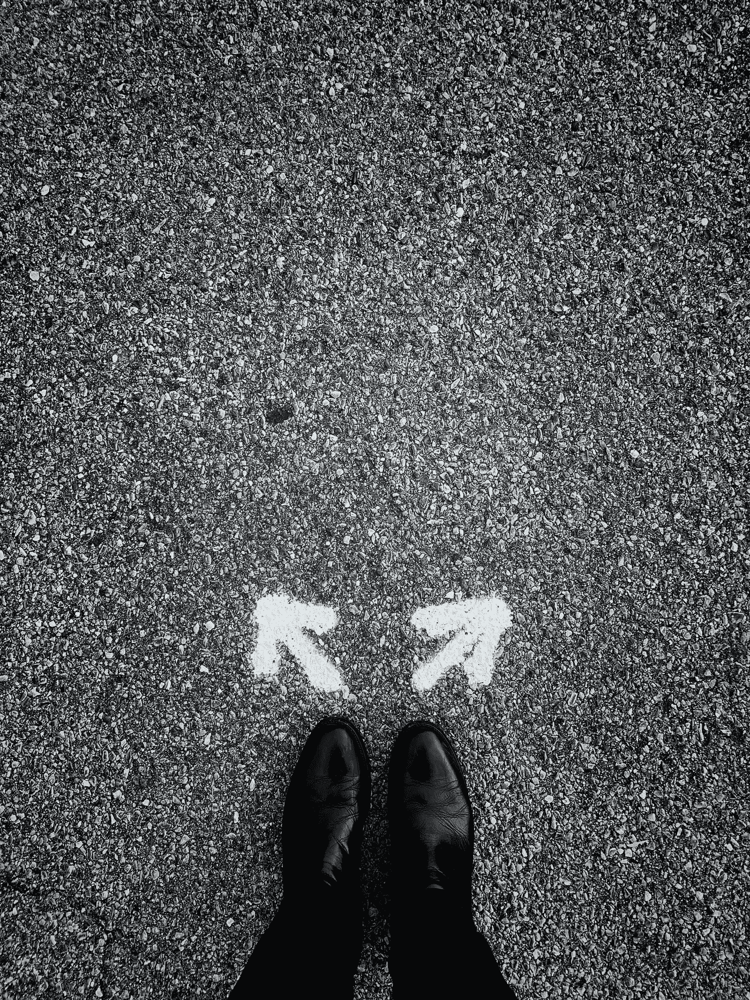
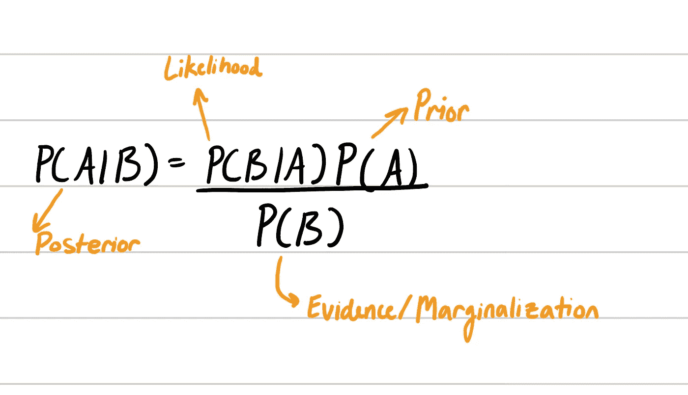
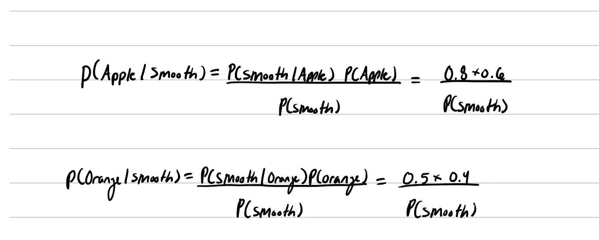
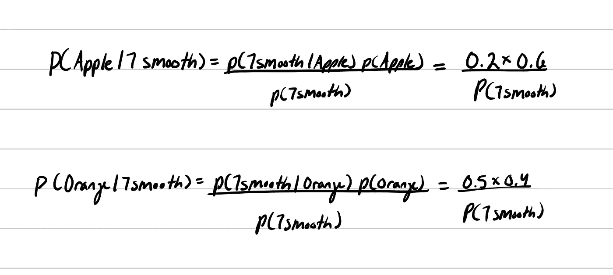

# 概率决策

> 原文：<https://medium.datadriveninvestor.com/probabilistic-decision-making-d7f4dbd98aab?source=collection_archive---------16----------------------->

[https://unsplash.com/photos/PXB7yEM5LVs](https://unsplash.com/photos/PXB7yEM5LVs)

这是一系列文章中的第一篇，在这些文章中，我们将回顾使用概率和统计来更好地影响决策。在本帖中，我们将回顾使用概率来合理化决策的好处。

# 最简单形式的概率决策

给定一个袋子，其中我们有 6 个苹果和 4 个橘子，并进行替换(将水果放回袋子中)，我们可以说苹果的概率是 60%，橘子的概率是 40%。因此，只有这些信息，如果我们要创建一些机器学习分类器，最佳决策将是总是输出苹果。为什么你会问？因为苹果的概率总是大于橘子的概率，我们需要假设这种情况会长期存在。有办法做得更好吗？从长远来看，我们预计会有 40%的误差，这对于这样一个简单的问题来说并不算大。让我们看看添加更多的信息是否有助于我们的情况。

# 利用贝叶斯定理扩展概率决策

上图是贝叶斯定理。顺便提一下，等式的左边应该理解为“给定 b 的概率”，那么我们可以用这个等式做什么呢？假设你有一段时间可以感觉到你手中的水果的一些特征。主持这个游戏的人解释说，苹果 80%的时间是光滑的，而橙子 50%的时间是光滑的。我们如何利用这些信息？假设我们抓到一个水果，它很光滑。我们想要比较苹果被给予平滑的概率和橘子被给予平滑的概率。

由于苹果被给予平滑的概率大于橙色被给予平滑的概率，如果对象是平滑的，我们将选择苹果。现在，如果我们触摸的水果不光滑怎么办？

因为给定的橙色不平滑的概率大于给定的苹果不平滑的概率，所以更好的输出将是橙色。

# 那么，我们该何去何从？

这仅仅是概率决策的开始，即使有了这个简单的模型，我们仍然要讨论如何评估这个模型的表现(计算模型的误差)。如果你们都想让我复习贝叶斯定理和条件概率，请告诉我！这些帖子旨在建立一个社区，让非计算机科学家更容易理解机器学习/统计学习。还有大量的其他问题，包括决定哪些特征是相关的，估计密度，监督和非监督学习。我的目标是尽可能用最简单的方式教授这些概念，同时只占用你一天中的 5 分钟，我希望你能坚持下去。如果有什么说不通的，就留下评论吧！我希望你们所有人，包括我自己，都能从这些博客中学习和成长。