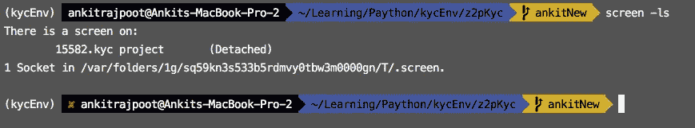

# Python 的流程管理

> 原文：<https://medium.datadriveninvestor.com/process-management-for-python-461ad5ce7dd0?source=collection_archive---------4----------------------->


大多数时候，你通过 ssh 登录到远程服务器。如果您启动一个 shell 脚本或命令并退出(中止远程连接)，该进程/命令将被终止。有时一项工作或一个命令需要很长时间。如果您不确定作业何时结束，最好让作业在后台运行。但是，如果您从系统中注销，该作业将被您的 shell 停止和终止。当进程出现 SIGHUP 时，您如何保持作业在后台运行？

下面给出了一些命令:

# Nohup:-

**Nohup** ，no hang-up 的缩写，是 **Linux** 系统中的一个命令，即使在退出 shell 或终端后，它也能保持进程运行。 **Nohup** 阻止进程或作业接收 SIGHUP(信号挂起)信号。这是在关闭或退出终端时发送给进程的信号。nohup 的一些基本命令如下。

您可以使用以下命令检查`**nohup**`命令的版本。

```
$ nohup --version
```

为了使[在后台运行命令](https://linuxize.com/post/how-to-run-linux-commands-in-background/)，在命令末尾添加一个符号`&`:

```
$ nohup mycommand &
```


如果你愿意，你可以通过键入`**fg**`返回到 shell 命令提示符

```
$ fg
```


要在恢复 shell 时检查进程，使用如图所示的`pgrep`命令

```
$ ps -ef | grep 'mycommand'
```


如果你想停止或终止正在运行的进程，使用`kill` a 命令后跟进程 ID，如下所示

```
$ kill 12628
```


您可以通过以下方式执行该命令，将输出重定向到 **output.txt** 文件。检查 **output.txt** 的输出。

```
$ nohup mycommand > output.txt
```


要重定向到一个文件和标准错误和输出，使用如下所示的`> filename 2>&1` 属性

```
$ nohup mycommand > myoutput.txt >2&1
```


注意:-没有办法重新启动或重新加载任何命令。

# 屏幕:-

Screen 或 GNU Screen 是一个终端多路复用器。换句话说，这意味着您可以启动一个屏幕会话，然后在该会话中打开任意数量的窗口(虚拟终端)。当窗口不可见时，在屏幕中运行的进程将继续运行，即使您断开连接。

在 Ubuntu 上安装 Linux 屏幕

```
$ sudo apt install screen
```

现在大多数 Linux 发行版上都预装了 screen 包。您可以通过键入以下命令来检查它是否安装在您的系统上:

```
$ screen --version
```


要开始屏幕会话，只需在控制台中键入`screen`:

```
$ screen
```


要结束屏幕会话，只需在屏幕会话控制台中键入`exit`:

```
exit
```


要使用任何命令启动屏幕会话，只需在控制台中键入`screen command`:

```
$ screen mycommand
```


运行多个屏幕会话时，命名会话非常有用。要创建命名会话，请使用以下参数运行 screen 命令:

```
$ screen -S 'session name detail' mycommand
```


您可以通过键入以下命令随时从屏幕会话中分离:

`Ctrl+a` `d`


在屏幕会话中运行的程序将在您从会话中分离后继续运行。

要查找会话 ID，请使用以下命令列出当前运行的屏幕会话:

```
$ screen -ls
```



要恢复屏幕会话，请使用以下命令:

```
$ screen -r
```


如果您的机器上运行多个屏幕会话，您需要在`r`开关后附加屏幕会话 ID。

```
$ screen -r 15582
```


以下是管理 Linux 屏幕窗口的一些最常见的命令:

*   `Ctrl+a` `c`新建一个窗口(带外壳)
*   `Ctrl+a` `"`列出所有窗口
*   `Ctrl+a` `0`切换到窗口 0(按数字)
*   `Ctrl+a` `A`重命名当前窗口
*   `Ctrl+a` `S`将当前区域水平分割成两个区域
*   `Ctrl+a` `|`将当前区域垂直分割成两个区域
*   `Ctrl+a` `tab`将输入焦点切换到下一个区域
*   `Ctrl+a` `Ctrl+a`在当前和上一个区域之间切换
*   `Ctrl+a` `Q`关闭除当前区域以外的所有区域
*   `Ctrl+a` `X`关闭当前区域

这些命令在后台管理您的应用程序，而`nohup`生成输出和错误文件，用于分析您的日志。有多种选择，如:`Pm2`、`tmux`等。

欢迎在评论区提出任何问题或疑问，或者你可以在脸书上 ping 我。