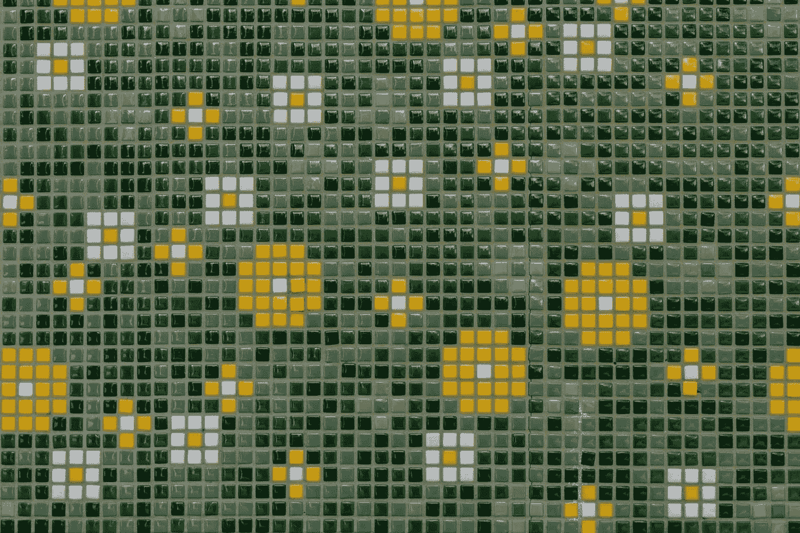
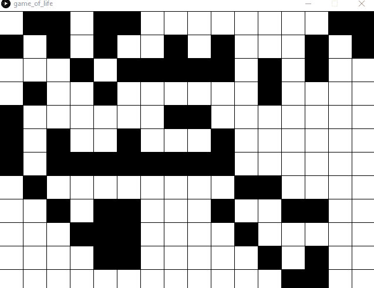
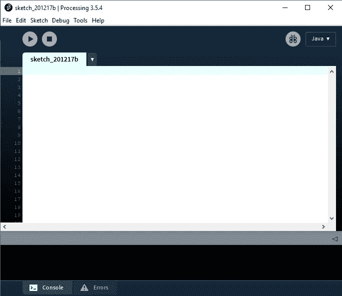
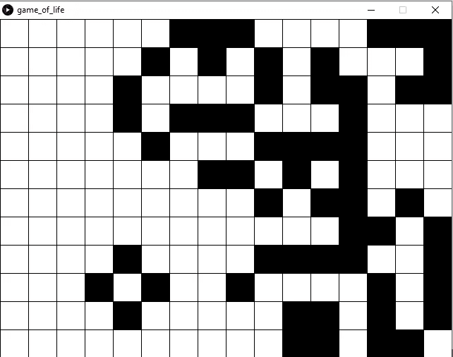
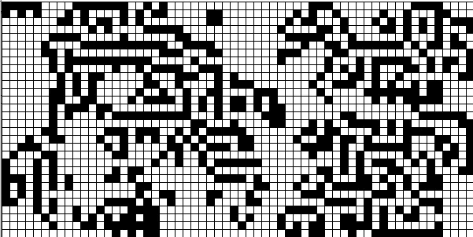
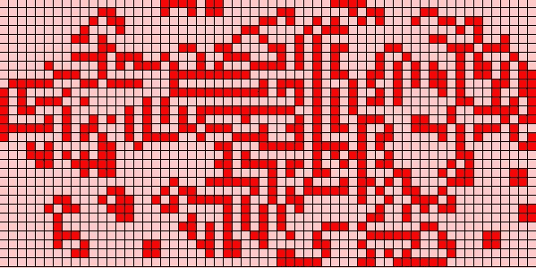

# 处理美:细胞自动机

> 原文：<https://medium.datadriveninvestor.com/processing-beauty-cellar-automata-ebab985177c9?source=collection_archive---------8----------------------->

加工简介



Simple patterns can produce pleasing results. unsplash: [Mitchell Luo](https://unsplash.com/@mitchel3uo)

> “每样东西都有它的美，但不是每个人都看得到。”——孔子

代码能创造美吗？

许多艺术品包含图案和设计。例如，马赛克艺术和硬边抽象。设计中固有的规则令人愉悦。

我们可以使用代码通过处理创建类似的模式。 [Processing](https://processing.org/) 是一款为艺术家、设计师、教师和初学计算机图形的学生开发的工具。使用 Processing，很容易制作简单的可视化程序。

**细胞自动机**

细胞自动机(CA)是这种编程的良好基础。CA 是一种使用“单元”网格显示复杂信息的方式在我们的例子中，我们将创建一个版本的[康威的生命游戏](http://pi.math.cornell.edu/~lipa/mec/lesson6.html)，一个非常著名的细胞自动机练习。

要创建这个游戏，我们首先需要画一个包含列和行的网格。网格上的每个细胞要么是“活的”，要么是“死的”跟踪每个细胞的状态将允许我们从一组简单的规则中生成复杂的动画图案。


An example of Conway’s Game of Life.

每个细胞都有邻居，这些邻居要么活着，要么死了。

CA 最早是由数学家约翰·冯·诺依曼在 20 世纪 40 年代发现的。游戏从随机确定网格中每个细胞的状态(活的或死的)开始。然后，游戏进行一步，并根据以下条件进入新的状态:

1.如果一个细胞是活的，如果它的邻居超过 3 个，或者少于 2 个，它就会死亡。

2.如果一个细胞死了，如果正好有 3 个邻居，它就会活过来。

3.在所有其他情况下，单元格保持不变。

利用这些规则，我们将创造生活的游戏，也许在这个过程中还会有一点美。最后提供了完整的代码。可以将其复制并粘贴到新的加工草图中。



An example of the Processing sketch we will build.

**入门**

要完成这个练习，你只需要一份加工的拷贝。你可以从 processing.org 免费下载 if。一旦你打开处理，你会看到一个包含你的草图的文本编辑器。



现在我们准备写一些代码。让我们从构建游戏板开始。棋盘是一个格子，很像棋盘。为了存储这些数据，使用 2D 数组是有意义的。

```
int[][] board = new int[columns][rows];
```

阵列中的每个单元将有一个状态，或者开或者关(0 或 1)。游戏开始时循环遍历每个单元格，并将它们设置为随机开始状态。

```
// Initialize the game board
  for (int x = 0; x < columns; x++){
    for (int y =0; y < rows; y++){
      gameboard[x][y] = int(random(2));
    }
  }
```

既然游戏板已经初始化，我们可以把它画到屏幕上了。我们可以使用 Processing 提供的 rect()函数来绘制每个单元格。我们将创建一个 DrawBoard()函数，该函数循环遍历每个单元格，并在指定位置绘制一个白色或黑色的矩形。

为此，我们将使用一个 int 来存储平铺图形的大小。将这个值乘以每个单元格的 x 和 y 坐标，我们就可以画出单元格。

处理提供了一个初始化草图的函数:setup()。从 setup()函数中调用 DrawBoard()会给我们一个板子的图像。



The first steps in the game of life.

我们的草图中还需要两个函数:CheckNeighbors()和 TakeStep()。CheckNeighbors 将有两个参数(x 和 y)。我们将使用这个函数来计算一个单元中活着的邻居的数量。

第二个函数 TakeStep()将遍历游戏棋盘中的每个单元格，计算其邻居，然后检查生命游戏的规则以确定该单元格是生是死。

我们将使用第二个 2D 数组(称为 next)来存储每个单元格的状态。在函数结束时，旧数据被新数据替换。

```
gameboard = next;
```

CheckNeighbors()函数使用双 for 循环(也称为嵌套循环)来检查单元格的邻居。首先，进行检查以确保邻居在游戏板内。接下来，我们确保不对当前单元格进行计数。在所有其他情况下，如果细胞是活的，我们将其视为邻居。

使用邻居计数和生命游戏的规则，我们可以根据游戏棋盘的当前状态来计算游戏中的下一个状态。

TakeStep()函数使用嵌套循环来抓取游戏棋盘中的每个单元格。然后它将需要确定该细胞当前是否存活。

如果细胞是活的，另一个检查确定它是否被杀死。请记住，在生命的游戏中，如果一个细胞的邻居超过 3 个(超过种群数量)，或少于 2 个(低于种群数量)，这个细胞就会死亡。

[](https://www.datadriveninvestor.com/2020/09/29/5-robotic-process-automation-traps-to-avoid/) [## 要避免的 5 个机器人流程自动化陷阱|数据驱动型投资者

### 在一些大公司的机器人流程自动化(RPA)之旅中，我从一开始就在这些公司工作…

www.datadriveninvestor.com](https://www.datadriveninvestor.com/2020/09/29/5-robotic-process-automation-traps-to-avoid/) 

如果细胞死了，如果它正好有 3 个邻居，它可以复活。

在所有其他情况下，单元格保持不变。

为了运行模拟，我们还需要一个函数:draw()。这个函数是在 setup()函数之后直接调用的，重复执行。使用名为“tick”的变量，我们可以计算在进行下一步并重新绘制棋盘之前我们想要等待多少个循环。

使用这种方法，我们可以控制细胞存活和死亡的速度。

以下是完整的加工草图:

```
// GAME OF LIFEint columns = 16; // width of the gameboard
int rows = 12; //height of the gameboard
int tile_size = 40; // size of the tiles
int tick = 1;
int tick_time = 10;int[][] gameboard = new int[columns][rows];int[][] next = new int[columns][rows];void setup(){
  size(640,480);

  // Initialize the game board
  for (int x = 0; x < columns; x++){
    for (int y =0; y < rows; y++){
      gameboard[x][y] = int(random(2));
      next[x][y] = gameboard[x][y];
    }
  }
  DrawBoard();
}void draw(){
  tick++;
  if (tick > tick_time){
    tick = 0;
    TakeStep();
    DrawBoard();
  }
}void TakeStep(){
  // loop through the board in it's current state
  for (int y = 0; y < rows; y++){
    for (int x = 0; x < columns; x++){

      int n = CheckNeighbors(x,y);
      //print(n, " ");
      // if cell is alive
      if (gameboard[x][y] == 1){
        // if over or under populated, kill it
        if (n > 3 || n < 2){
          next[x][y] = 0;
        }
      }
      else if(gameboard[x][y] == 0){
        if (n == 3){
          next[x][y] = 1;
        }
      }
      else{
        next[x][y] = gameboard[x][y];
      }
    }
  }

  gameboard = next;
}int CheckNeighbors(int x, int y) {
  int neighbors = 0;
  // loop through the 9possible neighbors 
  for (int i = -1; i < 2; i++){
    for (int j = -1; j < 2; j++){
      if (x + i < 0 || x + i > columns-1 || y + j < 0 || y + j > rows-1){
       // outside the bounds of the map. do nothing 
      }
      else if (i == 0 && j == 0){
        // don't count ourselves
      }

      else if (gameboard[x+i][y+j] == 1){
        neighbors++;
      }
    }
  }

  return neighbors;
}void DrawBoard(){
  for (int i = 0; i < columns; i++){
    for (int j = 0; j < rows; j++){
      if (gameboard[i][j] == 1) fill(0);
      else fill(255);
      stroke(0);
      rect(i*tile_size, j*tile_size, tile_size, tile_size);
    }
  }
}
```

一旦你有了完整的代码，运行草图就会产生一个随机的生命游戏。每部新戏都是独一无二的。尝试行数和列数将得到更小或更大的地图，更改切片大小将产生有趣的结果。



而且你可以挑选更讨人喜欢的颜色。



细胞自动机的美妙之处在于它的简单。简单的规则可以带来无限的变化。这本身就有一种美感，和自然的亲密关系。

使用处理，任何人都可以学习并利用代码的力量来创造美。

如果你喜欢我的作品，并愿意支持我和 Medium 上的其他作者，请使用[这个链接](https://harold-j-petty.medium.com/membership)成为会员。你的会员费直接支持我和你看的其他作家。你也可以在媒体上看到所有的故事。

## 获得专家视图— [订阅 DDI 英特尔](https://datadriveninvestor.com/ddi-intel)