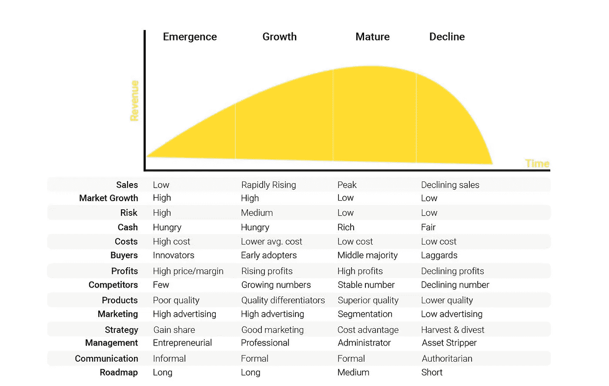

# 获胜者的产品适应性

> 原文：<https://medium.datadriveninvestor.com/product-fitness-for-winners-d8116ffded58?source=collection_archive---------10----------------------->

Photo by [Matt Lee](https://unsplash.com/@mattlee?utm_source=medium&utm_medium=referral) on [Unsplash](https://unsplash.com?utm_source=medium&utm_medium=referral)

## 帮助你对任何公司的商业周期进行压力测试的健康原则

行业是复杂的适应性系统。它们有自己的生命周期，在可预测的阶段从顶峰到谷底:萌芽、成长、成熟和衰落。注意不同行业的产品是如何随着时间的推移而商品化的。两个信号标志着一个行业的终结:产品创新不再有利可图，该行业的社会和经济贡献趋于平缓。MBA 教科书中常见的生命周期案例研究包括 20 世纪 80 年代的个人计算、20 世纪 90 年代初的电子商务或 21 世纪初的云计算平台。

如果你是一个数据驱动的投资者，你可以很容易地把你未来的投资放在产品生命周期曲线上。我在☟图表中指出了几个值得注意的信号，它们是每个生命周期阶段的特征。比如新兴阶段的产品，高风险/高回报。公司只能在有信念的创始人领导下运营。商业策略是专注于长期的市场份额路线图。相比之下，成长期的产品是中等风险/高回报，公司管理从创业型向专业型过渡，经营策略双击优秀营销。

High level diagram of product/industry life cycles. Notice how products in emergence/growth stages are cash hungry. This explains why startups and VCs are joined at the hip — you need early capital to bring a new business to life. Bootstrapped businesses are black swans.

适应度景观是进化生物学中常用的水晶球，用于可视化基因型和繁殖成功(又名物种存活)之间的关系。在商业背景下，健身景观通过研究过去和预测未来，帮助我们理解一个行业的演变。我们可以通过历史来推断企业如何在复杂的市场环境中生存下来。或者，我们可以观察塑造和改变现有生态系统的力量，并预测哪些商业模式可能会发展并适应新的动态。

动荡市场中的产品能否生存，取决于它们适应不断变化的市场动态的速度。一个产品的适用性，或者说它的适应能力，与财务上的成功密切相关。当产品适应时，它为新的价值渠道在技术创新、运营效率或客户卓越方面的出现创造了空间。当一个产品在这些渠道中的一个或多个表现突出时，它就会失去市场份额。一些著名的公司在落后的竞争中开辟了价值通道，并在这一通道上快速前进。

苹果:产品创新 ♔当人们想到苹果时，他们会谈论品牌、时尚美学和生活方式。这些都是产品关键特性之上的差异化因素:功能性。使用苹果产品感觉自然、直观、透明。卓越的产品体验来自对人机界面的设计痴迷，它为品牌的所有其他最优秀的特质奠定了基础。

亚马逊:运营效率 ♔这是一家公司打破常规的例子。在 19 世纪，航运业曾经是一个很有吸引力的行业。嗯，那是在杰夫·贝索斯对以光速效率运送你的书感兴趣之前。亚马逊采用了它最擅长的(运营效率)，并成功地在其他行业复制了这一模式:云计算、食品杂货、药品分销。出于战略原因(上市时间、风险缓解)，亚马逊通过并购在处于增长或成熟阶段的行业进行扩张。

**捷步达康:顾客卓越** ♔捷步达康是顾客卓越的典范；他们甚至在公司使命宣言中称之为“让你的员工让你的客户惊叹”。Zappos 从一开始就很好地选择了它的目标客户群(不是 Nordstrom 人群)和他们将简化的体验(不是美容产品)。他们制定了一个计划，并完美地执行了这个计划。

**历史重演——战略盲的例子**

意大利咖啡行业在该行业占据全球主导地位，但完全没有意识到咖啡店市场将会经历指数式增长，一家来自西雅图的美国公司将会主导这一市场。他们战略上的盲目:星巴克卖的是倒在咖啡杯里的生活方式。

**黑天鹅——战略灵活性的例子**

福特没有给马车增加更多的马，而是增加了机械速度。Equinox 预测，在每个人都成为 YouTube 上的夜间私人教练之前，消费者会向数字化过渡。作为潮流引领者，Equinox 发布了 Variis 健康和健身应用程序，以满足在家健身的狂热爱好者。微软将重心从设备软件(Windows)转移到云计算和无服务器软件应用。

经验是最好的老师，我在医疗保健/金融服务行业的经历教会了我一件关于业务框架的事情:它们不能容纳离群值。产品生命周期框架的一个常见谬误是:一个处于巅峰的行业是动态的、快速发展的。事实上，创新是缓慢的，新技术的采用是渐进的，而不是变革性的。这种现象在开发周期长、外部监管、新进入者壁垒高或创新缓慢的企业客户中更为常见。

今天的商业模式只能随着新的、有竞争力的能力的获得而发展。优越的地位取决于比同一市场中的其他公司更快/更好/更广泛地获得能力。公司发展的另一个重要组成部分是治理战略。换句话说，公司将在内部发展哪些能力，通过收购吸收哪些能力，将与外部实体建立什么样的伙伴关系？毕竟，商业就是博弈论。