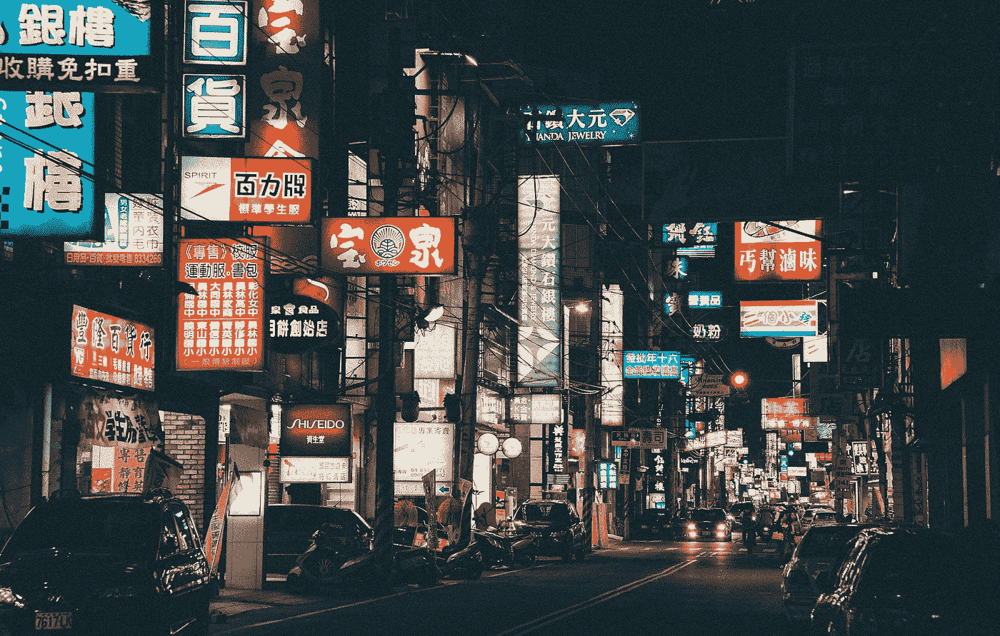

# 在中国生产对企业来说是一种风险

> 原文：<https://medium.datadriveninvestor.com/production-in-china-becomes-a-risk-for-companies-a6badba84454?source=collection_archive---------19----------------------->

(Picture from tookapic on pixabay.com)

第一季度发表的 ASPI 报告描述了对维吾尔少数民族的剥削，清楚地表明了中国共产党将会犯下哪些罪行。根据 1930 年关税法**第 307 节&2015 年贸易便利和贸易执行法**的规定，使用强制劳动力制造的商品不得进口到美国。严格地说，这可能会影响到所有在中国制造的产品或含有来自中国的个别成分的产品。

## 中国的行为迫使美国适用法律

迄今为止，这些法律并没有得到一贯的实施。除其他因素外，这是因为许多供应链与中国紧密交织在一起。为了更好地利用这种不对称性，中国不仅在新疆，而且在全国范围内开始使用维吾尔族强迫劳工。这使得有针对性的方法变得复杂，在这种方法中，本国和盟国的经济不会受到太大影响。

然而，由于贸易战和疫情电晕，这种情况正在改变。许多公司正在将供应链从中国的影响中解放出来。中国对其邻国持续的经济、政治和军事侵略也是迫使美国采取行动的事实。亨利·基辛格写道:

> 考虑到亚洲霸权的威胁——不管是哪个政权——美国会采取行动，就像它在第二次世界大战中对日本和冷战中对苏联所做的那样。(亨利·基辛格《美国的挑战》)

另一个强调国会和参议院对中国采取行动的紧迫性的事实是中国共产党犯下的令人难以置信的侵犯人权/罪行。这不仅包括香港案件，尤其是所谓的器官摘取([中国法庭](https://chinatribunal.com/))和集中营，在那里穆斯林少数民族被塞进了数百万人当中。

2020 年 7 月 1 日，发生了以下事情:

> [*发布新疆供应链业务公告*](https://www.state.gov/issuance-of-the-xinjiang-supply-chain-business-advisory/) *今天，美国国务院、美国财政部、美国商务部和美国国土安全部发布公告，警告企业注意与从事侵犯人权行为的实体的供应链环节的风险，包括在新疆和中国其他地方的强迫劳动。*
> 
> *新闻声明* [*国务卿迈克尔·庞培*](https://www.state.gov/biographies/michael-r-pompeo/) *2020 年 7 月 1 日*

大量当局/部委参与表明这是一个极其严重的迹象。**接下来将很快采取行动，如果制裁名单已经准备好，这并不奇怪，这些名单将在未来几周内使用，很可能是在选举之前。**

## 该法律的实施将公司置于风险之中

融入中国供应链并向美国出口商品的每一家公司都会受到影响。最终，这些商品是完全在中国制造，还是仅从中国获得初级产品，都将不再重要。因此，中国的业务可能会变成一种无法再计算的风险，尤其是暴露在风险之下的公司可能会面临非常大的困难。

另一项将极大增加压力的法律是国会一致通过的《香港自治法》。此前，参议院已经通过了一项同名法律草案，因此，目前提交给参议院的《香港自治法》草案很可能很快获得通过。

基本上，《香港自治法》是关于:

> *《香港自治法》授权对被列入年度颠覆香港自治名单的外国个人实施制裁。如果国务院第二次发现这样的人，他们必须受到没收财产和禁发签证的制裁。美国国务院还被要求确定与中国官员进行过重大交易、参与破坏香港自治的外国银行。这些银行将受到总统可以选择的一系列金融制裁。但在这些银行被认定的第二年，它们必须接受该法案概述的所有制裁，包括拒绝从美国金融机构获得贷款，以及禁止交易美国政府债务。*
> 
> *Sherman，Yoho 为捍卫香港自治提出众议院伴侣制裁立法—*[*https://Sherman . House . gov/media-center/press-releases/Sherman-Yoho-introde-House-Companion-Sanctions-Legislation-in-Defense*](https://sherman.house.gov/media-center/press-releases/sherman-yoho-introduce-house-companion-sanctions-legislation-in-defense)

这意味着不仅中国国内的商品生产可以自由支配，而且可以进入世界金融体系的网络。所有这些都将产生严重的后果，并将极大地塑造未来，等等。

## 长期过程

总的来说，一个决定未来几十年的过程已经开始。美国作为盎格鲁圈(英联邦王国，英联邦国家+日本)的中心，它本身很可能是西方阵营的中心，将继续是主要的霸权。从长远来看，贸易、市场准入、商业组织/网络、金融中心/流动、通信和其他许多方面都将受到当前行动和由此产生的法规的影响。

正如 Harald Malmgren 多年前所描述的那样，全球化将按菜单点菜。此外，政治将再次在各自的经济中扮演更重要的角色。**政治的首要地位又回来了**，这将要求服从。无国籍的跨国公司很可能会慢慢消失，并让位于更加以母国政策和目标为导向的方向。

政治不仅会威胁制裁，还会产生激励。在西方世界，激励往往比制裁更受关注，这是民主取向的一种表现，也是经济与国家之间相对距离的结果。**这些变化不仅会导致输家，也会导致赢家。**

约翰尼·亨德森