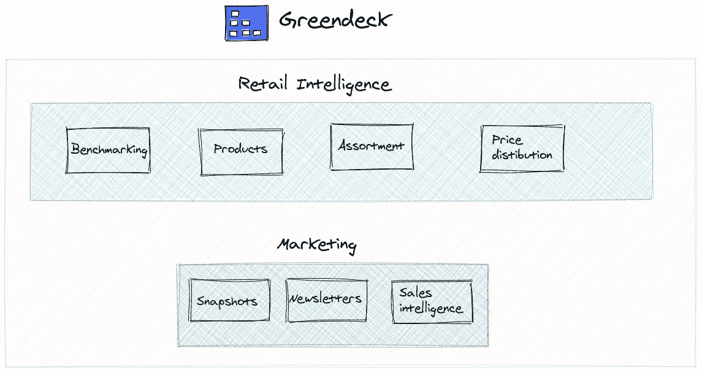
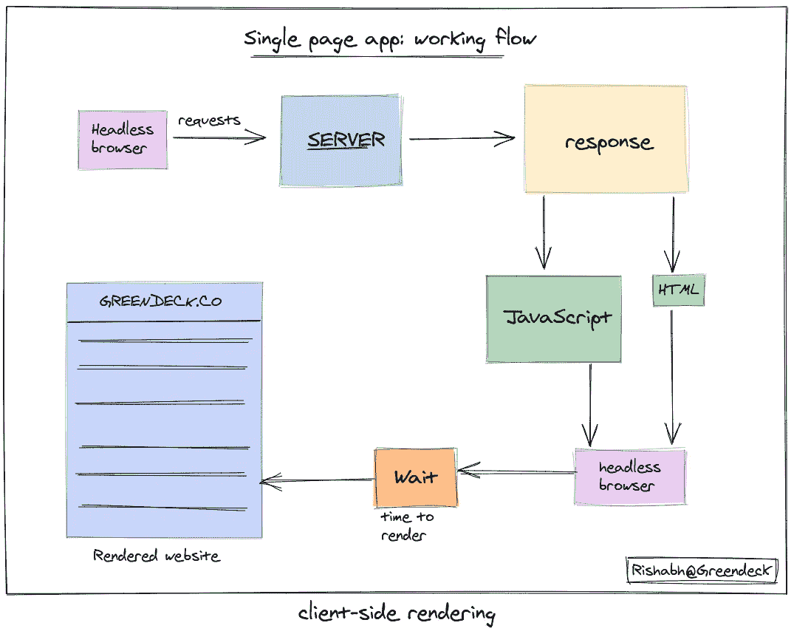
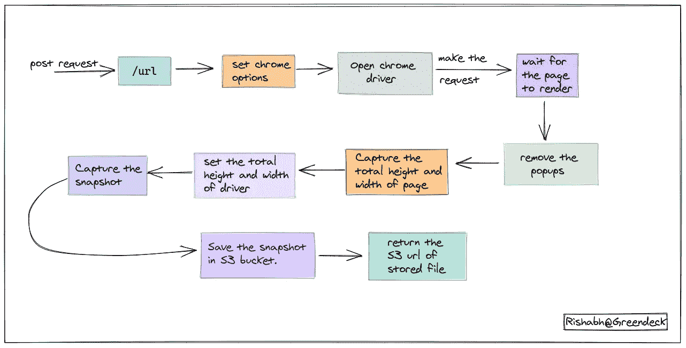

# 用于大规模获取网站截图的生产就绪型架构

> 原文：<https://medium.datadriveninvestor.com/production-ready-architecture-for-fetching-websites-screenshots-at-scale-5094c31f6324?source=collection_archive---------14----------------------->

在 [**Greendeck**](http://greendeck.co) ，我们还向我们的客户提供**市场情报**，为此，我们每天捕捉各种网站和时事通讯的数千张快照。



Greendeck Product offerings

**市场情报和捕捉快照有什么关系？**

电子商务商店需要跟踪如此多的变量，以设定其产品的定价、报价和销售。他们需要跟踪竞争对手产品的定价、他们正在进行的销售、他们的简讯、优惠以及他们在网站首页上展示的产品。

这就是为什么我们需要捕捉每个竞争对手网站的首页和他们发送的简讯的快照。

**这对任何人都有帮助？**

对**营销人员很有帮助。**因为营销人员可以很容易地知道这个特定的品牌在这个特定的日子进行销售，并且他们也通过他们的时事通讯推广他们的新产品。这有助于他们快速做出决定。

在[之前的博文](https://blog.greendeck.co/beyond-requests/)中，我讨论了 Greendeck 零售智能部分的数据端核心。

在这一篇中，我将涉及到跟踪电子商务商店的一些营销活动的数据方面。这些主要包括；跟踪他们的网站，他们的特色产品，他们正在进行的销售，以及他们发送给客户的简讯。

[](https://www.datadriveninvestor.com/2020/01/16/software-development-process-how-to-pick-the-right-process/) [## 软件开发过程:如何选择正确的过程？数据驱动的投资者

### 软件是任何企业组织成功的生命线。没有软件的帮助，一个…

www.datadriveninvestor.com](https://www.datadriveninvestor.com/2020/01/16/software-development-process-how-to-pick-the-right-process/) 

构建这项服务就像构建我们自己的小型网络存档机器一样。这非常有趣，我们将与您分享我们正在做的事情。

主要是两个服务完成所有这些工作。一个是**快照服务**另一个是**简讯服务。**

## 快照服务

简而言之，给定一个网站 URL 或 HTML，该服务捕获整个页面的快照，并将其存储在亚马逊 S3 桶中。它 24x7 全天候运行，所有这些都是自动完成的。它处理弹出窗口出现的所有问题，并使用无头浏览器完成所有任务。在这篇博文中，我们将了解它是如何做到所有这些事情的。

## 时事通讯服务

这项服务跟踪电子商务商店发送给客户的所有简讯。在这项服务中，他们是许多活动的部分，但那是另外一天。

**注意:**该服务大量使用快照服务在无头浏览器上呈现 HTML，然后捕获快照。

## 快照服务

快照服务是一个轻量级的 flask 应用程序，24x7 全天候运行，主要有两个端点:/url 和/html 端点。

/url 端点接受 post 请求中的 url 以及许多参数，如驱动程序必须等待页面呈现的时间。

首先，我们尝试在一个无头浏览器中打开给定的 URL，不做任何事情，然后捕获页面的快照。但是事情并不像预期的那样发展。以下是我们遇到的一些问题以及我们是如何解决的:

有些网站根本打不开。为什么？网站屏蔽了我们，因为他们知道请求资源的是代码，而不是人。所以，我们用**用户代理**来解决这个问题。

```
from selenium.webdriver.chrome.options import Optionschrome_options = Options()
chrome_options.add_argument('--headless')
chrome_options.add_argument('--no-sandbox')
chrome_options.add_argument('--disable-dev-shm-usage')user_agent = 'Mozilla/5.0 (X11; Linux x86_64) AppleWebKit/537.36 (KHTML, like Gecko) Chrome/76.0.3809.100 Safari/537.36'chrome_options.add_argument('user-agent={0}'.format(user_agent))
```

使用用户代理后，我们遇到了另一个问题，那就是生成的页面没有按照我们想要的方式呈现。为什么？**单页应用程序。**这种使用像 **Vue 和 React** 这样的框架构建单页面应用的革命在 web 开发行业非常普遍。驱动程序需要一些时间来组合服务器返回的所有沉重的 javascript，以将其呈现为一个完整的页面。

**解决方案**:等待几秒钟，让页面在浏览器中呈现。



Single-page app: working flow (Client-side rendering)

**c)阻止或删除弹出窗口:**

几乎我们访问的每个网站都会在你访问的时候闪现一些弹出窗口。它可以是一个正在运行的服务，或者只是一个嵌入式页面来订阅他们的时事通讯。我们还需要在截图之前删除它们。

**解决方案**:在弹出窗口的 **Xpath** 和弹出窗口的类名等相关的 post 请求中，传递所需的参数和网址，以便 chrome 驱动程序可以捕获弹出窗口元素，然后我们可以使用`click`函数将其移除。

```
from selenium import webdriver
from selenium.webdriver.support.ui import WebDriverWait
from selenium.webdriver.support import expected_conditions as ECdriver = webdriver.Chrome()element_present = EC.presence_of_element_located((By.XPATH, popup_xpath))WebDriverWait(driver, time_delay).until(element_present)driver.find_element_by_xpath(popup_xpath).click()
```

**d)** **捕捉页面的完整高度和宽度:**

我们需要捕捉一个单一的快照网站的完整页面。为此，我们需要通过从顶部`(0,0)`向下滚动到底部来计算页面的总高度和宽度，以便我们可以进一步设置 chrome 驱动程序的高度和宽度。

**快照服务工作:**

1.  通过一个端点上的 post 请求接受 url/html。
2.  像设置用户代理一样，在打开驱动之前设置 chrome 选项。
3.  打开驱动程序。
4.  提个要求。
5.  由于是单页应用程序，请等待页面呈现。
6.  通过再次刷新页面或单击来删除弹出窗口。
7.  从上到下(0，0)滚动到底部，以捕捉要捕捉的页面的完整高度和宽度。
8.  设置驱动器的宽度和高度。
9.  捕捉快照。
10.  将捕获的快照存储在 S3 存储桶中，然后返回存储文件的 url。



Snapshot service working

这项服务需要每天捕获快照。为了实现这一点，我们使用了一个名为 [Apache airflow](https://airflow.apache.org/) 的工作流管理工具。我们已经通过构建服务完成了我们的工作，剩下的调度部分全部由气流处理。

下一篇文章将会介绍简讯服务是如何工作的，以及它是如何利用快照服务来完成这项工作的。