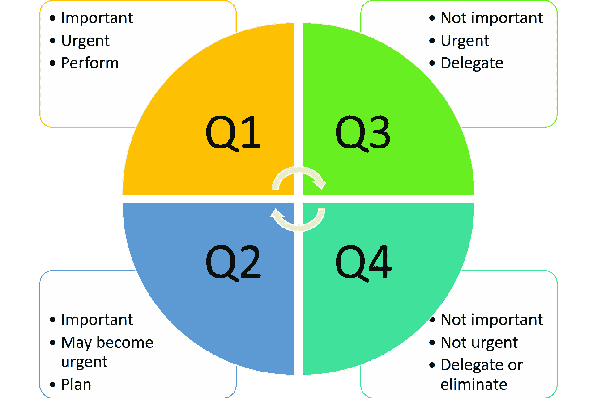

# 生产力不仅仅是我们做什么，也是我们不做什么

> 原文：<https://medium.datadriveninvestor.com/productivity-is-more-than-what-we-do-its-also-what-we-don-t-do-b0e895bd7199?source=collection_archive---------18----------------------->

## 美国总统德怀特·戴维·艾森豪威尔的建议帮助我们实现最重要的目标

Photo by [Vidar Nordli-Mathisen](https://unsplash.com/@vidarnm?utm_source=unsplash&utm_medium=referral&utm_content=creditCopyText) on [Unsplash](https://unsplash.com/s/photos/walking-up-steps?utm_source=unsplash&utm_medium=referral&utm_content=creditCopyText)

在德怀特·戴维·艾森豪威尔成为美国第 34 任总统之前，他是一名五星上将，也是欧洲盟军远征军的最高指挥官。在后一个角色中，他策划并指挥了对北非和诺曼底的入侵。他有一种不可思议的能力，能够在极度紧张的时候做出正确的决定，采取正确的行动来取得正确的结果。他做的每一个决定，采取的每一个行动都是生死攸关的事情。

> “艾森豪威尔的行动提供了现代设计理论在实践中的范例，特别是面对复杂的问题，管理多个利益相关者的利益，以及建立共识。”— [美国陆军少校达伦·r·阿尼](https://apps.dtic.mil/dtic/tr/fulltext/u2/a623447.pdf#:~:text=Eisenhower%E2%80%99s%20planning%20and%20decision-making%20process%20can%20educate%20a,planning%20that%20exemplifies%20ideas%20inherent%20in%20design%20theory.)

谢天谢地，我们中的大多数人永远不会发现自己处于艾森豪威尔所面临的可怕境地，但有时度过一天会感觉像是一种极端耐力的锻炼。关于艾森豪威尔的决策能力和[创造共识的能力，已经有很多论文和书籍，但是这篇文章主要关注他采用的一个相对简单的策略，我们都可以采用这个策略来提高我们的能力，使我们更有效率，在相互冲突的优先事项中做出选择，并实现我们最重要的结果。他使用的工具就是众所周知的艾森豪威尔矩阵。](https://medium.com/becoming-unstoppable/tips-for-gaining-consensus-64a1c23a637b)

# 艾森豪威尔矩阵是获得结果的关键。

艾森豪威尔认为，最佳结果来自于把我们的时间、精力和注意力集中在一项特定任务的相对重要性和紧迫性上。你可能会觉得这幅艾森豪威尔矩阵图很熟悉；《高效能人士的七个习惯》*的作者斯蒂芬·柯维提供了一个版本。*

Credit: Patricia Haddock

使用艾森豪威尔矩阵是决策、时间管理以及长期、中期和短期规划的宝贵工具。在宏观和微观层面上对每个象限的任务进行优先级排序，有助于我们更容易地逐月、逐周、逐日完成与目标相关的任务。从微观(我们现在所做的)到宏观(我们的长期目标)的每一次迭代都让我们更接近实现我们最大、最复杂、最重要的生活和工作目标。这是一个包罗万象的矩阵，旨在最大限度地提高生产力和实现目标。

> “每天早上计划当天事务并按照计划行事的人，身上带着一根线，将引导他穿过最忙碌生活的迷宫。”—维克多·雨果

# 象限 1:最重要和最紧急的任务

象限 1 标准很简单。任务必须是只有我们能完成的，重要的，*和*紧急的。当一项任务符合这个标准时，我们可以创建一个计划来实现它。每个月，我们都会根据象限 1 的标准，决定当月必须完成的前五项任务。然后我们:

*   将这些任务分解成这个月的每周任务，并专注于下周的具体任务。
*   在我们的日历上设定几个时间段来完成这些任务。当事情发生时，每周计划给了我们在日历上移动事情的灵活性——就像它通常做的那样。
*   将计划限制在每天最重要的五项任务上；在我们开始之前，更多的可能看起来是压倒性的。如果我们在一周内完成了最初五个中的一个，我们可以添加另一个来代替它。
*   避免安排一整天。我们需要空闲时间来处理日常事务，并退一步放松。

> "重要的事情很少是紧急的，紧急的事情也很少是重要的."—德怀特·艾森豪威尔

# 象限 2:在任务变得紧急之前就计划好

有些任务并不紧急，但需要我们的关注，以确保它们不会变得紧急。这就是逐月和逐周矩阵发挥作用的地方。他们给了我们一幅我们需要计划的管道图。虽然这些活动并不紧急，但它们需要我们的关注，必须在变得紧急之前安排在我们的日程表上。例如，根据合同，我们将在 6 个月内交付一本书的手稿或项目计划。因为这个任务很重要，但并不紧急，所以它位于象限 2；然而，重要的子任务可能是紧急的，例如开始我们的研究，安排采访，交付书的大纲或项目计划，等等。这些重要、紧急的子任务位于象限 1。

 [## 在家工作如何提高我的工作效率|数据驱动型投资者

### 在家工作确实激发了我最大的潜能，让我更有效率。因为在家工作给了我…

www.datadriveninvestor.com](https://www.datadriveninvestor.com/2020/07/29/how-working-from-home-increased-my-productivity/) 

# 象限 3:要委派的任务

象限 3 有不同的应用，取决于我们是企业家还是职业人士。让我们来看看每一个。

## 企业家

如果我们是一名企业家，我们在业务上做得越多，成功和满足感就越少。在我们的业务中工作*意味着我们专注于其他人可以为我们完成的任务。实际上，我们已经成为了公司的雇员。就我个人而言，我创业是因为我不想成为任何人的雇员——甚至是我自己的雇员。我们的目标是通过做只有我们能做的事情来发展我们的业务，所以我们需要摆脱其他的事情。*

我们必须学会雇佣帮手，依靠那些能够处理日常活动或我们现在不知道如何做或不想做的活动的专家。许多企业家不愿意让别人接手一项任务，因为我们不愿意放弃控制权。然而，试图自己做每件事是一种失败的邀请。我们已经戴了太多的帽子，需要把一些帽子交给其他人，所以我们可以专注于获得我们需要的结果。为什么要花费我们几个小时的时间去做一些我们很容易让别人做的事情呢？

## 职业专家

不是每个在职的人都可以选择授权。事实上，我们中的许多人都是经理象限 3 任务的委托人。它们成为我们象限 1 任务的一部分。我们也有自己的象限 3 任务，我们不能像常规报告那样委派，所以我们需要计划它们。在时间允许的情况下，这些任务被塞进了我们的日程表。我们还可以使用一些工具来更有效地完成象限 3 的任务。

学会忽略邮件。时间管理和组织专家通常建议人们关闭“你有邮件”通知。设定一天中查看和回复邮件的时间。使用过滤器和规则来组织需要立即关注的传入电子邮件。

> “……通过查看电子邮件，你冒着做别人想让你做的事情的风险。每次打开电子邮件，你都应该考虑它是否比你任务清单上的其他事情更重要——但实际上，我们当中有多少人真的会这么做？”— [锡德·萨瓦拉](https://sidsavara.com/do-not-check-email-in-the-morning/)

**捆绑常规任务。**当我们将日常活动打包或分批，在一个集中的时间段内完成时，我们的工作效率更高，完成任务也更快。

变得井井有条。混乱会耗尽生产力和效率。我们希望尽可能快地执行象限 3 的任务，因此建立[一个系统](https://medium.com/swlh/cures-for-incurable-disorganization-d19f0e9d741c)来归档和组织我们的物理和电子工作空间对于效率是必要的。

# 象限 4:消除

许多不必要的任务都落在了这个象限——我们可能有一天要做或者可能有一天需要做的事情。就像一个杂七杂八的文件夹。垃圾进去了，什么也没出来。通常，当我们拖延时，我们在这个象限工作。通过识别我们目前正在做的所有事情，落入象限 4，我们可以认识到我们的习惯在哪里负面影响我们的生产力，并可以开始用更有效的习惯来取代它们。

# 终极成就系统

艾森豪威尔矩阵之所以有效，是因为它是一个行之有效的过程，可以将巨大的目标分解成可行的任务，并消除一切既不重要也不紧急的事情。它的一些功能来自于创建任务列表这一简单的行为。维克森林大学的一项研究表明，制定完成任务的计划可以让我们摆脱担心任务时的焦虑。仅仅创建一个清单就能保证不会有任何侥幸心理。

> “这种计划行为减轻了大脑的负担，大脑正在努力记住我们必须做的所有事情。释放头脑中未完成任务的负担，让它变得更有效率。”— [法纳姆街](https://fs.blog/2013/02/the-psychology-of-the-to-do-list/)

当我们具体化我们需要做的事情时，我们大多数人都会有一种控制感。我们不会为一个目标或任务的大小而烦恼，而是将它分解成可行的部分。当我们完成每一项任务时，我们看到朝着我们的大而艰巨的目标前进，这增强了我们的自信。我们有一天可能会实现的看似模糊的东西会变成一个明确的目标，伴随着相关的更小的任务。

罗伯特·莫伊勒博士在他的优秀著作《一小步可以改变你的生活:改善之道》中解释了我们如何将改善运用到我们的生活和工作中，改善是一种日本技术，通过微小而稳定的步骤获得巨大而持久的成功。它包括识别我们觉得最不容易接受的最小的任务。当我们完成每一个小任务时，我们会打破更多的阻力，增强我们承担更大、更具挑战性的任务的能力。

艾森豪威尔矩阵为我们提供了一个识别通往成功之路的所有小步骤的系统，而改善之道向我们展示了如何克服阻力并找到完成每一步的动力。总之，我们有一个在生活和工作中实现不可阻挡的成功和满足感的系统。

> “趁困难还容易，勇敢地面对它；通过一系列小行动来完成伟大的任务。”—《道德经》

**访问专家视图—** [**订阅 DDI 英特尔**](https://datadriveninvestor.com/ddi-intel)