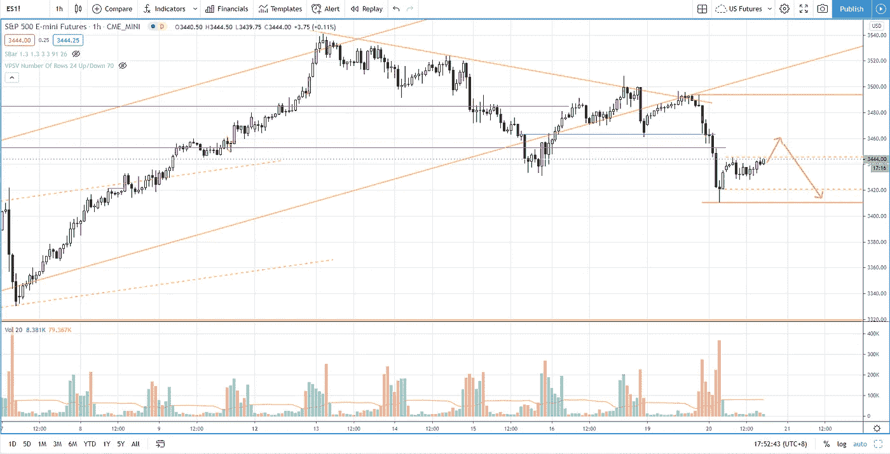

# 新手的有利可图的突破交易策略(根据教科书)

> 原文：<https://medium.datadriveninvestor.com/profitable-breakout-trading-as-per-the-textbook-s-p-500-day-trading-310d0d57feec?source=collection_archive---------21----------------------->

在交易回顾部分，你会发现如何像教科书一样一步一步地交易突破，再加上一些细微的差别，帮助你提高胜率。

观看视频，了解 2020 年 10 月 20 日交易时段标准普尔 500 指数期货的**每日市场分析。在这个视频中，我向你展示了上一个交易日的市场回顾和三分钟内的交易回顾(包括进场、出场和背后的原理)。展望未来，我将涵盖偏见，要注意的关键水平，我稍后的交易计划。**

## 时间戳

*   [1:07](https://www.youtube.com/watch?v=A2T_A5dTRCs&t=67s) 市场回顾
*   [3:45](https://www.youtube.com/watch?v=A2T_A5dTRCs&t=225s) 下跌趋势线在起作用
*   [4:30](https://www.youtube.com/watch?v=A2T_A5dTRCs&t=270s) 行业回顾
*   [8:50](https://www.youtube.com/watch?v=A2T_A5dTRCs&t=530s) 识别市场弱点
*   [9:47](https://www.youtube.com/watch?v=A2T_A5dTRCs&t=587s) 确定供应区
*   [10:13](https://www.youtube.com/watch?v=A2T_A5dTRCs&t=613s) 反转确认
*   当前的市场前景

如果你还没有看我在上一期的[每日市场分析视频](https://www.youtube.com/watch?v=lVUGo0d_vhQ)，以便更好地了解市场回顾和交易回顾。

**偏向** —中性(日内交易)；看涨(长期)

**关键点位** —阻力:3490–3500，3460；支持电话:3390-3420

**潜在设置** —在关键级别寻找潜在反转。

# 资源

**每周市场展望&最佳交易建议**直达您的收件箱:[https://www.tradeprecise.com/](https://www.tradeprecise.com/)

**职业免费**制图平台:创建账户→[www.TradingView.com](https://bit.ly/2U2Femd)

**非美国居民？** ( **、新加波**、澳洲、纽西兰、欧洲等……):[点击此处，存款 2000 新币](https://ji.hn/sgtiger)即可获得**免费股票(价值 100++ &美元)老虎经纪公司的欢迎礼物**

美国居民？[点击此处，当您存入 1500 美元](https://ji.hn/ustradeup)时，就有机会在 TradeUP 上获得一份**免费的 AMZN 股票(价值 3000++美元** ) & **欢迎礼物**

**无限制访问媒体文章** —加入以下:[https://priceactiontrading.medium.com/membership](https://priceactiontrading.medium.com/membership)

# 进一步阅读

 [## 摇摆交易的顶级仙股——HNRG、QEP、SNDL，告诉[巨大的上涨潜力]

### 找出这 4 只最便宜的股票——HNRG、QEP、SNDL，告诉他们基于回调可以进行摇摆交易…

medium.com](https://medium.com/datadriveninvestor/top-penny-stocks-for-swing-trading-hnrg-qep-sndl-tell-huge-upside-potential-b4937a3ce955)  [## 低估的可操作高成长股第 2 部分— FVRR、优步、PYPL、JMIA

### 这些高成长股很可能在几天内被触发。找出我的交易计划与进入和止损…

medium.com](https://medium.com/datadriveninvestor/underhyped-actionable-high-growth-stocks-part-2-fvrr-uber-pypl-jmia-b24183668d20)  [## 市场修正，泡沫还是崩盘？标准普尔 500 价格行为分析

### 标准普尔 500 期货(es)昨日因供应激增下跌 2.5%，跌破上行通道。这是正常的…

medium.com](https://medium.com/datadriveninvestor/market-correction-bubble-or-crash-s-p-500-price-action-analysis-6f26e6698dbc) 

Photo by Author — Ming Jong Tey

Photo by Author — Ming Jong Tey

披露:如果您点击本文中的链接进行购买或开立账户，并将所需金额存入推荐的经纪人账户，我们将免费为您赚取佣金。

免责声明:本演示中的信息仅用于教育目的，不应作为投资建议。