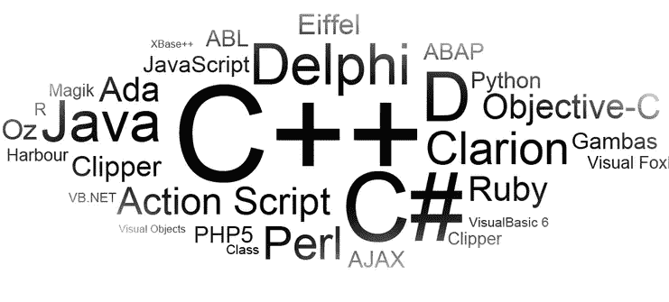
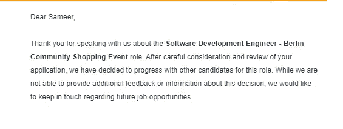

# 从头开始编程

> 原文：<https://medium.datadriveninvestor.com/programming-from-the-scratch-a1d66bb50670?source=collection_archive---------23----------------------->

你好，这几天我想了很多。我得出的结论是，写这个帖子很重要。你可能想知道为什么？

我被亚马逊拒绝了。这是人生最大的失望之一。这背后的原因是我是一个普通的开发人员，也是一个随着成长会忘记事情的人。问我的问题非常简单，比如“数组中插入和删除的复杂度是多少”或者“什么是堆栈和队列？”。我真的回答错了吗？他们永远不会告诉你拒绝的理由。

于是，我决定从头开始**编程。**我会独自完成，但我的想法是创造一个世界，让其他人不会因为同样的原因感到失望。我已经决定在 youtube 上做一个视频讲座系列，同时在 medium 上发布系列。视频讲座将更详细，而张贴将快速修改。所以如果你一周后有面试，你可以浏览一下这些帖子。所以你将有你的基本清除。

 [## 在不稳定的数字时代生存|数据驱动的投资者

### 如果你是一名计算机科学家，你可能已经注意到新的框架不断出现。编程…

www.datadriveninvestor.com](https://www.datadriveninvestor.com/2020/02/26/surviving-in-a-digital-age-of-instability/) 

下一件重要的事情是，你使用哪种通用编程语言并不重要。你仍然可以用这篇文章来修改，因为它们将是独立于语言的，而视频讲座将使用 C++来制作。所以如果你想用其他语言听同样的讲座。一定要写在视频的评论部分。

我将从写下在*亚马逊电话采访中问我的问题开始。*

*   栈和队列的区别是什么？
*   哈希是什么？
*   如果没有好的哈希函数会有什么问题？
*   什么是二叉查找树？
*   如何删除二叉查找树的一个节点？
*   如果你给你 *n 个*单词，并问你找出这些 *n 个*单词中的哪一个包含“x”作为字符。程序的复杂程度会怎样？
*   固定大小数组的插入和删除复杂度是多少？

你可能会觉得这些问题主要集中在数据结构上，但是要理解它们和它们的操作，谁应该让你的基础知识清晰到核心。

我们将在系列文章的下一篇中讨论这些后续主题。

关于我，我用 C++，python，C，C#和 Java 编程过。感觉 C++ 11/14 真的很好。所以我会在视频中使用它。

我将使用 Windows。下面是我将使用的 windows c++安装程序。

请随意问任何问题。你可以在这里和 youtube 上评论这个问题。