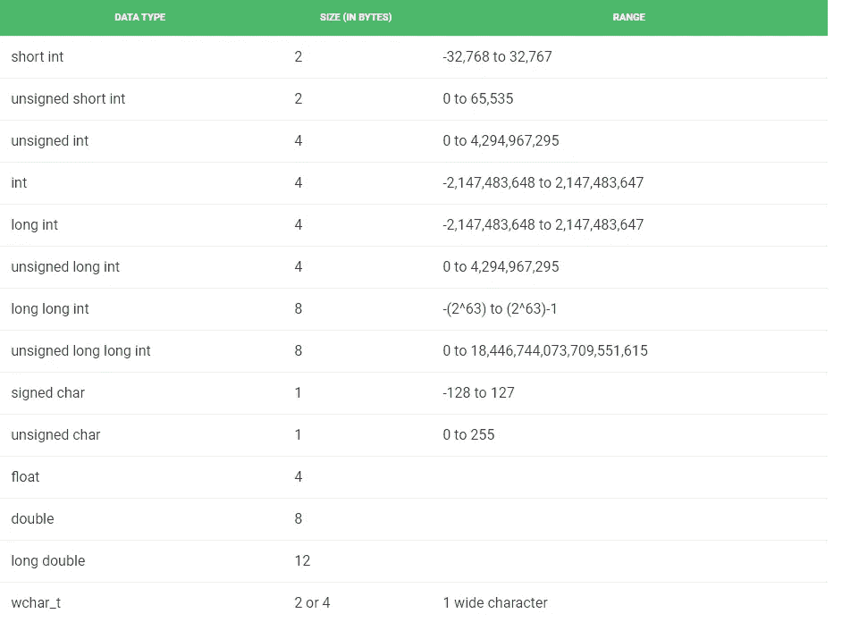

# 关于数据类型的面试问题

> 原文：<https://medium.datadriveninvestor.com/programming-fundamentals-data-types-29ca0bd1431d?source=collection_archive---------14----------------------->

这个世界上的一切都有质量。它占据空间。大多数都有名字。我们把它们归类。对于编程来说也是如此。

我们会以问答的形式回答所有的问题，因为这对你将来的面试会有帮助。对于详细的解释，我会提供 youtube 链接。

**什么是基本数据类型及其内存大小？**

Reference : [GeeksforGeeks](https://www.geeksforgeeks.org/).org

要理解 C++例子的所有内容，你可以浏览下面的视频。这个视频用详细的解释和例子解释了每一个概念。

**带签和不带签有什么区别？**

答案很简单。最高有效位(MSB)保留用于存储符号。在无符号的情况下，它用于存储值。

以上答案涉及十进制的二进制表示。建议通过下面的视频复习二进制到十进制和十进制到二进制的转换。

**无符号数据类型的最小值是多少？**

它将永远是零。也可以使用 limits 库 C++中的“std::numeric_limits <unsigned short="">::max()”进行检查。</unsigned>

**如何确定数据类型的内存大小？**

*   在 C++中使用 **sizeof()** 运算符。
*   在 python 中使用`sys.getsizeof(x).`

如何声明在整个程序中不变的变量？

Const 关键字

【const 和 constexpr 有什么区别？

const 关键字在运行时计算，而 constexpr 在编译时计算。如果你已经知道它的值，那么总是推荐使用 constexpr，因为它会节省你的运行时间。

如果您使用的是 Windows，并且在设置 g++编译器时遇到了问题。此视频解释了如何在 windows 中设置 C++编译器。