# 编程恐怖和幽默第 3 部分

> 原文：<https://medium.datadriveninvestor.com/programming-horror-and-humor-part-3-a0bdea3f56f4?source=collection_archive---------5----------------------->

## 继续笑，因为太搞笑了…

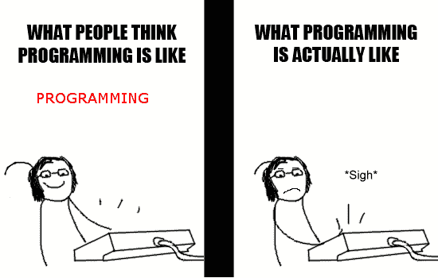

Pic credits : giphy

程序员的生活充满了过山车。这是编程恐怖和幽默系列的第三部分。对于最后两部分，请滚动到文章的结尾。

# 其他一些最好的系列—

> [**三十天的机器学习 Ops**](https://medium.com/coders-mojo/day-1-of-30-days-of-machine-learning-ops-7c299e4b09be?sk=4ab48350a5c359fc157109e48b1d738f)
> 
> [**30 天自然语言处理(NLP)系列**](https://medium.com/coders-mojo/quick-recap-30-days-of-natural-language-processing-nlp-with-projects-series-ceb674e3c09b?sk=ca09b27b3d5867f23ab4dc367b6c0c32)
> 
> [**30 天数据工程与项目系列**](https://medium.com/coders-mojo/day-1-of-30-days-of-data-engineering-894822fcb128?sk=76ba558bfe2d9f85cbe741e505295531)
> 
> [**数据科学与机器学习研究(论文)简体**](https://medium.com/coders-mojo/day-1-data-science-and-ml-research-papers-simplified-a68b00a3b1c4?sk=56136229ff738bd734f19d2b6953f78c) ******
> 
> [**60 天数据科学与 ML 系列带项目**](https://medium.com/coders-mojo/day-1-day-60-quick-recap-of-60-days-of-data-science-and-ml-6fc021643d1?sk=4e75e043b7630a9f963562ebac94e129)
> 
> [**100 天:你的数据科学与机器学习学位系列与项目**](https://medium.com/coders-mojo/100-days-your-data-science-and-ml-degree-part-3-c621ecfdf711?sk=1a8c7b0c204d73432d56b7d1a3a26474)
> 
> [**你应该知道的 23 个数据科学技巧**](https://ai.plainenglish.io/23-data-science-techniques-you-should-know-61bc2c9d1b3a?sk=1680c36193eb22198974c9008d62a33c)
> 
> [**技术面试系列—编码问题精选清单**](https://medium.com/coders-mojo/mega-post-tech-interview-the-only-list-of-questions-you-need-to-practice-ee349ea197bb?sk=fac3614684daff4b50a70c0a71e4d528)
> 
> [**用最热门的问题系列**](https://medium.com/coders-mojo/system-design-made-easy-quick-recap-of-complete-system-design-34af7e3aedfb?sk=bdd6a19edc1f3ce4a5064923f5b68721) 完成系统设计
> 
> [**完成数据可视化及预处理系列与项目**](https://medium.com/coders-mojo/complete-data-preprocessing-and-data-visualization-with-projects-mega-compilation-part-2-41584ef0920e?sk=842390da51689b8d43148c3980570db0)
> 
> [**完成 Python 系列与项目**](https://medium.com/coders-mojo/complete-python-and-projects-mega-compilation-7ec8f7adfe71?sk=ee0ecf43f23c6dd44dd35d984b3e5df4)
> 
> [**完成高级 Python 系列与项目**](https://medium.com/coders-mojo/complete-advanced-python-with-projects-mega-compilation-part-6-729c1826032b?sk=7faffe20f8039fa57099f7a372b6d665)
> 
> [**Kaggle 最会教你的笔记本**](https://medium.com/coders-mojo/my-list-of-kaggle-best-notebooks-topic-wise-data-science-and-machine-learning-part-2-84772863e9ae?sk=5ed02e419854a6c11add3ddc1e52947f)
> 
> [**Git 开发人员完整指南**](/the-complete-developers-guide-to-git-6a23125996e1?sk=e30479bbe713930ea93018e1a46d9185)
> 
> [**打赏 Github Repos**](https://medium.com/coders-mojo/6-exceptional-github-repos-for-all-developers-part-1-21e8fa04e150?sk=9140b249af6fe73d45717185fad48962)**—Part 1**
> 
> [**打赏 Github Repos**](https://medium.com/coders-mojo/6-exceptional-github-repos-for-all-developers-part-2-3eec9a68c31c?sk=8e31d0eb7eb1d2d0bbbcecaa66bd4e7e) **—第二部**
> 
> [**所有数据科学和机器学习资源**](/best-resources-for-data-science-and-machine-learning-full-list-5ceb9a2791bf?sk=cf85b2cef95560c58509877a794577ff)
> 
> [**210 机器学习项目**](/210-machine-learning-projects-with-source-code-that-you-can-build-today-721b035649e0?sk=da5f593572a0261a6314afad99a0356c)

## 科技时事通讯—

> 如果你感兴趣，你可以加入我的时事通讯，通过它我向超过 30，000 名读者发送技术面试技巧，技术，模式，黑客——软件开发，ML，数据科学，创业公司和技术项目。可以订阅 **Tech Brew :**

 [## 点火器

### 数据科学，人工智能，人工智能和更多…点击阅读由 Naina Chaturvedi 撰写的 Ignito，子堆栈出版物。推出 7 个月…

naina0405.substack.com](https://naina0405.substack.com/) 

## Github —

 [## 编码器-world 04-概述

### 此时您不能执行该操作。您已使用另一个标签页或窗口登录。您已在另一个选项卡中注销，或者…

github.com](https://github.com/Coder-World04)  [## 编写高效的 Python 代码—第 1 部分

### Python 是科技界最流行、使用最广泛的编程语言之一。

naina0412.medium.com](https://naina0412.medium.com/writing-efficient-python-code-part-1-e02763632080) 

让我们开始吧！

## 多种颜色的代码

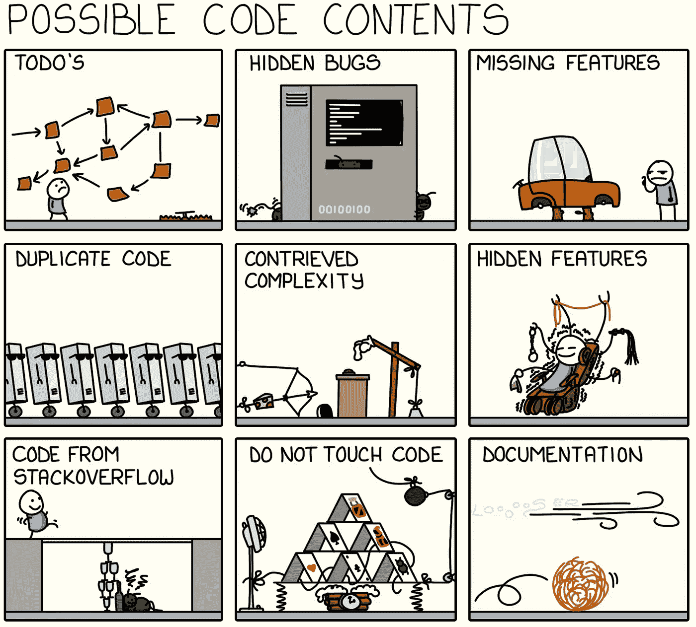

Credits : monkeyuser

## 当大便碰到屋顶时

 [## 如果编程语言是《权力的游戏》中的角色会怎样

### 最后一个很搞笑…

naina0412.medium.com](https://naina0412.medium.com/what-if-programming-languages-were-game-of-thrones-characters-ffc2c3018841) 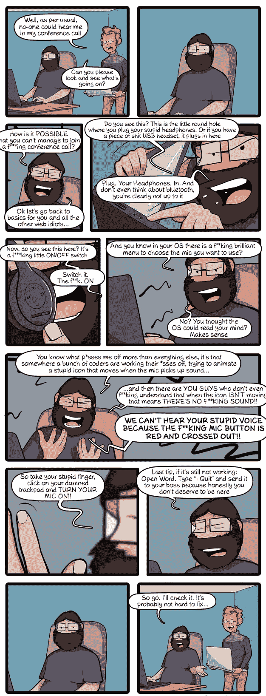

Pic credits : CommitStrip

 [## Python 中的统计简介—第 1 部分

### 统计很容易…真的吗？

medium.datadriveninvestor.com](/introduction-to-statistics-in-python-part-1-14e69ef05abe)  [## 编写高效的 Python 代码—第 2 部分

### 使用这些技巧和技术…

naina0412.medium.com](https://naina0412.medium.com/writing-efficient-python-code-part-2-4bf876712677) 

## 代码审查—恐怖秀开始

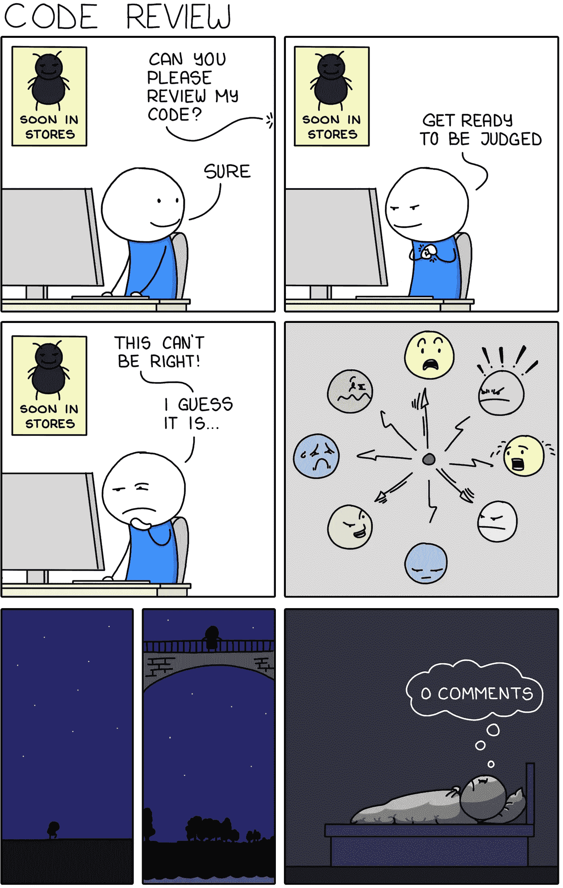

Credits: monkeyuser

 [## 6 面向所有开发者的特殊 GitHub 回购—第二部分

### 把它加入书签…它会给你很大的帮助

naina0412.medium.com](https://naina0412.medium.com/6-exceptional-github-repos-for-all-developers-part-2-3eec9a68c31c) 

## 艾的不幸遭遇

Credits : Pinterest

 [## 6 面向所有开发者的特殊 GitHub 回购—第 1 部分

### 把它加入书签…它会给你很大的帮助

medium.com](https://medium.com/coders-mojo/6-exceptional-github-repos-for-all-developers-part-1-21e8fa04e150) 

## 请给我啤酒— —

Credits : Safelyendangered

## 哈哈的笑..************

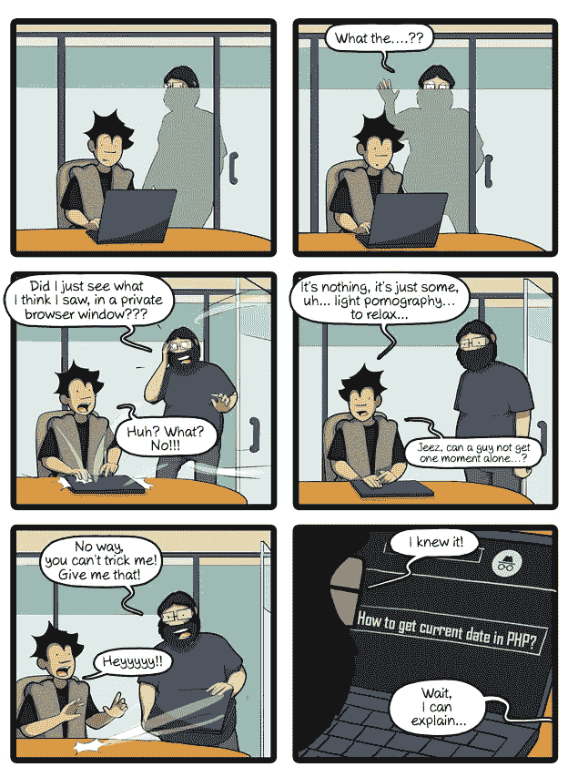

Credits : Commitstrip

## 内存问题

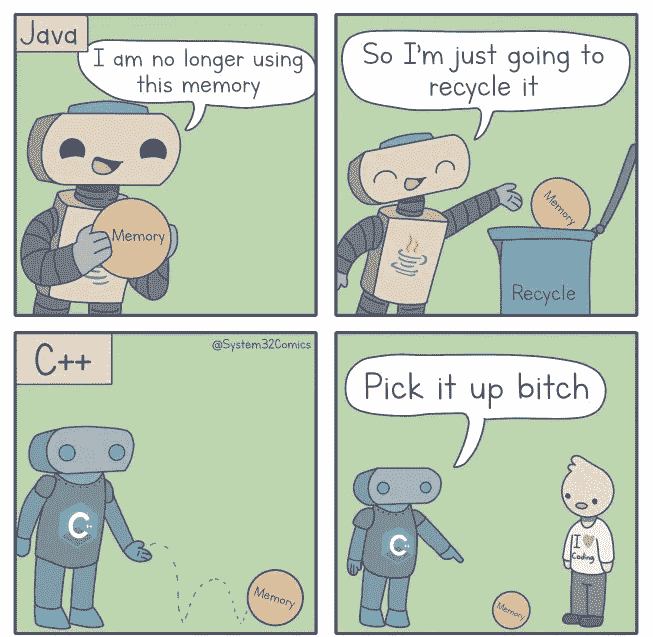

Credits : System32comics

## 爱恨关系

Pic credits : Pinterest

## 谁都经历过这种情况？

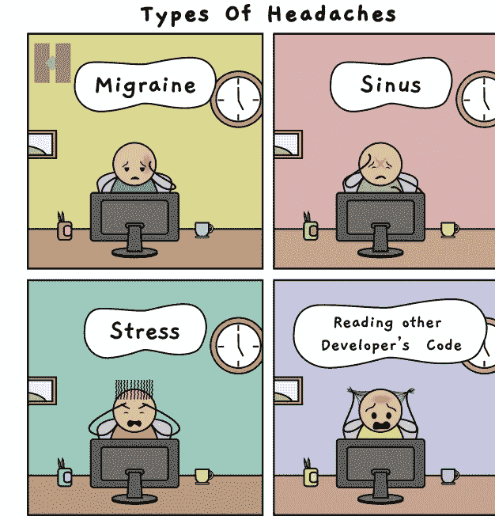

Pic Credits : Pinterest

## 看板恐怖

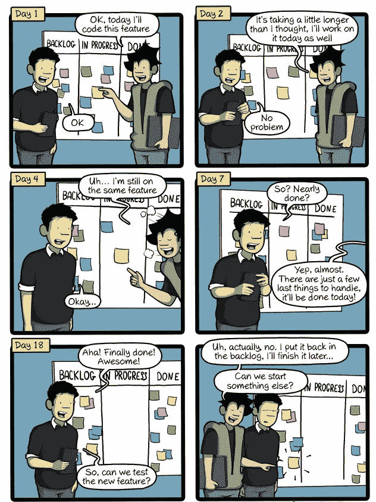

Pic credits : Pinterest

## 坚持住。

Credits : Pinterest

## 无聊的生活

Credits : Pinterest

## 周一早晨的忧郁——恐怖事件

Credits : monkeyuser

## 截止日期赛跑

Credits : Pinterest

## 乖还是淘气

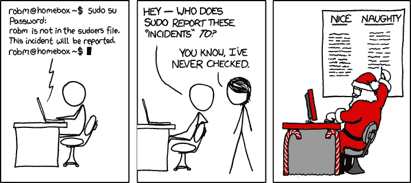

Credits : Dev Community

## 开枪！它过期了

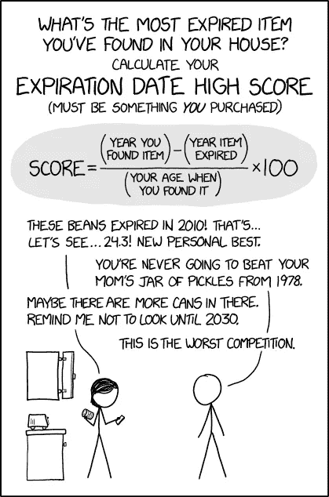

Credits : Pinterest

## 嗖嗖声…

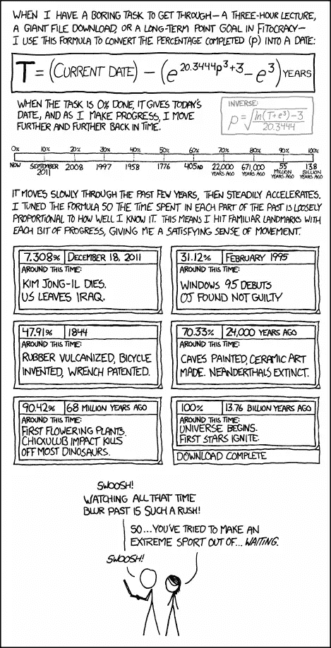

Credits : xkcd

## 程序员的悲伤阶段

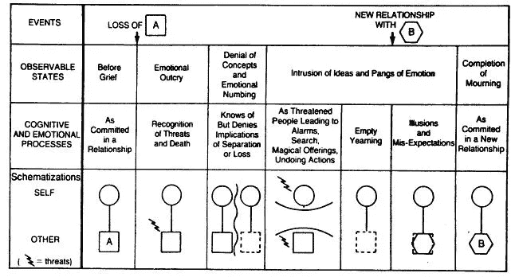

Credits : Pinterest

Credits : Pinterest

## (理想的)技术支持

Credits : Pinterest

## 创业机会

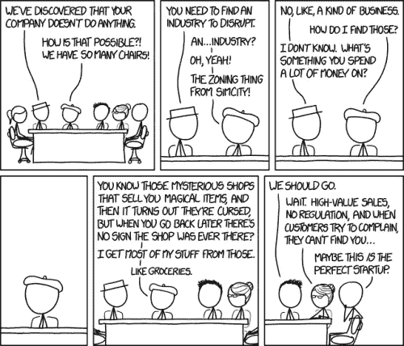

Credits : xkcd

## 古代科技双关语

Pic credits : xkcd

## 正则表达式是救世主

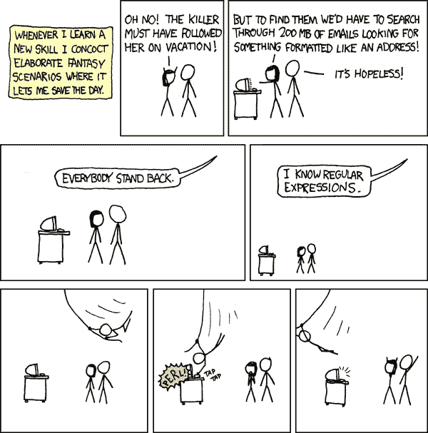

Credits : Pinterest

## Linux 悲剧

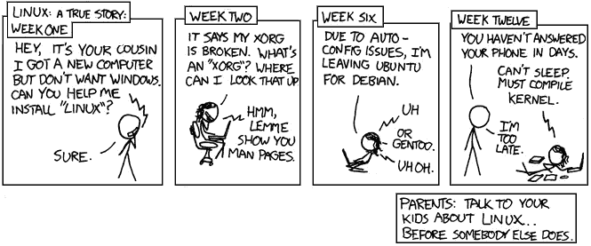

Credits : Pinterest

## 一有新的应用程序

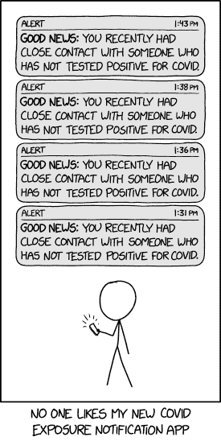

Credits : xkcd

***感谢阅读。继续学习编码 y'all :)***

*来源和感谢:xkcd，commitstrip，monkeyuser，pinterest*

# 推荐文章—

 [## Stack Overflow 分析了来自 60，000 多名软件开发人员的数据，包括他们的工作时间、语言…

### 以下是他们的发现…

medium.com](https://medium.com/datadriveninvestor/stack-overflow-analyzed-data-from-60-000-software-developers-hours-they-work-languages-they-476ac6ca0197)  [## 黑客地球调查了来自 76 个国家的 16000 名开发者——以下是我的发现

### 惊人的洞察力…

medium.com](https://medium.com/datadriveninvestor/hacker-earth-surveyed-16000-developers-from-76-countries-heres-what-i-found-dbd5d7c422b0)  [## 机器学习和人工智能如何改变电子商务的面貌？|数据驱动…

### 电子商务开发公司，现在，整合先进的客户体验到一个新的水平…

www.datadriveninvestor.com](https://www.datadriveninvestor.com/2020/11/19/how-machine-learning-and-artificial-intelligence-changing-the-face-of-ecommerce/)  [## Hacker Rank 分析了来自 10 万多名开发人员和招聘经理的数据——以下是我的发现

### 来自 100，000 多名开发人员和招聘经理的出色分析结果

medium.com](https://medium.com/datadriveninvestor/hacker-rank-analyzed-data-from-100k-developers-and-hiring-managers-here-is-what-i-found-a374b98e937e)  [## 编码原罪:令人捧腹的开发者自白

### “白板”是如何被嘲笑的

medium.com](https://medium.com/datadriveninvestor/coding-sins-hilarious-developer-confessions-f55eb342454e)  [## 编程幽默第 2 部分

### 继续笑，因为太搞笑了…

medium.com](https://medium.com/datadriveninvestor/programming-humor-part-2-f92cf5a26f2b)  [## 10 个让你着迷的诙谐编程笑话

### 这些太搞笑了…

medium.com](https://medium.com/datadriveninvestor/10-witty-programming-jokes-that-will-make-you-go-rofl-a53fbfb91943) 

## 访问专家视图— [订阅 DDI 英特尔](https://datadriveninvestor.com/ddi-intel)