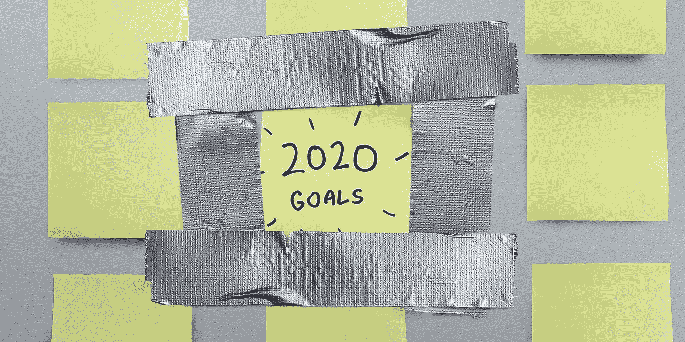
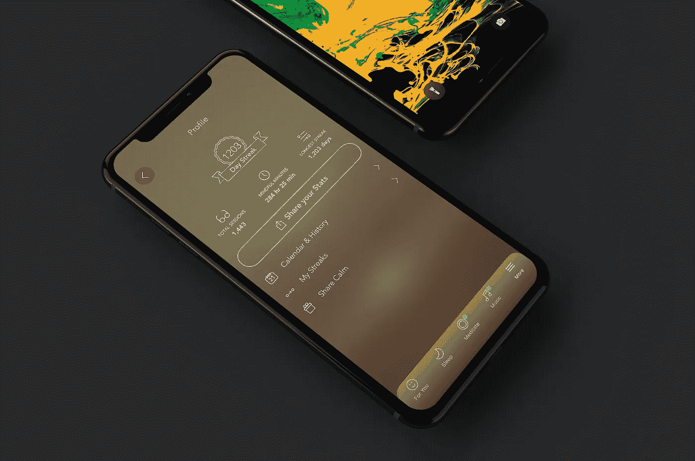
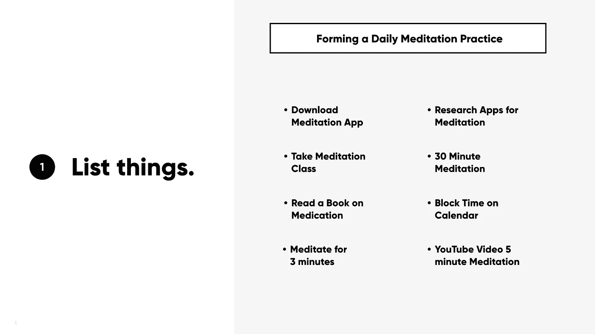
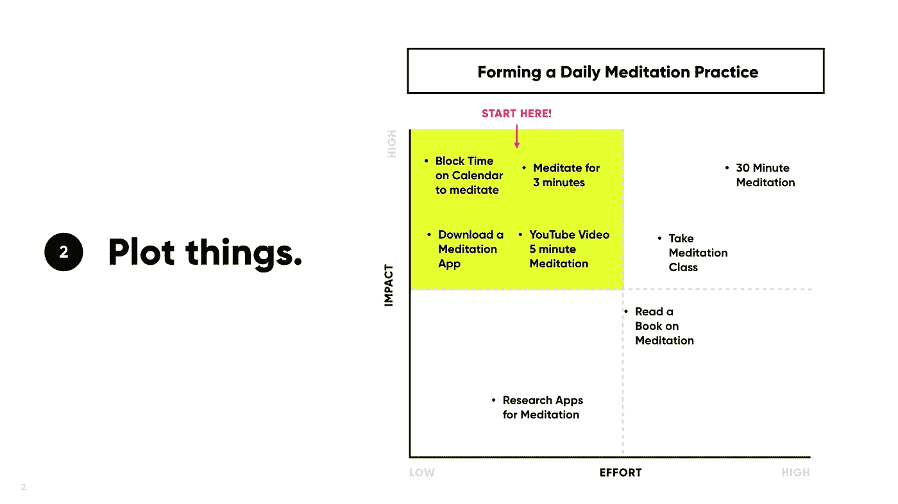
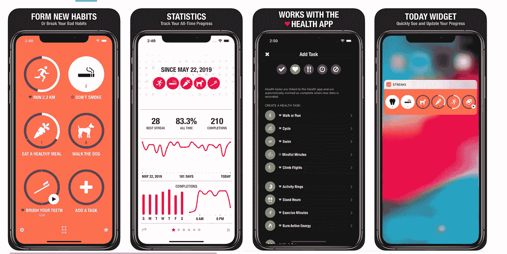

# 进步胜过完美:在创造改变时，积累对你有利的机会

> 原文：<https://medium.datadriveninvestor.com/progress-over-perfection-stack-the-odds-in-your-favor-when-creating-change-42ed34e6b046?source=collection_archive---------7----------------------->

# 你的新年决心进展如何？

我假设它正走向档案馆，以及 2019 年的剩余时间。这一点也不会让你难过。根据健身应用 Strava 对大约 8 亿次互动的研究, 2020 年 1 月 19 日是“放弃者日”——他们的数据显示大多数人在这一天放弃他们的新年决心。

不是你…也不是我…也不是 Strava 用户。大多数新年决心都是关于需要一些计划才能实现的重大改革。

那么，想要重新来过吗？让我们回到起点。

# 如何让决心坚持下去？

好消息是你可以在一年中的任何一天下决心。一月中的任何一天。一周中的任何一天和一天中的每个小时。因此，把“新年决心”所代表的整个时间表交易从桌面上拿掉。

现在，把你的决心重新组织成一系列的行动(步骤)，而不仅仅是一个巨大的、势不可挡的想法。举个例子，几年前我做了一个[决定](https://www.linkedin.com/pulse/stop-saying-youre-busy-start-feeling-better-pete-sena/):在读了丹·哈里斯的书 [*快乐 10%*](https://www.amazon.com/10-Happier-Self-Help-Actually-Works/dp/0062265423)后，我想学习如何冥想来发展正念。我的旅程是从先尝试[平静 app](https://www.calm.com/gp/mgvgz3)开始的。当这个计划不太奏效时，我转向尝试呼吸技巧。最后，我通过和一个朋友一起冥想找到了适合我的方法。*(下面是我的应用程序截图——在我写这篇文章的时候，我已经连续冥想了 1203 天。TLDR；这东西管用)*

# 首先列出所有有助于实现这个决心的事情

当我尝试每一步时，我确保将行动计划分成可征服的步骤(即，连续冥想三天，冥想 30 分钟)，而不是专注于崇高的不可能的梦想(即，一年中的每一天都冥想)。

 [## 跑步摆脱疯狂:锻炼如何提高你的生产力|数据驱动的投资者

### 没有比锻炼更好的方式来开始一天的工作了。我试着一周至少做四天，在…

www.datadriveninvestor.com](https://www.datadriveninvestor.com/2018/10/23/running-to-get-rid-of-the-crazy-how-working-out-increases-your-productivity/) 

如果你对你的决心(目标)进行逆向工程，你可以仔细看看实现它需要什么，然后创建一条前进的道路来解决每一步。

# 将你的目标绘制成图表并映射成微小的步骤

每当我着手一件感觉复杂的事情时，我喜欢用一个简单的影响/努力网格来帮助把它分解成小块的、可操作的部分。

从影响最大和努力最少的交叉点*(上图中的黄色方框)*开始，这样你就可以在一开始就体验成功。例如，在这种情况下，这将包括像跟随 [YouTube 视频](https://www.youtube.com/watch?v=i50ZAs7v9es&t=9s)上的五分钟冥想或冥想三分钟这样的事情。快速简单的点击可以帮助你克服拖延症，继续前进，实现你的目标。

当你把你的小成功扩大到一个全面的改变时，对大多数人都有效的一个习惯就是，嗯，习惯。以冥想为例，如果你认为你的一天会妨碍你实现日常习惯，那就在早上做第一件事。或者每天上午 11:30 关上办公室的门。关键是要承诺采取行动——所以把上午 11:30 的“会议”放在你的日程表上，确保你能参加。

***专业提示:*** *使用像* [*条纹*](https://itunes.apple.com/us/app/streaks/id963034692?mt=8) *这样的应用程序可以轻松跟踪任何事情，这有助于保持积极的强化流动。*

***你的 2020 年决心是什么？*** *与我和其他人评论和分享，这样我就可以成为你的责任伙伴，这有助于保持积极的强化流动。*

现在，回到你的新年决心:如果它仍然是你真正想要的东西，那么这是一个很好的迹象，它是首先要实现的完美目标。只要下定决心庆祝小小的胜利，你就走上了创造可持续变化的道路。

*原载于*[*https://www.linkedin.com*](https://www.linkedin.com/pulse/progress-over-perfection-stack-odds-your-favor-when-creating-sena/?published=t)*。*