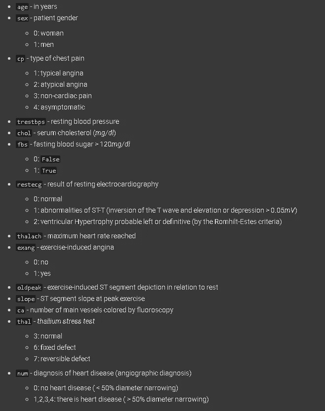
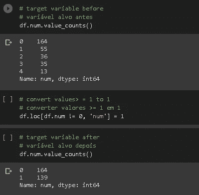
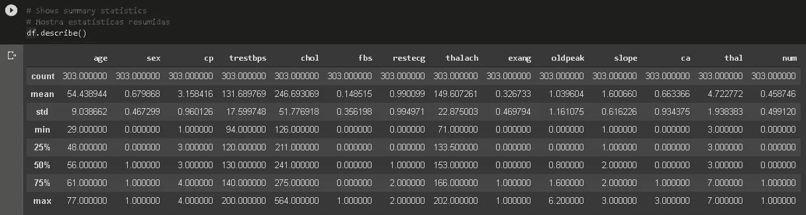
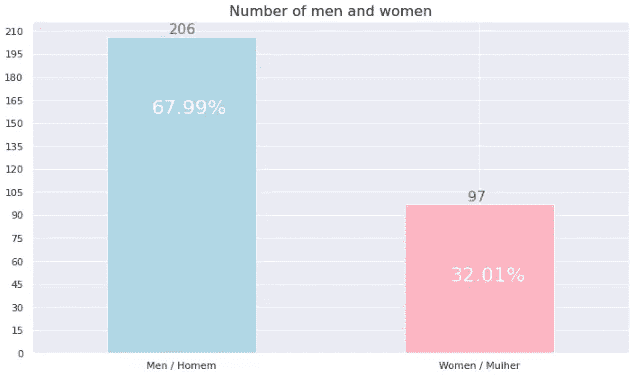
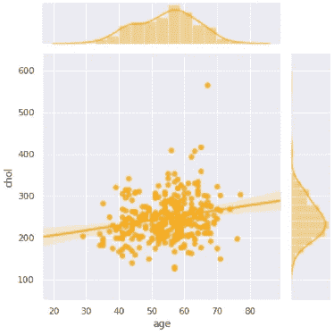
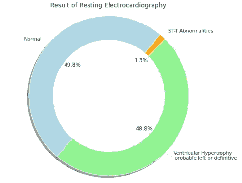
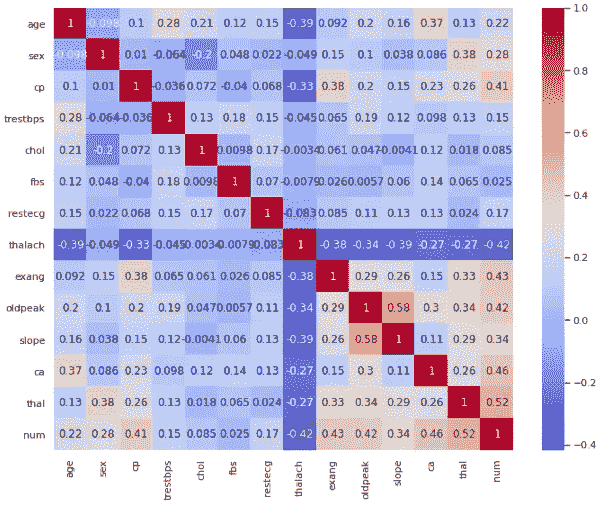
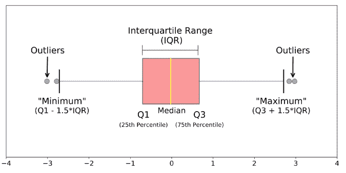
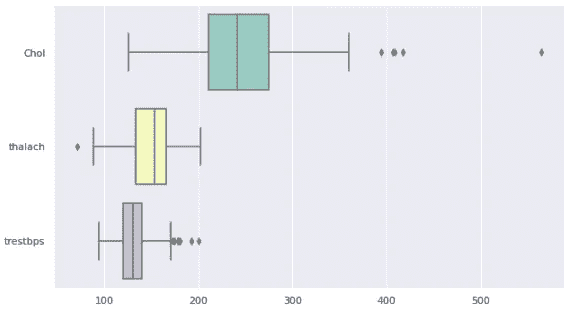

# 项目——心血管疾病

> 原文：<https://medium.datadriveninvestor.com/project-cardiovascular-diseases-b593a04c88?source=collection_archive---------11----------------------->

心血管疾病是心脏和血管的一类疾病或紊乱。这一类包括许多疾病，如先天性心脏病、风湿性心脏病、外周动脉疾病等。

尽管心血管疾病是世界范围内的主要死亡原因之一，但据估计，通过采取一些措施和改变生活方式，大约 90%的心血管疾病是可以预防的。

[image](https://img.medscape.com/thumbnail_library/is_191223_heart_disease1_800x450.jpg)

如今，*机器学习*领域有几种类型的研究，旨在构建预测模型，帮助医生发现患者的心血管疾病。

发表在杂志*自然生物医学工程机器*上的研究表明*深度学习*算法能够预测心血管疾病长达 5 年。

人工智能的使用深刻影响了医疗保健行业，并为医生提供了越来越准确的情报输入。

## 获取数据

该项目中使用的主要数据集是从克利夫兰诊所基金会收集的，并且可以在著名的 UCI 机器学习库获得。值得注意的是，患者的姓名、身份和个人文件已从数据库中完全删除。

 [## 将定义 2020 年就业前景的五大数据科学和机器学习趋势|数据驱动…

### 数据科学和 ML 是 2019 年最受关注的趋势之一，毫无疑问，它们将继续发展…

www.datadriveninvestor.com](https://www.datadriveninvestor.com/2020/02/19/five-data-science-and-machine-learning-trends-that-will-define-job-prospects-in-2020/) 

经过处理的*数据集*包含来自 303 个人的数据，有 76 个属性。然而，主要的文章和发表的研究只选择了 14 个被认为更相关的属性。同样，这个*数据科学*项目将使用同样的 14 个主要变量。

[image](https://www.netclipart.com/pp/m/181-1814526_heartburn-human-coronary-heart-disease.png)

*   的。包含 303 人和 14 个属性数据的 csv 文件可以在[此链接](https://raw.githubusercontent.com/carlosfab/curso_data_science_na_pratica/master/modulo_03/heart-disease-uci.csv)中下载。
*   包含本项目中使用的数据集的所有详细信息和文档的文件可在[此链接](https://github.com/carlosfab/curso_data_science_na_pratica/blob/master/modulo_03/heart-disease.names)中找到。
*   还有一个二级*数据集*，将用于查看巴西心血管疾病死亡人数的演变(2004 年至 2017 年之间)。这些数据由[巴西心脏病学会](http://www.cardiometro.com.br/anteriores.asp)提供，可在[此链接](https://raw.githubusercontent.com/carlosfab/curso_data_science_na_pratica/master/modulo_03/mortes_doencas_cardiovasculares.csv)下载。

*查看我的*[*GitHub*](https://bit.ly/39hVEMp)*查看完整代码*

# 属性信息

*这是我们数据集中每个属性的含义。*

*这是我们数据集中每个属性的含义。*

查看以上关于属性的信息，我们意识到我们的目标变量(num)有五个可能的值:[0，1，2，3，4]。

然而，根据使用该数据集的大多数研究，我们将只考虑两种可能的情况:

*   ***0 —无心脏病***
*   ***1 —有心脏病***

然后，我们将匹配 1–4 到 1 之间的值。

# 探索性数据分析

为了理解我们的数据集，让我们进行探索性分析，以发现任何模式，发现异常，使用图表表示和汇总统计来创建和检查假设。这样做，我们可以清理数据集并明智地使用数据。

## 汇总统计数据

应用 ***describe()*** 方法，我们可以从所有数字列中看到我们的第一个统计摘要。正如你在下面看到的一些基本的统计细节，如最大值、最小值、平均值、标准差等。快速浏览一下，我们已经注意到平均年龄大约是 54 岁。

## 数据集中有多少男人和女人？

正如你在我们的柱状图中看到的，我们的数据集中有 206 个条目是男性，这代表了几乎 68%的条目，而 97 个条目是女性，约占 32%。

## 患者年龄和胆固醇有关系吗？

结合散点图，显示我们两个变量之间的关系，我决定绘制一条回归线，这是一条简单的线，根据我们选择的变量显示最适合我们的数据。

根据今日医学新闻的一篇文章:“医生曾经通过将一个人的血清胆固醇水平与既定的正常范围进行比较来确定它是否健康。”

现在，在决定一个人的胆固醇是否不健康之前，医生会考虑几个因素，如肥胖、高血压、吸烟或烟草使用、家族史等。

对于我们的数据集，健康胆固醇的范围在 125 毫克/分升到 200 毫克/分升之间。

也就是说，我们可以在图表中看到，大多数人的胆固醇水平高于 200 毫克/分升，回归线有一个轻微的斜率，这意味着当一个人变老时，胆固醇有增加的趋势。

## 静息心电图结果

正如我们在环形图中所看到的，来自数据集的几乎 50%的条目具有正常的静息心电图结果，1.3%具有 ST-T 异常，其余 48.8%具有可能的左室肥厚或确定的心室肥厚(根据 Romhilt-Estes 标准)。

## 变量相关性

这种方法是一种很好的方法，可以看出变量之间是如何相关的。数字越大，相关性越高。

在图表中，斜率(运动峰值时的 ST 段斜率)和旧峰值(运动诱发的 ST 段相对于休息的描述)是具有较高相关性的变量，0.58，随后是 thal(铊负荷试验)和 num(心脏病诊断)，0.52。

# 有异常值吗？

异常值是比其余数据大得多或小得多的值。要成为异常值，数据值必须是:

*   比 Q3 大至少 1.5 倍的四分位距(IQR)，或
*   比 Q1 小至少是 IQR 的 1.5 倍。

[image](https://towardsdatascience.com/understanding-boxplots-5e2df7bcbd51)

记住变量的含义:

*   `chol` -血清胆固醇水平，单位为毫克/分升
*   `thalach` -达到最大心率
*   `trestbps` -静息血压

正如我们所看到的，在我们的箱线图中有一些异常值。

# 结论

这是这个项目的第一部分，这是我们在开始数据科学项目时可以做的一些数据探索性分析的例子。
这个项目的下一部分是创建一个基于预测模型的机器学习算法，可以帮助发现患者的心血管疾病。

检查我的 [GitHub](https://bit.ly/39hVEMp) 看完整代码。