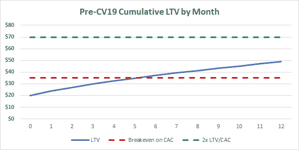
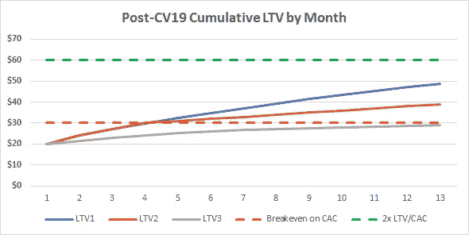
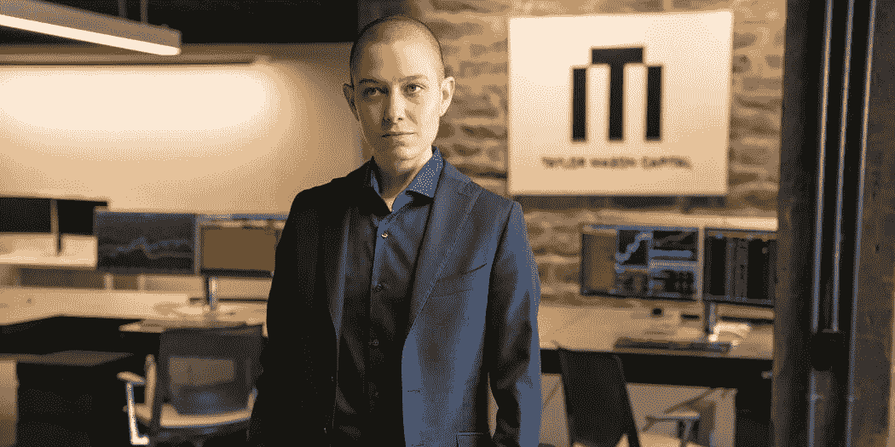

# 证明和盈利能力

> 原文：<https://medium.datadriveninvestor.com/proof-and-profitability-30b16326f0c4?source=collection_archive---------1----------------------->

## 作为一个消费品牌，在新冠肺炎期间平衡盈利能力和增长

对于一个新兴 CPG 品牌的首席执行官来说，这可能是最令人困惑的时刻。一场全球性的疫情让消费者只能呆在家里，3000 万美国人申请失业救济，Q1 GDP 下降了 5%，Q2 不可避免地会出现更严重的下滑；然而，对大多数人来说，销售额…上升了。自 3 月中旬以来，几乎每一位与我交谈过的首席执行官都证实了同样的趋势:广告成本下降，转化率上升，消费者在健康产品上的总体支出意愿增强。乐观是谨慎的；他们意识到，衰退可能与封锁不同(甚至更糟)，在此期间的某个时候，许多人将需要融资。这就是投资界加剧混乱的地方，他们说，我们现在更关心盈利能力，而不是增长。

 [## 夏普比率悖论:为什么还要投资风险资本？数据驱动的投资者

### 夏普比率是一种基于风险量化回报的方法，具体来说，它是超过…

www.datadriveninvestor.com](https://www.datadriveninvestor.com/2020/03/29/the-sharpe-ratio-paradox-why-still-invest-in-venture-capital/) 

公平地说，投资者的“转向盈利”并非始于病毒。行业内有一种感觉，这种感觉可能始于去年夏天 WeWork 的公开斗争，并随着 Casper 提交他们的 S-1 文件并表明盈利能力不会随着足够的规模而自行解决。甚至在与新冠肺炎有关的封锁席卷全国之前，我们就有消息称，尽管年销售额只有 4000 万美元，但迄今为止 Outdoor Voices 已经筹集了 9700 万美元，然后 Brandless 在筹集了 1.58 亿美元的股权资本后关闭。不管是不是疫情，投资者群体都不可避免地要在选择支持哪家公司的问题上做出调整。发生变化的是，面对如此不确定的经济前景，这种调整发生得有多快、有多剧烈。

Source: Pitchbook; Note: Casper market cap at close on May 4, 2020

让我们从为什么这令人困惑开始:对于大多数销售额低于 1000 万美元的品牌，你可以在没有净盈利的情况下负责任地增长。规模还不存在，这意味着你可以做所有正确的事情，但仍需要在未来 12 个月内筹集股本。你可能已经从投资者那里听说过，他们“不希望不惜一切代价实现增长”，“在这种环境下，盈利能力比增长更重要”，但如果你的销售额增长 25%，收支相抵，你可能很难在 2020 年底吸引到风险融资。投资者可能没有明确表示，但他们仍然非常关心增长。

那么你在那个位置上做什么？为了确保下一次融资顺利进行，如何在增长的现金投资和现金保值之间找到合适的平衡点？为了回答这个问题，让我们把初创 CPG 品牌在增长上花费的原因分成四个关键部分。

# 1.诱人的投资回报

在增长上投资的最明显和可量化的原因是这样做是否有利可图——这没有什么新的见解。让这变得棘手的是，许多 CPG 品牌在第一订单上并不盈利；他们的平均订单价值和利润不够高，这意味着他们依赖重复购买来实现他们的目标终身价值(LTV)。通常这不是什么大问题，如下图所示的一个假想品牌的单位经济学。

Hypothetical CPG brand with $50 AOV, 40% gross margin and $35 CAC

该品牌花费 35 美元获得普通客户，在第 5 个月收回投资，并在第 12 个月实现 1.4 倍的 LTV/CAC。在平时还不错，但在新冠肺炎期间，数字可能会有点不同。自 3 月中旬以来，大多数 CPG 品牌的 CAC 一直在下降，因为广告便宜，转化率高，但我们还不知道这些客户是否会像以往一样回来。下图显示了同样的品牌，后新冠肺炎时代，CAC 从 35 美元降至 30 美元，以及 LTV 基于不断变化的保留率的三种不同情景。

Same brand with $30 CAC and multiple retention scenarios

如果今年下半年经济衰退严重，品牌的保留率可能会大幅下降，这可能意味着 12 个月后广告支出不会持平(LTV3)。没有人有水晶球，这可能感觉不太可能，但即使在保留率持平(LTV1)的最佳情况下，首席执行官也可能决定不希望他们稀缺而宝贵的现金在 3-4 个月的转化周期内收回。正如我们在 3 月份学到的，手头有现金是件好事。

# 2.建立和利用先发优势

2020 年的品牌很少有可防御的 IP。他们的竞争护城河可以有多种形式:分销、品牌认知度、受众、人才、合作伙伴等等——所有这些都是某种形式的先发优势。不要被愚弄，以为这是一个薄弱的护城河；如果开发得当，一个品牌可以领先几个月，让自己成为消费者问题解决方案的代名词。那么，品牌应该在疫情期间努力建立这种领先优势吗？当你的竞争对手紧追不舍时，你可能很想进攻，但我认为，当别人这么做时，保留现金意味着你不会失去阵地。现在，你被后面的人抓住或领先优势扩大的风险较低。如果你打算为此花钱，你必须坚信它会奏效。

# 3.产品市场适应性的证明

处于首轮融资阶段及以后阶段的投资者在投资前都在寻找“证据”:证明它在起作用，证明它可能很大，证明他们的论点正在变成现实。直到最近，增长还是最有效的证明形式；毕竟，有什么比迅速采用你的产品更有说服力呢？Casper、Outdoor Voices 和 Brandless 给了投资者一个新的视角:如果你的 DNA 中没有盈利能力，那它可能永远也不会有，再大的规模也无法解决这个问题。

对于普通的新兴 CPG 品牌来说，这三个案例研究的相关性有限。在 CPG 中，融资超过一亿美元的情况非常罕见，当这种情况发生时，该品牌别无选择，只能快速增长，以证明估值的合理性。然而，相关的是这三家公司如何改变了投资者眼中的证据。投资者不再被付费社交推动的销售所打动，他们希望看到一个品牌通过受众、社区和口碑建立有机认知。他们不希望广告支出为销售提供资金，他们希望广告支出为病毒式传播提供资金。证明这一点的最佳方式是展示有机增长的早期迹象，因此，如果你花在付费增长上来向投资者证明自己，你将无法实现你的目标。

# 4.前冲力

慢下来，如果那是外卖，不是没有代价的。这样做可能会以一种不可忽视的方式影响你团队的文化和士气；毕竟，年轻、有才华、有动力的人可能会加入你的行列，快速前进，成就一番大业。我最喜欢的电视角色之一泰勒·梅森在《亿万富翁》中的一句台词一直萦绕在我的脑海中:“我需要前进的动力，甚至是金钱”。

Asia Kate Dillon as Taylor Mason in *“*Billions*”* (Showtime)

现金保值让为你的团队提供前进动力变得更具挑战性，但同样重要。正是在这样的时候，团结在一个短期或长期的计划周围可以非常有效地推动积极的参与。在当前的危机中， [Liquid I.V.](https://liquid-iv.com/blogs/news/lend-a-hand-giving-back-in-the-era-of-covid-19) 大力推动向医护人员捐赠产品，而豪斯【】T4 餐厅项目正在帮助餐厅创造联合品牌产品，以提供急需的现金流。如果有效，这些类型的计划不仅会吸引你的团队，也会吸引你的消费者。

# 外卖

现在是超越去年行之有效的方法的时候了。十年来，进入门槛不断降低，人们对健康的兴趣不断增长，我们见证了新兴消费品牌的崛起，但高潮不会永远持续下去。我预计，当我们回顾这段时间时，我们会看到那些获胜者将此视为马拉松而不是短跑，并使用创造性的方法与消费者进行有机联系。

依靠你的团队获得关于这种方法的想法——授权他们对你的营销策略进行创新可以提供他们渴望的前进动力。在大举支出之前积极测试，这样你就不会对与过去不同的衰退性留存趋势感到惊讶。尽你所能来接近一级盈利能力。现在不要担心竞争，只担心少花钱多办事，给自己尽可能多的时间展示证明。

当下一次融资的时候，你的证据需要评估，没人会指望你的现金流是正的。他们将期待合理的单位经济学，以及一张路线图，告诉他们一点点现金将如何发挥很大作用。如果你能掌控自己的命运，并且至少在未来 18 个月内不需要向下一个投资者出示证明，他们会对你印象深刻。毕竟，你能给投资者最好的证明就是你不需要他们的证明。