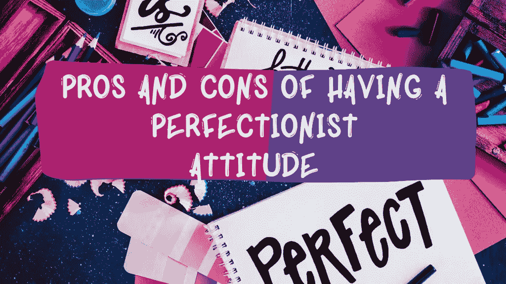
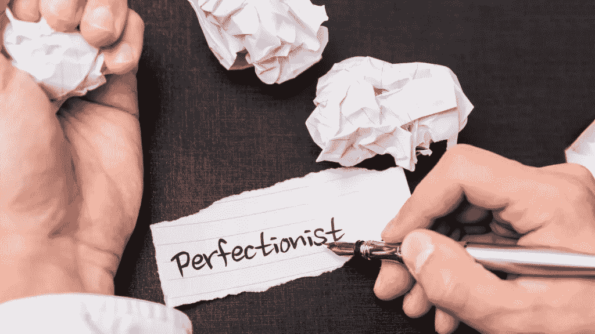

# 拥有完美主义态度的利弊

> 原文：<https://medium.datadriveninvestor.com/pros-and-cons-of-having-a-perfectionist-attitude-527bea964593?source=collection_archive---------0----------------------->

你是否经常寻求在你所做的每一项工作中达到完美的标准？还是在生活的某些方面有追求完美的欲望？

如果是这样，你可能是一个完美主义者。

“完美主义者被定义为拒绝接受任何不完美标准的人”,换句话说，他们拒绝做任何不尽如人意的事情，即使对别人来说已经足够好了。

如果你是一个完美主义者，你可能会认为你做的每件事都必须完美，因为这可以帮助一个人以更高的标准在生活中取得成功，虽然在某些情况下这可能是真的，因为完美主义带来了积极的影响，但成为一个完美主义者并不总是一件好事，也不是一件坏事，每种情况都有利弊，这完全取决于一个人的完美主义程度。

虽然完美主义有一些优点，但也有许多问题与完美主义人格相关，在这篇文章中，我们将讨论完美主义的利弊，并详细解释原因。

## **赞成者**

**1)更注重细节**——完美主义者注重细节。他们能看到哪怕是最小的细节中的错误，并且可能会付出额外的努力，以使它变得更加完美。他们在工作中加入别人想都不敢想的细节。他们确保他们所做的每一件事都会超出预期的结果，因为他们在纠正和改善甚至会被许多人忽略的微小细节方面表现出色。

对每件事都有更高的标准——完美主义者往往比大多数人有更高的个人标准。他们可能会为自己和他人设定一个几乎不可能的标准。他们会意识到他们比他们遇到的其他人有更高的标准。在寻找关系、友谊、伙伴关系等时，这将是一个重要因素。

更完美的最终结果——完美主义者愿意一遍又一遍地尝试做某件事，直到结果变得比他们预期的更好。他们投入时间和耐心来完善他们的工作，这样人们就会对最终的结果感到敬畏和惊讶。

完美主义者会付出更多——他们可能愿意长时间工作，只是为了让他们所做的事情尽善尽美，达到最佳效果。他们也可能会贡献一些额外的工作。

完美主义可以提高毅力水平 —完美主义者可以大大提高他们的整体毅力水平。他们会尽最大努力完成事情，以达到他们心中的目标，即使其他人已经放弃，他们也会度过困难时期。

## **弊**

**1)想得太多&有很多不必要的压力**——完美主义者经常想得太多，甚至是最小的细节，并给自己施加压力，让一切变得更好，即使在别人看来已经是最好的了。有时这可能是不必要的，因为工作的某些方面并不真的要求完美，尤其是在开发的早期阶段。例如，网站设计者需要不时地向开发主管汇报，首先提出建议和决定，因为完美主义者已经想到对事物进行改变，只是因为他们不喜欢它，这不是他们的强项，这反过来会导致许多重做，当主管不同意所做的改变时。

害怕无法实现目标 —完美主义者倾向于将自己推向实现目标和愿望的极限，因为他们害怕失败。他们不希望自己的梦想没有按预期或希望实现，因为他们不希望自己完美设定的目标成为失败。

效率低下——完美主义者经常过于关注工作的细节，以至于他们没有完成其他他们也需要做的重要事情。他们可能会花几天时间在一个项目的一个特定方面工作，最终会错过其他事情的截止日期，因为他们太专注于他们目前关注的一件事情。如果不完善当前阶段的工作，他们基本上无法进入下一个项目。

也就是说，完美主义者会浪费他们的时间和精力去做这些小事，并且无法控制自己放弃一项任务的能力，即使这项任务对某些人来说已经很完美了。反过来，他们可能会成就更少，压力更大

不能处理不完美的事情——完美主义者经常以一种相当荒谬的方式责备自己，尤其是当他们犯了一个错误的时候，不管这个错误有多小。事实上，完美主义会导致高度的不快乐，因为完美主义者无法处理不完美的事情。当他们没有达到他们想要的结果时，他们可能会感到沮丧，从长远来看，这将使他们感到不快乐，直到他们达到他们渴望的完美主义水平。

与完美主义相关的心理问题——完美主义者总是对实现他们的高标准目标有过多的要求，当某件事达不到完美时，这反过来会被视为他们的失败，仅此而已。当他们没有达到他们所说的目标时，他们会变得非常悲伤和绝望，如果治疗不好，可能会导致严重的抑郁症。此外，完美主义者还会遭受睡眠不足之苦，因为他们希望尽可能多地完成事情，这也会增加精神问题进一步出现的风险。

~~~~~~~~~~~~~~~~~~~~~~~~~~~~~~~~~~~~~~~

**如果你错过了我们之前的文章，可以点击下面这些链接阅读；**

**访问专家视图—** [**订阅 DDI 英特尔**](https://datadriveninvestor.com/ddi-intel)

 [## 2021 年自我提升小贴士

### 你要问问自己，每天能做些什么来提升自己？做一个比以前更好的人…

medium.com](https://medium.com/datadriveninvestor/self-improvement-tips-for-2021-a26f3f14abec)  [## 更好的你的 10 个个人发展目标(自我提升)

### 设定目标会给你一种生活的目标感，让你把时间和精力集中在真正重要的事情上

medium.com](https://medium.com/datadriveninvestor/10-personal-development-goals-for-a-better-version-of-you-self-improvement-2b87194a3ac9)  [## 新年新的你，2021 年能改善你生活的 7 个习惯

### 让你的 2021 年轰轰烈烈地开始吧，通过去除某些不会带来任何改变的习惯来改变你的生活方式…

medium.com](https://medium.com/datadriveninvestor/new-year-new-you-7-habits-that-could-improve-your-life-in-2021-e006fccebdb8)  [## 健康生活的最佳新年决心

### 对我们许多人来说，新的一年意味着新的开始，这就是为什么每当一年即将结束时，人们都会开始…

stephup.medium.com](https://stephup.medium.com/the-best-new-years-resolution-for-a-healthy-living-565cc74c371d)