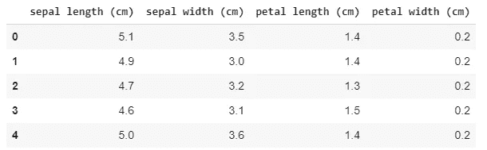
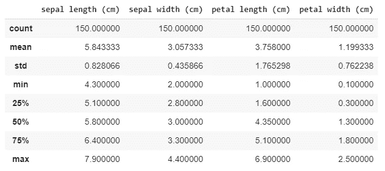
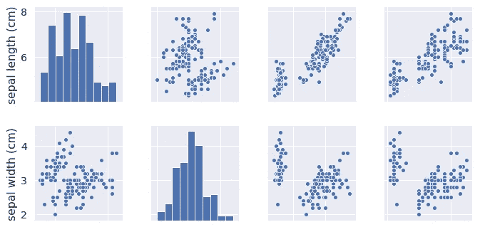
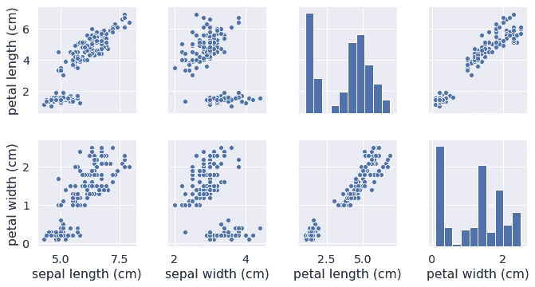
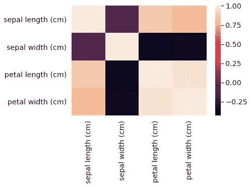
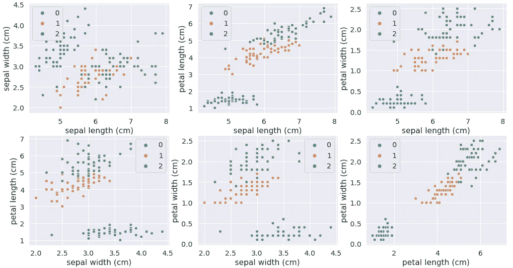
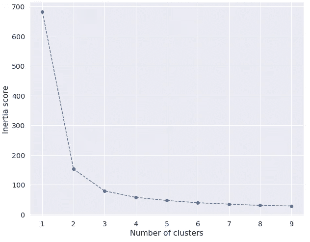
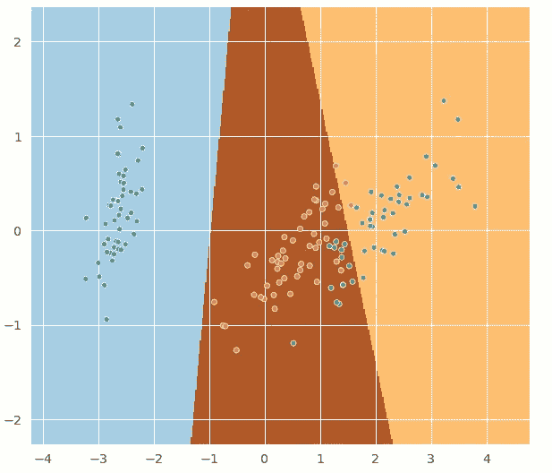

# 降维的利弊

> 原文：<https://medium.datadriveninvestor.com/pros-cons-of-dimensionality-reduction-f843cad3953a?source=collection_archive---------2----------------------->

## 基于主成分分析的虹膜数据压缩和可视化


Image by [Manfred Richter](https://pixabay.com/users/manfredrichter-4055600/?utm_source=link-attribution&utm_medium=referral&utm_campaign=image&utm_content=2219594) from [Pixabay](https://pixabay.com/?utm_source=link-attribution&utm_medium=referral&utm_campaign=image&utm_content=2219594)

我们将致力于著名的鸢尾花数据集。

导入必要的包。

```
# Importing the necessary packages**import numpy as np
import pandas as pd
import matplotlib.pyplot as plt
import seaborn as sns**
```

虹膜数据集从 sklearn.datasets 导入

```
# Importing the data set**from sklearn import datasets****iris_data = datasets.load_iris()**
```

让我们来了解一下‘iris _ data’。

```
**iris_data.keys()**
```

输出是 dict_keys(['data '，' target '，' target_names '，' DESCR '，' feature_names '，' filename'])。

**数据**’:-顾名思义，就是数据。
' **目标**':输出标签的整数编码。0 表示“setosa”，1 表示“versicolor”，2 表示“virginica”。
' **target_names** ' :-输出标签即['setosa '，' versicolor '，' virginica']。
' **描述**':数据集的描述。
' **feature_names** ':输入特征，即['萼片长度'，'萼片宽度'，'花瓣长度'，'花瓣宽度']。
' **文件名** ' :-文件的路径。

让我们创建一个“iris_data”的数据帧。

```
# Create a dataframe of the ‘iris_data’**iris = pd.DataFrame(data = iris_data[‘data’], columns = iris_data[‘feature_names’])**# Displays first 5 columns of ‘iris’**iris.head()**
```



```
# Displays properties of each column**iris.describe()**
```



可以观察到所有列的计数都是 150，所有列的最小值都是非零数字，这表明**没有丢失值**。

## 可视化数据

```
**sns.pairplot(iris)**
```



萼片长度、花瓣长度和花瓣宽度之间高度相关。

```
**sns.heatmap(iris.corr())**
```



```
# 'pairs' is a list of combinations of iris columns**pairs = []****for i in range(len(iris.columns)):
  for j in range(i+1,len(iris.columns)):
    pairs.append((iris.columns[i],iris.columns[j]))****pairs**
```

输出为
('萼片长(cm)'，'萼片宽(cm)')，
('萼片长(cm)'，'花瓣长(cm)')，
('萼片长(cm)'，'花瓣宽(cm)')，
('萼片宽(cm)'，'花瓣长(cm))，
('萼片宽(cm)'，'花瓣宽(cm)')，
('花瓣

```
**a = 1
left = 0.01****plt.figure(figsize = (15,9))** # Adjusting figure size**for i,j in pairs:** **sns.set(font_scale=1.3)** # Adjusting font size
  **plt.subplots_adjust(left)** # Adjusting spacing between subplots

  **plt.subplot(2,3,a)** # Subplot No. **sns.scatterplot(iris[i],iris[j],hue = iris_data[‘target’],palette= [“C0”, “C1”, “C2”])** # Plotting the scatter plot

**a = a+1**
```



Legend :- 0 denotes ‘Setosa’. 1 denotes ‘Versicolor’. 2 denotes ‘Virginica’.

在每个散点图中，可以看到 3 个分离良好的集群。橙色(“杂色”)和绿色(“海滨”)点之间有轻微的重叠。否则，集群是很好的区分。**这表明 K 均值聚类模型将是 iris 数据集的最佳选择**。因此，可视化数据不仅有助于了解数据，还有助于选择模型。

[](https://www.datadriveninvestor.com/2019/03/25/a-programmers-guide-to-creating-an-eclectic-bookshelf/) [## 创建折衷书架的程序员指南|数据驱动的投资者

### 每个开发者都应该有一个书架。他的内阁中可能的文本集合是无数的，但不是每一个集合…

www.datadriveninvestor.com](https://www.datadriveninvestor.com/2019/03/25/a-programmers-guide-to-creating-an-eclectic-bookshelf/) 

## 肘法

肘形法有助于确定最佳聚类数。

```
**from sklearn.cluster import KMeans**# K-Means model is run for different values of ‘number of clusters’**clusters = list(range(1,10))**# ‘inertia’ stores the inertia score of K-Means model**inertia = []**# ‘for’ loop to run K-Means model for each value of ‘number of clusters’**for i in clusters:
 kmeans = KMeans(n_clusters = i)
 kmeans.fit(iris)
 inertia.append(kmeans.inertia_)**# A graph is plotted with ‘number of clusters’ on x-axis and ‘inertia score’ on y-axis**plt.figure(figsize = (10,8))
plt.plot(clusters,inertia,marker = ‘o’,linestyle = ‘dashed’)
plt.xlabel(‘Number of clusters’)
plt.ylabel(‘Inertia score’)**
```



惯性分数急剧下降，直到“聚类数”= 3。之后没有明显的下降。因此,“聚类数”的最佳值是 3。之所以称之为弯头法，是因为在最佳值时会形成弯头。

**主成分分析(PCA)约简
主成分分析** ( **PCA** )是一种统计程序，它使用正交变换将一组可能相关变量的观察值转换为一组线性不相关变量的值，称为**主成分**。在降维过程中会丢失一些信息。

在数据集“虹膜”中，4 个特征中的 3 个特征(“萼片长度”、“花瓣长度”和“花瓣宽度”)彼此相关。因此，主成分分析将在“虹膜”数据集上很好地工作。

```
# Importing PCA**from sklearn.decomposition import PCA**# Perform PCA**pca = PCA(n_components = 2)
pc = pca.fit_transform(iris)**
```

具有 4 个特征的“iris”数据集已缩减为具有 2 个特征的“pc”。

```
**pc.shape**
```

形状为(150，2)。

让我们在缩减的数据集“pc”上训练模型。

```
**kmeans = KMeans(n_clusters = 3)
kmeans.fit(pc)**
```

让我们通过绘制颜色图来可视化简化的二维数据。

```
# Define step size of mesh**h = 0.02**# Generate mesh grid**x_min, x_max = pc[:,0].min() — 1, pc[:,0].max() + 1
y_min, y_max = pc[:,1].min() — 1, pc[:,1].max() + 1
xx, yy = np.meshgrid(np.arange(x_min,x_max,h), np.arange(y_min,y_max,h))**# Obtain labels for each point in the mesh using our trained model on reduced data set**Z = kmeans.predict(np.c_[xx.ravel(),yy.ravel()])**# Put the result into a color plot**Z = Z.reshape(xx.shape)**# Define color plot**cmap = plt.cm.Paired**# Plotting color plot figure (Decision Boundary)**plt.clf()
plt.figure(figsize=(10,9))
plt.imshow(Z,interpolation = ‘nearest’,extent=(xx.min(),xx.max(),yy.min(),yy.max()),
 cmap = cmap,aspect = ‘auto’,origin = ‘lower’)**# Plotting the points**sns.scatterplot(pc[:,0],pc[:,1],hue = iris_data[‘target’],palette=[“C0”, “C1”, “C2”],legend = False)**
```



根据“iris _ data[‘target’]”信息(实际输出)，分散的点被分为 3 种颜色。基于训练模型的预测(预测输出),这些区域已经被分类为 3 种颜色。

少数红色(杂色)和绿色(海滨)点被训练的模型错误分类。

## “无五氯苯甲醚”和“有五氯苯甲醚”的比较

基于以下 4 个度量进行比较:-准确性、同质性得分、完整性得分和 V-Measure 得分。

```
**from sklearn import metrics**# Training model on actual data**kmeans1 = KMeans(n_clusters=3)
kmeans1.fit(iris)**# Training model on reduced data**kmeans2 = KMeans(n_clusters=3)
kmeans2.fit(pc)**# Importing Metrics**from sklearn.metrics import homogeneity_score
from sklearn.metrics import completeness_score
from sklearn.metrics import v_measure_score**# Calculating Accuracy**models = [kmeans1,kmeans2]
accuracy = []****for i in models:
  h = 0
  correct_label = 0
  for j in range(i.n_clusters):
    index = np.where(iris_data['target'] == h)
    correct_label = correct_label + (i.labels_[index] == i.labels_[index].max()).sum()
    h = h + 1
  accuracy.append(correct_label/len(i.labels_))**# Printing the metrics**k = 0
for i in models:
  print('Accuracy : {}'.format(accuracy[k]))
  print('Homogeneity score  {}:'.format(metrics.homogeneity_score(iris_data['target'],i.labels_)))
  print('Completeness score {}:'.format(metrics.completeness_score(iris_data['target'],i.labels_)))
  print('V-Measure {}:'.format(metrics.v_measure_score(iris_data['target'],i.labels_)))
  print('\n')
  k = k+1**
```

> (1 无 PCA
> 准确度:0.7466666666666667
> 同质性得分:0.751485402198838
> 完整性得分:0.766868666154
> 
> (2 使用 PCA
> 的准确度:0.74
> 同质性得分:0.736419288125285
> 完备性得分:0.7474486585

降维后的准确率、同质性、完备性和 V-Measure 评分都有小幅下降。**这表明降低数据维度不会显著影响模型评估指标。数据的重要信息仍然被保留。降维还具有数据二维可视化的额外优势。**

新年快乐快乐阅读！