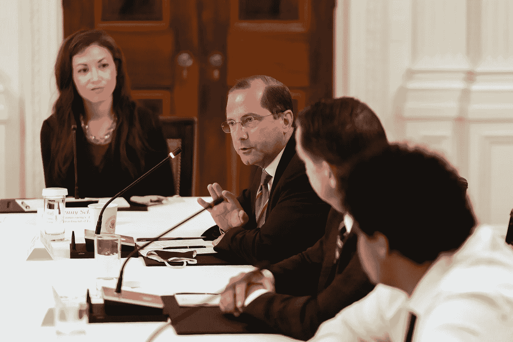
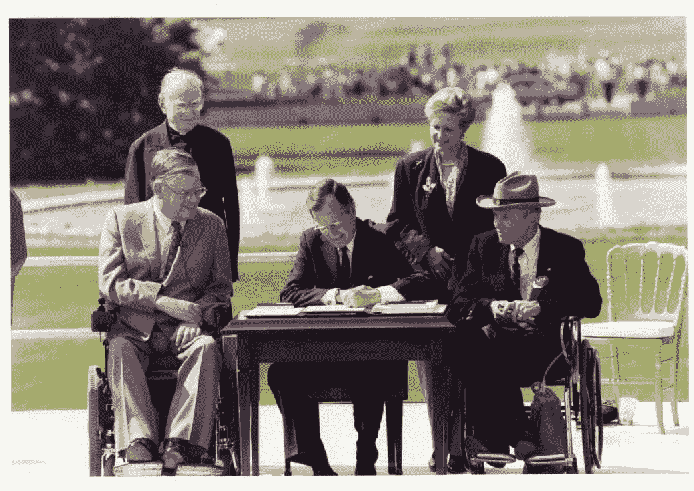
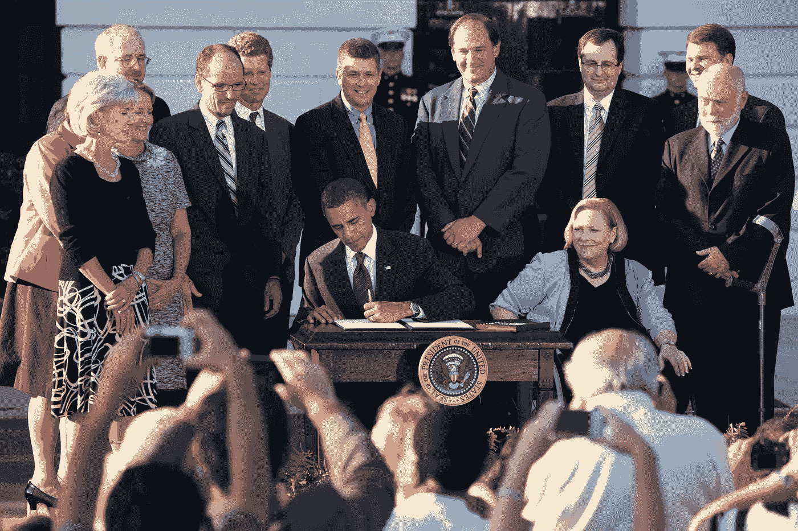

# 在新冠肺炎战争期间保护美国残疾人

> 原文：<https://medium.datadriveninvestor.com/protecting-americans-with-disabilities-during-covid-19-5440639a8423?source=collection_archive---------14----------------------->

卫生人类服务部一直在帮助确保残疾人平等获得医疗保健和社区支持。

Secretary of Health and Human Services Alex Azar addresses his remarks at the National Dialogue on Safely Reopening America’s Schools Tuesday, July 7, 2020, in the East Room of the White House. (Official White House Photo by Andrea Hanks)

## 美国残疾人法案 30 岁了

2020 年 7 月 26 日，星期天，标志着美国残疾人法案历史性签署 30 周年。对于美国残疾人来说，这一开创性立法的通过不仅仅是一个里程碑式的时刻。

1990 年 7 月 26 日，当《美国残疾人法》签署成为法律时，美国成为第一个通过全面、正式的残疾人基本公民权利宣言的国家。

> “《美国残疾人法》正式承认，美国残疾人首先是美国人，他们有权享有与其他人同样的权利和自由:属于并充分参与美国生活的权利；在工作场所内外享有尊严和受尊重的权利；随心所欲的自由。”—巴拉克·奥巴马总统，2009 年

《美国残疾人法案》的通过标志着残疾人、民权律师、十字军战士和倡导者多年辛勤工作的高潮。

1986 年，全国残疾人理事会(现为全国残疾人理事会)发布了颇具影响力的白皮书----"走向独立:**【对影响残疾人的联邦法律和方案的评估----附立法建议】*。*

* [## 不是数据驱动的政治辩论投资者

### 《纽约时报》在 2020 年 6 月 3 日在线发表了阿肯色州参议员汤姆…

www.datadriveninvestor.com](https://www.datadriveninvestor.com/2020/06/08/the-political-debate-that-has-not-been/) 

其中一项重要的立法建议是要求国会颁布一项“全面的”平等机会法，“或许可以以‘1986 年美国残疾人法案’为名”。

为了响应“走向独立”的号召，成立了一个国会特别工作组:“明确全面禁止基于残疾的歧视”，这是它在 1988 年明确宣布的目标。1989 年，参议院通过了美国残疾人法案。1990 年，它被众议院通过。

同年 7 月，乔治 H.W 布什总统将其签署为法律。

In this photograph taken on July 26, 1990, President George H. W. Bush signs the Americans with the Disabilities Act during a ceremony in the Rose Garden. Sitting beside him from left to right are Evan Kemp, Chairman of the Equal Employment Opportunity Commission, and Justin Dart, Chairman of the President’s Committee on Employment of People with Disabilities. Standing behind him from left to right are Reverend Harold Wilke and Swift Parrino, Chairperson, National Council on Disability. (photo: [George Bush Presidential Library and Museum/NARA](https://www.whitehousehistory.org/photos/americans-with-disabilities-act-signing))

此后，历届总统政府都改进并扩大了《反倾销协定》的原始授权。

前总统比尔·克林顿、乔治·w·布什和巴拉克·奥巴马都采取了重要措施来帮助确保具有不同能力的人的公民权利。

President Barack Obama signs Executive Order increasing federal employment of individuals with disabilities, during an event commemorating the 20th anniversary of the Americans with Disabilities Act on the South Lawn of the White House. July 26, 2010\. (Official White House Photo by Chuck Kennedy)

## 2020 年的 ADA

随着美国残疾人协会成立 30 周年，美国残疾人面临新的威胁，新政府令人钦佩地接受了挑战。

由 Alex Azar 部长领导的美国卫生与公众服务部在帮助美国残疾人应对新冠肺炎带来的诸多挑战方面发挥了核心作用。

> “我们通过阻止美国残疾人被拒绝接受器官移植和新冠肺炎治疗，努力确保平等获得医疗保健。我们努力保护美国残疾人成为父母的权利，我们改善并扩大了支持独立生活的服务，我们还为残疾人提供了前所未有的新就业机会。”— HHS 秘书阿历克斯·阿扎尔

卫生与公众服务部一直在这场健康危机的前线默默工作，以确保美国残疾人平等获得每一种可用的新冠肺炎治疗。

HHS 已经废除了呼吸机配给指南，该指南将深度智力残疾患者排除在外。该机构努力确保医院访客指南包括需要帮助了解其护理的人的支持人员。

由于新冠肺炎的特殊性，阿扎尔部长和卫生与公众服务部面临着前所未有的挑战。大多数人的长期护理院和临终关怀计划受到美国残疾人法案的保护。

HHS 一直在努力确保各州和医院在这场危机中不会基于对年龄或残疾的陈规定型观念而拒绝救生护理。

除了捍卫美国残疾人的医疗保健权利，HHS 还一直致力于支持新冠肺炎期间的其他关键需求。

通过 CARES 法案，最近向 350 多个独立生活中心提供了创纪录的 8500 万加元直接资助。这些基于社区的组织由残疾人经营，并为残疾人服务。

为了帮助残疾人在新冠肺炎危机期间保持独立，这些组织提供食物和准备膳食，帮助进行个人护理，并提供防护设备。

保持住房和医疗等支持服务的连续性至关重要。HHS 的支持在这些努力中至关重要。

从替代交通到医疗预约，再到扩展的医疗保健虚拟选择，HHS 下属的机构以创新和同情心做出了回应。

残疾人的基本公民权利是普遍无障碍:工作、公共服务、无障碍公共空间、电信、技术和医疗保健。

朝着这一目标的前进今天仍在继续。有了亚历克斯·阿扎尔执掌 HHS，美国残疾人有了一个不怕新冠肺炎挑战的冠军。

在阿扎尔的领导下，美国卫生与公众服务部将继续倡导所有美国残疾人平等获得优质护理和社区支持服务的权利。

(特约撰稿人布鲁克·贝尔)

**进入专家视角—** [**订阅 DDI 英特尔**](https://datadriveninvestor.com/ddi-intel)*